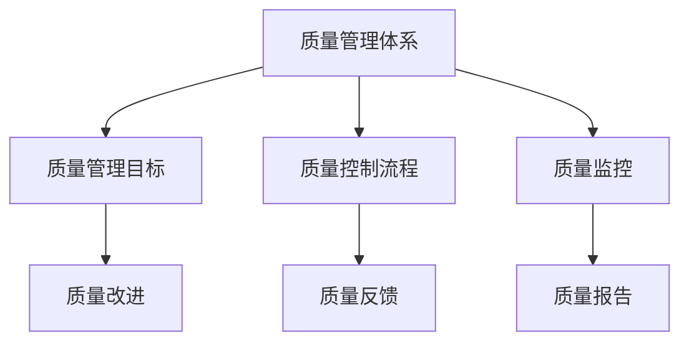
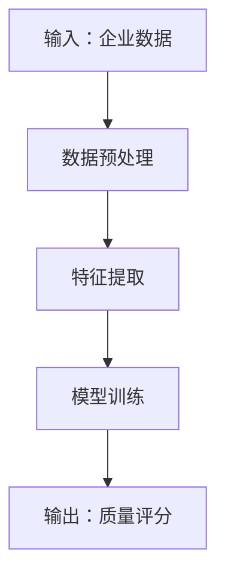
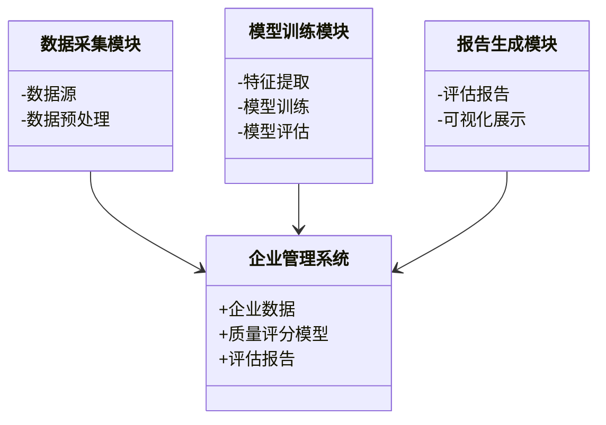
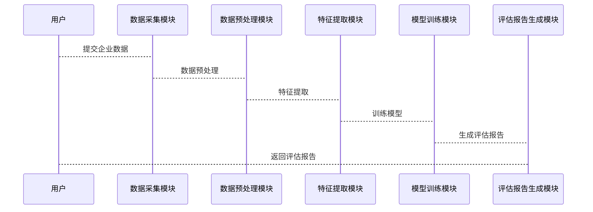

                 


# 玛丽·巴芙达的质量成长型公司识别方法

> 关键词：质量成长型公司，玛丽·巴芙达方法论，企业评估，质量管理体系，成长驱动因素

> 摘要：本文系统地介绍了玛丽·巴芙达的质量成长型公司识别方法，从背景、核心概念、算法原理到系统架构和项目实战，全面解析了该方法的理论基础和实践应用。通过详细的步骤分析和丰富的图表支持，帮助读者理解如何有效识别和培养质量成长型公司，从而为企业和投资者提供有力的决策支持。

---

# 第1章: 质量成长型公司的定义与背景

## 1.1 质量成长型公司的概念

### 1.1.1 问题背景与问题描述

在当今竞争激烈的商业环境中，企业不仅要追求短期的业绩增长，还需要具备持续成长的能力。然而，许多企业在快速发展过程中往往忽视了质量的把控，导致后期出现各种问题，影响企业的长期发展。如何在众多企业中识别出那些既有高质量又具备持续成长潜力的企业，成为企业和投资者关注的重点。

玛丽·巴芙达的质量成长型公司识别方法正是为了解决这一问题而提出的。该方法通过综合评估企业的质量管理体系、成长能力、创新能力和财务健康状况，帮助企业识别出那些能够在长期内保持高质量发展的公司。

### 1.1.2 质量成长型公司的定义与特征

质量成长型公司是指那些在保持高质量产品或服务的同时，具备持续成长潜力的企业。其核心特征包括：

1. **高质量的产品或服务**：企业的产品或服务在市场上具有较高的竞争力和客户满意度。
2. **持续的成长能力**：企业在过去几年中表现出稳定的增长趋势，并且未来有望继续保持增长。
3. **强大的质量管理体系**：企业具备完善的质量控制体系，能够确保产品或服务的高质量。
4. **创新能力**：企业具备较强的创新能力，能够不断推出新产品或服务以适应市场需求。
5. **财务健康**：企业的财务状况健康，具备较强的抗风险能力。

### 1.1.3 质量成长型公司与传统公司的区别

与传统公司相比，质量成长型公司更加注重质量和成长的平衡。传统公司可能更注重短期的业绩增长，而忽视了质量的把控，导致后期可能出现各种问题。而质量成长型公司则通过建立完善的质量管理体系和持续创新能力，确保了企业在长期内的稳定发展。

## 1.2 玛丽·巴芙达方法论的提出

### 1.2.1 方法论的核心思想

玛丽·巴芙达方法论的核心思想是通过综合评估企业的质量管理体系、成长能力、创新能力和财务健康状况，识别出那些能够在长期内保持高质量发展的公司。该方法强调质量和成长的平衡，旨在帮助企业找到那些既有高质量又具备持续成长潜力的企业。

### 1.2.2 方法论的适用范围

该方法适用于各种类型的企业，包括制造业、服务业、科技企业等。无论是中小企业还是大型企业，都可以通过这种方法进行评估。对于投资者来说，这种方法可以帮助他们找到那些具备长期投资价值的企业。

### 1.2.3 方法论的创新点

玛丽·巴芙达方法论的创新点在于其综合评估了企业的质量管理体系、成长能力、创新能力和财务健康状况，并通过量化指标对企业的质量成长潜力进行评分。这种方法不仅能够帮助企业识别出高质量成长型公司，还能为企业提供改进的方向。

## 1.3 识别质量成长型公司的意义

### 1.3.1 对企业的价值

通过识别质量成长型公司，企业可以更好地评估自身的优劣势，找到改进的方向，从而提升自身的质量和成长能力。此外，这种方法还可以帮助企业吸引更多的投资者和合作伙伴，为企业的长期发展提供支持。

### 1.3.2 对投资者的价值

对于投资者来说，识别质量成长型公司可以帮助他们找到那些具备长期投资价值的企业，从而实现更高的投资回报。此外，这种方法还可以帮助投资者降低投资风险，避免投资那些短期业绩良好但长期发展潜力不足的企业。

### 1.3.3 对行业发展的推动作用

通过识别和推广质量成长型公司，可以推动整个行业向高质量、可持续发展的方向发展。这不仅有助于提升行业的整体水平，还可以促进更多的创新和发展。

## 1.4 本章小结

本章通过对质量成长型公司的定义、特征以及玛丽·巴芙达方法论的核心思想、适用范围和创新点进行了详细阐述，帮助读者理解识别质量成长型公司的意义和价值。

---

# 第2章: 质量成长型公司的核心要素分析

## 2.1 核心概念与联系

### 2.1.1 质量管理体系的构建

质量管理体系是企业确保产品质量或服务质量的核心机制。玛丽·巴芙达方法论强调企业需要建立完善的质量管理体系，包括质量目标的设定、质量控制流程的优化、质量监控和反馈机制的建立等。

### 2.1.2 成长驱动因素的识别

成长驱动因素是指那些能够推动企业持续成长的关键因素。玛丽·巴芙达方法论认为，企业的成长能力不仅取决于当前的业绩表现，还取决于企业的创新能力、市场开拓能力、管理能力等。

### 2.1.3 核心要素的ER实体关系图

为了更好地理解质量成长型公司的核心要素之间的关系，我们可以用ER实体关系图来展示。



通过这个图，我们可以清晰地看到质量管理体系与其他核心要素之间的关系。

### 2.1.4 核心要素对比分析

为了进一步理解质量成长型公司的核心要素，我们可以通过对比分析来找出它们之间的差异和联系。

| 指标 | 权重 | 特性 |
|------|------|------|
| 质量管理 | 0.4 | 核心驱动 |
| 成长能力 | 0.3 | 次要驱动 |
| 创新能力 | 0.2 | 支持性驱动 |
| 财务健康 | 0.1 | 基础性驱动 |

从表格可以看出，质量管理是质量成长型公司的核心驱动因素，而财务健康是基础性驱动因素。

## 2.2 核心概念的数学模型与公式

### 2.2.1 指标权重分配

为了量化各个核心要素对企业质量成长潜力的影响程度，我们需要对各个指标分配权重。权重的分配可以通过专家评分法或层次分析法（AHP）来确定。例如：

$$权重_i = \frac{指标_i}{\sum 指标_j}$$

### 2.2.2 质量评分的计算公式

质量评分是通过将各个指标的权重与实际得分相乘，然后求和得到的。公式如下：

$$质量评分 = \sum (权重_i \times 指标_i)$$

其中，$指标_i$ 是各个指标的实际得分，$权重_i$ 是各个指标的权重。

### 2.2.3 成长潜力的预测模型

为了预测企业的成长潜力，我们可以建立一个基于质量评分的预测模型。例如：

$$成长潜力 = a \times 质量评分 + b \times 成长能力评分 + c \times 创新能力评分$$

其中，$a$、$b$、$c$ 是各个因素的系数，可以根据实际情况进行调整。

## 2.3 核心概念的对比分析

通过对比分析，我们可以更好地理解各个核心要素对企业质量成长潜力的影响。例如，质量管理是核心驱动因素，而财务健康是基础性驱动因素。因此，在实际应用中，我们需要优先关注质量管理的建设，同时也要确保财务健康状况的稳定。

## 2.4 本章小结

本章通过对质量成长型公司的核心要素进行了详细分析，并通过ER实体关系图和对比分析表格，帮助读者更好地理解各个核心要素之间的关系和重要性。

---

# 第3章: 玛丽·巴芙达方法论的算法原理

## 3.1 方法论的核心算法

### 3.1.1 算法的输入与输出

- **输入**：企业的各项指标数据，包括质量管理评分、成长能力评分、创新能力评分和财务健康评分。
- **输出**：企业的质量成长潜力评分。

### 3.1.2 算法的流程图

为了更直观地展示算法的流程，我们可以用mermaid流程图来表示。



### 3.1.3 算法的具体步骤

1. **数据预处理**：对输入的数据进行清洗和标准化处理，确保数据的准确性和一致性。
2. **特征提取**：从企业的各项指标中提取出与质量成长潜力相关的特征，例如质量管理评分、成长能力评分等。
3. **模型训练**：利用机器学习算法（如线性回归、随机森林等）对特征进行训练，建立质量评分模型。
4. **结果输出**：根据模型预测的结果，输出企业的质量成长潜力评分。

### 3.1.4 算法的数学模型

质量评分模型的数学公式如下：

$$总评分 = \sum (权重_i \times 指标_i)$$

其中，$权重_i$ 是各个指标的权重，$指标_i$ 是各个指标的实际得分。

## 3.2 算法的数学模型与公式

### 3.2.1 指标权重分配

为了量化各个核心要素对企业质量成长潜力的影响程度，我们需要对各个指标分配权重。权重的分配可以通过专家评分法或层次分析法（AHP）来确定。例如：

$$权重_i = \frac{指标_i}{\sum 指标_j}$$

### 3.2.2 质量评分的计算公式

质量评分是通过将各个指标的权重与实际得分相乘，然后求和得到的。公式如下：

$$质量评分 = \sum (权重_i \times 指标_i)$$

其中，$指标_i$ 是各个指标的实际得分，$权重_i$ 是各个指标的权重。

### 3.2.3 成长潜力的预测模型

为了预测企业的成长潜力，我们可以建立一个基于质量评分的预测模型。例如：

$$成长潜力 = a \times 质量评分 + b \times 成长能力评分 + c \times 创新能力评分$$

其中，$a$、$b$、$c$ 是各个因素的系数，可以根据实际情况进行调整。

## 3.3 算法的实现与优化

### 3.3.1 算法的实现步骤

1. **数据收集**：收集企业的各项指标数据，包括质量管理评分、成长能力评分、创新能力评分和财务健康评分。
2. **数据预处理**：对数据进行清洗和标准化处理，确保数据的准确性和一致性。
3. **特征提取**：从企业的各项指标中提取出与质量成长潜力相关的特征。
4. **模型训练**：利用机器学习算法对特征进行训练，建立质量评分模型。
5. **结果输出**：根据模型预测的结果，输出企业的质量成长潜力评分。

### 3.3.2 算法的优化建议

为了提高算法的准确性和效率，我们可以采取以下优化措施：

1. **特征选择**：通过特征选择方法（如LASSO回归）进一步优化特征，去除冗余特征，提高模型的准确性。
2. **模型优化**：尝试不同的机器学习算法（如支持向量机、神经网络等），找到最适合数据的模型。
3. **交叉验证**：通过交叉验证的方法评估模型的泛化能力，避免过拟合问题。

## 3.4 本章小结

本章详细介绍了玛丽·巴芙达方法论的核心算法，包括算法的输入输出、流程图、数学模型和实现步骤。同时，还提供了一些优化建议，以提高算法的准确性和效率。

---

# 第4章: 系统分析与架构设计方案

## 4.1 问题场景介绍

为了实现玛丽·巴芙达方法论的系统化应用，我们需要构建一个基于质量成长潜力评估的企业管理系统。该系统将帮助企业收集、分析和评估企业的各项指标数据，从而识别出质量成长型公司。

## 4.2 项目介绍

### 4.2.1 项目目标

- 实现企业质量成长潜力评估的自动化。
- 提供可视化的企业评估报告，帮助企业识别质量成长型公司。

### 4.2.2 项目范围

- 数据采集与处理。
- 模型训练与评估。
- 系统开发与部署。

## 4.3 系统功能设计

### 4.3.1 领域模型（mermaid 类图）

为了更好地理解系统的功能模块，我们可以用mermaid类图来展示领域模型。



### 4.3.2 系统架构设计（mermaid 架构图）


### 4.3.3 系统接口设计

系统接口设计包括以下几个部分：

1. **数据采集接口**：用于接收企业各项指标数据。
2. **模型训练接口**：用于训练质量评分模型。
3. **报告生成接口**：用于生成企业评估报告。

### 4.3.4 系统交互流程（mermaid 序列图）



## 4.4 本章小结

本章通过系统分析与架构设计，详细介绍了如何将玛丽·巴芙达方法论应用于实际的企业管理中。通过领域模型、系统架构图和交互流程图，我们展示了系统的各个功能模块及其交互过程。

---

# 第5章: 项目实战

## 5.1 环境安装与配置

为了实现玛丽·巴芙达方法论的系统化应用，我们需要安装以下环境和工具：

1. **编程语言**：Python 3.6+
2. **开发框架**：Django 或 Flask
3. **机器学习库**：scikit-learn、TensorFlow
4. **数据处理工具**：Pandas、NumPy
5. **可视化工具**：Matplotlib、Seaborn

### 5.1.1 安装Python环境

使用Anaconda或Miniconda安装Python环境：

```bash
conda create -n quality_growth python=3.8
conda activate quality_growth
```

### 5.1.2 安装开发框架

安装Django框架：

```bash
pip install django
```

### 5.1.3 安装机器学习库

安装scikit-learn和TensorFlow：

```bash
pip install scikit-learn tensorflow
```

### 5.1.4 安装数据处理工具

安装Pandas和NumPy：

```bash
pip install pandas numpy
```

### 5.1.5 安装可视化工具

安装Matplotlib和Seaborn：

```bash
pip install matplotlib seaborn
```

## 5.2 系统核心实现源代码

### 5.2.1 数据预处理代码

```python
import pandas as pd
import numpy as np

def data_preprocessing(data):
    # 删除缺失值
    data = data.dropna()
    # 标准化处理
    from sklearn.preprocessing import StandardScaler
    scaler = StandardScaler()
    data_scaled = scaler.fit_transform(data)
    return data_scaled
```

### 5.2.2 模型训练代码

```python
from sklearn.linear_model import LinearRegression
from sklearn.metrics import mean_squared_error

def train_model(data, target):
    # 训练模型
    model = LinearRegression()
    model.fit(data, target)
    # 模型预测
    predictions = model.predict(data)
    # 评估模型
    mse = mean_squared_error(target, predictions)
    print(f"均方误差：{mse}")
    return model
```

### 5.2.3 评估报告生成代码

```python
import matplotlib.pyplot as plt

def generate_report(model, data, target):
    # 预测结果
    predictions = model.predict(data)
    # 可视化展示
    plt.scatter(target, predictions)
    plt.xlabel('实际值')
    plt.ylabel('预测值')
    plt.title('质量评分预测结果')
    plt.show()
```

## 5.3 代码应用解读与分析

### 5.3.1 数据预处理代码解读

数据预处理代码主要用于清洗和标准化数据。首先，删除缺失值，然后使用标准差缩放到同一尺度，以便后续模型训练。

### 5.3.2 模型训练代码解读

模型训练代码使用了线性回归算法，将数据输入模型进行训练，并输出均方误差作为模型的评估指标。均方误差越小，模型的预测能力越强。

### 5.3.3 评估报告生成代码解读

评估报告生成代码通过散点图展示了实际值与预测值的关系。如果散点图中的点越接近对角线，说明模型的预测能力越强。

## 5.4 实际案例分析

假设我们有一组企业的质量评分数据，我们可以使用上述代码进行分析和评估。例如：

```python
import pandas as pd

# 数据加载
data = pd.read_csv('enterprise_data.csv')
# 数据预处理
data_processed = data_preprocessing(data)
# 模型训练
model = train_model(data_processed, data['质量评分'])
# 评估报告生成
generate_report(model, data_processed, data['质量评分'])
```

通过上述代码，我们可以得到企业的质量评分模型，并生成评估报告。

## 5.5 项目小结

本章通过实际案例分析，详细展示了如何使用玛丽·巴芙达方法论识别质量成长型公司。通过数据预处理、模型训练和评估报告生成，我们可以帮助企业找到那些具备高质量和持续成长潜力的企业。

---

# 第6章: 最佳实践与总结

## 6.1 小结

玛丽·巴芙达的质量成长型公司识别方法通过综合评估企业的质量管理体系、成长能力、创新能力和财务健康状况，帮助企业识别出那些具备高质量和持续成长潜力的企业。该方法不仅能够为企业提供改进的方向，还能为投资者提供决策支持。

## 6.2 注意事项

在实际应用中，需要注意以下几点：

1. **数据的准确性和完整性**：确保输入的数据准确无误，并尽可能包含更多的特征。
2. **模型的可解释性**：选择易于解释的模型，以便更好地理解各个因素对企业质量成长潜力的影响。
3. **模型的可扩展性**：确保模型能够适应不同的数据规模和类型。

## 6.3 拓展阅读

对于感兴趣的研究者和实践者，可以进一步阅读以下资料：

- 《机器学习实战》
- 《数据挖掘导论》
- 《企业质量管理手册》

## 6.4 本章小结

本章通过对玛丽·巴芙达方法论的总结和注意事项的提出，帮助读者更好地理解和应用该方法。同时，还提供了拓展阅读的资源，以便读者进一步深入学习。

---

# 作者

**作者：AI天才研究院/AI Genius Institute & 禅与计算机程序设计艺术 /Zen And The Art of Computer Programming**

