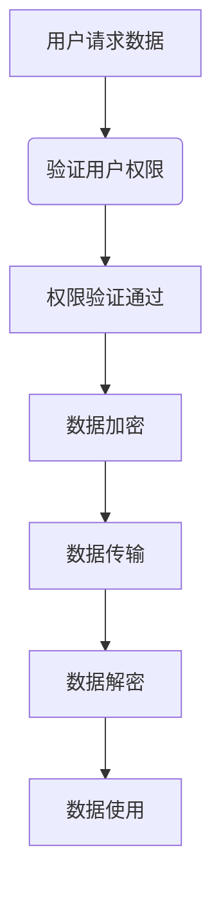
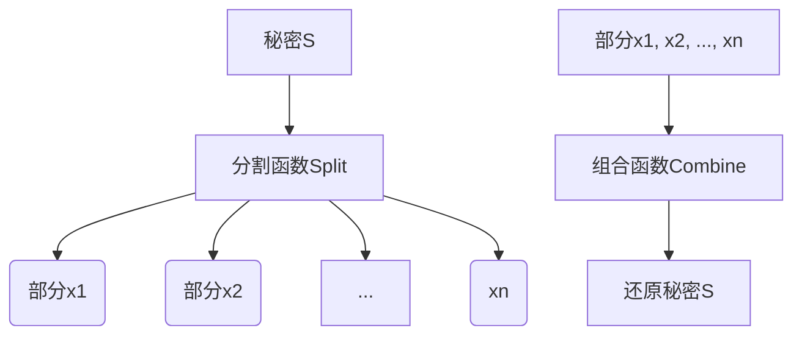
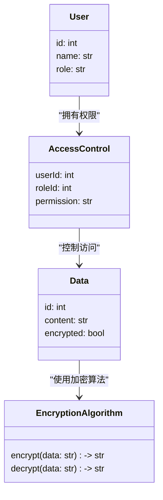
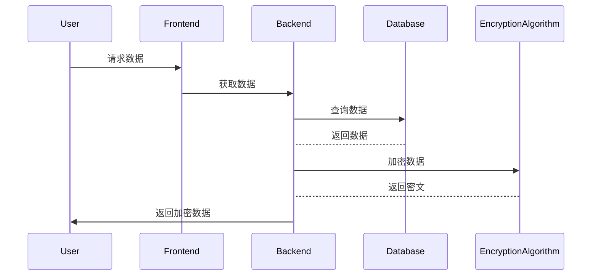

                 


# 《金融数据隐私保护与共享平台设计》

---

## 关键词：  
金融数据隐私保护、数据共享平台、隐私计算、区块链、数据安全、加密技术、数据匿名化

---

## 摘要：  
本文系统地探讨了金融数据隐私保护与共享平台的设计原则、技术实现和实际应用。首先，从金融数据隐私保护的背景出发，分析了数据隐私保护的重要性及其在金融行业中的特殊性。接着，详细阐述了数据隐私保护的核心概念与原理，包括数据加密、访问控制和匿名化等技术。随后，重点介绍了数据隐私保护的关键算法，如同态加密和秘密分享，并通过数学模型和流程图进行了深入分析。在系统设计部分，提出了基于区块链的金融数据隐私保护与共享平台的架构，并详细描述了系统的功能设计、架构设计和接口设计。最后，通过实际案例展示了平台的实现过程，并总结了最佳实践和未来研究方向。

---

# 第一章: 金融数据隐私保护与共享平台的背景与意义

## 1.1 数据隐私保护的背景与问题背景  
### 1.1.1 数据隐私保护的重要性  
在数字经济时代，数据已成为最重要的生产资料之一。金融数据由于涉及个人隐私和商业机密，其安全性尤为重要。数据泄露可能导致严重的经济损失和声誉损害，甚至引发法律纠纷。因此，数据隐私保护是金融行业的一项核心任务。

### 1.1.2 金融行业数据隐私保护的特殊性  
金融数据的特殊性主要体现在以下方面：  
1. **高敏感性**：金融数据通常包含个人信息（如身份证号、银行卡号）和交易记录，一旦泄露可能引发身份盗窃或欺诈。  
2. **合规性要求**：金融行业需要遵守严格的法律法规，如《个人信息保护法》（PIPL）和《数据安全法》。  
3. **数据共享需求**：金融机构之间需要共享数据以支持信贷评估、风险控制等业务，但共享过程中必须确保数据隐私。  

### 1.1.3 共享平台在金融数据中的应用价值  
数据共享平台能够帮助金融机构高效地进行数据交换，同时确保数据隐私。通过共享平台，金融机构可以降低数据孤岛带来的效率损失，提升业务协作能力，同时满足监管要求。

## 1.2 问题描述与目标  
### 1.2.1 数据隐私保护的核心问题  
1. 如何在保证数据可用性的前提下，实现数据的隐私保护？  
2. 如何设计一种安全、高效的共享机制，支持金融机构之间的数据共享？  

### 1.2.2 数据共享面临的挑战  
1. **数据孤岛问题**：不同金融机构之间数据孤立，难以实现有效共享。  
2. **数据隐私风险**：共享过程中可能面临数据泄露或篡改的风险。  
3. **信任问题**：金融机构之间需要建立信任机制，确保数据共享的合法性和安全性。  

### 1.2.3 平台设计的目标与边界  
平台设计的目标是实现金融数据的安全共享，同时保护数据隐私。具体目标包括：  
1. 提供数据加密和匿名化功能，确保数据在传输和存储过程中的安全性。  
2. 支持多方数据共享，同时保证各方只能访问其权限范围内的数据。  
3. 提供完善的审计和追溯功能，确保数据共享的合法性。  

## 1.3 问题解决与核心要素  
### 1.3.1 数据隐私保护的主要方法  
1. **数据加密**：通过加密技术保护数据的 confidentiality。  
2. **访问控制**：通过权限管理确保只有授权方才能访问数据。  
3. **数据匿名化**：通过去标识化技术降低数据被重新识别的风险。  

### 1.3.2 数据共享的实现机制  
1. **基于区块链的共享机制**：利用区块链的去中心化特性，确保数据共享的透明性和不可篡改性。  
2. **基于隐私计算的共享机制**：通过隐私计算技术（如同态加密、秘密分享）实现数据的隐私计算与共享。  

### 1.3.3 平台设计的核心要素  
1. **数据隐私保护技术**：包括加密算法、匿名化技术等。  
2. **数据共享机制**：包括区块链、隐私计算等技术的结合应用。  
3. **系统架构设计**：包括前端、后端、数据存储、区块链节点等组件的设计。  

## 1.4 本章小结  
本章从金融数据隐私保护的背景出发，分析了数据隐私保护的重要性及其在金融行业中的特殊性。同时，明确了平台设计的目标与核心要素，为后续的技术实现奠定了基础。

---

## 第二章: 数据隐私保护的核心概念与原理  

### 2.1 数据隐私保护的定义与属性  
数据隐私保护是指通过技术手段确保数据在存储、传输和使用过程中的安全性，防止未经授权的访问和泄露。其核心属性包括：  
1. **Confidentiality**：数据的机密性，确保只有授权方能够访问数据。  
2. **Integrity**：数据的完整性，确保数据在存储和传输过程中不被篡改。  
3. **Availability**：数据的可用性，确保合法用户能够及时访问数据。  

#### 核心概念的ER实体关系图  
以下是数据隐私保护的核心实体关系图：  

```mermaid  
erDiagram  
    user(User)  
    role(Role)  
    data(Data)  
    access\_control(AccessControl)  
    encryption\_algorithm(EncryptionAlgorithm)  
    anonymousization\_algorithm(AnonymousizationAlgorithm)  
    user ||--|| access\_control : "用户权限"  
    access\_control ||--|| data : "数据访问控制"  
    data ||--|| encryption\_algorithm : "数据加密"  
    data ||--|| anonymousization\_algorithm : "数据匿名化"  
```

### 2.2 数据共享平台的原理与机制  
数据共享平台的核心机制包括：  
1. **数据加密与解密**：通过加密技术保护数据隐私，只有授权方能够解密数据。  
2. **访问控制**：基于角色的访问控制（RBAC）确保只有特定角色的用户才能访问数据。  
3. **数据匿名化**：通过去标识化技术降低数据被重新识别的风险。  

#### 数据共享的流程图（Mermaid）  



### 2.3 数据隐私与共享的平衡  
数据隐私与共享之间存在矛盾，如何在两者之间取得平衡是平台设计的核心挑战。  
1. **隐私保护优先**：在数据共享过程中，始终将数据隐私保护放在首位。  
2. **最小化数据共享范围**：确保共享的数据仅限于业务所需的最小范围。  
3. **基于隐私计算的共享**：通过隐私计算技术（如同态加密、秘密分享）实现数据的隐私计算与共享。  

## 2.4 本章小结  
本章详细阐述了数据隐私保护的核心概念与原理，并通过ER图和流程图展示了数据共享的实现机制。接下来将重点介绍数据隐私保护的关键算法。

---

## 第三章: 数据隐私保护算法的核心原理  

### 3.1 同态加密算法  
#### 3.1.1 同态加密的定义与原理  
同态加密是一种特殊的加密技术，允许在不 decrypting 的情况下对密文进行计算，最终得到的密文解密后与直接对明文进行计算的结果相同。  

#### 同态加密的数学模型  
$$ f(x) = E(x) $$  

#### 同态加密的实现流程（Mermaid）  

```mermaid  
flowchart TD  
    A[明文数据x] --> B[加密函数E]  
    B --> C[密文数据E(x)]  
    C --> D[计算函数f]  
    D --> E[结果f(E(x))]  
    E --> F[解密函数D]  
    F --> G[结果f(x)]  
```

#### 同态加密的Python代码实现  
以下是一个简单的同态加密实现示例：  

```python
class HomomorphicEncryption:
    def __init__(self, key):
        self.key = key

    def encrypt(self, x):
        return x * self.key

    def decrypt(self, E_x):
        return E_x / self.key

# 示例
key = 5
he = HomomorphicEncryption(key)
x = 2
E_x = he.encrypt(x)
print(f"加密结果：{E_x}")
f_x = E_x + 3  # 对密文进行计算
D_x = he.decrypt(f_x)
print(f"解密结果：{D_x}")
```

### 3.2 秘密分享算法  
#### 3.2.1 秘密分享的定义与原理  
秘密分享是一种将秘密数据分割成多个部分的技术，只有当所有部分都组合在一起时，才能还原出原始秘密。  

#### 秘密分享的数学模型  
$$ S = \sum_{i=1}^{n} x_i $$  

#### 秘密分享的实现流程（Mermaid）  



#### 秘密分享的Python代码实现  
以下是一个简单的秘密分享实现示例：  

```python
def secret_share(secret, num_shares):
    shares = []
    for i in range(num_shares):
        shares.append(secret ^ i)
    return shares

def secret_combine(shares):
    secret = 0
    for i, share in enumerate(shares):
        secret ^= share ^ i
    return secret

# 示例
secret = 10
num_shares = 3
shares = secret_share(secret, num_shares)
print(f"分割后的部分：{shares}")
recovered_secret = secret_combine(shares)
print(f"还原的秘密：{recovered_secret}")
```

### 3.3 数据匿名化算法  
#### 3.3.1 数据匿名化的定义与原理  
数据匿名化是一种通过删除、加密或变形技术，降低数据被重新识别风险的技术。  

#### 数据匿名化的数学模型  
$$ D' = f(D) $$  

#### 数据匿名化的Python代码实现  
以下是一个简单的数据匿名化实现示例：  

```python
import random

def anonymize_data(data, probability=0.1):
    anonymized = []
    for d in data:
        if random.random() < probability:
            anonymized.append("匿名")
        else:
            anonymized.append(d)
    return anonymized

# 示例
data = ["张三", "李四", "王五", "赵六"]
anonymized_data = anonymize_data(data)
print(f"匿名化后的数据：{anonymized_data}")
```

## 3.4 本章小结  
本章重点介绍了数据隐私保护的关键算法，包括同态加密、秘密分享和数据匿名化，并通过数学模型和Python代码示例进行了详细讲解。接下来将介绍基于这些算法的系统架构设计。

---

## 第四章: 系统分析与架构设计  

### 4.1 系统需求分析  
金融数据隐私保护与共享平台需要满足以下需求：  
1. **数据加密与解密**：支持多种加密算法，确保数据的安全性。  
2. **数据共享**：支持多方数据共享，确保数据的可用性和隐私性。  
3. **权限管理**：基于角色的访问控制，确保只有授权方能够访问数据。  
4. **审计与追溯**：支持数据共享的审计和追溯，确保数据共享的合法性。  

### 4.2 系统功能设计  
系统功能设计包括以下模块：  
1. **数据加密模块**：负责对数据进行加密和解密。  
2. **数据共享模块**：负责数据的共享和访问控制。  
3. **权限管理模块**：负责用户权限的分配和管理。  
4. **审计与追溯模块**：负责数据共享的审计和追溯。  

#### 系统功能的领域模型（Mermaid类图）  



### 4.3 系统架构设计  
系统架构设计包括以下组件：  
1. **前端**：负责用户界面的展示和交互。  
2. **后端**：负责业务逻辑的实现和数据处理。  
3. **数据存储**：负责数据的存储和管理。  
4. **区块链节点**：负责数据共享的区块链网络支持。  

#### 系统架构的mermaid架构图  


### 4.4 系统接口设计  
系统接口设计包括以下接口：  
1. **数据加密接口**：负责对数据进行加密。  
2. **数据共享接口**：负责数据的共享和访问控制。  
3. **权限管理接口**：负责用户权限的分配和管理。  
4. **审计与追溯接口**：负责数据共享的审计和追溯。  

#### 系统交互的mermaid序列图  



## 4.5 本章小结  
本章从系统需求分析出发，设计了系统的功能模块和架构，并通过类图和序列图展示了系统的交互流程。接下来将介绍基于这些设计的项目实战。

---

## 第五章: 项目实战  

### 5.1 环境安装与配置  
项目实战基于Python和区块链技术，以下是环境安装与配置步骤：  
1. **安装Python**：确保安装了Python 3.8及以上版本。  
2. **安装区块链框架**：推荐使用Hyperledger Fabric。  
3. **安装其他依赖**：安装所需的加密库和区块链SDK。  

#### 环境配置示例  

```bash
# 安装Python
sudo apt-get update
sudo apt-get install python3.8 python3.8-distutils

# 安装Hyperledger Fabric
git clone https://github.com/hyperledger/fabric.git
cd fabric
git checkout v2.2.x
make -C build
```

### 5.2 核心代码实现  
以下是平台的核心代码实现：  

#### 数据加密模块  

```python
class DataEncryption:
    def __init__(self, key):
        self.key = key

    def encrypt(self, data):
        return data.encode().hex()

    def decrypt(self, encrypted_data):
        return bytes.fromhex(encrypted_data).decode()
```

#### 数据共享模块  

```python
class DataSharing:
    def __init__(self, blockchain):
        self.blockchain = blockchain

    def share_data(self, data, user):
        encrypted_data = self.encrypt(data)
        transaction = self.blockchain.create_transaction(user, encrypted_data)
        self.blockchain.broadcast_transaction(transaction)
```

#### 权限管理模块  

```python
class AccessControl:
    def __init__(self):
        self.permissions = {}

    def grant_permission(self, user, role):
        self.permissions[user] = role

    def check_permission(self, user, operation):
        if self.permissions[user] == "admin":
            return True
        return False
```

#### 审计与追溯模块  

```python
class Audit:
    def __init__(self):
        self.audit_log = []

    def log_activity(self, user, action):
        self.audit_log.append(f"{user} performed {action}")

    def get_audit_log(self):
        return self.audit_log
```

### 5.3 代码实现与解读  
1. **数据加密模块**：通过将数据编码为十六进制字符串进行加密，确保数据的安全性。  
2. **数据共享模块**：通过区块链技术实现数据的共享和传输，确保数据的透明性和不可篡改性。  
3. **权限管理模块**：通过角色-based权限管理，确保只有授权方能够访问数据。  
4. **审计与追溯模块**：通过记录数据共享的审计日志，确保数据共享的合法性。  

### 5.4 案例分析与实现  
以下是基于区块链的金融数据隐私保护与共享平台的具体实现：  

#### 基于Hyperledger Fabric的平台搭建  

1. **安装Hyperledger Fabric**  
2. **启动区块链网络**  
3. **部署智能合约**  
4. **实现数据共享功能**  

#### 代码实现示例  

```python
# 启动区块链网络
cd fabric/examples/compose
docker-compose up -d
```

#### 平台功能实现  

1. **数据加密与解密**：通过DataEncryption类实现数据的加密和解密。  
2. **数据共享与访问控制**：通过DataSharing和AccessControl类实现数据的共享和访问控制。  
3. **审计与追溯**：通过Audit类记录数据共享的审计日志。  

### 5.5 项目小结  
本章通过具体的项目实战，展示了如何基于区块链技术实现金融数据隐私保护与共享平台。通过代码实现和案例分析，验证了平台设计的可行性和有效性。

---

## 第六章: 最佳实践与总结  

### 6.1 最佳实践  
1. **数据隐私保护优先**：在数据共享过程中，始终将数据隐私保护放在首位。  
2. **最小化数据共享范围**：确保共享的数据仅限于业务所需的最小范围。  
3. **基于隐私计算的共享**：通过隐私计算技术（如同态加密、秘密分享）实现数据的隐私计算与共享。  
4. **区块链技术的应用**：通过区块链技术实现数据共享的透明性和不可篡改性。  

### 6.2 小结  
本章总结了金融数据隐私保护与共享平台设计的关键点，并提出了未来的研究方向。通过本文的系统阐述和项目实战，读者可以全面了解金融数据隐私保护与共享平台的设计原理和实现方法。

### 6.3 注意事项  
1. **合规性要求**：在设计平台时，必须遵守相关的法律法规，确保数据共享的合法性。  
2. **系统安全性**：在实现平台时，必须确保系统的安全性，防止数据泄露和攻击。  
3. **用户体验**：在设计平台时，必须关注用户体验，确保平台的易用性和高效性。  

### 6.4 拓展阅读  
1. **隐私计算技术**：深入研究同态加密、秘密分享等隐私计算技术。  
2. **区块链技术**：深入研究区块链技术在数据共享中的应用。  
3. **数据安全标准**：研究金融行业相关的数据安全标准和规范。  

## 6.5 本章小结  
本章总结了金融数据隐私保护与共享平台设计的关键点，并提出了未来的研究方向。通过本文的系统阐述和项目实战，读者可以全面了解金融数据隐私保护与共享平台的设计原理和实现方法。

---

## 作者：AI天才研究院 & 禅与计算机程序设计艺术

