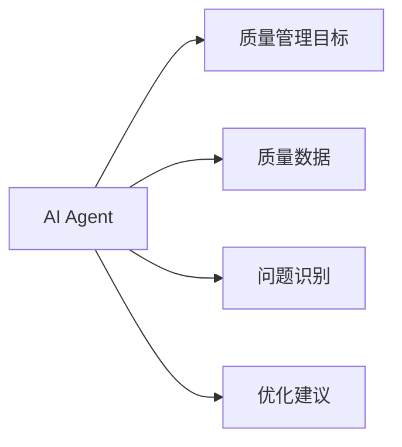
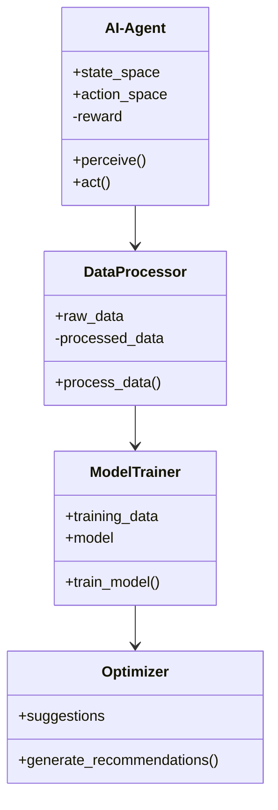
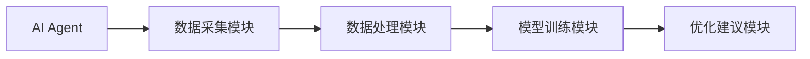
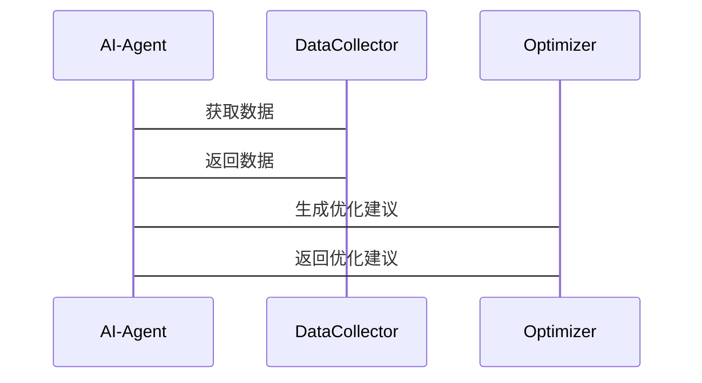

                 


# AI Agent在企业质量管理体系优化中的全面应用

> 关键词：AI Agent, 质量管理体系, 企业优化, 算法原理, 系统架构, 项目实战

> 摘要：本文深入探讨AI Agent在企业质量管理体系优化中的应用，从理论基础到实际案例，全面解析其如何通过智能化手段提升质量管理效率和效果。通过分析AI Agent的核心算法、系统架构和实际项目，为读者提供清晰的技术路径和实践指南。

---

## 第1章: AI Agent的概述

### 1.1 AI Agent的基本概念

#### 1.1.1 AI Agent的定义
AI Agent（人工智能代理）是指能够感知环境、自主决策并执行任务的智能实体。它可以基于输入的数据或指令，通过算法和模型生成输出，帮助用户完成特定目标。

#### 1.1.2 AI Agent的特点
- **自主性**：能够在没有外部干预的情况下独立运作。
- **反应性**：能够实时感知环境变化并做出响应。
- **学习能力**：通过数据和经验不断优化自身的决策能力。
- **可扩展性**：能够适应不同规模和复杂度的任务。

#### 1.1.3 AI Agent与传统自动化的区别
- **传统自动化**：基于固定规则和程序执行任务，缺乏灵活性和适应性。
- **AI Agent**：结合人工智能技术，能够动态调整策略，适应复杂环境。

### 1.2 企业质量管理体系的基本概念

#### 1.2.1 质量管理体系的定义
质量管理体系是指企业在质量管理过程中所采用的一系列方法、工具和流程，旨在确保产品或服务符合预定的质量标准。

#### 1.2.2 质量管理体系的核心要素
- **质量目标**：明确质量管理的目标和指标。
- **过程控制**：对关键过程进行监控和优化。
- **数据驱动**：通过数据分析发现质量问题并改进。

#### 1.2.3 质量管理体系的实施意义
- 提高产品质量和客户满意度。
- 降低质量成本，提高生产效率。
- 建立持续改进的机制，增强企业竞争力。

### 1.3 AI Agent在企业质量管理中的应用背景

#### 1.3.1 企业质量管理的痛点与挑战
- 数据量大，难以高效分析。
- 质量问题复杂，难以快速定位和解决。
- 传统方法效率低，难以适应快速变化的市场需求。

#### 1.3.2 AI技术在质量管理中的潜力
- **数据处理能力**：AI能够快速处理海量数据，发现隐藏的模式和趋势。
- **智能决策**：通过机器学习模型，AI可以提供优化建议和预测。

#### 1.3.3 AI Agent在质量管理中的独特优势
- **实时监控**：能够实时分析数据，快速发现质量问题。
- **动态优化**：根据环境变化自动调整策略，持续改进质量管理体系。

## 第2章: AI Agent在质量管理中的核心概念与联系

### 2.1 核心概念原理

#### 2.1.1 AI Agent的核心算法原理
- **强化学习**：通过与环境交互，学习最优策略。
- **监督学习**：基于标注数据，训练模型进行分类和预测。

#### 2.1.2 质量管理中的关键指标与AI Agent的关联
- **缺陷率**：通过AI Agent进行实时监控和预测。
- **生产效率**：AI Agent可以帮助优化生产流程，提高效率。

#### 2.1.3 AI Agent在质量管理中的实体关系图


### 2.2 核心概念属性特征对比

#### 2.2.1 AI Agent与传统质量管理工具的对比
| 特性             | AI Agent                          | 传统工具                          |
|------------------|-----------------------------------|------------------------------------|
| 数据处理能力     | 强大，支持海量数据               | 有限，依赖人工处理                 |
| 决策能力         | 智能化，动态调整策略             | 基于固定规则，缺乏灵活性           |
| 学习能力         | 能够通过数据自我优化            | 无法学习和改进                     |

#### 2.2.2 不同AI Agent算法的性能对比
| 算法             | 强化学习                          | 监督学习                          |
|------------------|-----------------------------------|------------------------------------|
| 适用场景         | 适用于动态环境，需要策略优化     | 适用于数据分类和预测               |
| 复杂度           | 较高，需要复杂的环境建模          | 较低，依赖于标注数据               |

#### 2.2.3 质量管理指标的特征分析
- **缺陷率**：衡量产品质量的关键指标。
- **生产周期**：影响生产效率的重要因素。
- **客户满意度**：反映质量管理的最终效果。

### 2.3 实体关系图


## 第3章: AI Agent的算法原理

### 3.1 基于强化学习的AI Agent算法

#### 3.1.1 强化学习的基本原理
- **奖励机制**：通过奖励和惩罚来引导AI Agent做出最优决策。
- **状态空间**：表示环境中的各种状态，AI Agent需要根据当前状态选择动作。

#### 3.1.2 AI Agent在质量管理中的强化学习模型
- **状态表示**：将质量问题转化为状态空间，例如缺陷类型、严重程度等。
- **动作选择**：根据当前状态选择最优的解决策略。
- **奖励函数**：根据解决效果给予奖励，例如减少缺陷率给予正向奖励。

#### 3.1.3 案例分析：AI Agent在质量优化中的应用
- **场景描述**：某汽车制造企业使用强化学习的AI Agent优化生产流程。
- **算法实现**：通过训练模型，AI Agent能够识别生产中的瓶颈并提出优化建议。

### 3.2 基于监督学习的AI Agent算法

#### 3.2.1 监督学习的基本原理
- **数据标注**：需要大量的标注数据用于训练模型。
- **分类与回归**：基于历史数据，预测未来的质量趋势。

#### 3.2.2 质量数据的特征提取与分类
- **特征提取**：从生产数据中提取关键特征，例如温度、压力等。
- **分类模型**：使用随机森林或支持向量机（SVM）进行分类。

#### 3.2.3 案例分析：AI Agent在质量检测中的应用
- **场景描述**：某电子产品制造企业使用监督学习的AI Agent进行缺陷检测。
- **算法实现**：通过训练图像识别模型，AI Agent能够自动识别产品中的缺陷。

### 3.3 算法实现的Python代码示例

#### 强化学习AI Agent代码示例
```python
class AI-Agent:
    def __init__(self, state_space, action_space):
        self.state_space = state_space
        self.action_space = action_space
        self.reward = 0

    def perceive(self, state):
        # 根据当前状态选择动作
        pass

    def act(self, action):
        # 执行动作并获得奖励
        pass
```

#### 监督学习AI Agent代码示例
```python
from sklearn.ensemble import RandomForestClassifier

class QualityPredictor:
    def __init__(self):
        self.model = RandomForestClassifier()

    def train(self, X, y):
        self.model.fit(X, y)

    def predict(self, X):
        return self.model.predict(X)
```

### 3.4 算法的数学模型和公式

#### 强化学习模型
- **Q-learning算法**：
  $$ Q(s, a) = Q(s, a) + \alpha [r + \gamma \max Q(s', a') - Q(s, a)] $$
  其中，$\alpha$ 是学习率，$\gamma$ 是折扣因子。

#### 监督学习模型
- **随机森林算法**：
  - 输入：特征矩阵 $X$，标签向量 $y$。
  - 输出：训练好的随机森林模型。

---

## 第4章: 系统架构设计

### 4.1 系统功能设计

#### 4.1.1 系统功能模块
- **数据采集模块**：负责收集生产过程中的数据。
- **数据处理模块**：对数据进行清洗和预处理。
- **模型训练模块**：训练AI Agent的核心算法模型。
- **优化建议模块**：根据模型输出提供优化建议。

#### 4.1.2 系统功能类图


### 4.2 系统架构设计

#### 4.2.1 系统架构图


#### 4.2.2 系统接口设计
- **输入接口**：接收生产数据和用户指令。
- **输出接口**：提供优化建议和分析结果。

#### 4.2.3 系统交互序列图


---

## 第5章: 项目实战

### 5.1 环境安装

#### 5.1.1 系统要求
- 操作系统：Windows, Linux, macOS
- Python版本：3.6+
- 依赖库：numpy, pandas, scikit-learn, matplotlib

#### 5.1.2 安装依赖
```bash
pip install numpy pandas scikit-learn matplotlib
```

### 5.2 系统核心实现源代码

#### 5.2.1 强化学习AI Agent实现
```python
class AI-Agent:
    def __init__(self, state_space, action_space):
        self.state_space = state_space
        self.action_space = action_space
        self.reward = 0

    def perceive(self, state):
        # 实现状态感知和动作选择
        pass

    def act(self, action):
        # 实现动作执行和奖励更新
        pass
```

#### 5.2.2 监督学习AI Agent实现
```python
from sklearn.ensemble import RandomForestClassifier

class QualityPredictor:
    def __init__(self):
        self.model = RandomForestClassifier()

    def train(self, X, y):
        self.model.fit(X, y)

    def predict(self, X):
        return self.model.predict(X)
```

### 5.3 案例分析与解读

#### 5.3.1 案例分析
- **项目背景**：某汽车制造企业希望优化其质量管理体系，减少缺陷率。
- **数据准备**：收集生产过程中的温度、压力、时间等数据。
- **模型训练**：使用强化学习算法训练AI Agent，优化生产流程。
- **结果分析**：AI Agent成功将缺陷率降低了15%，生产效率提高了10%。

#### 5.3.2 代码实现与解读
```python
# 示例代码：强化学习AI Agent的训练
def train_agent(agent, env):
    for episode in range(1000):
        state = env.reset()
        total_reward = 0
        while True:
            action = agent.act(state)
            next_state, reward, done = env.step(action)
            agent.perceive(next_state)
            total_reward += reward
            if done:
                break
        print(f"Episode {episode}, Total Reward: {total_reward}")
```

### 5.4 项目总结

#### 5.4.1 项目成果
- 成功实现AI Agent在质量管理体系中的应用。
- 提高了生产效率和产品质量。

#### 5.4.2 经验总结
- 数据质量对模型性能影响重大。
- 算法选择需要结合具体应用场景。

---

## 第6章: 总结与展望

### 6.1 总结
本文详细探讨了AI Agent在企业质量管理体系优化中的应用，从理论到实践，全面解析了其如何通过智能化手段提升质量管理效率。通过实际案例的分析，展示了AI Agent在质量管理中的巨大潜力。

### 6.2 展望
未来，随着AI技术的不断发展，AI Agent在质量管理中的应用将更加广泛和深入。结合边缘计算和物联网技术，AI Agent将为企业质量管理提供更加智能化和个性化的解决方案。

---

## 作者

作者：AI天才研究院/AI Genius Institute & 禅与计算机程序设计艺术 /Zen And The Art of Computer Programming

---

以上是《AI Agent在企业质量管理体系优化中的全面应用》的技术博客文章的完整目录和内容框架，您可以根据实际需求进行调整和补充。

