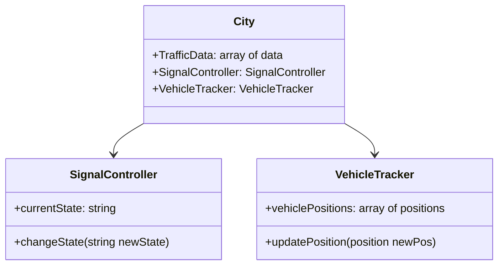
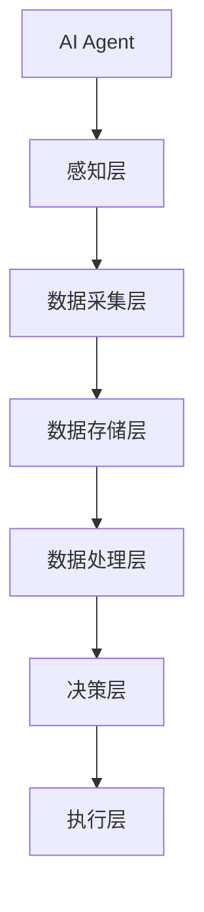
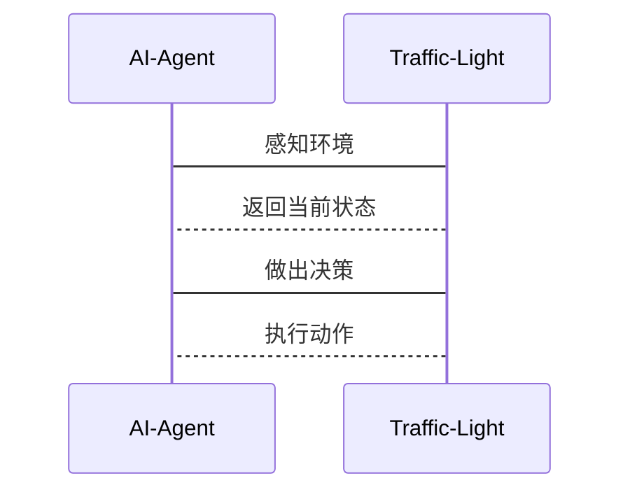

                 


# AI Agent在智慧城市中的应用前景

> 关键词：AI Agent，智慧城市，人工智能，物联网，大数据，智慧交通

> 摘要：随着人工智能技术的快速发展，AI Agent在智慧城市中的应用前景广阔。本文从AI Agent的基本概念出发，探讨其在智慧城市中的应用场景、算法原理、系统架构设计以及实际项目中的应用。通过分析AI Agent在智慧交通、智慧安防、智慧能源和智慧医疗等领域的具体应用，揭示其在提高城市运行效率、优化资源配置和提升居民生活质量方面的重要作用。本文还详细介绍了AI Agent的核心算法原理、数学模型和系统架构设计，为读者提供全面的技术背景和实践指导。

---

## 第一章：AI Agent与智慧城市背景介绍

### 1.1 AI Agent的基本概念

#### 1.1.1 什么是AI Agent
AI Agent（人工智能代理）是一种能够感知环境、自主决策并执行任务的智能实体。它可以是一个软件程序，也可以是一个物理设备，通过与环境交互来实现特定目标。

#### 1.1.2 AI Agent的核心特征
AI Agent具有以下几个核心特征：
1. **自主性**：能够在没有外部干预的情况下自主决策和行动。
2. **反应性**：能够实时感知环境并做出相应的反应。
3. **目标导向性**：以实现特定目标为导向，优化决策和行动。
4. **学习能力**：能够通过经验或数据不断优化自身的算法和行为。

#### 1.1.3 AI Agent与传统AI的区别
传统的AI系统通常依赖于预定义的规则和数据，而AI Agent则更加注重自主性和适应性。AI Agent能够主动感知环境、学习和优化，能够在动态环境中做出实时决策。

### 1.2 智慧城市的发展现状

#### 1.2.1 智慧城市的定义与目标
智慧城市建设的目标是通过信息技术的集成应用，提升城市运行效率、改善居民生活质量并促进可持续发展。智慧城市建设的核心领域包括智慧交通、智慧安防、智慧能源和智慧医疗等。

#### 1.2.2 智慧城市的技术架构
智慧城市的典型技术架构包括：
1. **数据采集层**：通过传感器、摄像头等设备采集城市运行数据。
2. **数据处理层**：对采集的数据进行分析和处理，提取有价值的信息。
3. **决策支持层**：基于数据处理结果，提供决策支持和优化建议。
4. **执行层**：根据决策结果执行相应的操作，例如交通信号控制、能源调度等。

#### 1.2.3 智慧城市的发展阶段
智慧城市建设通常分为三个阶段：
1. **数据采集与整合阶段**：主要任务是建立城市数据的采集和管理系统。
2. **数据分析与应用阶段**：通过对数据的分析，实现城市管理的智能化。
3. **智能决策与自适应阶段**：通过AI Agent等技术实现城市管理的自主优化和决策。

### 1.3 AI Agent在智慧城市中的应用背景

#### 1.3.1 智慧城市中的痛点与挑战
智慧城市建设面临以下痛点：
1. **数据孤岛**：不同部门和系统之间的数据无法有效共享和整合。
2. **决策延迟**：传统的人工决策方式效率低下，难以应对城市运行中的突发事件。
3. **资源浪费**：由于缺乏智能优化，城市资源的利用效率较低。

#### 1.3.2 AI Agent如何解决这些问题
AI Agent能够通过自主感知和决策，实时优化城市资源的配置，提升城市管理效率。例如，AI Agent可以通过实时数据分析，优化交通信号灯的控制，减少交通拥堵。

#### 1.3.3 AI Agent在智慧城市中的定位与作用
AI Agent是智慧城市建设的核心技术之一，通过其自主性和智能性，能够实现城市管理的智能化和高效化。AI Agent在智慧城市中的作用包括数据采集、决策优化、资源调度等。

---

## 第二章：AI Agent的核心概念与原理

### 2.1 AI Agent的定义与分类

#### 2.1.1 AI Agent的定义
AI Agent是一种能够感知环境、自主决策并执行任务的智能实体。

#### 2.1.2 AI Agent的分类
AI Agent可以根据不同的标准进行分类：
1. **按智能水平分类**：
   - 单智能体（Single-Agent）
   - 多智能体系统（Multi-Agent System）
2. **按应用场景分类**：
   - 服务型AI Agent
   - 控制型AI Agent

#### 2.1.3 各类AI Agent的特点对比
以下是各类AI Agent的特点对比：

| 类型             | 单智能体 | 多智能体系统 |
|------------------|----------|-------------|
| 智能水平         | 较低     | 较高         |
| 应用场景         | 简单任务 | 复杂任务     |
| 交互方式         | 单点控制 | 分布式协作   |

### 2.2 AI Agent的核心原理

#### 2.2.1 感知与决策机制
AI Agent通过传感器或其他数据源感知环境，然后基于感知到的信息进行决策。

#### 2.2.2 行为与执行机制
AI Agent根据决策结果执行相应的操作，例如控制交通信号灯或调整能源分配。

#### 2.2.3 学习与优化机制
AI Agent通过机器学习算法不断优化自身的决策模型，提升决策的准确性和效率。

### 2.3 AI Agent与相关技术的关系

#### 2.3.1 AI Agent与大数据技术的关系
AI Agent需要大量的数据支持，大数据技术为其提供了数据采集、存储和分析的基础设施。

#### 2.3.2 AI Agent与物联网技术的关系
物联网技术为AI Agent提供了丰富的数据来源，而AI Agent则通过分析物联网数据优化系统的运行。

#### 2.3.3 AI Agent与云计算技术的关系
云计算为AI Agent提供了强大的计算能力和存储资源，支持其进行大规模数据处理和机器学习。

---

## 第三章：AI Agent在智慧城市中的应用场景

### 3.1 智慧交通中的AI Agent应用

#### 3.1.1 智能交通管理
AI Agent可以通过实时分析交通流量，优化交通信号灯的控制，减少交通拥堵。

#### 3.1.2 自动驾驶与AI Agent
自动驾驶技术依赖于AI Agent进行实时环境感知和决策，实现车辆的自主行驶。

#### 3.1.3 交通预测与优化
AI Agent可以通过历史数据和实时数据，预测未来的交通状况，制定优化的交通管理策略。

### 3.2 智慧安防中的AI Agent应用

#### 3.2.1 智能监控与安全防护
AI Agent可以通过分析视频监控数据，实时识别异常行为，预防和处理安全事件。

#### 3.2.2 公共安全事件处理
在发生公共安全事件时，AI Agent可以快速协调相关部门和资源，制定应急处理方案。

#### 3.2.3 应急响应与协调
AI Agent可以实时监控应急资源的分布，优化应急响应的流程，提高救援效率。

### 3.3 智慧能源中的AI Agent应用

#### 3.3.1 智能电网管理
AI Agent可以通过分析电力消耗数据，优化电力的分配和调度，提高能源利用效率。

#### 3.3.2 能源消耗预测与优化
AI Agent可以通过机器学习算法，预测未来的能源消耗，制定优化的能源管理策略。

#### 3.3.3 可再生能源的智能调度
AI Agent可以实时监控可再生能源的生产情况，优化其在电网中的接入和使用。

### 3.4 智慧医疗中的AI Agent应用

#### 3.4.1 智能医疗诊断
AI Agent可以通过分析患者的病历和检查结果，辅助医生进行诊断。

#### 3.4.2 医疗资源优化配置
AI Agent可以通过分析医疗资源的分布和需求，优化资源的配置，提高医疗服务效率。

#### 3.4.3 患病人群的智能管理
AI Agent可以通过实时监控患者的健康状况，制定个性化的健康管理方案。

---

## 第四章：AI Agent的算法原理与数学模型

### 4.1 AI Agent的算法概述

#### 4.1.1 强化学习算法
强化学习是一种通过试错机制优化决策的算法，广泛应用于AI Agent的决策过程中。

#### 4.1.2 监督学习算法
监督学习是一种基于标注数据进行学习的算法，常用于AI Agent的数据分析和模式识别。

#### 4.1.3 非监督学习算法
非监督学习是一种基于无标注数据进行学习的算法，常用于AI Agent的数据聚类和异常检测。

### 4.2 AI Agent的数学模型

#### 4.2.1 强化学习模型
强化学习模型通常包括状态、动作和奖励三个部分，其数学模型可以表示为：

$$
Q(s, a) = r + \gamma \max_{a'} Q(s', a')
$$

其中，$s$表示当前状态，$a$表示当前动作，$r$表示奖励，$\gamma$表示折扣因子。

#### 4.2.2 监督学习模型
监督学习模型通常基于回归或分类算法，其数学模型可以表示为：

$$
y = f(x) + \epsilon
$$

其中，$x$表示输入特征，$y$表示输出标签，$\epsilon$表示误差项。

#### 4.2.3 非监督学习模型
非监督学习模型通常基于聚类算法，其数学模型可以表示为：

$$
\text{目标函数} = \sum_{i=1}^{n} \sum_{k=1}^{K} w_{ik} \log p(k | i)
$$

其中，$w_{ik}$表示样本$i$属于簇$k$的权重，$p(k | i)$表示样本$i$属于簇$k$的概率。

---

## 第五章：AI Agent的系统架构设计

### 5.1 系统功能设计

#### 5.1.1 领域模型设计
以下是AI Agent在智慧交通中的领域模型：



#### 5.1.2 系统架构设计
以下是AI Agent的系统架构设计：



### 5.2 系统接口设计

#### 5.2.1 API接口设计
以下是AI Agent的API接口设计：

```javascript
interface IAI-Agent {
    void perceiveEnvironment();
    void makeDecision();
    void executeAction();
}
```

#### 5.2.2 接口交互设计
以下是AI Agent与交通信号灯的交互设计：



---

## 第六章：AI Agent的项目实战

### 6.1 环境安装

#### 6.1.1 安装Python
```bash
# 安装Python
sudo apt-get install python3
```

#### 6.1.2 安装机器学习库
```bash
# 安装TensorFlow和Scikit-learn
pip install tensorflow scikit-learn
```

### 6.2 系统核心实现源代码

#### 6.2.1 AI Agent的实现
```python
class AI-Agent:
    def __init__(self):
        self.sensors = []
        self actuators = []
    
    def perceive(self):
        # 获取环境数据
        pass
    
    def decide(self):
        # 进行决策
        pass
    
    def act(self):
        # 执行动作
        pass
```

#### 6.2.2 交通信号灯控制
```python
class Traffic-Light:
    def __init__(self):
        self.state = 'green'
    
    def change_state(self, new_state):
        self.state = new_state
```

### 6.3 实际案例分析

#### 6.3.1 智慧交通案例
AI Agent可以通过分析交通流量数据，优化交通信号灯的控制策略，减少交通拥堵。

#### 6.3.2 智慧安防案例
AI Agent可以通过分析视频监控数据，实时识别异常行为，预防和处理安全事件。

---

## 第七章：总结与展望

### 7.1 本章总结
本文从AI Agent的基本概念出发，探讨了其在智慧城市中的应用场景、算法原理、系统架构设计以及实际项目中的应用。通过分析AI Agent在智慧交通、智慧安防、智慧能源和智慧医疗等领域的具体应用，揭示了其在提高城市运行效率、优化资源配置和提升居民生活质量方面的重要作用。

### 7.2 未来展望
随着人工智能技术的不断发展，AI Agent在智慧城市中的应用前景将更加广阔。未来，AI Agent将更加智能化和自主化，能够更好地应对城市运行中的复杂挑战。同时，随着5G、物联网和云计算等技术的进一步发展，AI Agent在智慧城市中的应用将更加深入和广泛。

---

## 附录

### 附录A：AI Agent相关技术的深入探讨
详细探讨AI Agent与大数据、物联网和云计算等技术的关系，以及这些技术如何共同推动智慧城市建设。

### 附录B：数学公式详解
对本文中涉及的数学公式进行详细推导和解释，帮助读者更好地理解AI Agent的算法原理。

### 附录C：参考文献
列出本文参考的主要文献和资料，方便读者进一步学习和研究。

---

作者：AI天才研究院/AI Genius Institute & 禅与计算机程序设计艺术 /Zen And The Art of Computer Programming

