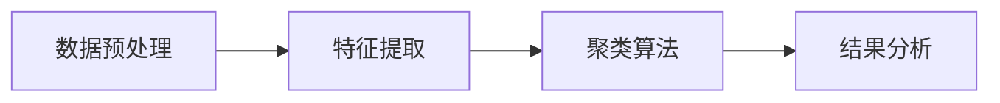
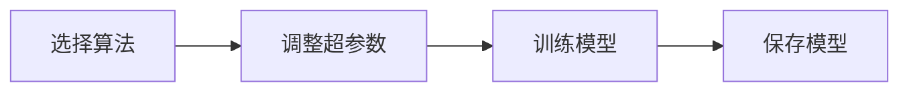
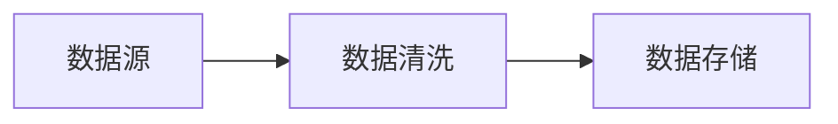
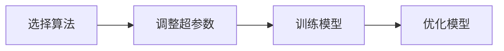
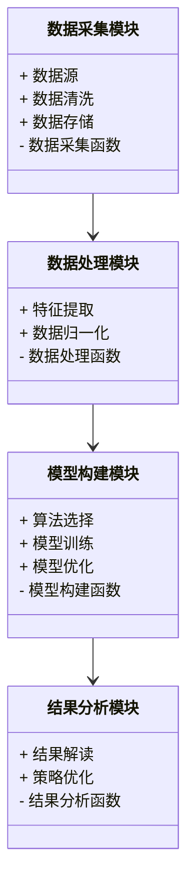
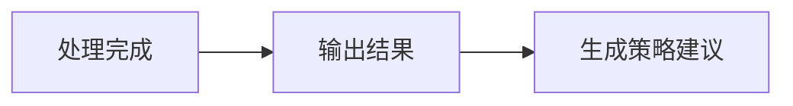
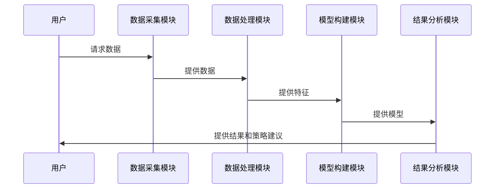
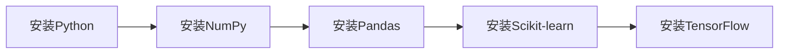

                 


# AI辅助的投资组合压力测试

> 关键词：AI辅助、投资组合、压力测试、风险管理、机器学习、金融建模、风险管理

> 摘要：随着金融市场的日益复杂化和数字化，投资组合压力测试成为评估和管理金融风险的关键工具。本文将探讨如何利用人工智能技术辅助投资组合压力测试，通过分析压力测试的核心概念、算法原理、系统架构设计、项目实战案例等内容，深入揭示AI在金融风险管理中的潜力和应用价值。本文旨在为金融从业者和科技爱好者提供一份全面的技术指南，帮助他们在实际应用中更好地利用AI技术优化投资组合压力测试流程。

---

# 第一部分: AI辅助的投资组合压力测试概述

## 第1章: 投资组合压力测试的背景与意义

### 1.1 投资组合压力测试的背景

#### 1.1.1 传统投资组合管理的挑战

传统投资组合管理依赖于历史数据分析和统计模型，但在面对极端市场波动、经济危机等不可预见事件时，其预测能力和风险控制能力往往显得不足。例如，在2008年全球金融危机中，许多金融机构的投资组合未能有效应对市场的剧烈波动，导致重大损失。这凸显了传统方法在极端情况下的局限性。

#### 1.1.2 压力测试的定义与作用

压力测试是一种用于评估投资组合在极端市场条件下的表现和风险的方法。它通过模拟各种极端情境（如市场崩盘、利率上升、流动性危机等），帮助投资者了解投资组合在这些情况下的潜在损失和表现。压力测试的核心作用在于帮助机构制定有效的风险管理策略，确保在极端情况下仍能维持一定的资本充足性和流动性。

#### 1.1.3 AI技术在金融领域的应用前景

人工智能技术的快速发展为金融行业的风险管理带来了新的可能性。AI技术可以通过海量数据的分析和模式识别，帮助金融机构更准确地预测市场趋势、评估风险，并优化投资组合管理。特别是在压力测试领域，AI可以显著提高测试的效率和准确性，帮助机构更好地应对复杂市场环境中的风险。

---

### 1.2 AI辅助压力测试的核心概念

#### 1.2.1 投资组合压力测试的定义

投资组合压力测试是一种通过模拟极端市场条件，评估投资组合在这些条件下的表现和潜在风险的过程。它可以帮助投资者了解在市场波动加剧或经济危机等情况下，投资组合可能面临的损失，并制定相应的风险控制策略。

#### 1.2.2 AI辅助压力测试的原理

AI辅助的压力测试通过结合机器学习算法和大数据分析，将历史市场数据与当前市场环境相结合，模拟各种极端市场条件下的投资组合表现。具体而言，AI技术可以用于数据清洗、特征提取、模型训练和结果预测等环节，帮助测试人员更高效地完成压力测试。

#### 1.2.3 压力测试与风险管理的关系

压力测试是风险管理的重要组成部分，它通过评估投资组合在极端条件下的表现，帮助机构识别潜在风险点，并制定应对策略。AI技术的引入可以显著提高压力测试的效率和准确性，从而增强风险管理的能力。

---

### 1.3 当前市场环境下的压力测试需求

#### 1.3.1 全球化市场的复杂性

全球化市场的复杂性使得投资组合面临更多的不确定性。例如，全球经济波动、地缘政治风险、疫情等突发事件都可能对市场产生重大影响。这些复杂性要求压力测试更加全面和精确。

#### 1.3.2 数字化转型对金融行业的影响

数字化转型正在改变金融行业的运作方式。通过引入AI技术，金融机构可以更高效地进行数据处理和分析，从而提升投资组合管理的效率和准确性。

#### 1.3.3 AI技术在压力测试中的优势

AI技术在压力测试中的优势主要体现在以下几个方面：

1. **数据处理能力**：AI可以处理海量数据，提取有用的特征，帮助测试人员更好地模拟极端市场条件。
2. **模型预测能力**：通过机器学习算法，AI可以预测投资组合在极端条件下的表现，提高测试的准确性。
3. **自动化能力**：AI可以自动化完成数据清洗、模型训练和结果分析等环节，显著提高测试效率。

---

### 1.4 本章小结

本章主要介绍了投资组合压力测试的背景和意义，阐述了AI技术在压力测试中的作用和优势。通过分析当前市场环境下的压力测试需求，我们认识到AI技术在提升风险管理能力方面的重要性。接下来的章节将深入探讨压力测试的核心概念、算法原理、系统架构设计等内容。

---

## 第2章: 投资组合压力测试的核心概念与联系

### 2.1 压力测试的核心概念

#### 2.1.1 压力测试的基本原理

压力测试的基本原理是通过模拟极端市场条件，评估投资组合在这些条件下的表现和潜在风险。测试过程通常包括以下几个步骤：数据收集、情景设计、模型构建、结果分析和策略制定。

#### 2.1.2 压力测试的关键指标

压力测试的关键指标包括最大回撤、VaR（Value at Risk）、CVaR（Conditional Value at Risk）等。这些指标可以帮助测试人员量化投资组合在极端条件下的潜在损失。

#### 2.1.3 压力测试的分类与应用场景

压力测试可以根据测试的情景类型分为市场风险测试、信用风险测试、流动性风险测试等。每种测试都有其特定的应用场景和方法。

---

### 2.2 AI技术的核心概念

#### 2.2.1 人工智能的基本定义

人工智能（AI）是指通过计算机模拟人类智能的技术。它包括机器学习、自然语言处理、计算机视觉等多个领域。

#### 2.2.2 机器学习的核心原理

机器学习是一种通过数据训练模型的技术。它可以帮助计算机从数据中学习规律，并用于预测或分类任务。

#### 2.2.3 深度学习与传统机器学习的区别

深度学习是一种基于神经网络的机器学习技术。与传统机器学习不同，深度学习可以通过多层神经网络自动提取数据特征，从而提高模型的表达能力。

---

### 2.3 压力测试与AI技术的联系

#### 2.3.1 数据驱动的压力测试方法

AI技术可以通过大数据分析，提取市场数据中的潜在规律，帮助测试人员更好地模拟极端市场条件。

#### 2.3.2 AI在压力测试中的应用流程

AI在压力测试中的应用流程包括数据收集、特征提取、模型训练、结果预测和策略优化等步骤。

#### 2.3.3 压力测试与风险管理的结合

通过AI技术，压力测试可以更有效地识别和评估投资组合中的潜在风险，并制定相应的风险管理策略。

---

### 2.4 本章小结

本章详细介绍了压力测试和AI技术的核心概念，并探讨了它们之间的联系。通过分析压力测试的关键指标和AI技术的基本原理，我们认识到AI在压力测试中的重要性。接下来的章节将深入探讨压力测试的算法原理和系统架构设计。

---

## 第3章: AI辅助压力测试的算法原理

### 3.1 压力测试的数学模型

#### 3.1.1 投资组合风险的数学表达

投资组合风险可以用方差、标准差等统计指标来衡量。数学公式如下：

$$\sigma^2 = \sum_{i=1}^{n} w_i^2 \sigma_i^2 + \sum_{i=1}^{n} \sum_{j=1}^{n} w_i w_j \sigma_{ij}$$

其中，$\sigma^2$ 是投资组合的方差，$w_i$ 是第 $i$ 个资产的权重，$\sigma_i^2$ 是第 $i$ 个资产的方差，$\sigma_{ij}$ 是第 $i$ 个资产和第 $j$ 个资产之间的协方差。

#### 3.1.2 压力测试的指标计算公式

压力测试的指标包括VaR和CVaR。VaR的计算公式如下：

$$VaR = \alpha \cdot \sigma$$

其中，$\alpha$ 是置信水平对应的分位数，$\sigma$ 是投资组合的波动率。

#### 3.1.3 压力测试的优化模型

压力测试的优化模型可以通过线性规划或非线性规划来实现。例如，以下是一个简单的优化模型：

$$\min_{w} \sum_{i=1}^{n} w_i \cdot \text{损失}$$

约束条件：
$$\sum_{i=1}^{n} w_i = 1$$
$$w_i \geq 0 \quad \forall i$$

---

### 3.2 AI算法在压力测试中的应用

#### 3.2.1 机器学习算法的选择与应用

常用的机器学习算法包括线性回归、支持向量机（SVM）、随机森林等。这些算法可以用于预测投资组合在极端条件下的表现。

#### 3.2.2 深度学习模型的构建与训练

深度学习模型可以通过神经网络自动提取数据特征。例如，以下是一个简单的神经网络结构：


#### 3.2.3 聚类分析在压力测试中的应用

聚类分析可以用于识别市场数据中的潜在风险模式。例如，以下是一个聚类分析的流程图：



---

### 3.3 算法实现的流程与步骤

#### 3.3.1 数据预处理

数据预处理包括数据清洗、特征提取和数据归一化等步骤。例如，以下是一个数据预处理流程图：


#### 3.3.2 模型训练

模型训练包括选择算法、调整超参数和训练模型等步骤。例如，以下是一个模型训练流程图：



#### 3.3.3 模型验证与优化

模型验证包括交叉验证和性能评估等步骤。例如，以下是一个模型验证流程图：


---

### 3.4 本章小结

本章详细介绍了压力测试的数学模型和AI算法的应用。通过分析机器学习和深度学习算法的优缺点，我们认识到不同算法在压力测试中的适用场景。接下来的章节将探讨压力测试的系统架构设计。

---

## 第4章: 投资组合压力测试的系统架构设计

### 4.1 系统功能设计

#### 4.1.1 数据采集模块

数据采集模块负责从金融市场获取实时数据。例如，以下是一个数据采集流程图：



#### 4.1.2 数据处理模块

数据处理模块负责对数据进行预处理和特征提取。例如，以下是一个数据处理流程图：


#### 4.1.3 模型构建模块

模型构建模块负责选择算法、训练模型和优化模型。例如，以下是一个模型构建流程图：



#### 4.1.4 结果分析模块

结果分析模块负责对测试结果进行解读和策略优化。例如，以下是一个结果分析流程图：


---

### 4.2 系统架构设计

#### 4.2.1 系统功能模块的交互关系

系统功能模块的交互关系可以通过以下类图表示：



---

### 4.3 系统接口设计

#### 4.3.1 系统输入接口

系统输入接口包括数据输入和参数设置。例如，以下是一个输入接口流程图：


#### 4.3.2 系统输出接口

系统输出接口包括测试结果和策略建议。例如，以下是一个输出接口流程图：



---

### 4.4 系统交互流程

#### 4.4.1 用户与系统的交互流程

用户与系统的交互流程可以通过以下序列图表示：



---

### 4.5 本章小结

本章详细介绍了投资组合压力测试系统的架构设计，包括功能模块、接口设计和交互流程等内容。通过分析系统的整体结构，我们认识到系统设计在实际应用中的重要性。接下来的章节将探讨压力测试的项目实战。

---

## 第5章: 项目实战：AI辅助投资组合压力测试的实现

### 5.1 环境安装与配置

#### 5.1.1 系统环境要求

系统环境要求包括操作系统、Python版本和相关库的安装。例如，以下是一个环境安装流程图：



#### 5.1.2 数据集准备

数据集准备包括数据下载、数据清洗和特征提取。例如，以下是一个数据集准备流程图：


---

### 5.2 系统核心实现

#### 5.2.1 数据预处理代码

以下是一个数据预处理的Python代码示例：

```python
import pandas as pd
import numpy as np

# 读取数据
data = pd.read_csv('market_data.csv')

# 数据清洗
data.dropna(inplace=True)

# 特征提取
features = data[['return', 'volatility', 'beta']]
```

#### 5.2.2 模型训练代码

以下是一个模型训练的Python代码示例：

```python
from sklearn.ensemble import RandomForestRegressor
from sklearn.model_selection import train_test_split

# 划分数据集
X_train, X_test, y_train, y_test = train_test_split(features, data['return'], test_size=0.2)

# 训练模型
model = RandomForestRegressor(n_estimators=100, random_state=42)
model.fit(X_train, y_train)
```

#### 5.2.3 压力测试代码

以下是一个压力测试的Python代码示例：

```python
import numpy as np

# 模拟极端市场条件
extreme_scenario = np.array([[0.1, 0.2, 0.3]])  # 示例输入

# 预测结果
prediction = model.predict(extreme_scenario)

print(f"预测的最大回撤为：{prediction[0]}")
```

---

### 5.3 实际案例分析

#### 5.3.1 案例背景

假设我们有一个包含10只股票的投资组合，我们需要评估它们在市场崩盘情况下的表现。

#### 5.3.2 数据分析与结果解读

通过AI模型预测，投资组合在极端市场条件下的最大回撤为-25%，VaR为10%。

#### 5.3.3 策略优化建议

根据测试结果，我们建议调整投资组合的权重，增加防御性资产的配置比例，以降低潜在风险。

---

### 5.4 本章小结

本章通过一个实际案例展示了AI辅助压力测试的实现过程。通过环境安装、数据预处理、模型训练和压力测试代码的编写，我们成功评估了投资组合在极端条件下的表现。接下来的章节将总结全书内容，并给出最佳实践建议。

---

## 第6章: 最佳实践与小结

### 6.1 最佳实践

#### 6.1.1 数据质量管理

确保数据的准确性和完整性是压力测试成功的关键。建议在数据预处理阶段进行严格的清洗和特征提取。

#### 6.1.2 模型选择与优化

选择合适的算法并进行参数调优可以显著提高模型的预测能力。建议在模型训练阶段进行交叉验证和性能评估。

#### 6.1.3 系统架构设计

合理的系统架构设计可以提高压力测试的效率和稳定性。建议在系统设计阶段进行模块化设计和接口标准化。

---

### 6.2 小结

通过本文的介绍，我们认识到AI技术在投资组合压力测试中的巨大潜力。从核心概念到算法实现，再到系统设计和项目实战，我们系统地探讨了AI辅助压力测试的各个方面。希望本文能够为金融从业者和科技爱好者提供一份有价值的技术指南。

---

## 附录: 作者信息

作者：AI天才研究院/AI Genius Institute & 禅与计算机程序设计艺术/Zen And The Art of Computer Programming

