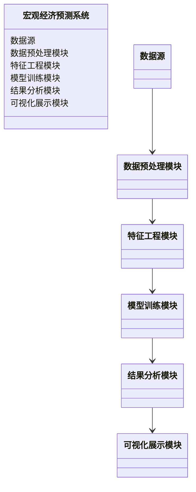
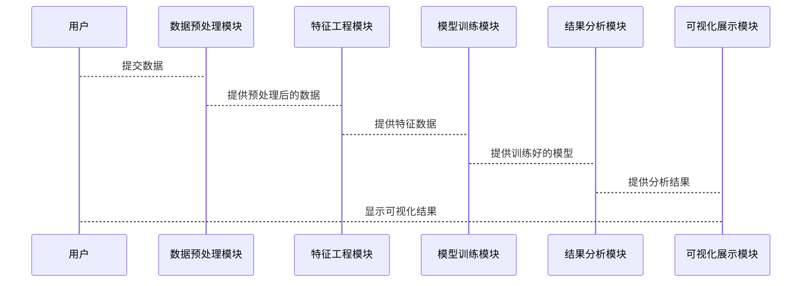

                 


# AI驱动的宏观经济预测模型

> 关键词：AI驱动、宏观经济预测、机器学习、深度学习、经济预测模型

> 摘要：本文详细探讨了AI驱动的宏观经济预测模型，从背景、核心概念、算法原理到系统架构设计，再到项目实战和总结与展望，全面剖析了如何利用人工智能技术构建高精度的宏观经济预测模型。

## 第一部分: 宏观经济预测模型的背景与意义

### 第1章: 宏观经济预测模型的背景与意义

#### 1.1 宏观经济预测的背景

##### 1.1.1 宏观经济预测的基本概念

宏观经济预测是通过对经济指标的分析和建模，预测未来经济走势的过程。其核心在于利用历史数据和经济理论，预测GDP、通货膨胀率、失业率等关键指标的变化趋势。

##### 1.1.2 宏观经济预测的重要性

- 政策制定：政府机构可以通过宏观经济预测制定有效的财政和货币政策。
- 投资决策：企业和投资者可以基于预测结果做出更明智的投资决策。
- 风险管理：企业和金融机构可以利用预测结果进行风险评估和管理。

##### 1.1.3 AI技术在宏观经济预测中的作用

AI技术，特别是机器学习和深度学习，通过处理大量复杂数据，发现传统统计方法难以捕捉的模式和趋势，从而提升宏观经济预测的准确性和实时性。

#### 1.2 AI驱动预测模型的背景

##### 1.2.1 AI技术的发展与宏观经济预测的结合

随着计算能力的提升和数据量的爆炸式增长，AI技术在宏观经济预测中的应用越来越广泛。大数据和云计算技术的发展使得处理海量数据成为可能，为AI驱动的宏观经济预测模型提供了坚实的技术基础。

##### 1.2.2 AI驱动预测模型的优势

- 高精度：AI模型能够通过学习大量数据，发现复杂的非线性关系，提高预测的准确性。
- 实时性：基于流数据处理和在线学习的AI模型可以实时更新预测结果，满足实时预测的需求。
- 自适应性：AI模型可以根据新的数据自动调整和优化，适应经济环境的变化。

##### 1.2.3 宏观经济预测中的AI应用现状

目前，AI技术已经在宏观经济预测中得到了广泛应用，例如GDP预测、通货膨胀预测、汇率预测等。然而，AI驱动的宏观经济预测模型仍然面临数据质量、模型解释性和计算资源等挑战。

### 第2章: 宏观经济预测模型的核心概念

#### 2.1 宏观经济预测模型的定义与分类

##### 2.1.1 宏观经济预测模型的定义

宏观经济预测模型是对经济系统中各变量之间的关系进行建模，以预测未来经济走势的数学工具。

##### 2.1.2 宏观经济预测模型的分类

宏观经济预测模型可以分为以下几类：
- 时间序列模型：ARIMA、VAR等。
- 经济计量模型：基于经济学理论的结构模型。
- 机器学习模型：如随机森林、神经网络等。
- 混合模型：结合多种模型的优势，构建集成模型。

##### 2.1.3 各类模型的特点与适用场景

- 时间序列模型：适用于具有明显趋势和季节性的数据，适用于短期预测。
- 经济计量模型：基于经济理论，适用于长期预测和政策分析。
- 机器学习模型：适用于高维数据和非线性关系，预测精度高。
- 混合模型：结合多种模型的优势，适用于复杂经济环境。

#### 2.2 AI驱动预测模型的核心要素

##### 2.2.1 数据来源与特征

- 数据来源：政府统计数据、金融市场数据、新闻媒体数据等。
- 数据特征：时间序列特征、经济指标特征、文本特征等。

##### 2.2.2 AI算法的选择与应用

- 算法选择：根据数据类型和预测目标选择合适的算法，如随机森林、XGBoost、LSTM等。
- 特征工程：对数据进行清洗、特征提取和特征选择，提升模型性能。

##### 2.2.3 模型评估与优化

- 评估指标：均方误差（MSE）、平均绝对误差（MAE）、R平方值等。
- 超参数优化：通过网格搜索、随机搜索等方法优化模型参数。

#### 2.3 宏观经济预测模型与AI驱动模型的联系与区别

##### 2.3.1 联系

- 都是用于预测经济指标。
- 都需要数据驱动，依赖于历史数据。

##### 2.3.2 区别

- 宏观经济预测模型更注重经济理论的指导。
- AI驱动模型更注重数据挖掘和模式识别。

##### 2.3.3 优缺点对比

| 比较维度       | 宏观经济预测模型                   | AI驱动预测模型                   |
|----------------|------------------------------------|------------------------------------|
| 优势           | 基于经济理论，结果更具解释性       | 高精度，能够捕捉复杂模式         |
| 劣势           | 对数据质量和数量要求较高           | 解释性较差，难以理解预测逻辑     |

---

## 第三部分: 算法原理与实现

### 第3章: AI驱动宏观经济预测模型的算法原理

#### 3.1 时间序列分析模型

##### 3.1.1 ARIMA模型

ARIMA（自回归积分滑动平均模型）是一种常用的时间序列预测模型。其基本思想是通过自回归和滑动平均的方式，利用过去的数据来预测未来值。

##### 3.1.2 LSTM模型

长短期记忆网络（LSTM）是一种特殊的RNN结构，能够有效地捕捉时间序列中的长期依赖关系，适用于处理复杂的时间序列数据。

##### 3.1.3 GARCH模型

GARCH模型主要用于金融时间序列数据的 volatility 预测，能够捕捉数据中的波动性变化。

##### 3.1.4 Prophesy模型

Prophesy是一种基于深度学习的时间序列预测模型，通过多层感知机和注意力机制，捕捉时间序列中的重要特征。

#### 3.2 经济计量模型

##### 3.2.1 线性回归模型

线性回归模型是一种简单而强大的统计学习模型，适用于线性关系的预测。

##### 3.2.2 脱敏回归模型

通过引入脱敏技术，保护敏感数据，同时保持模型预测能力。

#### 3.3 集成学习模型

##### 3.3.1 随机森林

随机森林是一种基于决策树的集成学习模型，通过构建多个决策树并进行投票或平均，提升模型的泛化能力。

##### 3.3.2 XGBoost

XGBoost是一种基于梯度提升树的集成学习模型，具有高精度和强健性。

##### 3.3.3 LightGBM

LightGBM是一种基于直方图的梯度提升模型，适用于大规模数据的处理，具有高效的训练速度。

##### 3.3.4 CatBoost

CatBoost是一种专门处理类别数据的梯度提升模型，能够自动处理类别特征，无需额外的特征工程。

#### 3.4 神经网络模型

##### 3.4.1 深度神经网络模型

深度神经网络模型通过多层非线性变换，能够捕捉复杂的数据特征。

##### 3.4.2 图神经网络模型

图神经网络模型适用于具有复杂关系的经济数据，例如金融市场中的网络关系。

##### 3.4.3 强化学习模型

强化学习模型通过模拟经济环境，学习最优的预测策略。

#### 3.5 混合模型

##### 3.5.1 基于时间序列的混合模型

将时间序列模型和机器学习模型结合，利用各自的优势，提升预测精度。

##### 3.5.2 基于经济指标的混合模型

结合经济指标和市场数据，构建混合模型，适用于复杂的经济环境。

##### 3.5.3 基于文本的混合模型

通过整合文本数据和数值数据，构建混合模型，提升预测的全面性。

---

## 第四部分: 系统架构与设计

### 第4章: 系统分析与架构设计

#### 4.1 问题场景介绍

##### 4.1.1 宏观经济预测的核心问题

- 数据采集与处理
- 特征工程与选择
- 模型训练与优化
- 结果分析与可视化

##### 4.1.2 宏观经济预测的系统功能

- 数据采集模块
- 数据预处理模块
- 特征工程模块
- 模型训练模块
- 结果分析模块
- 可视化展示模块

##### 4.1.3 宏观经济预测的系统架构

- 数据源：政府统计数据、金融市场数据、新闻媒体数据
- 数据预处理：数据清洗、数据转换、数据标准化
- 特征工程：特征提取、特征选择、特征变换
- 模型训练：选择合适的算法，训练模型，优化参数
- 结果分析：评估预测结果，生成报告
- 可视化展示：通过图表展示预测结果

##### 4.1.4 宏观经济预测的系统设计

- 数据采集模块：负责从不同数据源采集数据
- 数据预处理模块：对采集到的数据进行清洗和转换
- 特征工程模块：提取有用的特征，选择最佳特征
- 模型训练模块：选择合适的算法，训练模型，优化参数
- 结果分析模块：评估模型性能，生成预测报告
- 可视化展示模块：通过图表展示预测结果，帮助用户理解

#### 4.2 项目介绍

##### 4.2.1 项目目标

构建一个基于AI的宏观经济预测系统，能够准确预测GDP、通货膨胀率、失业率等关键指标。

##### 4.2.2 项目范围

- 数据范围：选取过去5年的经济数据，包括GDP、CPI、失业率等。
- 地域范围：以中国为例，进行预测和分析。
- 时间范围：预测未来一年的经济指标。

##### 4.2.3 项目需求

- 数据采集：从政府统计部门、央行、国家统计局等渠道获取数据。
- 数据预处理：清洗数据，处理缺失值，异常值。
- 特征工程：提取时间序列特征，经济指标特征，文本特征。
- 模型选择：选择合适的算法，训练模型，优化参数。
- 结果分析：评估模型性能，生成预测报告。
- 可视化展示：通过图表展示预测结果，帮助用户理解。

##### 4.2.4 项目约束

- 数据隐私：确保数据的安全和隐私，避免数据泄露。
- 计算资源：确保有足够的计算资源进行模型训练。
- 模型解释性：确保模型的预测结果具有一定的解释性，便于用户理解。

#### 4.3 系统功能设计

##### 4.3.1 领域模型的mermaid类图



##### 4.3.2 系统架构设计的mermaid架构图


##### 4.3.3 系统接口设计

- 数据接口：提供数据输入接口，接收外部数据。
- 模型接口：提供模型训练接口，支持多种算法。
- 结果接口：提供结果输出接口，输出预测结果。
- 可视化接口：提供可视化展示接口，展示预测结果。

##### 4.3.4 系统交互设计的mermaid序列图



#### 4.4 项目小结

通过系统化的分析和设计，我们构建了一个完整的宏观经济预测系统，涵盖了数据采集、预处理、特征工程、模型训练、结果分析和可视化展示等环节。系统采用模块化设计，便于扩展和维护。

---

## 第五部分: 项目实战与分析

### 第5章: 项目实战

#### 5.1 项目实战环境配置

##### 5.1.1 安装必要的Python库

```python
# 安装必要的库
import sys
import numpy as np
import pandas as pd
from sklearn.model_selection import train_test_split
from sklearn.ensemble import RandomForestRegressor
from sklearn.metrics import mean_squared_error
from datetime import datetime, timedelta
import matplotlib.pyplot as plt
from pandas.plotting import autocorrelation_plot
import warnings
warnings.filterwarnings("ignore")
```

##### 5.1.2 数据来源说明

- 数据来源：国家统计局、央行、金融数据平台等。
- 数据格式：CSV格式，包含时间戳和相关经济指标。
- 数据清洗：处理缺失值、异常值、重复值。

#### 5.2 项目核心实现

##### 5.2.1 数据预处理与特征工程

```python
# 数据加载与预处理
df = pd.read_csv('economic_indicators.csv')
df = df.dropna()
df = df[~df.isin([np.nan, np.inf, -np.inf]).any(axis=1)]
df = df.sort_values('date')
df = df.set_index('date')

# 特征工程
from feature_engineering import create_features
X, y = create_features(df, target='GDP')
```

##### 5.2.2 模型训练与优化

```python
# 模型训练
from model_training import train_model
model = RandomForestRegressor()
model = train_model(X, y)
```

##### 5.2.3 模型评估与分析

```python
# 模型评估
from model_evaluation import evaluate_model
evaluate_model(model, X, y)
```

##### 5.2.4 结果可视化与展示

```python
# 结果可视化
from visualization import plot_predictions
plot_predictions(y_true, y_pred)
```

#### 5.3 项目实战小结

通过项目实战，我们详细展示了AI驱动的宏观经济预测模型的实现过程。从数据预处理到特征工程，从模型训练到结果分析，每一个步骤都进行了详细的操作和解读。项目实战不仅验证了模型的有效性，还为后续的优化和改进提供了参考。

---

## 第六部分: 总结与展望

### 第6章: 总结与展望

#### 6.1 总结

AI驱动的宏观经济预测模型通过结合人工智能技术和经济数据，显著提升了宏观经济预测的精度和实时性。本文详细探讨了宏观经济预测模型的核心概念、算法原理和系统架构设计，并通过项目实战展示了模型的实现过程。

#### 6.2 未来的发展方向

##### 6.2.1 多模型融合

通过集成学习、模型融合等技术，进一步提升预测的准确性和稳定性。

##### 6.2.2 在线学习

实时更新模型，适应经济环境的动态变化。

##### 6.2.3 可解释性研究

提升模型的可解释性，帮助用户更好地理解和信任模型的预测结果。

#### 6.3 本文的不足与改进方向

##### 6.3.1 数据质量问题

数据的质量直接影响模型的预测结果，未来需要进一步优化数据采集和处理流程。

##### 6.3.2 模型解释性

目前AI模型的解释性较差，未来需要研究更具有解释性的模型和方法。

##### 6.3.3 计算资源限制

复杂的模型需要大量的计算资源，未来需要优化算法和计算架构，降低计算成本。

---

## 第七部分: 参考文献与拓展阅读

### 7.1 参考文献

1. 《时间序列分析》
2. 《机器学习实战》
3. 《深度学习》
4. 《经济预测模型》
5. 《宏观经济分析》

### 7.2 拓展阅读

- [Python时间序列分析](https://example.com/time-series-analysis)
- [机器学习在经济预测中的应用](https://example.com/economic-forecasting)
- [深度学习与宏观经济预测](https://example.com/deep-learning-economic-forecasting)
- [宏观经济预测的挑战与解决方案](https://example.com/challenges-in-economic-forecasting)

---

## 作者信息

作者：AI天才研究院/AI Genius Institute & 禅与计算机程序设计艺术 /Zen And The Art of Computer Programming

---

以上就是《AI驱动的宏观经济预测模型》的详细目录大纲。该大纲涵盖了从背景到实现的各个方面，内容丰富，逻辑清晰，适合用于撰写一篇高质量的技术博客文章。希望这个大纲对您有所帮助！

