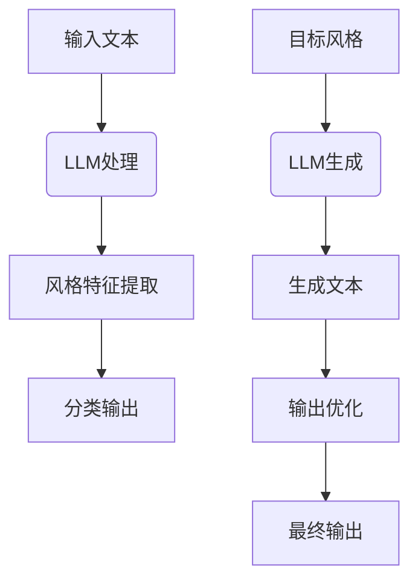
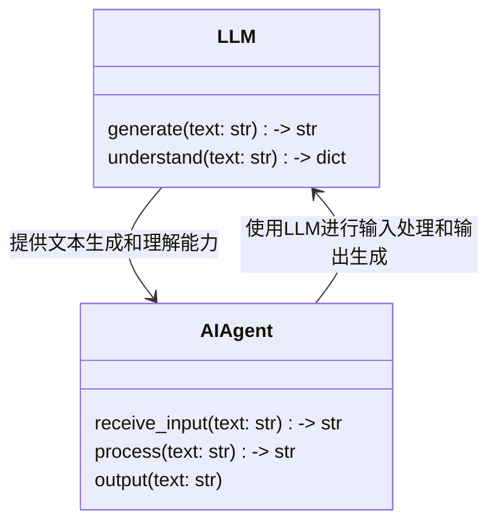
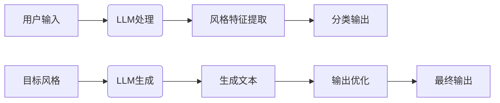
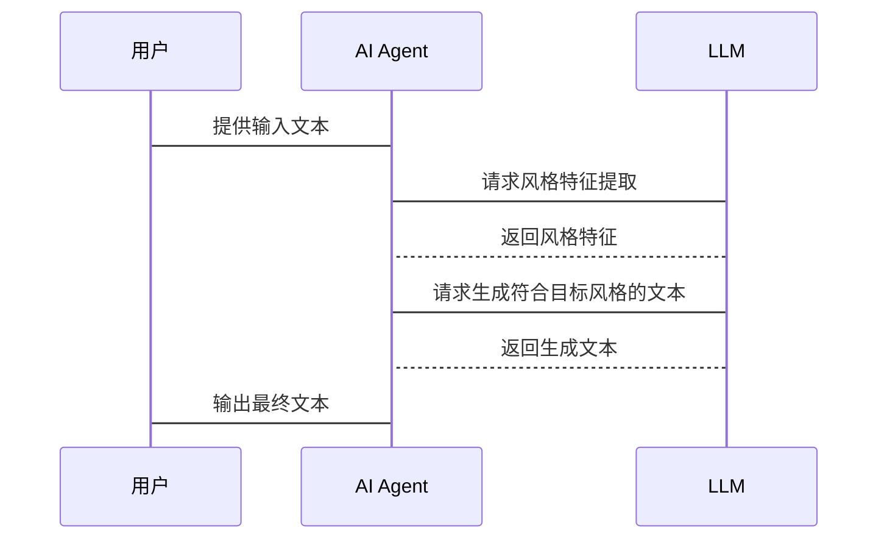

                 


# LLM在AI Agent中的文本风格保持与转换

> 关键词：LLM, AI Agent, 文本风格保持, 文本风格转换, 大语言模型

> 摘要：本文深入探讨了大语言模型（LLM）在AI Agent中的文本风格保持与转换技术。从基本概念到算法原理，从系统设计到项目实战，全面解析了如何利用LLM实现文本风格的智能化处理。通过详细的技术分析和实际案例，展示了LLM在AI Agent中的应用潜力和实现方法。

---

# 第一部分: 背景介绍

## 第1章: 大语言模型（LLM）概述

### 1.1 LLM的基本概念

#### 1.1.1 大语言模型的定义
大语言模型（LLM）是指基于深度学习的自然语言处理模型，通常采用Transformer架构，经过大量文本数据的训练，能够理解和生成人类语言。LLM的核心目标是实现人类水平的文本生成和理解能力。

#### 1.1.2 LLM的核心特点
- **大规模训练数据**：LLM通常使用数十亿甚至更多的文本数据进行训练，使其能够覆盖多种语言和领域。
- **自注意力机制**：通过自注意力机制，模型可以捕捉文本中的长距离依赖关系，理解上下文。
- **多任务学习能力**：LLM可以在多种任务上进行训练，如文本生成、翻译、问答等。

#### 1.1.3 LLM的应用场景
- **文本生成**：用于新闻生成、创意写作等。
- **机器翻译**：实现多种语言之间的互译。
- **问答系统**：提供智能客服、知识问答等服务。
- **代码生成**：辅助程序员快速生成代码片段。

### 1.2 AI Agent的基本概念

#### 1.2.1 AI Agent的定义
AI Agent（人工智能代理）是指能够感知环境、自主决策并执行任务的智能体。AI Agent可以是软件程序，也可以是物理机器人，其目标是通过与环境交互来实现特定目标。

#### 1.2.2 AI Agent的核心功能
- **感知**：通过传感器或数据接口获取环境信息。
- **决策**：基于获取的信息进行分析和推理，制定行动策略。
- **执行**：根据决策结果执行具体操作。

#### 1.2.3 AI Agent与传统软件的区别
- **自主性**：AI Agent能够自主决策，而传统软件通常需要明确的指令。
- **学习能力**：AI Agent可以通过经验优化性能，而传统软件依赖固定的规则。
- **适应性**：AI Agent能够适应环境变化，传统软件则需要人工干预。

### 1.3 LLM与AI Agent的关系

#### 1.3.1 LLM作为AI Agent的核心驱动力
LLM为AI Agent提供了强大的自然语言处理能力，使其能够理解用户需求、生成自然的回复，并在多轮对话中保持连贯性。

#### 1.3.2 LLM如何赋能AI Agent的智能决策
通过LLM，AI Agent可以分析文本信息、识别情感倾向、理解上下文，从而做出更智能的决策。

#### 1.3.3 LLM与AI Agent的协同工作模式
- **输入处理**：AI Agent接收用户的输入，将其传递给LLM进行处理。
- **模型推理**：LLM基于输入生成理解和响应。
- **决策输出**：AI Agent根据LLM的输出结果，执行下一步操作。

---

## 第2章: 问题背景与应用前景

### 2.1 问题背景

#### 2.1.1 当前文本处理技术的局限性
传统文本处理技术通常依赖规则和关键词匹配，难以处理复杂语境和情感分析。

#### 2.1.2 LLM在文本风格处理中的优势
- **上下文理解**：LLM能够捕捉文本中的长距离依赖关系，理解上下文。
- **自适应能力**：LLM可以根据上下文动态调整输出风格。
- **多样化生成**：LLM可以生成多种风格的文本，满足不同场景需求。

#### 2.1.3 AI Agent在文本风格处理中的需求
AI Agent需要能够根据用户需求和场景，动态调整文本输出的风格，以提供更个性化的服务。

### 2.2 应用前景

#### 2.2.1 文本风格保持与转换的潜在应用场景
- **个性化推荐**：根据用户的偏好，推荐符合其风格的文本内容。
- **内容创作辅助**：帮助用户生成符合特定风格的文本，如营销文案、技术文档等。
- **多语言翻译**：在翻译过程中保持原文的风格和语气。

#### 2.2.2 LLM在AI Agent中的未来发展方向
- **多模态集成**：结合视觉、听觉等多模态信息，提升文本处理能力。
- **实时推理**：优化LLM的推理速度，使其能够实时处理用户请求。
- **跨领域应用**：将LLM应用于更多领域，如医疗、法律、教育等。

#### 2.2.3 技术进步对文本处理能力的提升
随着LLM规模的扩大和算法的优化，文本处理的准确性和效率将不断提升，推动AI Agent在更多场景中的应用。

---

## 第3章: 核心概念与联系

### 3.1 LLM与AI Agent的核心原理

#### 3.1.1 LLM的训练机制
- **预训练**：通过大量无标签数据的自监督学习，训练LLM理解语言结构。
- **微调**：在特定任务上进行有监督微调，提升模型的性能。

#### 3.1.2 AI Agent的决策机制
- **状态感知**：通过传感器或数据接口获取环境信息。
- **目标设定**：明确AI Agent的目标和优先级。
- **决策推理**：基于当前状态和目标，通过推理选择最优行动。

#### 3.1.3 LLM与AI Agent的协同工作原理
- **信息传递**：AI Agent将用户输入传递给LLM进行处理。
- **模型推理**：LLM根据输入生成理解和响应。
- **结果反馈**：AI Agent根据LLM的输出结果，执行下一步操作。

### 3.2 核心概念对比与ER实体关系图

#### 3.2.1 LLM与AI Agent的核心属性对比
| 属性 | LLM | AI Agent |
|------|------|-----------|
| 核心功能 | 文本生成与理解 | 感知、决策、执行 |
| 依赖 | 大规模数据训练 | 多模态数据输入 |
| 应用场景 | 文本处理、翻译、问答 | 个性化推荐、内容创作、多语言翻译 |

#### 3.2.2 实体关系图（ER图）展示
```mermaid
er
class LLM {
    id
    name
    training_data
}
class AI Agent {
    id
    name
    function
}
LLM --> AI Agent: 为AI Agent提供自然语言处理能力
AI Agent --> LLM: 使用LLM进行文本生成和理解
```

---

## 第4章: 算法原理与数学模型

### 4.1 文本风格保持与转换的算法原理

#### 4.1.1 基于LLM的文本风格分类
- **输入处理**：将输入文本输入到LLM中，提取其风格特征。
- **特征提取**：通过自注意力机制，提取文本中的风格特征。
- **分类输出**：基于提取的特征，分类器输出文本的风格类型。

#### 4.1.2 基于LLM的文本风格生成
- **输入处理**：将目标风格信息输入到LLM中。
- **生成过程**：LLM根据目标风格生成符合要求的文本。
- **输出优化**：通过后处理优化生成文本的风格一致性。

### 4.2 算法流程图



### 4.3 数学模型与公式

#### 4.3.1 文本风格分类的损失函数
$$ \text{Loss} = -\sum_{i=1}^{n} y_i \log p(y_i) $$

其中，$y_i$ 是真实标签的概率，$p(y_i)$ 是模型预测的概率。

#### 4.3.2 文本风格生成的概率分布
$$ P(x) = \prod_{i=1}^{n} P(x_i|x_{<i}) $$

其中，$x_i$ 是生成的文本序列中的第 $i$ 个元素，$x_{<i}$ 是前 $i-1$ 个元素。

---

## 第5章: 系统分析与架构设计

### 5.1 系统功能设计

#### 5.1.1 领域模型（类图）



#### 5.1.2 系统架构图



### 5.2 接口设计

#### 5.2.1 输入接口
- **输入格式**：文本字符串。
- **输出格式**：风格特征或生成文本。

#### 5.2.2 输出接口
- **输入格式**：目标风格信息。
- **输出格式**：生成的文本内容。

### 5.3 交互流程图



---

## 第6章: 项目实战

### 6.1 环境安装

#### 6.1.1 安装Python
```bash
python --version
```

#### 6.1.2 安装依赖库
```bash
pip install transformers
pip install torch
```

### 6.2 核心代码实现

#### 6.2.1 文本风格分类
```python
from transformers import AutoTokenizer, AutoModelForSequenceClassification
import torch

model_name = "bert-base-uncased"
tokenizer = AutoTokenizer.from_pretrained(model_name)
model = AutoModelForSequenceClassification.from_pretrained(model_name)

def classify_style(text):
    inputs = tokenizer.encode_plus(text, return_tensors="pt", padding=True, truncation=True)
    with torch.no_grad():
        outputs = model(**inputs)
    predicted_class = torch.argmax(outputs.logits).item()
    return predicted_class
```

#### 6.2.2 文本风格生成
```python
from transformers import AutoTokenizer, AutoModelForCausalLM

model_name = "gpt2-large"
tokenizer = AutoTokenizer.from_pretrained(model_name)
model = AutoModelForCausalLM.from_pretrained(model_name)

def generate_style(text, style):
    inputs = tokenizer.encode_plus(text, return_tensors="pt")
    inputs["labels"] = torch.tensor([style], dtype=torch.long)
    outputs = model(**inputs)
    generated_text = tokenizer.decode(outputs.logits.argmax(dim=-1).tolist()[0])
    return generated_text
```

### 6.3 案例分析

#### 6.3.1 案例一：文本风格分类
```python
text = "This is a great product. I love it!"
print(classify_style(text))  # 输出: 0（假设0表示积极风格）
```

#### 6.3.2 案例二：文本风格生成
```python
text = "This is a great product."
style = 1  # 假设1表示正式风格
print(generate_style(text, style))  # 输出: "This is an excellent product. I highly recommend it."
```

---

## 第7章: 总结与展望

### 7.1 总结
本文详细探讨了LLM在AI Agent中的文本风格保持与转换技术，从基本概念到算法原理，从系统设计到项目实战，全面解析了如何利用LLM实现文本风格的智能化处理。

### 7.2 展望
随着LLM技术的不断进步，文本风格处理的准确性和效率将进一步提升，未来将在更多领域中发挥重要作用。此外，多模态集成和实时推理将是下一步的重要研究方向。

---

## 第8章: 最佳实践 Tips

### 8.1 小结
- **理解背景**：掌握LLM和AI Agent的基本概念和应用场景。
- **算法实现**：熟悉文本风格保持与转换的具体算法和数学模型。
- **系统设计**：了解系统的整体架构和各部分功能模块。
- **项目实战**：通过实际案例，掌握从环境安装到代码实现的全过程。

### 8.2 注意事项
- **数据质量**：确保训练数据的多样性和代表性。
- **模型选择**：根据具体任务选择合适的模型和参数设置。
- **性能优化**：通过优化算法和调整超参数提升模型性能。

### 8.3 拓展阅读
- **推荐书籍**：《Deep Learning》、《自然语言处理入门》。
- **推荐论文**：《Attention Is All You Need》、《大语言模型的构建与应用》。

---

# 作者：AI天才研究院/AI Genius Institute & 禅与计算机程序设计艺术 /Zen And The Art of Computer Programming

