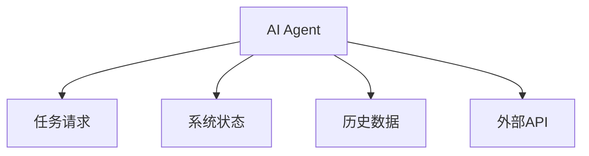
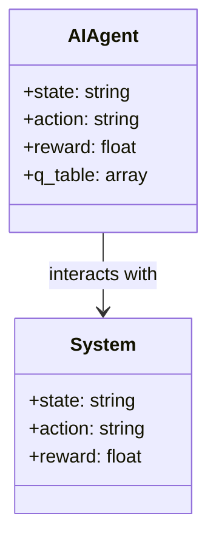
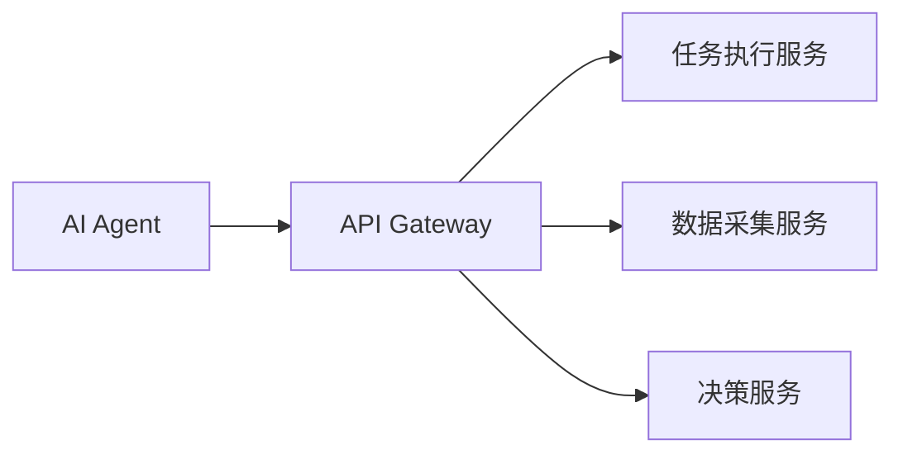

                 


# 企业AI Agent的自动化DevOps实践

> 关键词：企业AI Agent, 自动化DevOps, 强化学习, 系统架构设计, 项目实战

> 摘要：本文详细探讨了企业AI Agent在自动化DevOps中的应用，从基本概念到算法实现，再到系统设计和项目实战，全面解析了如何利用AI技术提升企业DevOps的自动化水平。通过深入分析AI Agent的核心原理、技术实现和实际应用案例，本文为读者提供了系统化的知识体系和实践指导。

---

## 第一章: 企业AI Agent与自动化DevOps概述

### 1.1 企业AI Agent的背景与重要性
#### 1.1.1 传统DevOps的局限性
- 传统DevOps依赖手动操作和预定义脚本，难以应对复杂多变的环境。
- 面对日益复杂的系统和业务需求，传统方法效率低下，容易出错。
- 人工运维成本高，且难以实现真正意义上的自动化。

#### 1.1.2 AI Agent在DevOps中的角色
- AI Agent作为智能决策者，能够根据实时数据和上下文信息自动执行操作。
- 通过自然语言处理和机器学习，AI Agent可以理解和执行复杂的任务。
- AI Agent能够优化DevOps流程，减少人工干预，提高效率和准确性。

#### 1.1.3 企业级AI Agent的核心价值
- 提高DevOps流程的智能化水平，实现真正的自动化运维。
- 通过智能决策减少人为错误，降低运维成本。
- 支持快速响应和自适应，适应企业快速变化的业务需求。

### 1.2 企业AI Agent的基本概念
#### 1.2.1 什么是AI Agent
- AI Agent是一个能够感知环境、理解任务需求，并通过智能决策和自主行动来完成目标的智能体。
- 它结合了人工智能、自然语言处理和自动化技术，能够在复杂的环境中执行任务。
- AI Agent的核心特征包括智能性、自主性、反应性和学习能力。

#### 1.2.2 AI Agent的核心特征
| 特征       | 描述                                                                 |
|------------|----------------------------------------------------------------------|
| 智能性      | 基于机器学习和大数据分析，能够做出智能决策。                     |
| 自主性      | 能够独立执行任务，无需人工干预。                               |
| 反应性      | 能够实时感知环境变化并做出响应。                             |
| 学习能力    | 通过反馈机制不断优化自身算法和决策策略。                     |

#### 1.2.3 企业AI Agent与传统自动化工具的区别
| 方面       | 传统自动化工具                              | 企业AI Agent                                  |
|------------|------------------------------------------|----------------------------------------------|
| 智能性      | 基于预定义规则和脚本，缺乏灵活性。        | 基于机器学习和大数据分析，具备智能决策能力。 |
| 自适应性    | 无法应对复杂多变的环境。                  | 能够自适应环境变化，动态调整策略。            |
| 交互方式    | 通常通过命令行或固定接口进行交互。       | 支持自然语言交互，能够理解用户意图。          |

### 1.3 企业AI Agent的应用场景
#### 1.3.1 CI/CD流程中的应用
- 自动化代码审查、构建、测试和部署流程。
- 根据历史数据优化CI/CD pipeline，减少构建失败率。
- 智能识别潜在问题，提前预警。

#### 1.3.2 智能监控与故障排查
- 实时监控系统运行状态，智能识别异常情况。
- 自动分析故障原因，提供解决方案建议。
- 自动生成故障报告，辅助运维人员快速定位问题。

#### 1.3.3 自动化运维与资源管理
- 自动化配置管理，确保系统一致性。
- 智能资源分配，优化计算资源利用率。
- 自动化容量规划，预测未来资源需求。

### 1.4 企业AI Agent的发展趋势
#### 1.4.1 AI与DevOps的深度融合
- 从简单的任务执行到智能决策的转变。
- DevOps工具链的智能化，AI Agent成为核心组件。

#### 1.4.2 企业AI Agent的未来发展方向
- 更强的自适应能力和学习能力。
- 支持多模态交互，包括文本、语音和图像。
- 高度集成到企业现有系统中，提供端到端的自动化能力。

#### 1.4.3 技术挑战与解决方案
- 数据隐私与安全问题：通过数据加密和匿名化处理。
- 算法可解释性：开发更加透明和可解释的机器学习模型。
- 多环境支持：优化算法以适应不同的计算资源和环境。

### 1.5 本章小结
- 本章介绍了企业AI Agent的基本概念、核心特征以及在DevOps中的应用场景。
- 强调了AI Agent在提升企业DevOps自动化水平中的重要性。
- 展望了未来的发展方向和面临的挑战。

---

## 第二章: AI Agent的核心概念与原理

### 2.1 AI Agent的核心概念
#### 2.1.1 智能决策机制
- 基于实时数据和历史信息，AI Agent能够做出最优决策。
- 使用强化学习和监督学习算法，优化决策过程。

#### 2.1.2 自然语言处理能力
- 通过NLP技术，AI Agent能够理解用户意图并执行任务。
- 支持多语言和复杂语义的理解，提高人机交互的自然性。

#### 2.1.3 自适应学习能力
- AI Agent能够通过反馈机制不断优化自身的算法和策略。
- 支持在线学习和离线学习，适应不同环境的变化。

### 2.2 AI Agent与传统自动化工具的对比
#### 2.2.1 工作原理对比
- 传统自动化工具基于预定义规则和脚本，缺乏灵活性。
- AI Agent通过机器学习算法，能够动态调整策略。

#### 2.2.2 功能特性对比
| 功能       | 传统自动化工具                        | 企业AI Agent                              |
|------------|--------------------------------------|------------------------------------------|
| 任务执行    | 执行预定义的脚本或命令。              | 根据上下文信息动态生成任务执行策略。     |
| 自适应性    | 无法根据环境变化调整策略。            | 能够自适应环境变化，动态优化策略。         |
| 智能性      | 无智能决策能力。                      | 具备智能决策能力，能够解决复杂问题。      |

#### 2.2.3 优缺点分析
| 优缺点       | 传统自动化工具                              | 企业AI Agent                                  |
|--------------|------------------------------------------|----------------------------------------------|
| 优点         | 实现简单，易于部署和维护。              | 具备智能性和自适应性，能够应对复杂场景。    |
| 缺点         | 难以应对复杂多变的环境，缺乏灵活性。      | 对技术要求高，开发和部署成本较高。        |

### 2.3 AI Agent的实体关系图


### 2.4 本章小结
- 本章详细探讨了AI Agent的核心概念和与传统自动化工具的区别。
- 通过对比分析，突出了AI Agent在自动化DevOps中的优势和挑战。

---

## 第三章: AI Agent的算法实现与数学模型

### 3.1 基于强化学习的决策算法
#### 3.1.1 强化学习
- 强化学习是一种通过试错机制来优化决策的机器学习方法。
- 通过与环境的交互，智能体学习如何做出最优决策以获得最大奖励。

#### 3.1.2 Q-Learning算法
- Q-Learning是一种经典的强化学习算法，适用于离线学习场景。
- 算法通过更新Q值表，学习状态-动作对的最优价值。

#### 3.1.3 算法实现
```python
class QLearningAgent:
    def __init__(self, state_space, action_space):
        self.q_table = np.zeros((state_space, action_space))
    
    def get_action(self, state):
        return np.argmax(self.q_table[state])
    
    def update(self, state, action, reward, next_state):
        self.q_table[state][action] = self.q_table[state][action] * 0.8 + reward * 0.2
```

#### 3.1.4 应用场景
- 优化CI/CD流程中的任务调度。
- 自动选择最优的资源分配策略。

### 3.2 基于监督学习的分类算法
#### 3.2.1 监督学习
- 监督学习是一种通过训练数据学习输入与输出之间关系的机器学习方法。
- 常见的监督学习算法包括线性回归、支持向量机和随机森林等。

#### 3.2.2 算法实现
```python
from sklearn.svm import SVC

model = SVC()
model.fit(X_train, y_train)
y_pred = model.predict(X_test)
```

#### 3.2.3 应用场景
- 系统故障分类与预测。
- 自动识别异常日志并分类。

### 3.3 算法的数学模型
#### 3.3.1 强化学习的数学模型
- 状态空间：S，动作空间：A。
- 奖励函数：R(s, a)，目标是最大化累积奖励。
- 动作选择策略：π(a|s)，表示在状态s下选择动作a的概率。

#### 3.3.2 监督学习的数学模型
- 输入：X，输出：Y。
- 损失函数：L(y, y_true)，目标是最小化损失。

### 3.4 本章小结
- 本章介绍了AI Agent中常用的强化学习和监督学习算法。
- 通过数学模型和代码示例，详细讲解了算法的实现和应用。

---

## 第四章: 系统架构设计

### 4.1 系统功能设计
#### 4.1.1 功能模块划分
- 用户交互模块：接收用户指令并解析。
- 任务执行模块：根据解析后的指令执行任务。
- 数据采集模块：采集系统运行数据并存储。
- 决策模块：基于数据进行智能决策。

#### 4.1.2 领域模型


### 4.2 系统架构设计
#### 4.2.1 分层架构
- 表示层：用户交互界面。
- 业务逻辑层：AI Agent的核心算法和逻辑。
- 数据访问层：与数据库和其他系统接口交互。

#### 4.2.2 微服务架构
- 每个功能模块独立为一个微服务。
- 通过API Gateway统一对外提供服务。

#### 4.2.3 架构图


### 4.3 接口设计
#### 4.3.1 API接口
- POST /api/agent/execute：接收任务请求并执行。
- GET /api/agent/status：获取系统当前状态。
- POST /api/agent/train：训练AI Agent模型。

#### 4.3.2 交互流程
1. 用户通过API发送任务请求。
2. AI Agent解析请求并生成决策。
3. 执行模块根据决策执行任务。
4. 数据采集模块记录执行结果并反馈给AI Agent。

### 4.4 本章小结
- 本章详细设计了企业AI Agent的系统架构，包括功能模块、架构图和接口设计。
- 强调了系统可扩展性和可维护性的重要性。

---

## 第五章: 项目实战

### 5.1 环境搭建
#### 5.1.1 安装依赖
- 安装Python、Jupyter Notebook、TensorFlow、Kubernetes等工具。
- 安装企业内部使用的DevOps工具，如Jenkins、Docker、Kubernetes。

#### 5.1.2 安装AI框架
- 安装TensorFlow或PyTorch框架。
- 配置自然语言处理库，如spaCy和transformers。

### 5.2 核心代码实现
#### 5.2.1 AI Agent核心算法实现
```python
import numpy as np
from sklearn.svm import SVC

class QLearningAgent:
    def __init__(self, state_space, action_space):
        self.q_table = np.zeros((state_space, action_space))
    
    def get_action(self, state):
        return np.argmax(self.q_table[state])
    
    def update(self, state, action, reward, next_state):
        self.q_table[state][action] = self.q_table[state][action] * 0.8 + reward * 0.2
```

#### 5.2.2 系统集成
```python
import requests

def execute_task(action):
    response = requests.post('http://localhost:8080/api/agent/execute', json={'action': action})
    return response.json()
```

### 5.3 案例分析
#### 5.3.1 CI/CD流程优化
- 使用AI Agent优化Jenkins pipeline，减少构建失败率。
- 通过机器学习算法预测构建时间，动态调整资源分配。

#### 5.3.2 故障自动修复
- AI Agent实时监控系统状态，智能识别异常情况。
- 自动触发修复任务，恢复系统正常运行。

### 5.4 项目总结
- 通过项目实战，验证了企业AI Agent在自动化DevOps中的有效性。
- 总结了实际应用中的经验教训，为后续优化提供了参考。

### 5.5 本章小结
- 本章通过实际项目展示了企业AI Agent的实现和应用。
- 强调了理论与实践相结合的重要性。

---

## 第六章: 最佳实践与未来展望

### 6.1 最佳实践
#### 6.1.1 数据质量管理
- 确保数据的完整性和准确性，为AI Agent提供可靠的输入。
- 定期清洗和更新数据，保持模型的有效性。

#### 6.1.2 模型可解释性
- 开发可解释的机器学习模型，便于分析和优化。
- 提供直观的可视化工具，帮助运维人员理解模型决策。

#### 6.1.3 安全与隐私
- 加强数据加密和访问控制，确保系统安全。
- 遵守数据隐私法规，保护用户隐私。

### 6.2 未来展望
#### 6.2.1 多模态交互
- 支持语音和图像等多种交互方式，提高用户体验。
- 结合计算机视觉技术，实现更智能的系统监控。

#### 6.2.2 自适应学习
- 开发更加高效的在线学习算法，适应快速变化的环境。
- 利用迁移学习技术，提高模型的泛化能力。

#### 6.2.3 边缘计算
- 将AI Agent部署在边缘设备上，减少延迟和带宽消耗。
- 实现分布式计算和协同决策。

### 6.3 本章小结
- 本章总结了企业在实施AI Agent过程中需要注意的事项。
- 展望了未来的发展趋势和可能的应用场景。

---

## 作者：AI天才研究院/AI Genius Institute & 禅与计算机程序设计艺术 /Zen And The Art of Computer Programming

---

**摘要**：本文系统地探讨了企业AI Agent在自动化DevOps中的应用，从基本概念到算法实现，再到系统设计和项目实战，全面解析了如何利用AI技术提升企业DevOps的自动化水平。通过深入分析AI Agent的核心原理、技术实现和实际应用案例，本文为读者提供了系统化的知识体系和实践指导。

