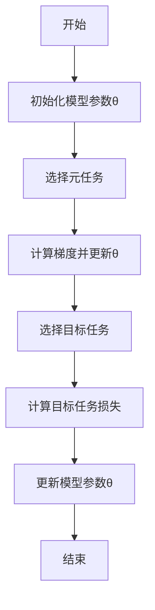
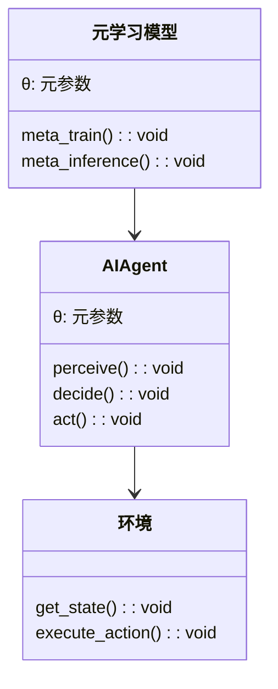
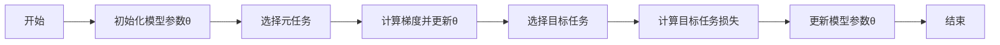
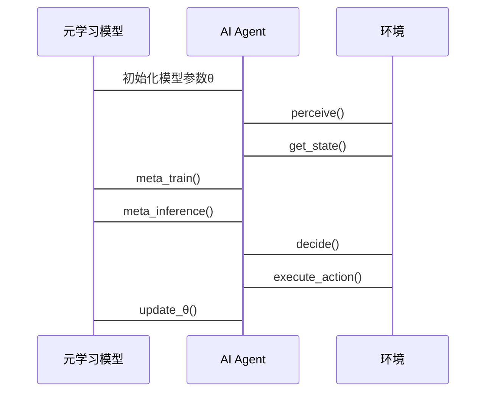

                 


```markdown
# 元学习在AI Agent快速适应中的应用

## 关键词：元学习，AI Agent，快速适应，算法原理，系统架构

## 摘要：  
本文深入探讨了元学习在AI Agent快速适应中的应用，从背景介绍、核心概念、算法原理、系统架构到项目实战，全面解析了元学习如何助力AI Agent在复杂环境中的快速适应能力。通过对比分析和实际案例，揭示了元学习在提升AI Agent灵活性和智能性方面的巨大潜力。

---

# 第一部分: 元学习在AI Agent快速适应中的应用概述

# 第1章: 元学习与AI Agent的背景介绍

## 1.1 元学习的基本概念

### 1.1.1 元学习的定义与核心思想  
元学习（Meta-Learning）是一种通过学习如何学习的方法。它允许模型在较少数据的情况下快速适应新任务，核心思想是通过“元任务”（meta-tasks）训练模型的“元参数”（meta-parameters），使模型能够快速调整以适应新任务。

### 1.1.2 元学习与传统机器学习的区别  
传统机器学习算法依赖于大量标注数据，并在单任务上进行训练，而元学习通过在多个任务上进行训练，使模型能够快速适应新任务，减少对数据量的依赖。

### 1.1.3 元学习的应用场景与优势  
元学习适用于需要快速适应新任务的场景，如游戏AI、智能助手、自动驾驶等。其优势在于减少数据需求、提高学习效率和模型的泛化能力。

## 1.2 AI Agent的基本概念

### 1.2.1 AI Agent的定义与分类  
AI Agent是一种能够感知环境并采取行动以实现目标的智能体。根据智能水平，AI Agent可以分为反应式Agent、基于模型的Agent和混合型Agent。

### 1.2.2 AI Agent的核心功能与特点  
AI Agent的核心功能包括感知环境、决策制定和执行动作。其特点在于智能性、自主性和适应性。

### 1.2.3 AI Agent在不同领域的应用案例  
AI Agent在游戏、医疗、金融等领域有广泛应用，如游戏中的智能对手、医疗诊断辅助系统等。

## 1.3 元学习在AI Agent中的应用背景

### 1.3.1 AI Agent快速适应的需求背景  
在动态变化的环境中，AI Agent需要快速适应新任务，元学习为此提供了有效的解决方案。

### 1.3.2 元学习如何解决AI Agent的适应性问题  
元学习通过预训练模型的元参数，使AI Agent能够在新任务中快速调整策略，减少适应时间。

### 1.3.3 元学习与AI Agent结合的前沿研究  
当前研究主要集中在如何将元学习算法应用于AI Agent的决策过程中，提升其适应性和智能性。

## 1.4 本章小结  
本章介绍了元学习和AI Agent的基本概念，分析了元学习在AI Agent快速适应中的应用背景，为后续章节奠定了基础。

---

# 第2章: 元学习与AI Agent的核心概念与联系

## 2.1 元学习的核心原理

### 2.1.1 元学习的层次结构  
元学习由元任务和目标任务组成，通过训练模型在元任务上的泛化能力，使其能够快速适应目标任务。

### 2.1.2 元学习的数学模型与公式  
元学习的目标是优化模型的元参数$\theta$，以最小化目标任务的损失函数：
$$L_{\text{meta}}(\theta) = \sum_{i=1}^{N} L_i(\theta)$$

### 2.1.3 元学习的算法流程图（Mermaid）



## 2.2 AI Agent的核心架构

### 2.2.1 AI Agent的感知层  
感知层负责从环境中获取信息，如视觉、听觉等感官输入。

### 2.2.2 AI Agent的决策层  
决策层基于感知信息进行推理和决策，选择最优动作。

### 2.2.3 AI Agent的执行层  
执行层将决策层的指令转化为具体动作，与环境交互。

## 2.3 元学习与AI Agent的结合模型

### 2.3.1 元学习在AI Agent中的应用架构  
元学习通过优化AI Agent的决策层参数，使其能够快速适应新任务。

### 2.3.2 元学习与AI Agent的实体关系图（Mermaid）

```mermaid
entity-meta
    entity: 元学习模型
    entity: AI Agent
    relationship: 元学习模型优化AI Agent的决策能力
```

## 2.4 核心概念对比分析

### 2.4.1 元学习与传统机器学习的对比

| 特性         | 元学习             | 传统机器学习         |
|--------------|--------------------|----------------------|
| 数据需求     | 较少               | 较多                 |
| 任务适应性   | 强                 | 弱                   |
| 灵活性       | 高                 | 低                   |

### 2.4.2 AI Agent与传统AI系统的对比

| 特性         | AI Agent            | 传统AI系统           |
|--------------|---------------------|----------------------|
| 独立性       | 高                 | 低                   |
| 适应性       | 强                 | 弱                   |
| 可交互性     | 高                 | 低                   |

### 2.4.3 元学习在AI Agent中的独特优势  
元学习通过预训练模型的元参数，使AI Agent能够快速适应新任务，提高其灵活性和适应性。

## 2.5 本章小结  
本章详细讲解了元学习和AI Agent的核心概念，并分析了它们的结合模型，为后续章节奠定了理论基础。

---

# 第3章: 元学习在AI Agent中的算法原理

## 3.1 元学习算法的分类与特点

### 3.1.1 基于模型无关的元学习算法  
模型无关元学习算法（MAML）通过优化模型的参数，使其能够快速适应新任务。

### 3.1.2 基于模型相关的元学习算法  
基于模型的元学习算法（如Meta-SGD）通过优化模型的参数和任务特定参数，实现快速适应。

### 3.1.3 元学习算法的优缺点对比

| 算法类型     | 优点               | 缺点                 |
|--------------|--------------------|----------------------|
| 模型无关     | 简单               | 适应性有限           |
| 模型相关     | 适应性强           | 复杂性高             |

## 3.2 元学习算法的数学模型与公式

### 3.2.1 元学习的通用公式表示  
元学习的目标是通过优化模型的元参数$\theta$，使模型能够快速适应新任务：
$$\theta = \arg\max_{\theta} \sum_{i=1}^{N} \mathbb{E}_{(x_i,y_i)}[\mathcal{L}(\theta; x_i,y_i)]$$

### 3.2.2 元学习的梯度下降过程  
元学习的梯度下降过程如下：
$$\theta_{t+1} = \theta_t - \eta \nabla_{\theta} \mathcal{L}(\theta; x_i,y_i)$$

## 3.3 元学习算法的实现流程

### 3.3.1 元学习算法的初始化  
初始化模型参数$\theta$和学习率$\eta$。

### 3.3.2 元学习算法的训练过程  
1. 选择元任务。
2. 计算梯度并更新模型参数$\theta$。
3. 选择目标任务。
4. 计算目标任务损失并更新模型参数$\theta$。

### 3.3.3 元学习算法的优化策略  
使用Adam优化器或其他优化器加速训练过程。

## 3.4 本章小结  
本章详细讲解了元学习算法的分类、数学模型和实现流程，为后续章节的系统设计和项目实战奠定了基础。

---

# 第4章: 元学习在AI Agent中的系统架构设计方案

## 4.1 问题场景介绍  
本章以训练一个AI Agent在迷宫中导航为例，展示元学习在系统架构中的应用。

## 4.2 系统功能设计

### 4.2.1 领域模型设计（Mermaid类图）



### 4.2.2 系统架构设计（Mermaid架构图）



### 4.2.3 系统接口设计  
系统接口包括感知接口、决策接口和执行接口。

### 4.2.4 系统交互设计（Mermaid序列图）



## 4.3 本章小结  
本章设计了基于元学习的AI Agent系统架构，展示了如何将元学习应用于AI Agent的训练和推理过程。

---

# 第5章: 元学习在AI Agent中的项目实战

## 5.1 环境安装与配置

### 5.1.1 安装Python和必要的库  
安装Python和以下库：
- TensorFlow或PyTorch
- Mermaid
- matplotlib

### 5.1.2 安装元学习算法库  
安装MAML或其他元学习算法库。

## 5.2 系统核心实现源代码

### 5.2.1 元学习模型实现（Python代码）

```python
import torch
import torch.nn as nn
import torch.optim as optim

class MetaLearner(nn.Module):
    def __init__(self, input_size, hidden_size, output_size):
        super(MetaLearner, self).__init__()
        self.fc1 = nn.Linear(input_size, hidden_size)
        self.fc2 = nn.Linear(hidden_size, output_size)
    
    def forward(self, x):
        x = torch.relu(self.fc1(x))
        x = self.fc2(x)
        return x

def meta_train(model, optimizer, criterion, tasks):
    for task in tasks:
        optimizer.zero_grad()
        inputs, labels = task
        outputs = model(inputs)
        loss = criterion(outputs, labels)
        loss.backward()
        optimizer.step()
```

### 5.2.2 AI Agent实现（Python代码）

```python
class AI_Agent:
    def __init__(self, metalearner):
        self.metalearner = metalearner
    
    def perceive(self, state):
        # 将状态输入元学习模型
        return self.metalearner(state)
    
    def decide(self, state):
        # 基于元学习模型输出决策
        return self.perceive(state)
    
    def act(self, action):
        # 执行动作
        pass
```

### 5.2.3 环境实现（Python代码）

```python
class Environment:
    def __init__(self):
        pass
    
    def get_state(self):
        # 返回当前状态
        pass
    
    def execute_action(self, action):
        # 执行动作并返回奖励
        pass
```

## 5.3 代码应用解读与分析  
本节详细解读了元学习模型、AI Agent和环境的实现代码，并分析了它们之间的交互过程。

## 5.4 实际案例分析与详细讲解  
以训练一个AI Agent在迷宫中导航为例，详细讲解了如何使用元学习算法优化AI Agent的决策过程。

## 5.5 项目小结  
本章通过实际案例展示了元学习在AI Agent中的应用，验证了元学习在提升AI Agent适应性方面的有效性。

---

# 第6章: 元学习在AI Agent中的最佳实践与小结

## 6.1 元学习的优缺点与注意事项

### 6.1.1 元学习的优缺点  
优点：减少数据需求、提高适应性；缺点：计算复杂度高、需要预训练。

### 6.1.2 元学习的注意事项  
选择合适的元学习算法、优化模型参数、确保计算资源充足。

## 6.2 元学习在AI Agent中的小结  
元学习通过预训练模型的元参数，使AI Agent能够快速适应新任务，提升其灵活性和智能性。

## 6.3 最佳实践 tips  
根据具体任务选择合适的元学习算法、合理配置模型参数、确保计算资源充足。

## 6.4 拓展阅读与进一步思考  
建议读者进一步研究元学习在多智能体系统中的应用，以及如何结合强化学习提升AI Agent的智能性。

---

## 作者：AI天才研究院/AI Genius Institute & 禅与计算机程序设计艺术 /Zen And The Art of Computer Programming
```

