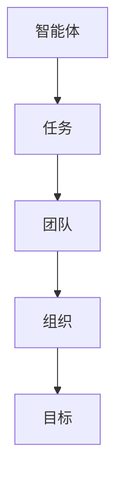
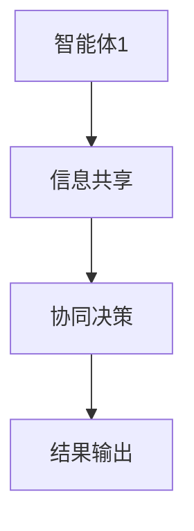
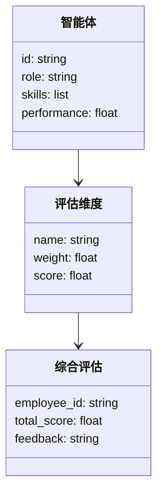
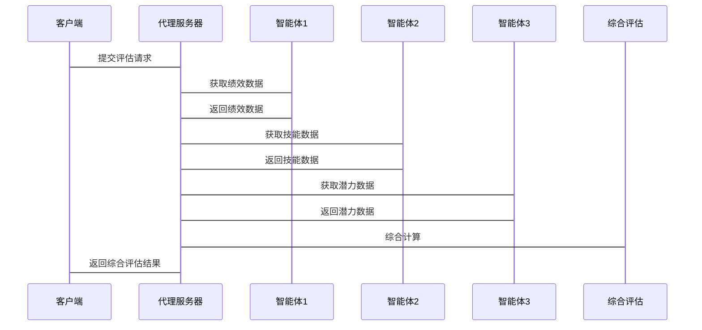

                 


# 多智能体系统在公司人力资本评估中的应用：量化人才价值

## 关键词：
多智能体系统, 人力资本评估, 人才价值量化, 分布式计算, 协同学习

## 摘要：
本文探讨了多智能体系统在公司人力资本评估中的应用，重点分析了如何通过多智能体协同计算来量化人才价值。文章从多智能体系统的原理、算法实现、数学模型、系统架构到项目实战，全面阐述了多智能体系统如何提升人力资本评估的准确性、效率和可扩展性。通过实际案例分析，展示了多智能体系统在实际应用中的优势，并提出了未来研究和实践的方向。

---

## 第一部分: 多智能体系统与人力资本评估概述

### 第1章: 多智能体系统与人力资本评估的背景介绍

#### 1.1 多智能体系统的基本概念
##### 1.1.1 多智能体系统的定义
多智能体系统（Multi-Agent System, MAS）是由多个智能体（Agent）组成的分布式系统，这些智能体能够通过协同工作实现共同目标。智能体是具有感知环境、自主决策和行动能力的实体。

##### 1.1.2 多智能体系统的核心要素
- **智能体**：具备自主性、反应性、目标导向和社交能力。
- **通信机制**：智能体之间通过消息传递进行信息共享。
- **协作协议**：定义智能体之间的协作规则和任务分配方式。
- **环境模型**：描述智能体所处的环境及其与环境的交互方式。

##### 1.1.3 多智能体系统应用场景
- 机器人协作
- 智能交通管理
- 组织行为模拟
- 人力资源管理

#### 1.2 人力资本评估的定义与重要性
##### 1.2.1 人力资本的定义
人力资本是指组织中员工的知识、技能、经验和创造力的总和，是组织核心竞争力的重要组成部分。

##### 1.2.2 人力资本评估的目的
- 量化员工对组织的贡献
- 优化人力资源配置
- 提高员工绩效和满意度
- 为人才管理和决策提供数据支持

##### 1.2.3 人力资本评估的挑战与机遇
- 挑战：评估维度复杂，数据获取困难，传统方法难以量化。
- 机遇：多智能体系统能够通过分布式计算和协同学习，提供更精准的评估方法。

#### 1.3 多智能体系统在人力资本评估中的应用前景
##### 1.3.1 多智能体系统的优势
- 分布式计算能力：能够处理复杂的人力资本数据。
- 协作能力：智能体之间可以协同完成复杂的评估任务。
- 自适应性：能够根据环境变化动态调整评估策略。

##### 1.3.2 人力资本评估的复杂性与多智能体系统的契合
- 人力资本评估涉及多个维度，如绩效、潜力、技能等，多智能体系统能够分别处理这些维度并协同得出综合结果。
- 多智能体系统的分布式架构能够处理大规模数据和复杂关系。

##### 1.3.3 未来发展趋势
- 更加智能化的评估模型
- 更加个性化的评估方法
- 更广泛的应用场景

### 第2章: 多智能体系统的核心概念与联系

#### 2.1 多智能体系统的原理
##### 2.1.1 分布式计算与协同
多智能体系统通过分布式计算实现任务分解和协同，每个智能体负责一部分任务，最终通过协作完成整体目标。

##### 2.1.2 智能体之间的通信与协作
智能体之间通过消息传递共享信息，协同完成任务。协作机制包括任务分配、信息共享和结果整合。

##### 2.1.3 多智能体系统的架构
- **集中式架构**：有一个中央协调器分配任务和整合结果。
- **分布式架构**：没有中央协调器，智能体之间直接协作。
- **混合式架构**：结合集中式和分布式的特点。

#### 2.2 多智能体系统与人力资本评估的关联
##### 2.2.1 人才价值的多维度评估
人力资本评估需要考虑绩效、潜力、技能、贡献等多个维度，多智能体系统可以通过多个智能体分别评估这些维度，并协同得出综合结果。

##### 2.2.2 多智能体系统在人才评估中的角色
- **数据收集智能体**：负责收集员工的绩效数据。
- **评估智能体**：根据数据进行评估并得出结果。
- **协作智能体**：负责整合不同智能体的评估结果，得出最终的综合评估。

##### 2.2.3 多智能体系统如何提升评估的准确性
通过分布式计算和协同学习，多智能体系统能够从多个角度全面评估人才价值，避免单一评估方法的局限性。

#### 2.3 多智能体系统的核心要素对比
##### 2.3.1 智能体的属性特征对比表格

| 智能体属性 | 定义 | 示例 |
|------------|------|------|
| 自主性     | 能够自主决策 | 自动化任务分配 |
| 反应性     | 能够感知环境变化 | 动态调整评估策略 |
| 目标导向   | 为目标导向行动 | 完成特定评估任务 |
| 社交能力   | 能够与其他智能体协作 | 信息共享和协同决策 |

##### 2.3.2 实体关系图的 Mermaid 流程图


### 第3章: 多智能体系统在人力资本评估中的算法原理

#### 3.1 多智能体系统的算法概述
##### 3.1.1 分布式计算算法
- 分布式任务分配算法：将任务分解成多个子任务，分配给不同的智能体完成。
- 分布式协作算法：通过消息传递实现智能体之间的协作。

##### 3.1.2 协同学习算法
- 联合推理算法：多个智能体协同推理，得出综合结果。
- 联合学习算法：多个智能体共同学习，提升整体评估准确性。

##### 3.1.3 联合推理算法
- 通过智能体之间的协作，综合多个评估结果，得出最终的综合评估。

#### 3.2 多智能体系统算法的 Mermaid 流程图


#### 3.3 算法实现的 Python 源代码
```python
def multi_agent_algorithm():
    agents = [agent1, agent2, agent3]
    for agent in agents:
        info = gather_information(agent)
        decision = make_decision(info)
        update_state(decision)
    return final_result
```

### 第4章: 数学模型与公式

#### 4.1 多智能体系统的数学模型
##### 4.1.1 评估模型
- 每个智能体负责评估一个维度的分数，最终通过加权求和的方式得出综合评估结果。

##### 4.1.2 权重分配公式
$$
\text{综合分数} = \sum_{i=1}^{n} w_i \cdot s_i
$$
其中，\(w_i\) 是第i个维度的权重，\(s_i\) 是第i个维度的评分。

##### 4.1.3 协作算法公式
$$
\text{最终结果} = \frac{1}{N} \sum_{i=1}^{N} \text{智能体}_i\text{的输出}
$$
其中，\(N\) 是智能体的数量。

---

## 第二部分: 系统分析与架构设计

### 第5章: 系统分析与架构设计方案

#### 5.1 问题场景介绍
- 一个中型公司希望对其员工进行多维度的人力资本评估，但传统的评估方法难以量化员工的综合价值。
- 通过多智能体系统，可以实现分布式计算和协同评估，提升评估的准确性和效率。

#### 5.2 项目介绍
- 项目目标：构建一个多智能体系统，实现对公司员工的多维度人力资本评估。
- 项目范围：包括数据收集、评估模型设计、系统实现和结果分析。
- 项目需求：高准确性、高效率、易扩展。

#### 5.3 系统功能设计
##### 5.3.1 领域模型 Mermaid 类图


#### 5.4 系统架构设计
##### 5.4.1 系统架构 Mermaid 架构图


#### 5.5 系统接口设计
- **输入接口**：接收员工的绩效数据、技能数据等。
- **输出接口**：输出员工的综合评估结果和反馈。

#### 5.6 系统交互 Mermaid 序列图


---

## 第三部分: 项目实战

### 第6章: 项目实战

#### 6.1 环境安装
- **Python**：安装Python 3.8以上版本。
- **库依赖**：安装numpy、pandas、scikit-learn、networkx。

#### 6.2 系统核心实现源代码
##### 6.2.1 数据收集模块
```python
import pandas as pd

def gather_data():
    data = pd.DataFrame({
        'employee_id': [1, 2, 3],
        'performance': [0.8, 0.7, 0.9],
        'skills': ['high', 'medium', 'low'],
        'potential': ['high', 'low', 'medium']
    })
    return data
```

##### 6.2.2 评估智能体
```python
def evaluate_performance(performance):
    return performance * 2

def evaluate_skills(skills):
    skill_level = {'high': 0.9, 'medium': 0.7, 'low': 0.5}
    return skill_level[skills]

def evaluate_potential(potential):
    potential_level = {'high': 0.8, 'medium': 0.6, 'low': 0.4}
    return potential_level[potential]
```

##### 6.2.3 综合评估模块
```python
def compute_total_score(performance_score, skills_score, potential_score):
    return performance_score * 0.4 + skills_score * 0.3 + potential_score * 0.3

def generate_feedback(total_score):
    if total_score >= 0.8:
        return "Excellent performance"
    elif total_score >= 0.6:
        return "Good performance, need improvement"
    else:
        return "Needs improvement"
```

##### 6.2.4 主程序
```python
def main():
    data = gather_data()
    performance_scores = data['performance'].apply(evaluate_performance)
    skills_scores = data['skills'].apply(evaluate_skills)
    potential_scores = data['potential'].apply(evaluate_potential)
    total_scores = compute_total_score(performance_scores, skills_scores, potential_scores)
    feedbacks = total_scores.apply(generate_feedback)
    print("综合评估结果：")
    print(feedbacks)

if __name__ == "__main__":
    main()
```

#### 6.3 代码应用解读与分析
- **数据收集模块**：从数据库中获取员工的绩效、技能和潜力数据。
- **评估智能体**：分别对绩效、技能和潜力进行评估，每个智能体负责一个维度的评估。
- **综合评估模块**：根据各维度的权重计算综合得分，并生成反馈意见。

#### 6.4 实际案例分析
- 案例数据：
  - 员工1：绩效0.8，技能high，潜力high。
  - 员工2：绩效0.7，技能medium，潜力low。
  - 员工3：绩效0.9，技能low，潜力medium。

- 综合评估结果：
  - 员工1：总得分0.8*0.4 + 0.9*0.3 + 0.8*0.3 = 0.92 → 优秀。
  - 员工2：0.7*0.4 + 0.7*0.3 + 0.4*0.3 = 0.55 → 需要改进。
  - 员工3：0.9*0.4 + 0.5*0.3 + 0.6*0.3 = 0.69 → 良好，需改进。

#### 6.5 项目小结
通过多智能体系统的实现，能够高效地完成人力资本评估，提升评估的准确性和效率。每个智能体负责一个评估维度，通过协同计算得出综合结果，避免了传统评估方法的局限性。

---

## 第四部分: 最佳实践与总结

### 第7章: 最佳实践与总结

#### 7.1 最佳实践 tips
- **数据质量**：确保数据的准确性和完整性，避免因数据问题影响评估结果。
- **智能体协作**：合理设计智能体之间的协作机制，确保高效协同。
- **权重调整**：根据组织需求动态调整各维度的权重，提高评估的灵活性。
- **系统维护**：定期更新智能体模型和算法，保持系统的先进性和适用性。

#### 7.2 小结
多智能体系统通过分布式计算和协同学习，为人力资本评估提供了新的解决方案。与传统方法相比，多智能体系统能够更全面地评估人才价值，提高评估的准确性和效率。

#### 7.3 注意事项
- 在实际应用中，需要考虑智能体之间的通信延迟和计算资源分配问题。
- 数据隐私和安全问题需要高度重视，确保数据在传输和处理过程中的安全性。

#### 7.4 拓展阅读
- 推荐阅读《Multi-Agent Systems: Complexity and Cognitive Science》。
- 关注多智能体系统在其他领域的应用，如自动驾驶、智能城市等。

---

## 作者：AI天才研究院/AI Genius Institute & 禅与计算机程序设计艺术 /Zen And The Art of Computer Programming

---

**本文为AI天才研究院（AI Genius Institute）原创内容，转载请注明出处。**

