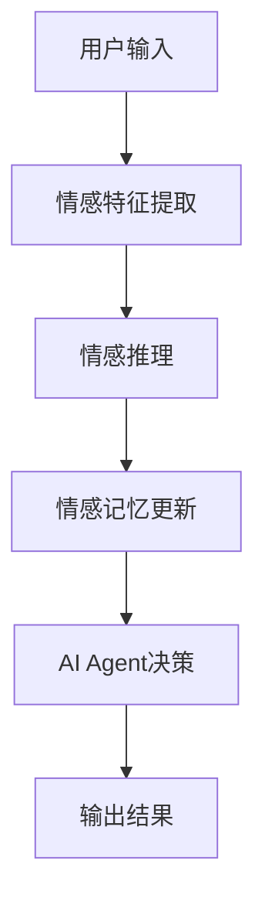
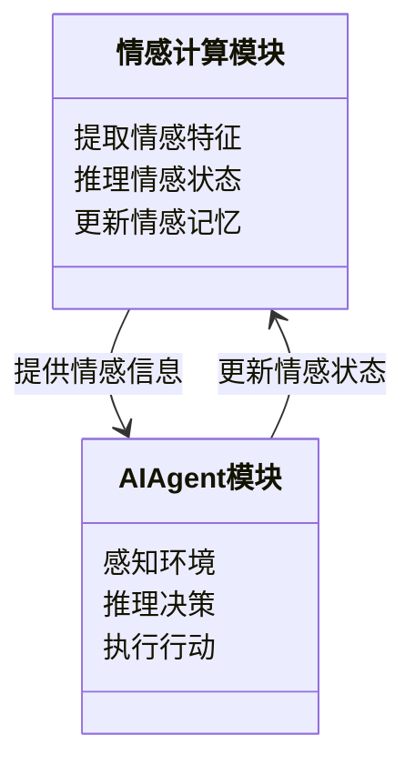
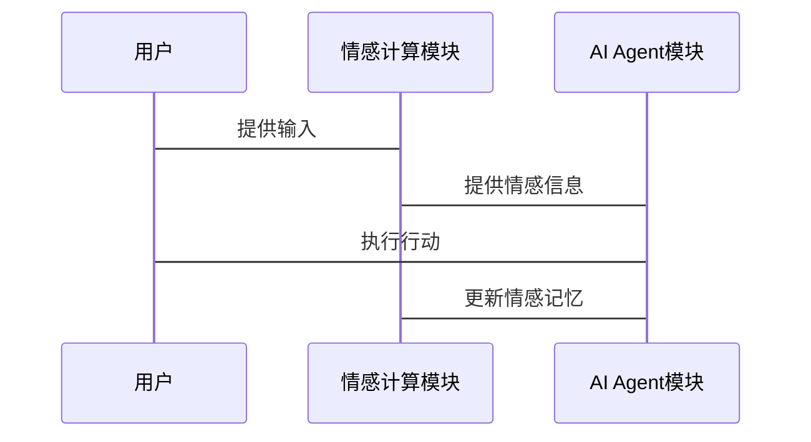
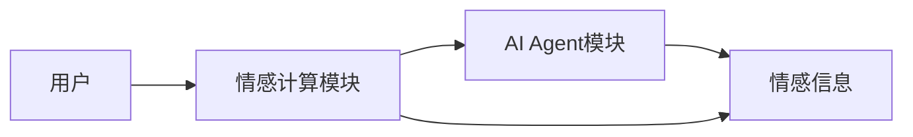
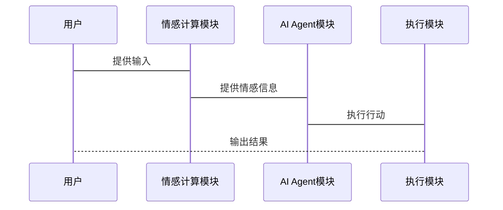
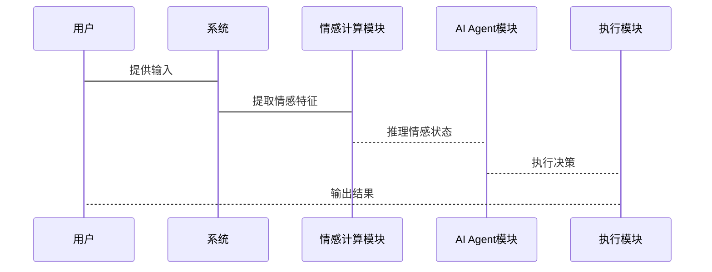

                 


# 情感计算增强AI Agent：提升LLM的情感智能

> 关键词：情感计算、AI Agent、自然语言处理、机器学习、深度学习

> 摘要：本文探讨了情感计算在AI Agent中的应用，详细分析了情感计算的核心技术及其与AI Agent的结合方式，通过算法实现、系统设计和项目实战，展示了如何提升大语言模型（LLM）的情感智能，使AI Agent能够更好地理解和处理人类情感。

---

# 第一章: 情感计算与AI Agent概述

## 1.1 情感计算的基本概念

### 1.1.1 情感计算的定义
情感计算（Affective Computing）是研究计算机系统如何识别、理解和响应人类情感的一门交叉学科。它不仅关注用户的情感状态，还试图通过技术手段与用户进行情感上的互动。情感计算的核心在于捕捉和分析情感相关的数据，如文本、语音和图像中的情感信息。

### 1.1.2 情感计算的核心要素
- **情感特征提取**：从数据中提取与情感相关特征，如文本中的情感词、语音的音调和语速、图像中的表情特征。
- **情感推理**：基于提取的特征，判断用户的情感状态，如快乐、悲伤、愤怒等。
- **情感记忆**：记录用户的情感变化，以便后续更好地理解和响应。

### 1.1.3 情感计算的应用场景
- **智能客服**：通过分析用户的情感状态，提供更贴心的服务。
- **教育技术**：根据学生的情感变化调整教学策略。
- **社交机器人**：与用户进行情感上的互动，增强用户体验。

## 1.2 AI Agent的基本概念

### 1.2.1 AI Agent的定义
AI Agent（人工智能代理）是一种能够感知环境并采取行动以实现目标的智能实体。它可以是一个软件程序，也可以是一个物理设备，通过与环境交互，完成特定任务。

### 1.2.2 AI Agent的分类
- **简单反射型Agent**：基于简单的规则做出反应。
- **基于模型的反射型Agent**：维护环境的模型，基于模型做出决策。
- **目标驱动型Agent**：根据目标选择行动。
- **实用驱动型Agent**：根据效用函数选择行动。

### 1.2.3 AI Agent的核心功能
- **感知**：通过传感器或接口获取环境信息。
- **推理**：分析信息，做出决策。
- **行动**：根据决策执行操作。
- **学习**：通过经验改进性能。

## 1.3 情感计算与AI Agent的结合

### 1.3.1 情感计算在AI Agent中的作用
情感计算为AI Agent提供了情感理解能力，使其能够更好地与人类交互，提升用户体验。

### 1.3.2 情感计算增强AI Agent的意义
- **提升用户体验**：通过理解用户情感，提供更个性化的服务。
- **增强决策能力**：情感信息可以作为决策的辅助依据。
- **扩展应用场景**：情感计算使AI Agent能够处理更多复杂任务。

### 1.3.3 情感计算增强AI Agent的应用前景
- **智能助手**：提供更贴心的服务。
- **心理健康支持**：通过情感分析提供心理支持。
- **教育辅助**：根据学生情感状态调整教学策略。

## 1.4 本章小结
本章介绍了情感计算和AI Agent的基本概念，探讨了情感计算在AI Agent中的作用及其应用前景，为后续章节奠定了基础。

---

# 第二章: 情感计算的核心技术

## 2.1 情感特征提取

### 2.1.1 文本情感特征提取
- **情感词提取**：识别文本中的情感词汇，如“高兴”、“悲伤”等。
- **情感句分析**：分析句子的情感倾向。
- **情感段落分析**：综合分析段落的情感。

### 2.1.2 声音情感特征提取
- **音调分析**：分析声音的音调变化。
- **语速分析**：分析说话速度。
- **语调分析**：分析声音的高低变化。

### 2.1.3 图像情感特征提取
- **面部表情识别**：分析面部表情特征。
- **肢体语言识别**：分析肢体动作特征。
- **颜色情感分析**：分析图像的颜色特征。

## 2.2 情感推理算法

### 2.2.1 基于规则的情感推理
- **规则定义**：根据预定义的规则进行情感推理。
- **案例分析**：例如，根据否定词的出现，推断情感倾向为负面。

### 2.2.2 基于机器学习的情感推理
- **特征选择**：选择情感相关的特征。
- **模型训练**：使用训练数据训练情感分类器。
- **情感预测**：基于训练好的模型进行情感预测。

### 2.2.3 基于深度学习的情感推理
- **神经网络模型**：如LSTM、Transformer等。
- **端到端训练**：直接从原始数据中学习情感特征。
- **情感强度预测**：预测情感的强度，如“非常高兴”或“有点生气”。

## 2.3 情感记忆机制

### 2.3.1 情感记忆的定义
情感记忆是指记录和存储用户的情感变化，以便后续更好地理解和响应。

### 2.3.2 情感记忆的实现方式
- **基于时间序列**：记录情感随时间的变化。
- **基于事件驱动**：记录特定事件的情感变化。
- **基于上下文**：记录情感与上下文的关系。

### 2.3.3 情感记忆的应用
- **个性化服务**：根据用户历史情感记录，提供个性化建议。
- **情感趋势分析**：分析用户情感变化趋势。

## 2.4 本章小结
本章详细介绍了情感计算的核心技术，包括情感特征提取、情感推理算法和情感记忆机制，为后续章节提供了技术基础。

---

# 第三章: AI Agent的核心技术

## 3.1 知识表示与推理

### 3.1.1 知识图谱的构建
- **实体识别**：识别文本中的实体。
- **关系抽取**：抽取实体之间的关系。
- **知识图谱构建**：将实体和关系组织成图结构。

### 3.1.2 基于知识图谱的推理
- **路径查询**：通过知识图谱查询特定路径。
- **逻辑推理**：基于知识图谱进行逻辑推理。
- **概率推理**：基于概率模型进行推理。

### 3.1.3 知识表示的优化
- **实体消歧**：消除实体的歧义性。
- **关系权重化**：赋予关系不同的权重。
- **知识融合**：整合多源知识。

## 3.2 自然语言处理

### 3.2.1 基于词嵌入的NLP技术
- **词嵌入模型**：如Word2Vec、GloVe。
- **上下文嵌入**：如BERT、GPT。
- **文本摘要**：提取文本摘要。
- **机器翻译**：进行语言翻译。

### 3.2.2 基于预训练模型的NLP技术
- **大规模预训练**：使用大规模数据预训练模型。
- **微调任务**：针对具体任务微调模型。
- **零样本学习**：无需特定数据即可完成任务。

### 3.2.3 多语言NLP技术
- **多语言模型**：支持多种语言的NLP任务。
- **跨语言推理**：在不同语言之间进行推理。

## 3.3 人机交互

### 3.3.1 基于文本的交互
- **文本生成**：生成自然语言文本。
- **对话系统**：实现流畅的对话交互。

### 3.3.2 基于语音的交互
- **语音识别**：将语音转换为文本。
- **语音合成**：将文本转换为语音。
- **语音情感识别**：识别语音中的情感特征。

### 3.3.3 基于视觉的交互
- **图像识别**：识别图像中的物体和场景。
- **视觉问答**：回答基于图像的问题。
- **视觉推理**：根据图像进行推理。

## 3.4 本章小结
本章介绍了AI Agent的核心技术，包括知识表示与推理、自然语言处理和人机交互，为后续章节提供了技术支持。

---

# 第四章: 情感计算增强AI Agent的算法实现

## 4.1 情感计算增强AI Agent的算法框架

### 4.1.1 算法流程图



### 4.1.2 算法实现细节
- **情感特征提取**：使用预训练的情感词典提取情感特征。
- **情感推理**：基于深度学习模型进行情感分类。
- **情感记忆更新**：根据当前情感状态更新历史记录。

## 4.2 情感计算增强AI Agent的数学模型

### 4.2.1 情感强度计算公式

$$
\text{情感强度} = \sum_{i=1}^{n} w_i \times e_i
$$

其中，$w_i$ 是情感特征 $e_i$ 的权重。

### 4.2.2 情感记忆更新公式

$$
m_{t} = \alpha \times m_{t-1} + (1-\alpha) \times e_t
$$

其中，$\alpha$ 是记忆衰减因子，$e_t$ 是当前情感强度。

## 4.3 本章小结
本章详细介绍了情感计算增强AI Agent的算法实现，包括算法流程图和数学模型，为后续章节提供了实现基础。

---

# 第五章: 情感计算增强AI Agent的系统设计

## 5.1 系统功能设计

### 5.1.1 系统功能模块



### 5.1.2 功能模块交互



## 5.2 系统架构设计

### 5.2.1 系统架构图



### 5.2.2 系统组件交互



## 5.3 系统接口设计

### 5.3.1 系统接口描述
- **输入接口**：接收用户输入，如文本、语音、图像。
- **输出接口**：输出AI Agent的决策结果。
- **情感接口**：提供情感信息，如情感强度、情感类型。

### 5.3.2 接口交互流程



## 5.4 本章小结
本章详细设计了情感计算增强AI Agent的系统架构和功能模块，为后续章节的实现提供了系统支持。

---

# 第六章: 项目实战——情感计算增强AI Agent的实现

## 6.1 项目环境安装

### 6.1.1 安装Python环境
```bash
python --version
pip install --upgrade pip
```

### 6.1.2 安装依赖库
```bash
pip install numpy
pip install scikit-learn
pip install transformers
```

## 6.2 核心代码实现

### 6.2.1 情感计算模块

```python
from transformers import AutoTokenizer, AutoModelForTokenClassification
import numpy as np

class SentimentAnalyzer:
    def __init__(self):
        self.tokenizer = AutoTokenizer.from_pretrained('nlpaueb/bert-base Greeker')
        self.model = AutoModelForTokenClassification.from_pretrained('nlpaueb/bert-base Greeker')

    def get_sentiment(self, text):
        inputs = self.tokenizer(text, return_tensors='np')
        outputs = self.model(**inputs)
        scores = outputs.logits.argmax(dim=1)
        return scores.numpy()[0]
```

### 6.2.2 AI Agent模块

```python
class AI-Agent:
    def __init__(self):
        self.sentiment_analyzer = SentimentAnalyzer()
        self.memory = {}

    def process_input(self, input_text):
        sentiment = self.sentiment_analyzer.get_sentiment(input_text)
        self.update_memory(sentiment)
        return self.generate_response(sentiment)

    def update_memory(self, sentiment):
        self.memory['last_sentiment'] = sentiment
        # 更多记忆更新逻辑...

    def generate_response(self, sentiment):
        # 根据情感生成响应
        return "您现在看起来有些生气，有什么我可以帮助您的吗？"
```

## 6.3 项目实战案例分析

### 6.3.1 案例1：用户输入“我今天非常开心”

```python
agent = AI-Agent()
response = agent.process_input("我今天非常开心")
print(response)  # 输出：您今天看起来非常开心，有什么我可以帮助您的吗？
```

### 6.3.2 案例2：用户输入“我感到很沮丧”

```python
agent = AI-Agent()
response = agent.process_input("我感到很沮丧")
print(response)  # 输出：您现在看起来有些沮丧，有什么我可以帮助您的吗？
```

## 6.4 本章小结
本章通过项目实战，详细展示了情感计算增强AI Agent的实现过程，包括环境安装、核心代码实现和案例分析。

---

# 第七章: 最佳实践与注意事项

## 7.1 小结

- 情感计算增强了AI Agent的情感智能，使其能够更好地与人类交互。
- 通过情感计算技术，AI Agent能够理解用户情感，提供更贴心的服务。

## 7.2 注意事项

- **数据隐私**：处理用户情感数据时，需注意数据隐私和用户 consent。
- **模型泛化能力**：情感计算模型需要具备良好的泛化能力，以应对不同的用户和场景。
- **系统鲁棒性**：系统需具备良好的容错能力，以应对异常输入和错误。

## 7.3 扩展阅读

- **相关书籍**：《Affective Computing》
- **相关论文**：推荐几篇经典论文，如“Deep Learning for Affective Computing”。

## 7.4 本章小结
本章总结了情感计算增强AI Agent的重要性和注意事项，并提供了扩展阅读资料，帮助读者进一步学习和实践。

---

# 作者：AI天才研究院/AI Genius Institute & 禅与计算机程序设计艺术 /Zen And The Art of Computer Programming

---

# END

