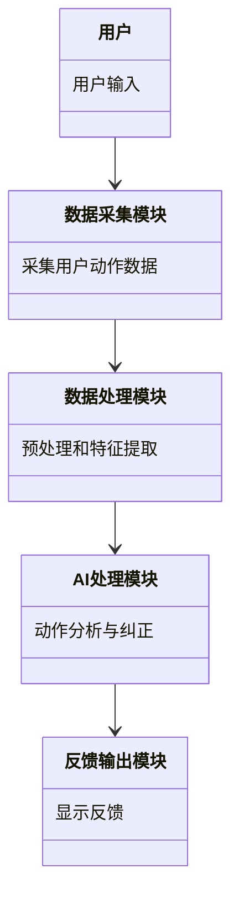
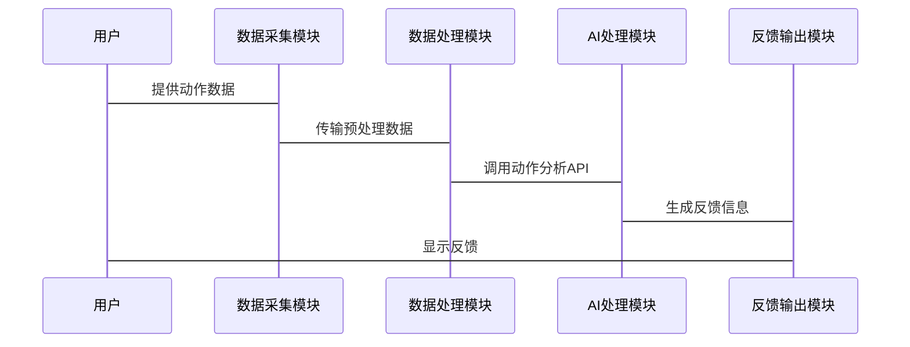

                 


**# 智能健身镜：AI Agent的实时动作纠正与评分**

**关键词：**智能健身镜、AI Agent、动作纠正、动作评分、实时反馈、计算机视觉、机器学习

**摘要：**  
智能健身镜是一种结合了人工智能技术的创新健身工具，通过AI Agent实现对用户动作的实时纠正与评分。本文从智能健身镜的背景与核心概念出发，详细探讨其背后的技术原理，包括动作捕捉与分析算法、AI驱动的动作纠正与评分机制。通过系统架构设计、项目实战和扩展优化，全面解析智能健身镜的技术实现与应用价值。本文旨在为技术开发者和健身爱好者提供深入的技术洞察与实践指导。

---

**# 第1章: 智能健身镜的背景与定义**

## 1.1 智能健身镜的定义与应用场景

### 1.1.1 智能健身镜的定义  
智能健身镜是一种结合了计算机视觉和人工智能技术的交互式健身设备，通过镜子表面或内置的摄像头和传感器，实时捕捉用户的动作，并利用AI算法进行分析，提供实时的动作纠正与评分反馈。  

### 1.1.2 智能健身镜的主要应用场景  
- **家庭健身：** 用户可以在家中使用智能健身镜进行瑜伽、力量训练、舞蹈等健身活动，无需教练在场即可获得实时指导。  
- **健身房辅助：** 智能健身镜可以作为传统健身房的辅助工具，帮助用户更精准地完成动作，避免受伤。  
- **远程健身课程：** 用户可以通过智能健身镜参与在线健身课程，实时与教练互动，获得个性化的指导。  

### 1.1.3 智能健身镜的核心功能与价值  
- **实时动作纠正：** AI Agent通过分析用户的动作，识别错误并提供纠正建议。  
- **动作评分：** 基于动作的标准程度，AI算法为用户打分，帮助用户量化健身效果。  
- **个性化反馈：** 根据用户的身体状况和健身目标，提供定制化的健身计划与建议。  

---

## 1.2 AI Agent在智能健身镜中的作用  

### 1.2.1 AI Agent的基本概念  
AI Agent（人工智能代理）是指能够感知环境、执行任务并做出决策的智能系统。在智能健身镜中，AI Agent负责接收用户的动作数据，分析并生成纠正建议和评分反馈。  

### 1.2.2 AI Agent在智能健身镜中的具体应用  
- **动作捕捉与分析：** AI Agent通过摄像头或传感器获取用户的动作数据，进行实时分析。  
- **动作纠正：** 基于分析结果，AI Agent识别动作中的错误，并提供纠正建议。  
- **评分与反馈：** AI Agent根据动作的标准程度生成评分，并通过镜子或APP向用户反馈。  

### 1.2.3 AI Agent与传统健身指导的区别  
- **实时性：** AI Agent可以实时捕捉并分析动作，而传统健身指导通常依赖人工观察。  
- **个性化：** AI Agent可以根据用户的具体情况提供个性化的反馈，而传统指导往往基于经验。  
- **效率：** AI Agent能够快速处理大量数据，提高健身指导的效率。  

---

## 1.3 动作纠正与评分的背景与意义  

### 1.3.1 动作纠正的重要性  
正确的动作执行是确保健身效果和避免运动损伤的关键。AI Agent通过实时纠正用户的动作，帮助用户形成良好的运动习惯。  

### 1.3.2 AI技术在动作评分中的优势  
- **精准性：** AI算法能够基于大量数据训练，实现对动作的高精度识别与评分。  
- **可扩展性：** AI技术可以快速适应不同的动作类型和健身场景。  
- **便捷性：** 用户无需依赖专业教练即可获得实时反馈，提升了健身的便捷性。  

### 1.3.3 智能健身镜的市场现状与发展前景  
随着人们对健康生活的追求和AI技术的快速发展，智能健身镜市场逐渐升温。未来，智能健身镜将与更多智能设备联动，提供更全面的健身解决方案。

---

**# 第2章: 智能健身镜的核心概念与技术基础**

## 2.1 AI Agent的基本原理  

### 2.1.1 AI Agent的定义与分类  
AI Agent可以分为基于规则的Agent和基于学习的Agent。在智能健身镜中，通常采用基于深度学习的AI Agent，通过模型训练实现动作分析与纠正。  

### 2.1.2 AI Agent的核心技术与实现方式  
- **数据采集：** 通过摄像头或传感器获取用户的动作数据。  
- **数据处理：** 对采集到的数据进行预处理和特征提取。  
- **模型训练：** 使用深度学习模型（如卷积神经网络）进行动作识别与纠正。  
- **反馈生成：** 根据分析结果生成纠正建议和评分反馈。  

### 2.1.3 AI Agent在智能健身镜中的任务分解  
- **数据采集与传输：** 摄像头捕捉用户的动作数据并传输到AI处理模块。  
- **动作分析与识别：** AI算法分析动作，识别错误并生成纠正建议。  
- **反馈输出：** 通过镜子或APP向用户反馈纠正建议和评分。  

---

## 2.2 动作捕捉与分析技术  

### 2.2.1 基于摄像头的2D动作捕捉  
- **实现原理：** 通过摄像头捕捉用户的图像，提取关键点（如关节位置）进行分析。  
- **优缺点：** 成本低、易部署，但精度较低，难以捕捉复杂的三维动作。  

### 2.2.2 基于深度传感器的3D动作捕捉  
- **实现原理：** 使用深度传感器（如Kinect、LiDAR）捕捉用户的三维动作数据。  
- **优缺点：** 精度高、能够捕捉复杂的动作，但设备成本较高。  

### 2.2.3 动作捕捉技术的优缺点对比  

| 技术类型 | 优点 | 缺点 |
|----------|------|------|
| 2D动作捕捉 | 成本低、部署简单 | 精度低、难以捕捉复杂动作 |
| 3D动作捕捉 | 精度高、捕捉范围广 | 成本高、设备复杂 |

---

## 2.3 AI驱动的动作纠正与评分机制  

### 2.3.1 动作纠正的算法流程  
1. **数据采集：** 通过摄像头或传感器获取用户的动作数据。  
2. **数据预处理：** 对数据进行归一化处理，提取关键特征。  
3. **动作识别：** 使用深度学习模型识别用户当前执行的动作类型。  
4. **动作纠正：** 基于预设的标准动作模型，计算当前动作与标准动作的偏差，生成纠正建议。  

### 2.3.2 动作评分的指标体系与实现方法  
- **评分指标：** 包括动作标准度、完成度、姿势对称性等。  
- **评分公式：$$ \text{评分} = \sum_{i=1}^{n} w_i \cdot s_i $$，其中$w_i$是指标权重，$s_i$是指标得分。  

### 2.3.3 动作纠正与评分的实时性优化  
- **模型优化：** 使用轻量化模型减少计算延迟。  
- **多线程处理：** 通过并行计算提升处理效率。  
- **缓存机制：** 对重复动作进行缓存，减少重复计算。  

---

**# 第3章: 智能健身镜的核心算法与数学模型**

## 3.1 动作识别与分类算法  

### 3.1.1 基于深度学习的动作识别模型  
- **模型结构：** 使用卷积神经网络（CNN）提取动作特征。  
- **训练数据：** 使用大规模标注数据进行模型训练。  

### 3.1.2 动作分类的实现流程  
1. **数据预处理：** 对图像数据进行归一化和增强。  
2. **特征提取：** 使用CNN提取图像特征。  
3. **分类预测：** 基于特征向量进行动作分类。  

---

## 3.2 动作纠正算法  

### 3.2.1 基于模型匹配的动作纠正  
- **实现原理：** 将用户的动作与标准动作模型进行匹配，计算偏差并生成纠正建议。  

### 3.2.2 基于运动学模型的动作纠正  
- **实现原理：** 基于人体骨骼模型，计算关节角度和运动轨迹，识别动作中的错误。  

---

## 3.3 动作评分系统  

### 3.3.1 评分指标的设计  
- **指标1：** 动作标准度，基于模型匹配的相似度计算。  
- **指标2：** 动作完成度，基于动作完成的百分比。  
- **指标3：** 动作流畅度，基于动作连贯性评估。  

### 3.3.2 评分公式  
$$ \text{总评分} = w_1 \cdot s_1 + w_2 \cdot s_2 + w_3 \cdot s_3 $$  
其中，$w_1, w_2, w_3$是评分指标的权重，$s_1, s_2, s_3$是各指标的得分。  

---

**# 第4章: 智能健身镜的系统架构设计**

## 4.1 问题场景介绍  

### 4.1.1 用户需求  
- 实时动作纠正与评分  
- 个性化健身计划  
- 多设备联动  

### 4.1.2 系统需求  
- 高精度动作捕捉  
- 实时反馈生成  
- 系统可扩展性  

---

## 4.2 系统功能设计  

### 4.2.1 功能模块划分  
- **数据采集模块：** 负责采集用户的动作数据。  
- **数据处理模块：** 对数据进行预处理和特征提取。  
- **AI处理模块：** 执行动作分析、纠正与评分。  
- **反馈输出模块：** 通过镜子或APP向用户输出反馈。  

### 4.2.2 领域模型（mermaid 类图）  



---

## 4.3 系统架构设计  

### 4.3.1 系统架构（mermaid 架构图）  

```mermaid
container 智能健身镜系统 {
    数据采集模块
    数据处理模块
    AI处理模块
    反馈输出模块
}
```

---

## 4.4 系统接口设计  

### 4.4.1 接口描述  
- **数据采集接口：** 提供摄像头或传感器的数据接口。  
- **AI处理接口：** 提供动作分析与评分的API。  
- **反馈输出接口：** 提供显示反馈的接口。  

---

## 4.5 系统交互设计  

### 4.5.1 交互流程（mermaid 序列图）  



---

**# 第5章: 智能健身镜的项目实战**

## 5.1 环境安装  

### 5.1.1 开发环境  
- **操作系统：** Windows/Mac/Linux  
- **开发工具：** PyCharm/VSCode  
- **深度学习框架：** TensorFlow/PyTorch  

---

## 5.2 系统核心实现  

### 5.2.1 动作捕捉模块  
```python
import cv2

cap = cv2.VideoCapture(0)
while cap.isOpened():
    ret, frame = cap.read()
    # 进行动作捕捉和分析
    # ...
    cv2.imshow('Fittness Mirror', frame)
    if cv2.waitKey(1) & 0xFF == ord('q'):
        break
cap.release()
cv2.destroyAllWindows()
```

---

## 5.2.2 动作纠正算法实现  
```python
def correct_motion(keypoints, model):
    # keypoints: 用户动作的关键点坐标
    # model: 预训练的标准动作模型
    # 返回纠正建议
    pass
```

---

## 5.2.3 评分系统实现  
```python
def calculate_score(keypoints, model):
    # keypoints: 用户动作的关键点坐标
    # model: 预训练的标准动作模型
    # 返回评分
    pass
```

---

## 5.3 实际案例分析  

### 5.3.1 案例1：瑜伽动作纠正  
用户执行一个瑜伽动作，AI Agent识别其肩部未对齐，并建议调整肩膀位置。  

---

## 5.3.2 案例2：力量训练评分  
用户完成一次俯卧撑动作，AI Agent根据动作的标准程度给予85分的评分，并指出手部位置需要调整。  

---

## 5.4 项目小结  

### 5.4.1 实践经验总结  
- 确保数据采集的稳定性与准确性。  
- 优化AI算法的实时性与精度。  
- 提供友好的用户界面与反馈机制。  

### 5.4.2 注意事项  
- 数据隐私保护：确保用户的动作数据不被滥用。  
- 系统稳定性：保证在复杂环境下仍能正常运行。  
- 用户体验：提供清晰的反馈与个性化的建议。  

---

**# 第6章: 智能健身镜的扩展与优化**

## 6.1 模型优化与性能提升  

### 6.1.1 模型轻量化  
通过剪枝和量化等技术，减少模型大小，提升运行效率。  

### 6.1.2 实时性优化  
使用多线程和异步处理，降低延迟。  

---

## 6.2 用户体验优化  

### 6.2.1 反馈机制优化  
- 提供视觉与语音双重反馈，提升用户体验。  

### 6.2.2 个性化建议  
根据用户的健身目标与身体状况，提供定制化的健身计划。  

---

## 6.3 系统扩展  

### 6.3.1 多设备联动  
- 与智能音箱联动，提供语音指导。  
- 与手机APP联动，记录用户的健身数据。  

---

## 6.4 拓展思考  

### 6.4.1 智能健身镜的未来发展方向  
- 更智能的健身指导：结合健康数据（如心率、血压）提供更精准的建议。  
- 更丰富的健身内容：支持更多类型的健身课程与动作库。  
- 更强的社交属性：支持用户分享健身成果，形成健身社区。  

---

**# 第7章: 总结与展望**

## 7.1 本书内容总结  

### 7.1.1 智能健身镜的核心技术  
- AI Agent的实现与应用。  
- 动作捕捉与分析算法。  
- 动作纠正与评分系统。  

### 7.1.2 系统架构与设计  
- 功能模块划分。  
- 接口设计与交互流程。  

---

## 7.2 当前技术的优缺点分析  

### 7.2.1 优点  
- 高效性：AI技术能够快速处理大量数据，提供实时反馈。  
- 便捷性：用户可以随时随地进行健身，无需依赖专业教练。  

### 7.2.2 缺点  
- 成本高：智能健身镜的设备与技术支持成本较高。  
- 数据隐私问题：用户的动作数据可能面临泄露风险。  

---

## 7.3 未来技术发展的展望  

### 7.3.1 技术进步  
- 更先进的动作捕捉技术：如更高精度的深度传感器与AI算法的结合。  
- 更智能的AI模型：如基于Transformer的模型在动作分析中的应用。  

### 7.3.2 应用场景扩展  
- 更广泛的健身场景：如医疗康复、体育训练等领域。  
- 更智能的健康管理系统：结合健康监测设备，提供全面的健康解决方案。  

---

**作者：AI天才研究院/AI Genius Institute & 禅与计算机程序设计艺术 /Zen And The Art of Computer Programming**

