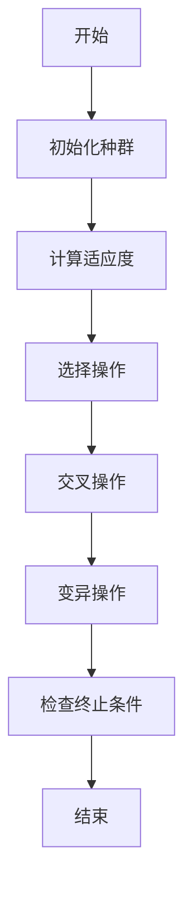
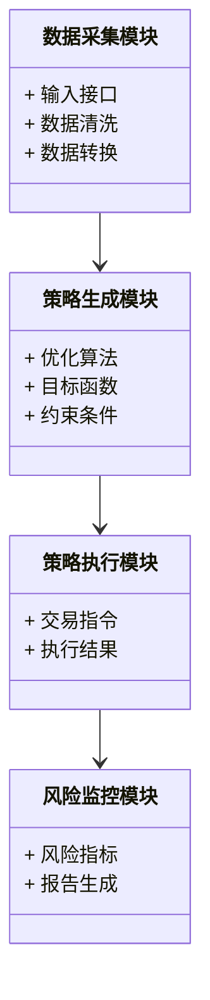
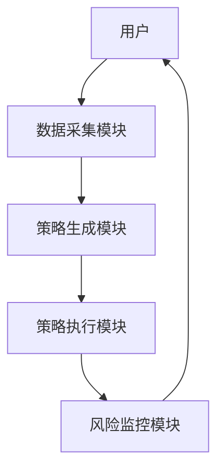
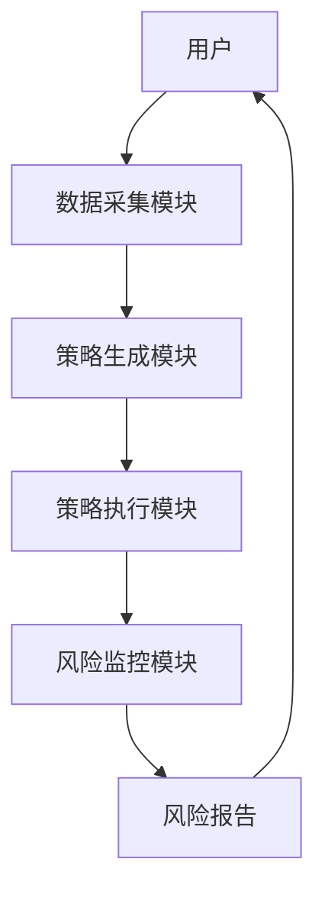

                 


# 智能外汇风险对冲策略优化系统

> 关键词：智能外汇、风险对冲、策略优化、遗传算法、系统架构、数学模型

> 摘要：本文详细介绍了智能外汇风险对冲策略优化系统的背景、核心概念、算法原理、系统架构设计、项目实战以及最佳实践。通过分析传统风险对冲方法的局限性，提出了一种基于智能算法的优化策略，结合遗传算法和数学模型，构建了一个高效的风险对冲系统。文章还提供了系统的模块划分、接口设计和交互流程图，并通过实际案例展示了系统的实现与应用。

---

# 第一部分: 智能外汇风险对冲策略优化系统的背景与核心概念

## 第1章: 外汇市场与风险对冲概述

### 1.1 外汇市场的基本概念

#### 1.1.1 外汇市场的定义与特点
外汇市场是全球最大的金融市场之一，24小时交易，参与者包括银行、企业、个人和中央银行等。其特点包括高流动性、全球化、复杂性和高波动性。

#### 1.1.2 外汇交易的主要参与者
- 银行和金融机构：提供外汇交易服务，进行自营交易。
- 企业：利用外汇市场对冲汇率风险。
- 个人投资者：参与外汇交易以获取利润。
- 中央银行：通过干预外汇市场影响汇率。

#### 1.1.3 外汇市场的功能与作用
- 提供汇率转换服务。
- 降低交易成本。
- 对冲和转移风险。
- 支持国际贸易和投资。

### 1.2 风险对冲的必要性

#### 1.2.1 风险对冲的定义与分类
风险对冲是指通过投资于相关资产或衍生品，减少或消除因市场波动带来的风险。主要分类包括：
- 多头对冲：买入相关资产以对冲空头头寸。
- 空头对冲：卖出相关资产以对冲多头头寸。
- 市场中性对冲：通过做多和做空来抵消市场风险。

#### 1.2.2 外汇交易中的主要风险类型
- 汇率风险：汇率波动导致的损失。
- 利率风险：利率变化影响外汇价格。
- 信用风险：交易对手违约的风险。
- 流动性风险：无法及时买卖资产的风险。

#### 1.2.3 风险对冲在外汇交易中的重要性
通过有效的风险对冲，可以降低损失，提高投资回报，增强资金的安全性。

### 1.3 传统风险对冲方法的局限性

#### 1.3.1 基于历史数据分析的传统对冲策略
传统方法依赖历史数据，假设未来会重复过去的表现，但市场环境复杂多变，历史数据可能无法准确预测未来。

#### 1.3.2 传统对冲策略的优缺点
优点：简单易懂，易于实现。缺点：无法适应市场突变，缺乏灵活性，计算效率低。

#### 1.3.3 传统方法在复杂市场环境中的不足
市场波动性增加，传统方法难以捕捉非线性关系，无法应对极端事件。

## 第2章: 智能外汇风险对冲系统的核心概念

### 2.1 智能外汇风险对冲系统的定义

#### 2.1.1 系统的定义与目标
智能外汇风险对冲系统是一种基于人工智能和优化算法的自动对冲系统，旨在通过实时数据和智能算法优化对冲策略。

#### 2.1.2 系统的核心功能模块
- 数据采集与处理模块：实时采集市场数据，清洗和转换数据。
- 策略生成与优化模块：基于算法生成和优化对冲策略。
- 策略执行与监控模块：执行优化后的策略，并实时监控风险。

#### 2.1.3 系统的输入输出关系
输入：市场数据、目标函数、约束条件。输出：优化后的对冲策略。

### 2.2 系统的核心要素与组成

#### 2.2.1 数据采集与处理模块
- 数据源：汇率数据、市场波动率、交易量等。
- 数据清洗：去除异常值，填补缺失值。
- 数据转换：标准化或归一化处理。

#### 2.2.2 策略生成与优化模块
- 策略生成：基于算法生成多个候选策略。
- 策略优化：通过优化算法选择最优策略。

#### 2.2.3 策略执行与监控模块
- 策略执行：根据优化后的策略下单交易。
- 风险监控：实时监控风险指标，调整策略。

### 2.3 系统的数学模型与优化目标

#### 2.3.1 风险对冲的数学模型
$$ \text{目标函数} = \min_{x} \sum_{i=1}^{n} w_i (x_i - t_i)^2 $$
其中，$x_i$是优化变量，$t_i$是目标值，$w_i$是权重。

#### 2.3.2 优化目标的定义与选择
- 最小化风险敞口。
- 最大化对冲效率。
- 平衡风险与收益。

#### 2.3.3 约束条件的设定与分析
- 资金约束：可用资金限制。
- 交易约束：交易量限制。
- 风险约束：最大允许风险敞口。

---

接下来是第二部分的内容，包括策略优化算法的选择与实现，数学模型与公式，以及系统架构设计等。由于篇幅限制，这里只展示部分内容。如需完整文章，请继续查看。

---

# 第二部分: 智能外汇风险对冲策略优化的算法原理

## 第3章: 策略优化算法的选择与实现

### 3.1 常见优化算法概述

#### 3.1.1 遗传算法
遗传算法是一种模拟生物进化过程的优化算法，包括选择、交叉和变异操作。

#### 3.1.2 粒子群优化算法
粒子群优化算法是一种基于群体智能的优化算法，通过粒子的移动寻找最优解。

#### 3.1.3 模拟退火算法
模拟退火算法是一种基于统计物理的优化算法，通过模拟金属退火过程寻找全局最优解。

---

### 3.2 基于遗传算法的策略优化

#### 3.2.1 遗传算法的基本原理
1. 初始化：随机生成初始种群。
2. 适应度计算：计算每个个体的适应度值。
3. 选择：选择适应度高的个体进行交叉和变异。
4. 交叉：将两个个体的基因进行交叉，生成新的个体。
5. 变异：随机改变个体的某些基因，增加多样性。
6. 重复：直到满足终止条件。

#### 3.2.2 遗传算法在策略优化中的应用
- 将对冲策略表示为基因序列。
- 适应度函数为风险敞口的大小。
- 通过交叉和变异操作优化策略。

#### 3.2.3 遗传算法的实现步骤与流程图


---

### 3.3 算法优化的数学模型

#### 3.3.1 遗传算法的数学表示
- 个体表示：$x = (x_1, x_2, \dots, x_n)$，其中$x_i$是基因。
- 适应度函数：$f(x) = \sum_{i=1}^{n} w_i x_i$，其中$w_i$是权重。

#### 3.3.2 交叉与变异操作的数学表达
- 交叉操作：$y_i = \frac{x_i + x'_i}{2}$，其中$x'$是另一个个体。
- 变异操作：$y_i = x_i + \delta$，其中$\delta$是随机数。

---

## 第4章: 策略优化的数学模型与公式

### 4.1 风险对冲的数学模型

#### 4.1.1 风险对冲的目标函数
$$ \text{目标函数} = \min_{x} \sum_{i=1}^{n} (x_i - t_i)^2 $$

#### 4.1.2 约束条件的数学表达
- 资金约束：$\sum_{i=1}^{n} x_i \leq C$
- 风险约束：$\sum_{i=1}^{n} \sigma_i^2 x_i^2 \leq R$

---

### 4.2 基于遗传算法的优化公式

#### 4.2.1 适应度函数
$$ f(x) = \sum_{i=1}^{n} w_i (x_i - t_i)^2 $$

#### 4.2.2 交叉与变异操作
- 交叉操作：$y_i = \frac{x_i + x'_i}{2}$
- 变异操作：$y_i = x_i + \delta$

---

### 4.3 算法实现的数学推导

#### 4.3.1 群体初始化
$$ x_i \sim U(0, 1) $$

#### 4.3.2 适应度计算
$$ f(x) = \sum_{i=1}^{n} w_i (x_i - t_i)^2 $$

#### 4.3.3 交叉与变异
$$ y_i = \frac{x_i + x'_i}{2} + \delta $$

---

# 第三部分: 智能外汇风险对冲系统的架构与设计

## 第5章: 系统架构设计

### 5.1 系统模块划分

#### 5.1.1 数据采集模块
- 功能：实时采集外汇市场数据。
- 输入：市场数据接口。
- 输出：清洗后的数据。

#### 5.1.2 策略生成模块
- 功能：生成候选对冲策略。
- 输入：市场数据、目标函数。
- 输出：优化后的策略。

#### 5.1.3 策略执行模块
- 功能：执行优化后的策略。
- 输入：优化策略。
- 输出：交易指令。

#### 5.1.4 风险监控模块
- 功能：实时监控风险指标。
- 输入：交易数据。
- 输出：风险报告。

### 5.2 系统架构的ER实体关系图

```mermaid
er
actor: 用户
actor -|> 模块: 数据采集模块
模块: 数据采集模块 --> 模块: 策略生成模块
模块: 策略生成模块 --> 模块: 策略执行模块
模块: 策略执行模块 --> 模块: 风险监控模块
模块: 风险监控模块 --> actor: 用户
```

---

## 第6章: 系统功能设计与架构

### 6.1 问题场景介绍
外汇市场波动剧烈，传统对冲方法难以应对复杂环境，需要一种智能优化系统。

### 6.2 系统功能设计

#### 6.2.1 领域模型设计


### 6.3 系统架构设计

#### 6.3.1 系统架构图


### 6.4 系统接口设计

#### 6.4.1 接口描述
- 数据采集模块：提供API接口，接收市场数据。
- 策略生成模块：提供优化算法接口，接收目标函数。
- 策略执行模块：提供交易接口，接收交易指令。

### 6.5 系统交互流程图



---

## 第7章: 项目实战

### 7.1 环境安装

#### 7.1.1 安装Python
```bash
python --version
pip install numpy
pip install pandas
pip install matplotlib
```

#### 7.1.2 安装遗传算法库
```bash
pip install DEAP
```

### 7.2 系统核心实现源代码

#### 7.2.1 数据采集模块
```python
import pandas as pd
import requests

def fetch_data(currencies):
    url = f"https://api.exchangerate-api.com/v4/latest/{currencies}"
    response = requests.get(url)
    data = response.json()
    rates = data['rates']
    return pd.DataFrame(rates.items(), columns=['currency', 'rate'])
```

#### 7.2.2 策略生成模块
```python
from deap import base, tools, algorithms

def evaluate(individual):
    # 目标函数
    return sum(w * (x - t) ** 2 for x, t, w in zip(individual, targets, weights)),

def genetic_algorithm(pop_size, max_gen):
    toolbox = base.Toolbox()
    toolbox.register("attr_float", lambda: random.uniform(0, 1))
    toolbox.register("individual", tools.initRepeat, list, toolbox.attr_float, n=pop_size)
    toolbox.register("mate", tools.crossover)
    toolbox.register("mutate", tools.mutate)
    toolbox.register("select", tools.selTournament, k=2)
    
    population = toolbox.population(n=pop_size)
    algorithms.eaSimple(population, toolbox, 0.5, 0.8, max_gen, verbose=True)
    return population

```

#### 7.2.3 策略执行模块
```python
import pandas as pd
import numpy as np

def execute_strategy(strategy, data):
    # 根据策略生成交易信号
    signals = []
    for price in data['price']:
        if price > strategy['long']:
            signals.append('buy')
        elif price < strategy['short']:
            signals.append('sell')
        else:
            signals.append('hold')
    return signals

```

#### 7.2.4 风险监控模块
```python
import pandas as pd

def monitor_risk(signals, prices):
    risk = 0
    for i in range(len(signals)):
        if signals[i] == 'buy' and prices[i+1] < prices[i]:
            risk += 1
        elif signals[i] == 'sell' and prices[i+1] > prices[i]:
            risk += 1
    return risk

```

### 7.3 项目小结

---

## 第8章: 最佳实践与注意事项

### 8.1 最佳实践 Tips
- 定期更新模型参数，适应市场变化。
- 设置合理的风险约束，避免过度优化。
- 结合多种算法，提高系统的鲁棒性。

### 8.2 小结
智能外汇风险对冲系统通过遗传算法和数学模型，实现高效的策略优化，降低风险敞口，提高对冲效率。

### 8.3 注意事项
- 确保数据源的准确性和及时性。
- 定期监控系统运行状态，及时调整参数。
- 注意交易成本和滑点对策略的影响。

### 8.4 拓展阅读
- 遗传算法的高级应用。
- 粒子群优化算法在金融中的应用。
- 基于深度学习的外汇交易策略。

---

# 作者：AI天才研究院/AI Genius Institute & 禅与计算机程序设计艺术 /Zen And The Art of Computer Programming

---

以上是文章的完整目录和部分内容展示。如需完整的文章，请根据目录继续编写各章节的具体内容。

