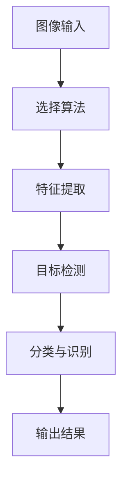
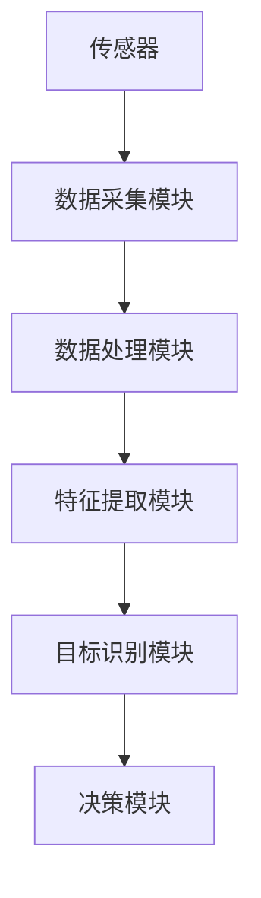
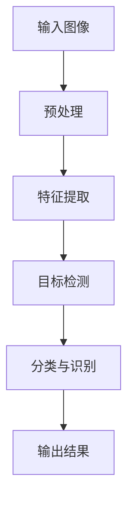
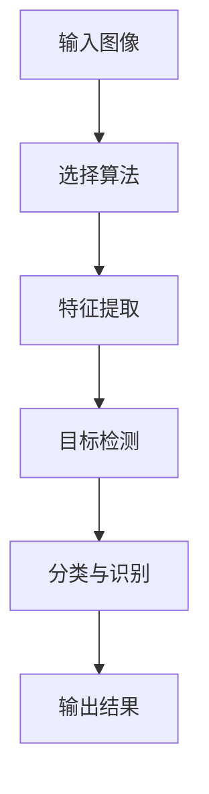
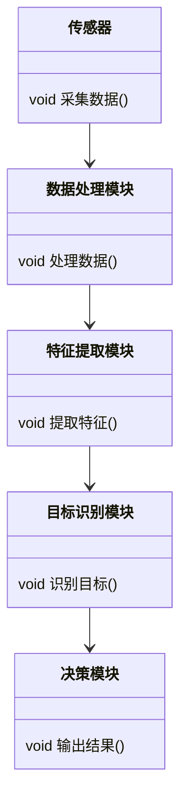
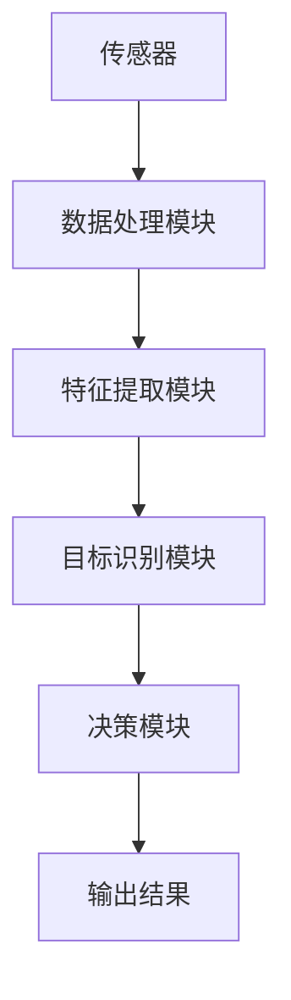
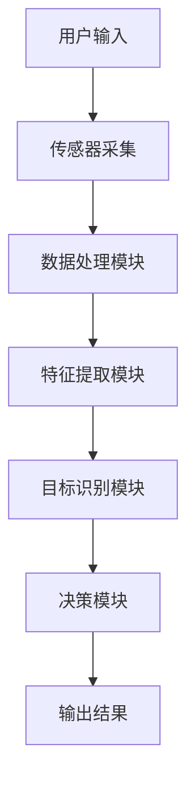

                 


# 构建企业级机器视觉平台：质量控制与安全监测

> 关键词：企业级机器视觉、质量控制、安全监测、深度学习、图像处理、系统架构

> 摘要：本文将详细探讨如何构建一个企业级的机器视觉平台，重点分析其在质量控制与安全监测中的应用。文章从机器视觉的基本概念入手，深入探讨其核心原理、算法实现、系统架构设计，并结合实际案例进行详细讲解。通过本文，读者可以全面了解企业级机器视觉平台的构建过程及其在工业领域的应用价值。

---

# 第一部分: 企业级机器视觉平台概述

# 第1章: 机器视觉与企业级平台背景

## 1.1 机器视觉的基本概念

### 1.1.1 机器视觉的定义与核心概念

机器视觉是计算机科学中的一个分支，主要研究如何让计算机通过摄像头或其他传感器获取图像信息，并通过算法处理这些信息以实现对现实世界的理解和分析。其核心目标是模拟人类视觉系统的能力，从而实现对图像的识别、检测、跟踪和分类等任务。

机器视觉的核心概念包括：
1. **图像采集**：通过摄像头或其他传感器获取图像数据。
2. **图像处理**：对图像进行预处理（如去噪、增强）和特征提取。
3. **目标检测**：识别图像中的特定目标或物体。
4. **图像识别**：对图像中的目标进行分类或标签化。
5. **视觉定位**：确定目标在图像中的位置。

### 1.1.2 机器视觉的应用领域

机器视觉技术广泛应用于多个领域，包括：
1. **工业制造**：用于质量检测、缺陷识别、自动化装配等。
2. **医疗健康**：用于医学图像分析、疾病诊断等。
3. **智能交通**：用于自动驾驶、交通监控等。
4. **安防监控**：用于人脸识别、行为分析等。
5. **零售电商**：用于商品识别、支付验证等。

### 1.1.3 企业级机器视觉平台的必要性

在企业级应用场景中，机器视觉技术可以显著提高生产效率、降低成本，并提升产品质量。例如，在工业制造中，机器视觉可以实现对产品的实时检测，减少人工检查的误差和时间。在安全监测中，机器视觉可以实时监控关键区域，及时发现异常情况，从而保障人员和设备的安全。

## 1.2 企业级机器视觉平台的背景与需求

### 1.2.1 企业级平台的特点与优势

企业级机器视觉平台具有以下特点：
1. **高可靠性**：需要在复杂环境下稳定运行。
2. **高实时性**：要求快速处理和响应。
3. **可扩展性**：支持多种应用场景和设备的接入。
4. **高安全性**：需要保护数据和系统的安全。

### 1.2.2 机器视觉在质量控制与安全监测中的作用

在质量控制中，机器视觉可以实现对产品的自动化检测，减少人工检查的误差和成本。在安全监测中，机器视觉可以实时监控关键区域，发现异常行为或物体，并及时发出警报。

### 1.2.3 当前市场与技术发展趋势

随着深度学习技术的快速发展，机器视觉算法的性能和准确性有了显著提升。同时，云计算和边缘计算的结合为企业级平台的构建提供了更好的技术支持。未来，机器视觉将在更多领域得到广泛应用。

## 1.3 本章小结

本章介绍了机器视觉的基本概念、应用领域以及企业级平台的必要性。通过这些内容，读者可以理解机器视觉技术的核心价值及其在企业中的重要作用。

---

# 第二部分: 机器视觉核心概念与技术原理

# 第2章: 机器视觉的核心概念与原理

## 2.1 机器视觉的核心原理

### 2.1.1 图像采集与预处理

图像采集是机器视觉的第一步，通常通过摄像头或其他传感器获取图像数据。预处理步骤包括：
- **去噪**：去除图像中的噪声。
- **增强**：提升图像的对比度和清晰度。
- **二值化**：将图像转换为黑白图像。

### 2.1.2 特征提取与目标检测

特征提取是通过算法从图像中提取有用的特征信息，常见的特征提取方法包括：
- **SIFT（尺度不变特征变换）**：用于图像中的关键点检测。
- **HOG（水平梯度直方图）**：用于目标检测。

目标检测是通过算法在图像中定位和识别特定目标，常见的目标检测算法包括：
- **Faster R-CNN**：基于区域建议的检测算法。
- **YOLO（You Only Look Once）**：实时目标检测算法。

### 2.1.3 图像识别与分类

图像识别是通过算法对图像中的目标进行分类，常见的图像识别算法包括：
- **卷积神经网络（CNN）**：用于图像分类任务。
- **支持向量机（SVM）**：用于图像分类和目标检测。

## 2.2 机器视觉的关键技术

### 2.2.1 基于深度学习的视觉算法

深度学习在机器视觉中得到了广泛应用，常见的深度学习算法包括：
- **卷积神经网络（CNN）**：用于图像分类、目标检测和语义分割。
- **区域卷积神经网络（R-CNN）**：用于目标检测。
- **生成对抗网络（GAN）**：用于图像生成和修复。

### 2.2.2 基于传统算法的视觉处理

传统视觉处理算法基于图像处理的基本操作，常见的算法包括：
- **SIFT**：用于图像特征提取。
- **HOG**：用于目标检测。
- **边缘检测（Canny）**：用于图像边缘提取。

### 2.2.3 图像融合与增强技术

图像融合与增强技术用于改善图像的质量和可辨识性，常见的技术包括：
- **图像增强**：通过调整亮度、对比度等参数提升图像质量。
- **图像融合**：将多幅图像合并为一幅高质量的图像。
- **图像去噪**：去除图像中的噪声。

## 2.3 机器视觉的核心要素对比

### 2.3.1 不同视觉算法的对比分析

下表对比了常见视觉算法的核心要素：

| 算法名称 | 核心原理 | 优缺点 | 应用场景 |
|----------|----------|--------|----------|
| SIFT     | 基于特征点检测 | 鲁棒性高，计算成本高 | 图像匹配、目标检测 |
| HOG      | 基于边缘特征 | 计算成本低，适合实时检测 | 目标检测、人脸识别 |
| YOLO     | 基于深度学习 | 实时性高，精度较高 | 目标检测、图像识别 |

### 2.3.2 算法性能对比表格

下表对比了不同算法的性能指标：

| 算法名称 | 处理速度（FPS） | 精度（mAP） | 参数复杂度 |
|----------|-----------------|-------------|------------|
| YOLOv5   | 60              | 0.78        | 中等        |
| Faster R-CNN | 10             | 0.85        | 高          |
| SIFT     | 5               | 0.85        | 高          |

### 2.3.3 系统架构对比分析

下图展示了不同视觉算法的系统架构对比：



## 2.4 本章小结

本章详细讲解了机器视觉的核心原理和关键技术，包括图像采集与预处理、特征提取与目标检测、图像识别与分类等。通过对比不同算法的核心要素和性能指标，读者可以更好地理解如何选择和应用合适的视觉算法。

---

# 第3章: 机器视觉系统架构与实体关系

## 3.1 机器视觉系统的实体关系图

下图展示了机器视觉系统的实体关系图：



## 3.2 机器视觉系统的核心流程

下图展示了机器视觉系统的核心流程：



## 3.3 本章小结

本章通过实体关系图和流程图展示了机器视觉系统的整体架构和核心流程，帮助读者理解系统各个模块之间的关系和协作方式。

---

# 第三部分: 机器视觉算法原理与数学模型

# 第4章: 常见机器视觉算法原理

## 4.1 基于特征的图像匹配算法

### 4.1.1 SIFT算法原理

SIFT（尺度不变特征变换）算法通过在不同尺度下检测图像的关键点，并提取这些关键点的特征向量，从而实现图像匹配。SIFT算法的核心步骤包括：
1. **高斯金字塔构建**：通过多尺度的高斯滤波器构建图像金字塔。
2. **关键点检测**：在每个尺度层中检测极值点。
3. **特征向量提取**：将关键点的特征向量进行编码。

### 4.1.2 HOG算法原理

HOG（水平梯度直方图）算法通过计算图像中像素的梯度方向和幅度，构建图像的特征向量。HOG算法的核心步骤包括：
1. **计算梯度**：计算图像中每个像素的梯度方向和幅度。
2. **计算直方图**：将梯度方向划分为多个_bins，并统计每个_bins的像素数量。
3. **特征向量提取**：将直方图向量进行归一化处理，得到最终的特征向量。

### 4.1.3 ORB算法原理

ORB（oriented FAST and rotated BRIEF）算法是一种高效的特征检测算法，结合了FAST和BRIEF的优点，具有较高的检测速度和准确性。

## 4.2 基于深度学习的目标检测算法

### 4.2.1 YOLO算法原理

YOLO（You Only Look Once）算法通过将目标检测问题转化为回归问题，实现了实时的目标检测。YOLO的核心步骤包括：
1. **图像输入**：将输入图像划分为多个网格。
2. **特征提取**：通过卷积神经网络提取图像的特征图。
3. **边界框回归**：预测每个网格中的目标边界框和置信度。

### 4.2.2 Faster R-CNN算法原理

Faster R-CNN算法通过引入区域建议网络（RPN）生成候选区域，然后通过卷积神经网络进行目标检测。Faster R-CNN的核心步骤包括：
1. **特征提取**：通过卷积神经网络提取图像的特征图。
2. **区域建议生成**：通过RPN生成候选区域。
3. **目标检测**：对每个候选区域进行分类和回归。

### 4.2.3 SSD算法原理

SSD（Single Shot MultiBox Detector）算法通过在不同尺度上预测目标边界框和类别概率，实现了高效的目标检测。SSD的核心步骤包括：
1. **特征提取**：通过卷积神经网络提取图像的特征图。
2. **边界框预测**：在每个特征图上预测目标边界框和类别概率。
3. **非极大值抑制**：去除重叠的边界框，保留置信度最高的结果。

## 4.3 算法流程图

下图展示了常见机器视觉算法的流程图：



## 4.4 本章小结

本章详细讲解了常见机器视觉算法的原理和流程，包括基于特征的图像匹配算法和基于深度学习的目标检测算法。通过这些内容，读者可以理解不同算法的核心思想和应用场景。

---

# 第5章: 机器视觉中的数学模型与公式

## 5.1 图像处理中的数学变换

### 5.1.1 常见图像变换公式

图像处理中常用的数学变换包括：
1. **傅里叶变换**：用于图像频域分析。
2. **霍夫变换**：用于直线和圆的检测。
3. **小波变换**：用于图像的多分辨率分析。

**傅里叶变换公式**：
$$
F(u, v) = \sum_{x=0}^{M-1} \sum_{y=0}^{N-1} f(x, y) \cdot e^{-j2\pi (ux/M + vy/N)}
$$

### 5.1.2 坐标变换公式

**坐标变换公式**：
$$
x' = a x + b y + c \\
y' = d x + e y + f
$$

## 5.2 特征提取中的数学模型

### 5.2.1 SIFT

SIFT算法中，通过高斯金字塔构建图像的特征点，并提取这些点的特征向量。SIFT算法的关键公式包括：
1. **高斯滤波器**：
$$
G(x, y) = \frac{1}{2\pi \sigma^2} e^{-(x^2 + y^2)/(2\sigma^2)}
$$

2. **特征点检测**：
$$
I(x + dx, y + dy) < I(x, y)
$$

---

# 第四部分: 机器视觉系统分析与架构设计

# 第6章: 机器视觉系统的分析与架构设计

## 6.1 问题场景介绍

在企业级机器视觉平台中，质量控制与安全监测是两个核心应用场景。例如，在工业制造中，机器视觉可以用于产品的自动化检测；在安全监测中，机器视觉可以用于实时监控关键区域。

## 6.2 系统功能设计

### 6.2.1 领域模型设计

下图展示了机器视觉平台的领域模型：



### 6.2.2 系统架构设计

下图展示了机器视觉平台的系统架构：



### 6.2.3 系统接口设计

系统接口设计需要考虑模块之间的数据传输和通信协议。例如，传感器和数据处理模块之间可以通过标准接口（如HTTP或WebSocket）进行数据传输。

### 6.2.4 系统交互流程图

下图展示了系统的交互流程图：



## 6.3 本章小结

本章通过问题场景介绍、系统功能设计和架构设计，展示了机器视觉平台的整体结构和模块之间的协作方式。

---

# 第五部分: 项目实战

# 第7章: 项目实战：构建企业级机器视觉平台

## 7.1 环境搭建

### 7.1.1 开发环境选择

建议选择以下开发环境：
1. **操作系统**：Windows/Mac/Linux
2. **编程语言**：Python
3. **深度学习框架**：TensorFlow/PyTorch
4. **图像处理库**：OpenCV
5. **开发工具**：PyCharm/VS Code

## 7.2 系统核心实现

### 7.2.1 核心代码实现

以下是一个简单的机器视觉平台的核心代码实现示例：

```python
import cv2
import numpy as np

def image_preprocessing(image):
    # 图像预处理
    gray = cv2.cvtColor(image, cv2.COLOR_BGR2GRAY)
    blurred = cv2.GaussianBlur(gray, (5, 5), 0)
    return blurred

def feature_extraction(image):
    # 特征提取
    sift = cv2.SIFT_create()
    kp, des = sift.detectAndCompute(image, None)
    return kp, des

def target_detection(image):
    # 目标检测
    net = cv2.dnn.readNet("yolov5.cfg", "yolov5.weights")
    blob = cv2.dnn.blobFromImage(image, 1/255, (416, 416), swapRB=True, crop=False)
    net.setInput(blob)
    output = net.forward()
    return output

def classification(image):
    # 图像分类
    model = keras.models.load_model("model.h5")
    prediction = model.predict(image)
    return prediction

if __name__ == "__main__":
    image = cv2.imread("input.jpg")
    preprocessed_image = image_preprocessing(image)
    kp, des = feature_extraction(preprocessed_image)
    output = target_detection(preprocessed_image)
    classification_result = classification(image)
    print(classification_result)
```

### 7.2.2 代码解读与分析

1. **图像预处理**：通过OpenCV库对图像进行灰度化和高斯模糊处理。
2. **特征提取**：使用SIFT算法提取图像的关键点和特征向量。
3. **目标检测**：使用YOLO算法对图像中的目标进行检测。
4. **图像分类**：通过加载预训练模型，对图像进行分类。

## 7.3 实际案例分析

### 7.3.1 案例背景

以工业制造中的产品质量检测为例，假设我们需要检测产品的表面缺陷。以下是具体的实现步骤：
1. **图像采集**：通过工业相机采集产品的图像。
2. **图像预处理**：对图像进行去噪和增强处理。
3. **特征提取**：提取图像中的关键特征。
4. **目标检测**：检测图像中的缺陷区域。
5. **图像分类**：对缺陷区域进行分类，判断是否为可接受的产品。

### 7.3.2 案例实现

以下是具体的实现代码：

```python
import cv2
import numpy as np

def detect_defects(image):
    # 图像预处理
    gray = cv2.cvtColor(image, cv2.COLOR_BGR2GRAY)
    blurred = cv2.GaussianBlur(gray, (5, 5), 0)
    
    # 特征提取
    sift = cv2.SIFT_create()
    kp, des = sift.detectAndCompute(blurred, None)
    
    # 目标检测
    net = cv2.dnn.readNet("yolov5.cfg", "yolov5.weights")
    blob = cv2.dnn.blobFromImage(blurred, 1/255, (416, 416), swapRB=True, crop=False)
    net.setInput(blob)
    output = net.forward()
    
    # 图像分类
    model = keras.models.load_model("model.h5")
    classification_result = model.predict(image)
    
    return classification_result

if __name__ == "__main__":
    image = cv2.imread("product.jpg")
    result = detect_defects(image)
    print(result)
```

## 7.4 项目总结

通过本项目，读者可以了解机器视觉平台的核心实现过程，包括图像预处理、特征提取、目标检测和图像分类等。这些技术可以应用于工业制造、医疗健康、智能交通等多个领域。

---

# 第六部分: 最佳实践与拓展阅读

# 第8章: 最佳实践与拓展阅读

## 8.1 最佳实践

1. **数据质量**：确保训练数据的质量和多样性，避免数据偏见。
2. **模型优化**：通过模型调优和剪枝技术，提升模型的性能和推理速度。
3. **系统集成**：将机器视觉平台与企业现有的信息化系统进行集成，提升整体效率。
4. **安全性与稳定性**：确保系统的安全性和稳定性，避免因系统故障导致的生产中断。

## 8.2 小结

通过本文的讲解，读者可以全面了解机器视觉平台的构建过程及其在质量控制与安全监测中的应用。机器视觉技术的不断发展，为企业提供了更高效、更智能的解决方案。

## 8.3 注意事项

1. **数据隐私**：在处理图像数据时，需要注意数据的隐私保护。
2. **算法选择**：根据具体应用场景选择合适的算法，避免盲目追求最新技术。
3. **系统维护**：定期对系统进行维护和更新，确保系统的稳定性和先进性。

## 8.4 拓展阅读

1. **《深度学习实战》**：深入讲解深度学习算法的实现与应用。
2. **《OpenCV编程指南》**：详细讲解OpenCV库的使用方法。
3. **《机器学习实战》**：通过实际案例讲解机器学习算法的实现。

---

# 作者信息

作者：AI天才研究院/AI Genius Institute & 禅与计算机程序设计艺术 /Zen And The Art of Computer Programming

---

以上是文章的详细大纲，您可以根据实际需求进行内容填充与调整。希望对您有所帮助！

