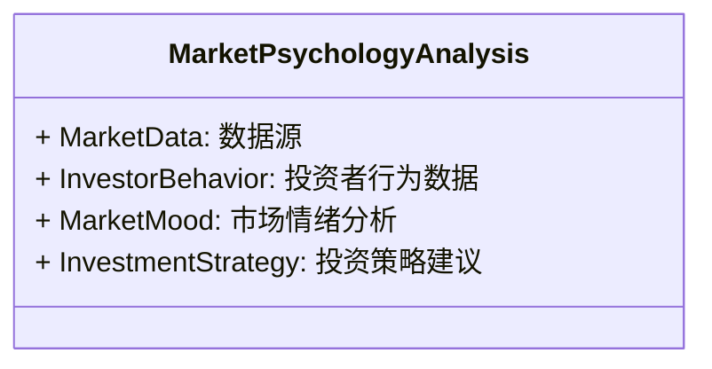
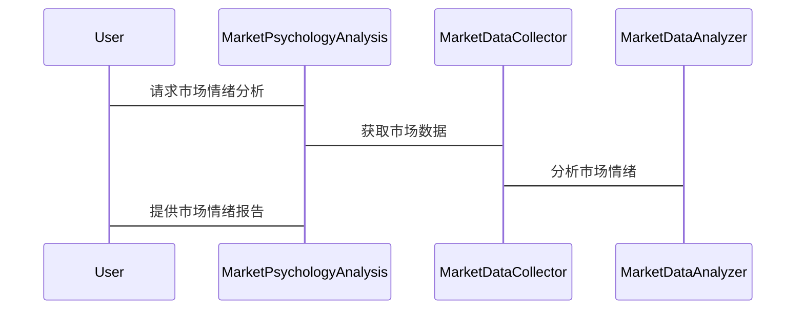

                 


# 格雷厄姆的Mr. Market比喻：理解市场心理

**关键词：** 本杰明·格雷厄姆, 市场心理, 投资者行为, 价值投资, 市场波动, 理性决策

**摘要：** 本文通过分析本杰明·格雷厄姆提出的Mr. Market比喻，深入探讨市场心理与投资者行为之间的关系。文章从Mr. Market比喻的背景出发，分析其在市场波动中的应用，结合行为金融学理论，揭示投资者心理偏差对投资决策的影响，并提供基于Mr. Market比喻的投资策略和风险管理方法。通过系统分析与实战案例，帮助读者更好地理解市场心理，做出理性的投资决策。

---

# 第一部分: 格雷厄姆的Mr. Market比喻基础

## 第1章: Mr. Market比喻的起源与背景

### 1.1 本杰明·格雷厄姆与价值投资概述

#### 1.1.1 本杰明·格雷厄姆的生平简介
本杰明·格雷厄姆（Benjamin Graham）是20世纪著名的投资学家和价值投资的鼻祖。他出生于1894年，曾在哥伦比亚大学教授证券分析，培养了包括沃伦·巴菲特在内的众多投资大师。格雷厄姆的投资理念强调安全边际和长期价值，主张以低于内在价值的价格买入优质股票。

#### 1.1.2 价值投资的核心理念
价值投资的核心理念是寻找市场价格低于内在价值的证券进行投资。格雷厄姆认为，市场先生（Mr. Market）的情绪波动为理性投资者提供了低价买入优质资产的机会。价值投资强调对公司的基本面分析，关注长期收益而非短期市场波动。

#### 1.1.3 Mr. Market比喻的提出背景
Mr. Market比喻是格雷厄姆在其著作《聪明的投资者》中提出的，旨在解释市场波动的内在原因。他认为，市场波动并非随机事件，而是投资者心理和情绪的反映。通过Mr. Market比喻，格雷厄姆希望投资者能够区分市场价值与内在价值，避免被短期市场情绪左右。

### 1.2 Mr. Market比喻的核心概念

#### 1.2.1 市场情绪的波动性
市场情绪的波动性是Mr. Market比喻的核心。市场先生（Mr. Market）代表市场情绪，其情绪波动会导致市场价格偏离内在价值。投资者需要理解市场波动的周期性，避免盲目跟风。

#### 1.2.2 投资者心理的双面性
投资者心理的双面性体现在市场的繁荣与恐慌时期。在市场繁荣时，投资者过于乐观；在市场恐慌时，投资者过于悲观。这种心理双面性导致了市场的波动性。

#### 1.2.3 市场波动与理性决策的关系
市场波动与理性决策密切相关。理性投资者能够在市场波动中保持冷静，利用市场先生的情绪波动寻找投资机会。非理性投资者则容易被市场情绪左右，做出错误的投资决策。

### 1.3 本章小结
本章介绍了本杰明·格雷厄姆及其价值投资理念，重点阐述了Mr. Market比喻的提出背景和核心概念。通过理解市场情绪的波动性，投资者可以更好地应对市场波动，做出理性的投资决策。

---

## 第2章: 市场心理与投资者行为分析

### 2.1 投资者心理的构成要素

#### 2.1.1 理性与非理性决策
理性决策基于事实和逻辑，而非理性决策受情绪和偏见影响。投资者需要识别并克服非理性决策，以做出更明智的投资选择。

#### 2.1.2 情绪化投资的特征
情绪化投资表现为投资者在市场繁荣时过于乐观，在市场恐慌时过于悲观。这种情绪化投资容易导致追涨杀跌，违背价值投资理念。

#### 2.1.3 社会心理与从众效应
社会心理和从众效应促使投资者跟随市场潮流，忽视个体分析。这种行为增加了市场的波动性，也使得投资者容易陷入集体疯狂或恐慌。

### 2.2 行为金融学的核心理论

#### 2.2.1 心理账户理论
心理账户理论认为，投资者将资金分配到不同的心理账户中，每个账户有不同的心理权重。这种划分影响了投资者的决策，可能导致非理性行为。

#### 2.2.2 前景理论
前景理论（Prospect Theory）由心理学家Kahneman和Tversky提出，解释了投资者在面对收益和损失时的不同决策倾向。前景理论指出，投资者对损失的敏感度高于收益，导致风险厌恶和非理性决策。

#### 2.2.3 群体思维与市场狂热
群体思维（Groupthink）导致市场狂热，投资者忽视风险，盲目跟风。这种现象在市场泡沫和崩盘中尤为明显。

### 2.3 Mr. Market比喻与投资者行为的联系

#### 2.3.1 市场情绪的周期性
市场情绪呈现周期性波动，从乐观到悲观，再从悲观到乐观。投资者需要识别这种周期性，避免被市场情绪左右。

#### 2.3.2 投资者认知偏差的克服
投资者常见的认知偏差包括确认偏差、过度自信偏差等。通过了解这些偏差，投资者可以更好地控制情绪，做出理性的决策。

#### 2.3.3 理性决策的培养
理性决策需要投资者具备独立思考能力，避免从众效应，关注长期价值而非短期市场波动。

### 2.4 本章小结
本章分析了投资者心理的构成要素和行为金融学的核心理论，揭示了Mr. Market比喻与投资者行为的联系。通过克服认知偏差，投资者可以更好地应对市场波动，做出理性的投资决策。

---

## 第3章: 市场波动与周期分析

### 3.1 市场波动的内在规律

#### 3.1.1 市场波动的周期性特征
市场波动呈现周期性特征，包括上涨、下跌、震荡等阶段。每个阶段对应不同的市场情绪和投资者行为。

#### 3.1.2 市场波动的驱动因素
市场波动的驱动因素包括经济基本面、政策变化、市场情绪等。投资者需要综合分析这些因素，判断市场的长期趋势。

#### 3.1.3 市场波动的预测与应对
市场波动的预测需要结合技术分析和基本面分析，制定合理的投资策略。应对市场波动的关键是保持冷静，避免情绪化决策。

### 3.2 Mr. Market比喻在市场周期中的应用

#### 3.2.1 市场周期的四个阶段
市场周期分为牛市、熊市、震荡市和调整市四个阶段。每个阶段对应不同的市场情绪和投资策略。

#### 3.2.2 不同阶段的投资者行为特征
牛市阶段投资者情绪乐观，熊市阶段情绪悲观，震荡市阶段投资者犹豫不决，调整市阶段投资者逐步恢复信心。

#### 3.2.3 如何利用市场周期制定投资策略
投资者应根据市场周期调整投资策略，在牛市中增加仓位，在熊市中寻找低估资产，避免盲目跟风。

### 3.3 市场波动的数学模型与分析

#### 3.3.1 市场波动的随机游走模型
随机游走模型认为市场价格的变化是随机的，无法通过技术分析预测短期走势。投资者应关注长期趋势而非短期波动。

#### 3.3.2 市场波动的均值回归理论
均值回归理论认为市场价格会围绕长期趋势波动，偏离长期趋势后会回归。投资者可以在价格偏离长期趋势时进行投资。

#### 3.3.3 市场波动的数学公式推导
通过时间序列分析和回归模型，可以量化市场波动的周期性和趋势。例如，使用ARIMA模型预测市场波动。

### 3.4 本章小结
本章分析了市场波动的内在规律和数学模型，探讨了Mr. Market比喻在市场周期中的应用。通过理解市场波动的周期性，投资者可以更好地制定投资策略，应对市场变化。

---

## 第4章: 投资策略与风险管理

### 4.1 投资策略的制定原则

#### 4.1.1 长期投资与短期波动的平衡
长期投资注重内在价值，短期波动关注市场情绪。投资者需要在长期与短期之间找到平衡，避免过度交易。

#### 4.1.2 价值投资与趋势投资的结合
价值投资关注低估资产，趋势投资关注市场趋势。投资者可以根据市场环境选择合适的投资策略。

#### 4.1.3 投资目标的设定与调整
投资目标应根据个人风险承受能力和财务状况设定，并定期调整以适应市场变化。

### 4.2 Mr. Market比喻在投资策略中的应用

#### 4.2.1 理性决策的培养
投资者应保持理性，避免被市场情绪左右。通过长期价值分析制定投资策略。

#### 4.2.2 市场情绪的监控与分析
投资者需要持续监控市场情绪，识别市场波动的周期性，及时调整投资策略。

#### 4.2.3 投资组合的优化与调整
根据市场波动和投资目标，优化投资组合的资产配置，分散风险，降低波动性。

### 4.3 风险管理的策略与技巧

#### 4.3.1 风险分散与资产配置
通过分散投资不同资产类别，降低市场波动带来的风险。

#### 4.3.2 仓位管理与止损策略
合理控制仓位，设置止损点，避免过度亏损。

#### 4.3.3 心理风险管理的实践
投资者需要培养心理抗压能力，避免情绪化决策，保持冷静和理性。

### 4.4 本章小结
本章探讨了投资策略与风险管理的制定原则，强调了Mr. Market比喻在投资策略中的应用。通过合理分散风险和心理管理，投资者可以更好地应对市场波动，实现长期稳定的收益。

---

## 第5章: 系统分析与架构设计方案

### 5.1 市场心理分析系统的设计目标

#### 5.1.1 系统功能需求
市场心理分析系统需要实现市场情绪监控、投资者行为分析、市场波动预测等功能。

#### 5.1.2 系统性能需求
系统应具备高并发处理能力，实时数据分析能力，确保数据的准确性和及时性。

#### 5.1.3 系统边界与外延
系统需要与金融市场数据源、投资者行为数据库等外部系统对接，确保数据的完整性和可靠性。

### 5.2 系统功能设计

#### 5.2.1 领域模型


#### 5.2.2 系统架构设计


### 5.3 系统接口设计

#### 5.3.1 数据接口
系统需要与金融市场数据源对接，获取实时数据和历史数据。

#### 5.3.2 用户接口
提供用户友好的界面，方便投资者进行市场情绪监控和投资策略分析。

### 5.4 系统交互设计

#### 5.4.1 交互流程


### 5.5 本章小结
本章设计了市场心理分析系统的功能需求、架构设计和交互流程，为投资者提供了一个强大的工具，帮助他们更好地理解市场心理，制定理性的投资策略。

---

## 第6章: 项目实战与案例分析

### 6.1 项目实战

#### 6.1.1 环境安装
需要安装Python、Pandas、NumPy、Matplotlib等数据分析和可视化工具。

#### 6.1.2 核心实现源代码
```python
import pandas as pd
import numpy as np
import matplotlib.pyplot as plt

def calculate_market_mood(data):
    # 计算市场情绪指数
    return data['Close'].rolling(window=20).mean()

def plot_market_mood(mood_index):
    plt.plot(mood_index)
    plt.title('Market Mood Index')
    plt.xlabel('Time')
    plt.ylabel('Index Value')
    plt.show()

if __name__ == '__main__':
    # 读取数据
    data = pd.read_csv('market_data.csv')
    # 计算市场情绪指数
    mood_index = calculate_market_mood(data)
    # 绘制市场情绪图
    plot_market_mood(mood_index)
```

#### 6.1.3 代码应用解读与分析
上述代码展示了如何通过计算市场情绪指数来分析市场情绪。投资者可以根据情绪指数判断市场趋势，制定投资策略。

### 6.2 实际案例分析

#### 6.2.1 案例分析
以2020年新冠疫情为例，分析市场情绪的变化对投资决策的影响。

#### 6.2.2 案例解读
在疫情初期，市场情绪恐慌，投资者大量抛售资产。理性投资者利用市场恐慌，买入低估资产，获得长期收益。

### 6.3 项目小结
通过项目实战，投资者可以更好地理解市场情绪的分析方法，掌握投资策略的制定技巧。

---

## 第7章: 最佳实践与小结

### 7.1 最佳实践

#### 7.1.1 投资策略的制定
投资者应根据市场环境和自身情况，制定合理的投资策略，避免盲目跟风。

#### 7.1.2 风险管理的技巧
合理分散投资，设置止损点，保持心理稳定。

#### 7.1.3 市场心理的分析
通过市场情绪分析工具，持续监控市场波动，及时调整投资策略。

### 7.2 小结

#### 7.2.1 核心观点回顾
本文通过Mr. Market比喻，分析了市场心理与投资者行为的关系，揭示了市场波动的内在规律，提供了投资策略和风险管理的方法。

#### 7.2.2 投资建议
投资者应保持理性，避免情绪化决策，关注长期价值，分散投资风险。

#### 7.2.3 风险管理的注意事项
在市场波动中，投资者需要保持冷静，避免过度交易，合理配置资产。

### 7.3 拓展阅读

#### 7.3.1 推荐书籍
1. 《聪明的投资者》——本杰明·格雷厄姆
2. 《投资心理学》——Richard O. Fisher

#### 7.3.2 推荐博客与资源
1.巴菲特投资思想博客
2.行为金融学研究网站

### 7.4 本章小结
本章总结了全文的核心观点，提出了最佳实践建议，并为读者提供了拓展阅读的资源。

---

# 作者：AI天才研究院/AI Genius Institute & 禅与计算机程序设计艺术 /Zen And The Art of Computer Programming

