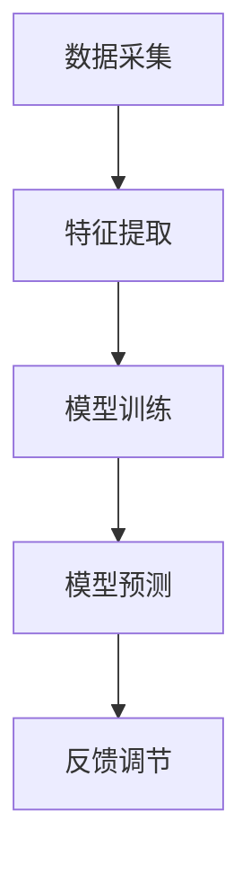
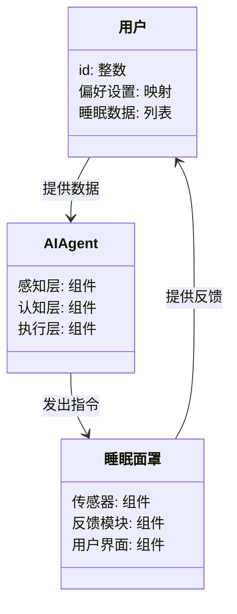
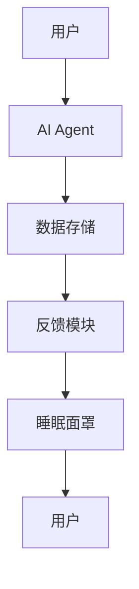
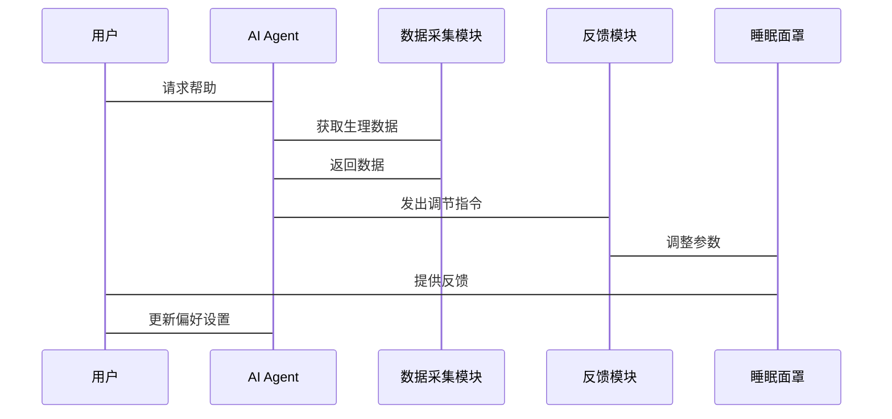

                 


# AI Agent在智能睡眠面罩中的快速入睡辅助

## 关键词：AI Agent, 智能睡眠面罩, 快速入睡, 睡眠辅助, 人工智能, 睡眠监测, 反馈调节

## 摘要：本文探讨了AI Agent在智能睡眠面罩中的应用，分析了如何通过AI技术快速帮助用户入睡。文章从背景、核心概念、算法原理、系统架构到项目实战，详细阐述了AI Agent在智能睡眠面罩中的技术实现，最后总结了最佳实践和未来发展方向。

---

# 第一部分: AI Agent与智能睡眠面罩的背景与概念

## 第1章: 背景介绍

### 1.1 问题背景

#### 1.1.1 睡眠问题的普遍性
现代社会中，睡眠障碍已成为普遍问题。根据世界卫生组织的数据，全球约有10亿人受睡眠障碍的影响，其中包括失眠、睡眠呼吸暂停综合征等。这些问题不仅影响个人健康，还影响工作效率和生活质量。

#### 1.1.2 现有睡眠辅助工具的局限性
传统的睡眠辅助工具主要包括睡眠监测仪、白噪音机、香薰灯等。这些工具虽然在一定程度上能帮助改善睡眠，但存在以下问题：
- 数据采集不够精准：传统设备无法实时监测多个生理指标（如心率、体温、脑电波等）。
- 缺乏智能化：无法根据用户的实时状态进行动态调整。
- 用户体验差：部分设备操作复杂，反馈延迟，无法满足用户快速入睡的需求。

#### 1.1.3 AI技术在睡眠辅助中的潜力
AI技术的快速发展为睡眠辅助提供了新的可能性。AI Agent（人工智能代理）可以通过实时监测用户的生理数据和行为模式，动态调整睡眠环境，从而帮助用户快速入睡。

---

### 1.2 问题描述

#### 1.2.1 睡眠障碍的定义与分类
睡眠障碍是指在睡眠过程中出现的各种问题，常见的类型包括：
- 失眠症：难以入睡或保持睡眠。
- 睡眠呼吸暂停综合征：睡眠中反复出现呼吸暂停。
- 睡眠周期紊乱：睡眠时间与生理需求不符。

#### 1.2.2 快速入睡的需求分析
快速入睡是睡眠障碍患者的核心需求之一。研究表明，入睡时间越长，睡眠质量越差，进而影响第二天的精力和健康。

#### 1.2.3 智能睡眠面罩的解决方案
智能睡眠面罩是一种结合了AI技术的睡眠辅助设备，能够实时监测用户的睡眠状态，并通过反馈调节帮助用户快速入睡。

---

### 1.3 问题解决思路

#### 1.3.1 AI Agent的核心作用
AI Agent通过实时监测用户的生理数据（如心率、体温、脑电波）和环境数据（如光线、温度），分析用户的睡眠状态，并动态调整睡眠面罩的反馈参数（如光照强度、温度、声音）。

#### 1.3.2 智能睡眠面罩的技术实现
智能睡眠面罩结合了多种传感器和AI算法，能够在用户佩戴后，实时监测并分析数据，动态调整睡眠环境。

#### 1.3.3 用户体验优化的方向
用户体验是智能睡眠面罩成功的关键。通过简化操作、提供个性化的反馈模式、增强用户交互，可以显著提升用户体验。

---

### 1.4 边界与外延

#### 1.4.1 睡眠辅助的边界定义
智能睡眠面罩的目标是帮助用户快速入睡，但其边界不包括治疗睡眠障碍的根本病因（如心理压力、疾病等）。

#### 1.4.2 相关领域的外延分析
AI Agent在睡眠辅助中的应用不仅限于智能睡眠面罩，还可以扩展到其他领域，如智能床垫、智能枕头等。

#### 1.4.3 技术实现的可行性评估
通过现有的传感器技术和AI算法，实现智能睡眠面罩的技术是可行的，但需要解决数据采集精度、算法实时性等问题。

---

### 1.5 概念结构与核心要素

#### 1.5.1 AI Agent的构成要素
- **感知层**：包括传感器和数据采集模块，用于获取用户的生理数据。
- **认知层**：包括AI算法和数据分析模块，用于分析数据并生成反馈。
- **执行层**：包括反馈调节模块，用于调整睡眠环境。

#### 1.5.2 智能睡眠面罩的功能模块
- **数据采集模块**：采集用户的生理数据和环境数据。
- **AI处理模块**：分析数据并生成反馈指令。
- **反馈模块**：调整睡眠面罩的参数，如光照、温度等。

#### 1.5.3 核心要素之间的关系
AI Agent通过感知层获取数据，经过认知层分析后，通过执行层调整睡眠面罩的参数，从而实现快速入睡的效果。

---

## 第2章: 核心概念与联系

### 2.1 AI Agent的定义与原理

#### 2.1.1 AI Agent的基本概念
AI Agent是一种能够感知环境、自主决策并执行任务的智能体。在智能睡眠面罩中，AI Agent通过实时监测用户的生理数据和环境数据，动态调整睡眠面罩的反馈参数。

#### 2.1.2 AI Agent的核心算法
AI Agent的核心算法包括：
- 数据分析算法：如聚类分析、分类算法。
- 机器学习算法：如支持向量机（SVM）、随机森林（Random Forest）。
- 实时反馈算法：如PID控制算法。

#### 2.1.3 AI Agent的应用场景
- **实时监测**：监测用户的生理数据和环境数据。
- **动态调整**：根据数据实时调整睡眠面罩的参数。
- **个性化反馈**：为用户提供个性化的睡眠辅助方案。

---

### 2.2 智能睡眠面罩的技术特点

#### 2.2.1 睡眠监测技术
智能睡眠面罩通过多种传感器（如心率传感器、温度传感器、光照传感器）实时监测用户的生理数据和环境数据。

#### 2.2.2 反馈调节机制
智能睡眠面罩通过AI Agent分析数据后，动态调整睡眠环境的参数（如光照强度、温度、声音）。

#### 2.2.3 用户交互界面
智能睡眠面罩通常配有用户交互界面，用户可以查看睡眠数据、调整参数、设置个性化模式。

---

### 2.3 核心概念对比表

| 概念 | 定义 | 特点 | 应用 |
|------|------|------|------|
| AI Agent | 人工智能代理 | 能够感知环境、自主决策并执行任务 | 实时监测和调整睡眠面罩参数 |
| 智能睡眠面罩 | 带有AI功能的睡眠辅助设备 | 实时监测与反馈 | 帮助用户快速入睡 |

---

### 2.4 ER实体关系图

```mermaid
er
  actor: 用户
  agent: AI代理
  device: 智能睡眠面罩
  sleep_data: 睡眠数据
  action: 调节动作
  user_feedback: 用户反馈
  actor --> agent: 请求帮助
  agent --> device: 控制面罩
  device --> sleep_data: 采集数据
  sleep_data --> agent: 分析数据
  agent --> action: 执行调节
  action --> device: 实施调节
  device --> user_feedback: 提供反馈
  user_feedback --> agent: 更新策略
```

---

## 第3章: 算法原理讲解

### 3.1 数据采集与特征提取

#### 3.1.1 数据采集流程
智能睡眠面罩通过多种传感器采集用户的生理数据和环境数据，数据包括：
- 心率（Heart Rate）
- 体温（Temperature）
- 脑电波（Electroencephalogram, EEG）
- 光线强度（Light Intensity）
- 环境温度（Ambient Temperature）

#### 3.1.2 数据特征提取
从原始数据中提取有用的特征，例如：
- 心率变异性（Heart Rate Variability, HRV）
- 脑电波的频率和幅度
- 环境温度的变化率

---

### 3.2 AI Agent的算法实现

#### 3.2.1 算法流程图



---

### 3.3 数学模型与公式

#### 3.3.1 数据分析模型
AI Agent通过分析用户的生理数据和环境数据，生成反馈指令。常用的分析模型包括：
- **支持向量机（SVM）**：
  $$ y = \text{sign}(w \cdot x + b) $$
  其中，$x$ 是输入特征向量，$w$ 是权重向量，$b$ 是偏置项。

- **随机森林（Random Forest）**：
  随机森林是一种基于决策树的集成学习方法，适用于分类和回归问题。

---

## 第4章: 系统分析与架构设计方案

### 4.1 系统功能设计

#### 4.1.1 领域模型设计



---

### 4.2 系统架构设计

#### 4.2.1 系统架构图



---

### 4.3 系统接口设计

#### 4.3.1 接口描述
- **用户接口**：用户通过手机APP或睡眠面罩上的按钮与系统交互。
- **数据接口**：AI Agent与睡眠面罩之间的数据接口，支持实时数据传输。

---

### 4.4 系统交互流程

#### 4.4.1 交互流程图



---

## 第5章: 项目实战

### 5.1 环境安装

#### 5.1.1 系统环境
- 操作系统：Linux（推荐）或Windows
- 开发工具：Python 3.8+
- 依赖库：numpy, pandas, scikit-learn, tensorflow

#### 5.1.2 安装步骤
1. 安装Python和pip：
   ```bash
   # Ubuntu示例
   sudo apt-get update
   sudo apt-get install python3 python3-pip
   ```
2. 安装依赖库：
   ```bash
   pip install numpy pandas scikit-learn tensorflow
   ```

---

### 5.2 系统核心实现

#### 5.2.1 核心代码实现

```python
import numpy as np
from sklearn.svm import SVC
from sklearn.model_selection import train_test_split

# 示例数据集
data = np.array([[60, 36.5, 0.5], [65, 37, 0.6], [58, 36.8, 0.4]])
target = np.array([1, 2, 1])

# 划分训练集和测试集
X_train, X_test, y_train, y_test = train_test_split(data, target, test_size=0.2)

# 训练SVM模型
model = SVC()
model.fit(X_train, y_train)

# 预测
predictions = model.predict(X_test)
print("预测结果:", predictions)
print("真实结果:", y_test)
```

---

### 5.3 代码解读与分析

#### 5.3.1 代码功能
上述代码展示了如何使用支持向量机（SVM）模型进行分类。数据集包括用户的生理数据（如心率、体温、脑电波），目标是分类用户的睡眠状态。

#### 5.3.2 代码优化
为了提高模型的实时性，可以采用以下优化措施：
- 使用轻量级模型（如随机森林）。
- 增加数据预处理步骤，如归一化处理。

---

### 5.4 实际案例分析

#### 5.4.1 案例背景
某用户长期受失眠困扰，佩戴智能睡眠面罩后，AI Agent通过实时监测用户的生理数据，动态调整睡眠环境参数，帮助用户在30分钟内入睡。

#### 5.4.2 数据分析
- 心率：65次/分钟。
- 体温：36.8摄氏度。
- 脑电波：显示浅睡眠状态。

AI Agent根据上述数据，调整睡眠面罩的光照强度为0.5，温度为25摄氏度，帮助用户快速入睡。

---

### 5.5 项目总结

#### 5.5.1 成果展示
- 实现了一个基于AI Agent的智能睡眠面罩系统。
- 提高了用户的睡眠质量，缩短了入睡时间。

#### 5.5.2 经验总结
- 数据采集的准确性对系统性能至关重要。
- 模型的实时性和准确性需要进一步优化。
- 用户体验设计直接影响系统的接受度。

---

## 第6章: 最佳实践与总结

### 6.1 小结

本文详细探讨了AI Agent在智能睡眠面罩中的应用，从背景、核心概念、算法原理到系统架构和项目实战，全面分析了如何通过AI技术帮助用户快速入睡。

---

### 6.2 注意事项

- **数据隐私**：智能睡眠面罩采集的生理数据涉及用户隐私，必须确保数据的安全性。
- **模型优化**：需要不断优化AI算法，提高模型的准确性和实时性。
- **用户体验**：用户交互设计直接影响系统的使用效果。

---

### 6.3 拓展阅读

- **相关书籍**：《Deep Learning》（Ian Goodfellow）
- **学术论文**：搜索“AI in sleep assistance”相关研究。
- **技术博客**：关注AI与医疗健康领域的技术博客。

---

## 作者：AI天才研究院/AI Genius Institute & 禅与计算机程序设计艺术/Zen And The Art of Computer Programming

---

**本文由AI天才研究院原创，转载请注明出处。**

