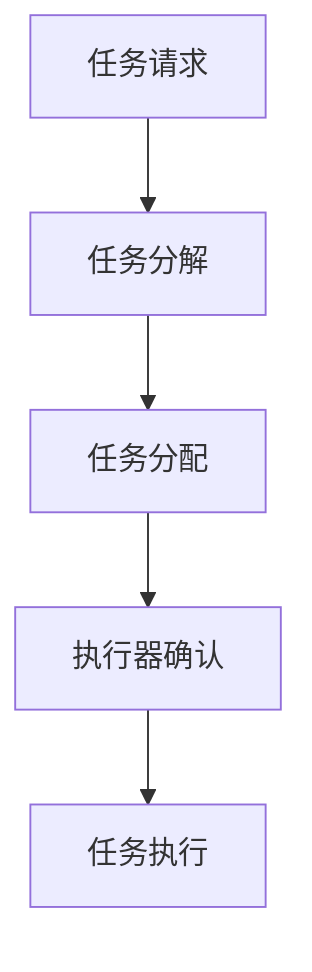
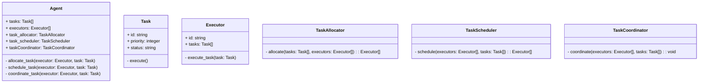
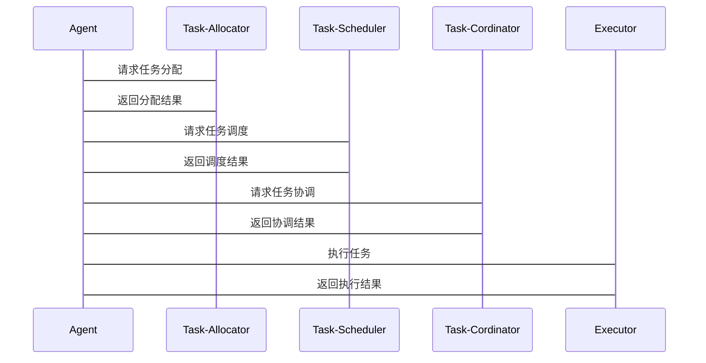

                 


# AI Agent的多任务并行处理能力

> 关键词：AI Agent, 多任务并行处理, 任务分解, 任务调度, 任务协调, 系统架构, 实战案例

> 摘要：本文系统地探讨了AI Agent的多任务并行处理能力，从核心概念、算法原理、系统架构到实战案例，层层深入，全面解析了AI Agent在多任务并行处理中的实现机制、应用场景及优化策略。通过本文，读者将能够全面理解AI Agent的多任务处理能力，并掌握实际开发中的关键技术和最佳实践。

---

# 第1章: AI Agent与多任务并行处理概述

## 1.1 AI Agent的基本概念
### 1.1.1 AI Agent的定义与特点
AI Agent（人工智能代理）是指能够感知环境、自主决策并执行任务的智能实体。其核心特点包括：
- **自主性**：无需外部干预，自主完成任务。
- **反应性**：能够实时感知环境并做出响应。
- **目标导向性**：以目标为导向，优先完成关键任务。
- **可扩展性**：能够适应不同规模和复杂度的任务。

### 1.1.2 多任务并行处理的定义
多任务并行处理是指在同一时间段内，AI Agent能够同时执行多个任务的能力。这些任务可以是相互独立的，也可以是相互依赖的，关键在于如何高效地分配和协调这些任务。

### 1.1.3 AI Agent与多任务并行处理的关系
AI Agent的多任务并行处理能力是其实现高效任务执行的核心能力之一。通过并行处理，AI Agent能够显著提升任务执行效率，降低系统响应时间，同时优化资源利用率。

## 1.2 多任务并行处理的背景与意义
### 1.2.1 当前AI Agent的发展趋势
随着AI技术的快速发展，AI Agent的应用场景越来越广泛，例如智能助手、自动驾驶、智能客服等。在这些场景中，多任务并行处理能力成为衡量AI Agent性能的重要指标。

### 1.2.2 多任务并行处理的必要性
在实际应用中，AI Agent往往需要同时处理多个任务，例如在自动驾驶中，AI Agent需要同时处理环境感知、路径规划、决策控制等多个任务。多任务并行处理能力能够显著提升系统的实时性和响应速度。

### 1.2.3 多任务并行处理的应用场景
- **智能助手**：同时处理用户的多种请求，例如查询信息、发送消息、管理日程等。
- **自动驾驶**：同时处理环境感知、路径规划、决策控制等多个任务。
- **智能客服**：同时处理多个客户的咨询请求，并根据客户需求动态调整任务优先级。

## 1.3 本章小结
本章从AI Agent的基本概念出发，详细阐述了多任务并行处理的定义、背景及意义，并通过实际应用场景说明了多任务并行处理的重要性。

---

# 第2章: 多任务并行处理的核心概念与联系

## 2.1 核心概念原理
### 2.1.1 任务分解与分配
任务分解是指将复杂任务拆解为多个子任务，每个子任务由不同的执行器负责。例如，在自动驾驶中，环境感知任务可以分解为目标检测、障碍物识别等多个子任务。

### 2.1.2 任务调度与协调
任务调度是指根据任务优先级和系统资源状况，动态调整任务的执行顺序。任务协调是指在多个执行器之间，确保任务执行的一致性和高效性。

### 2.1.3 任务并行执行机制
任务并行执行机制是实现多任务并行处理的核心机制，包括任务的并行执行、资源的共享与分配、任务的同步与异步处理等。

## 2.2 核心概念属性特征对比表
| 概念       | 特性1   | 特性2   | 特性3   |
|------------|---------|---------|---------|
| 任务分解   | 独立性   | 并行性   | 依赖性   |
| 任务调度   | 响应性   | 公平性   | 效率性   |
| 任务协调   | 同步性   | 异步性   | 一致性   |

## 2.3 ER实体关系图（Mermaid）
```mermaid
er
actor(Agent) -[发起任务]-> task(任务)
task(任务) -[分配给]-> executor(执行器)
executor(执行器) -[反馈结果]-> task(任务)
```

## 2.4 本章小结
本章通过任务分解、任务调度和任务协调三个核心概念，详细分析了多任务并行处理的原理及其相互关系，并通过对比表格和实体关系图进一步明确了各概念的属性特征。

---

# 第3章: 多任务并行处理的算法原理

## 3.1 算法原理概述
### 3.1.1 任务分配算法
任务分配算法是实现多任务并行处理的基础，其核心目标是将任务合理分配给不同的执行器，确保任务执行的高效性和均衡性。

### 3.1.2 任务调度算法
任务调度算法是根据任务优先级和系统资源状况，动态调整任务执行顺序的算法。常见的任务调度算法包括轮转调度、优先级调度等。

### 3.1.3 任务协调算法
任务协调算法是确保多个任务在并行执行过程中保持一致性和高效性的算法，常见的任务协调机制包括同步、异步和事务管理。

## 3.2 任务分配算法（Mermaid流程图）


## 3.3 任务调度算法实现
```python
def task_scheduler(tasks, executors):
    # 任务分配逻辑
    for task in tasks:
        executor = select_executor(executors)
        executor.tasks.append(task)
    return executors
```

## 3.4 任务协调机制
### 3.4.1 同步机制
同步机制是指在多个任务之间，通过共享变量或信号量实现任务之间的同步。例如，使用信号量控制任务的访问顺序。

### 3.4.2 异步机制
异步机制是指任务之间不共享资源，通过消息传递或事件驱动实现任务之间的协调。例如，使用消息队列实现任务之间的通信。

### 3.4.3 事务管理机制
事务管理机制是指在任务执行过程中，确保任务的原子性、一致性、隔离性和持久性。例如，使用事务管理器确保多个任务之间的数据一致性。

## 3.5 数学模型与公式
### 3.5.1 任务

---

# 第4章: 多任务并行处理的系统分析与架构设计

## 4.1 问题场景介绍
在实际应用中，AI Agent的多任务并行处理能力需要满足以下需求：
- **高并发**：能够同时处理大量任务。
- **低延迟**：任务执行的响应时间要尽可能短。
- **高可用性**：系统在部分节点故障时仍能正常运行。

## 4.2 项目介绍
本项目旨在设计一个高效的AI Agent多任务并行处理系统，包括任务分解、任务调度、任务协调等功能。

## 4.3 系统功能设计（领域模型Mermaid类图）


## 4.4 系统架构设计（Mermaid架构图）
```mermaid
C4
ComponentDiagram
    Component AI-Agent-Manager
    Component Task-Allocator
    Component Task-Scheduler
    Component Task-Cordinator
    Component Executor-1
    Component Executor-2
    Component Executor-3
    Executor-1 --> Task-Allocator
    Executor-2 --> Task-Allocator
    Executor-3 --> Task-Allocator
    Task-Allocator --> Task-Scheduler
    Task-Scheduler --> Task-Cordinator
    Task-Cordinator --> Executor-1
    Task-Cordinator --> Executor-2
    Task-Cordinator --> Executor-3
```

## 4.5 系统交互设计（Mermaid序列图）


## 4.6 本章小结
本章从系统架构的角度，详细分析了AI Agent多任务并行处理系统的功能设计、架构设计和交互设计，并通过类图、架构图和序列图进一步明确了各组件之间的关系和交互流程。

---

# 第5章: 多任务并行处理的项目实战

## 5.1 环境安装与配置
### 5.1.1 系统环境要求
- 操作系统：Linux/Windows/MacOS
- Python版本：3.6以上
- 依赖库：numpy, matplotlib, scikit-learn

### 5.1.2 安装依赖
```bash
pip install numpy matplotlib scikit-learn
```

## 5.2 系统核心实现源代码
### 5.2.1 任务分配实现
```python
class TaskAllocator:
    def allocate(self, tasks, executors):
        # 简单的轮转分配策略
        for task in tasks:
            executor = executors[len(executors) // 2]
            executor.tasks.append(task)
        return executors
```

### 5.2.2 任务调度实现
```python
class TaskScheduler:
    def schedule(self, executors, tasks):
        # 简单的优先级调度策略
        executors.sort(key=lambda x: len(x.tasks))
        for executor in executors:
            if len(executor.tasks) > 0:
                task = executor.tasks.pop(0)
                executor.execute_task(task)
        return executors
```

### 5.2.3 任务协调实现
```python
class TaskCoordinator:
    def coordinate(self, executors, tasks):
        # 简单的同步协调策略
        import threading
        lock = threading.Lock()
        for executor in executors:
            for task in executor.tasks:
                with lock:
                    task.execute()
```

## 5.3 代码应用解读与分析
### 5.3.1 任务分配代码解读
上述任务分配代码采用简单的轮转分配策略，将任务均匀分配给不同的执行器。在实际应用中，可以根据任务的优先级和执行器的负载情况动态调整分配策略。

### 5.3.2 任务调度代码解读
上述任务调度代码采用优先级调度策略，优先调度负载较轻的执行器。在实际应用中，可以根据任务的紧急程度和执行器的资源情况动态调整调度策略。

### 5.3.3 任务协调代码解读
上述任务协调代码采用简单的同步协调策略，通过锁机制确保任务的原子性。在实际应用中，可以根据任务的依赖关系和执行器的资源情况动态调整协调策略。

## 5.4 实际案例分析
### 5.4.1 案例背景
假设我们有一个智能助手系统，需要同时处理用户的多种请求，例如查询信息、发送消息、管理日程等。

### 5.4.2 系统实现
通过上述代码实现任务分配、任务调度和任务协调，确保多个任务能够高效地并行执行。

### 5.4.3 实验结果与分析
通过实验可以发现，采用合理的任务分配和调度策略，系统能够显著提升任务执行效率，降低系统响应时间。

## 5.5 本章小结
本章通过实际案例分析，详细讲解了AI Agent多任务并行处理系统的实现过程，并通过代码实现和实验结果进一步验证了系统的有效性。

---

# 第6章: 多任务并行处理的最佳实践与优化

## 6.1 最佳实践
### 6.1.1 任务分解策略
在任务分解时，应尽量将任务分解为独立性较高的子任务，以减少任务之间的依赖关系。

### 6.1.2 任务调度策略
在任务调度时，应根据任务的优先级和系统资源状况动态调整任务的执行顺序。

### 6.1.3 任务协调策略
在任务协调时，应根据任务的依赖关系和执行器的资源情况动态调整协调策略。

## 6.2 优化建议
### 6.2.1 并行计算优化
通过使用多线程、多进程或分布式计算技术，进一步提升任务的并行执行效率。

### 6.2.2 资源分配优化
根据任务的资源需求和系统资源状况，动态调整任务的资源分配策略。

### 6.2.3 系统容错优化
通过引入容错机制，确保系统在部分节点故障时仍能正常运行。

## 6.3 小结
本章通过最佳实践和优化建议，进一步提升了AI Agent多任务并行处理系统的性能和可靠性。

---

# 第7章: 总结与展望

## 7.1 本章总结
本文系统地探讨了AI Agent的多任务并行处理能力，从核心概念、算法原理、系统架构到实战案例，层层深入，全面解析了AI Agent在多任务并行处理中的实现机制、应用场景及优化策略。

## 7.2 未来展望
随着AI技术的不断发展，AI Agent的多任务并行处理能力将更加智能化和高效化。未来的研究方向包括：
- **智能任务分配**：基于机器学习的任务分配策略。
- **自适应调度算法**：能够根据动态环境自适应调整任务调度策略。
- **分布式协调机制**：在分布式系统中实现高效的多任务并行处理。

---

# 作者：AI天才研究院/AI Genius Institute & 禅与计算机程序设计艺术 /Zen And The Art of Computer Programming

