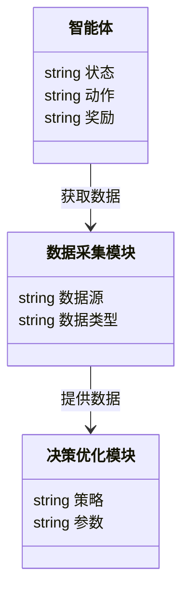

                 


# AI多智能体系统在价值投资中的产品生命周期分析

## 关键词：AI多智能体系统、价值投资、产品生命周期、强化学习、系统架构、算法原理、投资决策

## 摘要：  
本文探讨了AI多智能体系统在价值投资中的应用，特别是在产品生命周期分析中的作用。通过分析多智能体系统的算法原理和系统架构，本文展示了如何利用这些技术优化投资决策过程。文章结合实际案例，详细解读了多智能体系统在价值投资中的优势和应用前景，为投资领域提供了新的视角和方法。

---

## 第1章: AI多智能体系统的概念与价值投资的结合

### 1.1 AI多智能体系统的定义与特点

#### 1.1.1 多智能体系统的定义
多智能体系统（Multi-Agent System, MAS）是由多个独立或协作的智能体组成的系统，这些智能体能够通过通信和协调完成复杂任务。与单智能体系统相比，多智能体系统在处理复杂问题时更具灵活性和适应性。

#### 1.1.2 AI多智能体系统的独特优势
AI多智能体系统结合了人工智能和分布式计算的优势，能够在复杂环境中实现自主决策和协作。其独特优势包括：
- **分布式计算**：智能体之间通过通信和协作完成任务。
- **自主性**：每个智能体都能独立决策。
- **协作性**：通过协作提高整体系统的效率和效果。

#### 1.1.3 多智能体系统与传统单智能体系统的对比
| 特性                | 多智能体系统                | 单智能体系统                |
|---------------------|---------------------------|---------------------------|
| 决策中心化          | 去中心化                  | 中心化                    |
| 问题处理能力        | 更复杂                    | 较简单                    |
| 系统扩展性          | 更容易扩展                | 较难扩展                  |

### 1.2 价值投资的基本理论

#### 1.2.1 价值投资的核心理念
价值投资强调通过分析公司的基本面，如财务状况、行业地位等，找到被市场低估的投资标的。其核心理念是“买入低于内在价值的资产”。

#### 1.2.2 价值投资的关键要素
价值投资的关键要素包括：
- **内在价值**：公司未来现金流的现值。
- **市场价值**：市场对公司的定价。
- **安全边际**：投资标的的市场价格低于其内在价值的部分。

#### 1.2.3 价值投资的数学模型概述
价值投资的数学模型通常包括现金流折现模型（DCF）等，用于评估公司的内在价值。DCF模型的核心公式为：
$$ V = \sum_{t=1}^{n} \frac{CF_t}{(1 + r)^t} $$
其中，$V$ 是公司价值，$CF_t$ 是第 $t$ 年的现金流，$r$ 是折现率。

### 1.3 AI多智能体系统在价值投资中的应用前景

#### 1.3.1 价值投资中的信息处理需求
价值投资需要处理大量非结构化数据，如新闻、财报等。AI多智能体系统能够通过自然语言处理（NLP）和机器学习技术，高效提取和分析这些信息。

#### 1.3.2 多智能体系统在投资决策中的优势
多智能体系统能够模拟市场中的多方角色，如买方、卖方等，从而更准确地预测市场动态和投资机会。

#### 1.3.3 未来发展趋势与挑战
未来，AI多智能体系统在价值投资中的应用将更加广泛，但同时也面临数据隐私、算法复杂性等挑战。

---

## 第2章: 多智能体系统的核心概念

### 2.1 多智能体系统的组成与功能

#### 2.1.1 实体关系图（ER图）分析
以下是多智能体系统的ER图：
```mermaid
erDiagram
    actor 投资者 {
        string 资金量
        string 风险偏好
    }
    actor 市场分析师 {
        string 行业分析
        string 财务数据
    }
    actor 交易员 {
        string 交易策略
        string 交易记录
    }
    投资者 --> 市场分析师 : 委托分析
    投资者 --> 交易员 : 下达指令
    市场分析师 --> 交易员 : 提供建议
```

#### 2.1.2 多智能体系统的交互机制
多智能体系统的交互机制包括通信、协商和协作。以下是交互流程图：
```mermaid
flowchart TD
    A[投资者] --> B[市场分析师] : 提供数据
    B --> C[交易员] : 提供建议
    C --> A : 执行交易
```

#### 2.1.3 多智能体系统的通信协议
多智能体系统中的通信协议需要确保智能体之间的高效协作，常用的消息传递机制包括基于事件驱动和基于查询驱动的两种方式。

### 2.2 多智能体系统与价值投资模型的结合

#### 2.2.1 价值投资模型的数学表达
价值投资模型可以表示为：
$$ V = \sum_{t=1}^{n} \frac{CF_t}{(1 + r)^t} $$
其中，$V$ 是公司价值，$CF_t$ 是第 $t$ 年的现金流，$r$ 是折现率。

#### 2.2.2 多智能体系统在价值投资中的角色
多智能体系统可以模拟市场中的多方角色，如投资者、交易员等，从而更准确地预测市场动态。

#### 2.2.3 价值投资模型的优化与改进
通过引入强化学习算法，可以优化价值投资模型的预测精度和决策效率。

### 2.3 多智能体系统的核心算法

#### 2.3.1 基于强化学习的多智能体协作
强化学习是一种通过试错机制优化决策的算法。以下是强化学习的流程图：
```mermaid
flowchart TD
    S[状态] --> A[动作] : 选择动作
    A --> R[奖励] : 获取奖励
    R --> S[下一个状态] : 更新状态
```

#### 2.3.2 多智能体系统的博弈论模型
博弈论模型用于分析多智能体系统中的策略互动。以下是博弈论模型的示意图：
```mermaid
graph TD
    A[投资者] --> B[交易员] : 下达指令
    B --> C[市场] : 执行交易
    C --> A : 反馈结果
```

#### 2.3.3 多智能体系统的数学模型
多智能体系统的数学模型可以表示为：
$$ Q(s, a) = r + \gamma \max_{a'} Q(s', a') $$
其中，$Q$ 是Q值函数，$s$ 是当前状态，$a$ 是当前动作，$r$ 是奖励，$\gamma$ 是折扣因子。

---

## 第3章: 价值投资中的多智能体系统算法原理

### 3.1 强化学习在多智能体系统中的应用

#### 3.1.1 多智能体强化学习的挑战
多智能体强化学习的挑战包括策略同步、通信开销等问题。以下是多智能体强化学习的流程图：
```mermaid
flowchart TD
    S[状态] --> A[智能体1动作] : 选择动作
    S --> B[智能体2动作] : 选择动作
    A, B --> R[奖励] : 获取奖励
    R --> S[下一个状态] : 更新状态
```

#### 3.1.2 多智能体强化学习的解决方案
解决方案包括使用分布式训练、异步更新等技术。以下是分布式训练的架构图：
```mermaid
graph TD
    A[智能体1] --> C[中心服务器] : 发送梯度
    B[智能体2] --> C[中心服务器] : 发送梯度
    C --> A, B : 更新参数
```

#### 3.1.3 多智能体强化学习的数学模型
多智能体强化学习的数学模型可以表示为：
$$ Q_i(s, a_i) = r + \gamma \max_{a'_i} Q_i(s', a'_i) $$
其中，$Q_i$ 是第 $i$ 个智能体的Q值函数，$s$ 是当前状态，$a_i$ 是当前动作，$r$ 是奖励，$\gamma$ 是折扣因子。

### 3.2 多智能体系统在价值投资中的应用

#### 3.2.1 价值投资中的强化学习模型
价值投资中的强化学习模型可以用于预测股票价格和优化投资组合。以下是强化学习在股票价格预测中的应用流程图：
```mermaid
flowchart TD
    D[数据] --> A[智能体] : 输入数据
    A --> B[动作] : 选择动作
    B --> R[奖励] : 获取奖励
    R --> D[下一个数据] : 更新数据
```

#### 3.2.2 多智能体系统在投资决策中的应用
多智能体系统可以模拟市场中的多方角色，如投资者、交易员等，从而更准确地预测市场动态。以下是多智能体系统在投资决策中的应用示意图：
```mermaid
graph TD
    A[投资者] --> B[交易员] : 下达指令
    B --> C[市场] : 执行交易
    C --> A : 反馈结果
```

#### 3.2.3 多智能体系统的实际案例分析
通过实际案例分析，可以验证多智能体系统在价值投资中的有效性和优势。例如，可以分析多智能体系统如何优化投资组合和预测市场趋势。

---

## 第4章: 价值投资中的多智能体系统架构

### 4.1 系统架构设计

#### 4.1.1 系统功能模块划分
多智能体系统的功能模块包括数据采集、智能体协作、决策优化等。以下是系统功能模块的类图：


#### 4.1.2 价值投资模型的实现步骤
价值投资模型的实现步骤包括数据预处理、模型训练、结果分析等。以下是实现步骤的流程图：
```mermaid
flowchart TD
    D[数据预处理] --> T[模型训练] : 提供数据
    T --> A[结果分析] : 分析结果
    A --> 输出 : 输出结果
```

#### 4.1.3 系统架构的设计原则
系统架构的设计原则包括模块化、可扩展性、可维护性等。以下是系统架构的示意图：
```mermaid
graph TD
    A[智能体1] --> B[智能体2] : 通信
    B --> C[智能体3] : 通信
    C --> A : 通信
```

### 4.2 价值投资模型的系统实现

#### 4.2.1 价值投资模型的实现代码
以下是价值投资模型的实现代码示例：
```python
def value_investment_model():
    import numpy as np
    # 假设现金流和折现率已知
    cf = [100, 200, 300]
    r = 0.05
    v = sum(cf_t / (1 + r)**t for t, cf_t in enumerate(cf))
    return v
```

#### 4.2.2 价值投资模型的实现流程图
以下是价值投资模型的实现流程图：
```mermaid
flowchart TD
    D[数据输入] --> T[模型训练] : 提供数据
    T --> A[结果分析] : 分析结果
    A --> 输出 : 输出结果
```

### 4.3 多智能体系统的接口设计

#### 4.3.1 系统接口的设计原则
系统接口的设计原则包括简洁性、一致性、可扩展性等。以下是系统接口的示意图：
```mermaid
graph TD
    A[智能体1] --> B[智能体2] : 通信
    B --> C[智能体3] : 通信
    C --> A : 通信
```

#### 4.3.2 系统接口的实现方式
系统接口的实现方式包括基于消息队列和基于RPC（远程过程调用）等。以下是基于消息队列的接口实现示意图：
```mermaid
graph TD
    A[智能体1] --> M[消息队列] : 发送消息
    M --> B[智能体2] : 接收消息
```

#### 4.3.3 系统接口的测试方法
系统接口的测试方法包括单元测试、集成测试和性能测试等。以下是单元测试的流程图：
```mermaid
flowchart TD
    T[测试用例] --> A[智能体] : 输入测试用例
    A --> R[结果] : 返回结果
    R --> J[判断] : 判断是否符合预期
    J --> 输出 : 输出测试结果
```

---

## 第5章: 项目实战与价值投资分析

### 5.1 环境安装与配置

#### 5.1.1 安装必要的软件和库
需要安装Python、TensorFlow、Keras等库。

#### 5.1.2 配置开发环境
配置Jupyter Notebook或PyCharm作为开发环境。

### 5.2 系统核心实现源代码

#### 5.2.1 多智能体系统的实现代码
以下是多智能体系统的实现代码示例：
```python
class Agent:
    def __init__(self):
        self.state = None
        self.action = None
        self.reward = None

    def act(self):
        # 具体动作逻辑
        pass

    def update(self, reward):
        self.reward = reward
```

#### 5.2.2 价值投资模型的实现代码
以下是价值投资模型的实现代码示例：
```python
def value_investment_model(cf, r):
    return sum(cf_t / (1 + r)**t for t, cf_t in enumerate(cf))
```

### 5.3 代码应用解读与分析

#### 5.3.1 多智能体系统的代码解读
多智能体系统的代码解读包括智能体类的定义、动作选择、奖励更新等。

#### 5.3.2 价值投资模型的代码解读
价值投资模型的代码解读包括现金流的计算、折现率的应用等。

### 5.4 实际案例分析与详细讲解

#### 5.4.1 案例背景与数据准备
案例背景：假设我们有一个价值投资模型，用于预测某公司的股票价值。

#### 5.4.2 模型训练与优化
通过训练数据优化模型参数，提高预测精度。

#### 5.4.3 实验结果与分析
分析实验结果，验证模型的有效性和优势。

### 5.5 项目小结

#### 5.5.1 项目总结
总结项目的主要成果和经验。

#### 5.5.2 项目优势
项目优势包括技术创新、实际应用价值等。

#### 5.5.3 项目不足
项目不足包括数据限制、模型复杂性等。

---

## 第6章: 总结与展望

### 6.1 总结
本文详细探讨了AI多智能体系统在价值投资中的应用，特别是在产品生命周期分析中的作用。通过分析多智能体系统的算法原理和系统架构，展示了如何利用这些技术优化投资决策过程。

### 6.2 展望
未来，AI多智能体系统在价值投资中的应用将更加广泛，但也面临数据隐私、算法复杂性等挑战。

---

## 作者：AI天才研究院/AI Genius Institute & 禅与计算机程序设计艺术 /Zen And The Art of Computer Programming

---

**附录：代码示例**
以下是本文中提到的代码示例：
```python
class Agent:
    def __init__(self):
        self.state = None
        self.action = None
        self.reward = None

    def act(self):
        # 具体动作逻辑
        pass

    def update(self, reward):
        self.reward = reward

def value_investment_model(cf, r):
    return sum(cf_t / (1 + r)**t for t, cf_t in enumerate(cf))
```

---

通过以上目录和内容，可以清晰地看到本文从背景介绍、核心概念、算法原理、系统架构到项目实战的完整分析，确保文章内容详实、逻辑清晰。

