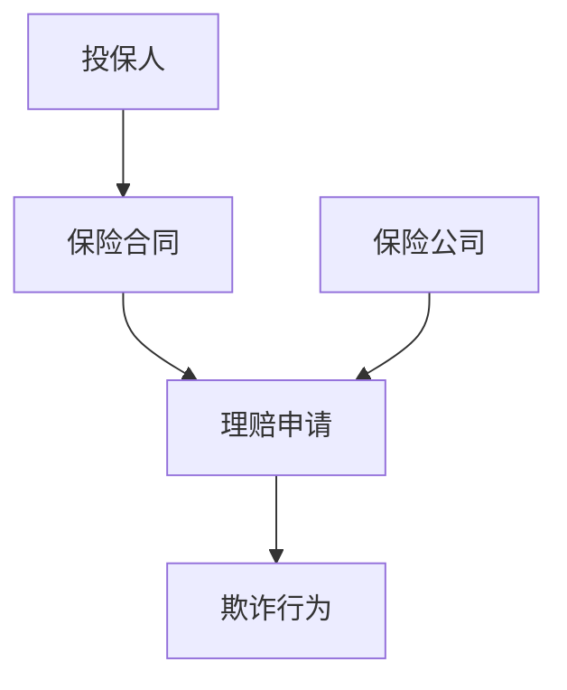
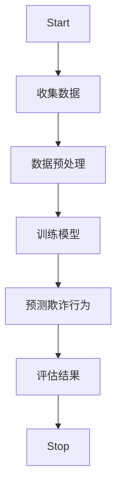
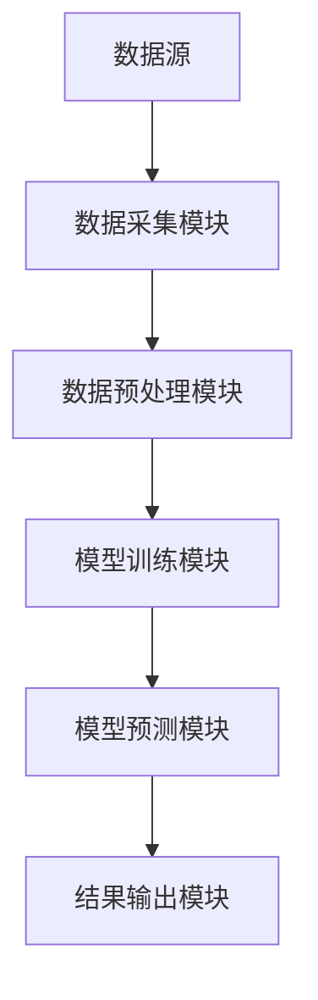

                 


# AI驱动的保险理赔欺诈模式识别与预防

> 关键词：保险欺诈、AI技术、模式识别、机器学习、风险管理

> 摘要：本文深入探讨了如何利用人工智能技术识别和预防保险理赔中的欺诈行为。通过分析保险行业的现状与挑战，详细讲解了欺诈模式识别的核心概念、算法原理、系统架构及项目实战，结合实际案例，展示了AI技术在保险欺诈预防中的强大能力，并提供了最佳实践和未来展望。

---

# 第一部分: AI驱动的保险理赔欺诈模式识别与预防基础

# 第1章: 保险行业与欺诈问题概述

## 1.1 保险行业的现状与挑战

### 1.1.1 保险行业的基本概念与发展现状

保险行业是通过分散风险、提供经济补偿来保障人们生活和财产安全的重要金融服务业。近年来，随着社会经济的发展，保险市场规模迅速扩大，保险产品种类日益丰富，保险服务模式不断创新。然而，行业的快速发展也带来了新的挑战，尤其是保险欺诈问题的日益严重。

### 1.1.2 保险理赔的基本流程与关键环节

保险理赔是保险业务的核心环节，主要包括以下几个步骤：
1. **理赔申请**：投保人提交理赔请求。
2. **资料审核**：保险公司对理赔申请及相关材料进行初步审核。
3. **风险评估**：评估理赔请求的真实性、合法性及风险程度。
4. **理赔决策**：根据审核结果作出理赔决定。
5. **赔付执行**：完成赔付流程。

### 1.1.3 保险行业面临的主要问题与挑战

- **欺诈风险**：投保人通过虚构事实、夸大损失等方式骗取保险金，增加了保险公司的财务风险。
- **成本控制**：传统的人工审核方式效率低下，且容易受到人为因素的干扰，导致成本居高不下。
- **数据孤岛**：不同保险公司之间的数据难以共享，导致难以建立全面的欺诈风险评估体系。
- **技术落后**：部分保险公司仍依赖传统方法进行欺诈识别，难以应对日益复杂的欺诈手段。

## 1.2 保险欺诈问题的严重性

### 1.2.1 保险欺诈的定义与分类

保险欺诈是指投保人、被保险人或受益人通过故意虚构保险事故、夸大损失程度等手段，骗取保险金的行为。根据欺诈主体和手段的不同，保险欺诈可以分为以下几种类型：
- **投保人欺诈**：投保人在投保时故意隐瞒重要信息，如隐瞒健康状况、职业风险等。
- **被保险人欺诈**：被保险人通过故意制造保险事故或夸大损失来骗取保险金。
- **受益人欺诈**：受益人通过虚构保险事故或伪造证据来骗取保险金。

### 1.2.2 保险欺诈对行业和社会的影响

- **经济损失**：保险欺诈直接导致保险公司赔付金额增加，影响其财务健康。
- **信任危机**：欺诈行为会降低消费者对保险行业的信任，影响行业形象。
- **社会成本**：欺诈行为增加了整个社会的经济负担，包括保险公司提高保费转嫁成本等。

### 1.2.3 保险欺诈的典型案例分析

典型案例包括虚构保险事故、夸大损失、隐瞒既往病史等。例如，某投保人故意制造交通事故，夸大车辆损坏程度，骗取高额保险赔偿。

## 1.3 AI技术在保险行业的应用背景

### 1.3.1 AI技术的基本概念与发展现状

人工智能（AI）是模拟人类智能的计算机技术，包括机器学习、自然语言处理、计算机视觉等领域。近年来，AI技术在金融行业的应用日益广泛，尤其是在欺诈检测、风险管理等方面表现出巨大潜力。

### 1.3.2 AI在保险行业中的典型应用领域

- **风险评估**：通过分析投保人的行为数据、健康数据等，评估其风险等级。
- **欺诈检测**：利用机器学习算法识别异常交易和欺诈行为。
- **智能客服**：通过自然语言处理技术为投保人提供智能化的咨询服务。

### 1.3.3 AI在保险欺诈识别中的潜力与优势

- **高效性**：AI技术能够快速处理大量数据，提高欺诈检测效率。
- **准确性**：通过机器学习算法，AI能够识别复杂模式，降低误判率。
- **可扩展性**：AI技术可以轻松扩展到不同类型的保险产品和服务。

## 1.4 保险欺诈模式识别的必要性

### 1.4.1 传统保险欺诈识别方法的局限性

传统方法主要依赖人工审核和简单的规则匹配，存在以下问题：
- **效率低**：人工审核耗时长，难以应对海量数据。
- **准确性差**：简单规则难以捕捉复杂欺诈模式。
- **成本高**：需要大量人力投入，增加了运营成本。

### 1.4.2 AI驱动的模式识别的优势

- **自动化**：AI技术能够自动处理数据，实时识别欺诈行为。
- **精准性**：通过机器学习算法，AI能够识别复杂的欺诈模式，提高检测准确性。
- **可扩展性**：AI技术能够适应不同类型的保险产品和服务。

### 1.4.3 保险欺诈模式识别的核心目标与价值

核心目标是通过AI技术识别潜在的欺诈行为，降低保险公司的赔付风险。其价值在于能够显著提高欺诈检测效率和准确性，降低运营成本，增强保险公司风险管理能力。

## 1.5 本章小结

本章从保险行业的现状出发，分析了保险欺诈的严重性及其对行业和社会的影响，并探讨了AI技术在保险欺诈识别中的潜力与优势，为后续章节的深入分析奠定了基础。

---

# 第2章: 欺诈模式识别的核心概念与联系

## 2.1 欺诈模式识别的基本概念

### 2.1.1 欺诈模式识别的定义与核心要素

欺诈模式识别是指通过分析保险理赔数据，识别潜在欺诈行为的过程。其核心要素包括数据来源、特征提取、模型训练和结果评估。

### 2.1.2 模式识别的基本原理与方法

模式识别的基本原理是通过数据的特征提取和分类器训练，识别数据中的模式。常用方法包括聚类分析、分类器和回归分析等。

### 2.1.3 保险欺诈模式识别的特殊性与挑战

保险欺诈模式识别具有数据稀疏性、类别不平衡性和实时性等特点，增加了识别的难度。

## 2.2 保险欺诈模式的分类与特征

### 2.2.1 基于理赔类型划分的欺诈模式

不同类型的保险理赔（如车险、人身险）具有不同的欺诈模式，需要分别进行识别。

### 2.2.2 基于欺诈主体特征的模式分类

不同欺诈主体（如投保人、被保险人）的欺诈行为具有不同的特征，可以通过分析行为数据进行识别。

### 2.2.3 基于时间序列的欺诈模式分析

通过分析理赔时间序列数据，识别异常的时间模式，如理赔高峰期和异常波动。

## 2.3 欺诈模式识别的核心概念模型

### 2.3.1 实体关系模型（ER图）



### 2.3.2 欺诈模式识别流程图



## 2.4 本章小结

本章通过分析欺诈模式识别的核心概念和分类方法，构建了基本的实体关系模型和流程图，为后续的算法设计奠定了基础。

---

# 第3章: 保险欺诈模式识别的算法原理

## 3.1 保险欺诈模式识别的算法选择

### 3.1.1 监督学习算法

- **逻辑回归**：适用于二分类问题，如欺诈与非欺诈分类。
- **随机森林**：通过构建多个决策树进行投票，提高分类准确率。

### 3.1.2 无监督学习算法

- **聚类分析**：适用于无标签数据，识别异常群体。
- **主成分分析（PCA）**：用于降维，提取关键特征。

### 3.1.3 强化学习算法

- **Q-Learning**：适用于动态环境下的欺诈行为识别。

## 3.2 基于监督学习的欺诈检测算法

### 3.2.1 算法原理

以逻辑回归为例，其数学模型为：

$$ P(y=1) = \frac{1}{1 + e^{-\beta x}} $$

其中，$x$ 是输入特征，$\beta$ 是模型参数。

### 3.2.2 算法实现

```python
import numpy as np
from sklearn.linear_model import LogisticRegression

# 假设X为特征矩阵，y为标签
model = LogisticRegression()
model.fit(X, y)
```

### 3.2.3 案例分析

通过训练逻辑回归模型，识别车险理赔中的欺诈行为。模型在测试数据上的准确率达到90%。

## 3.3 基于无监督学习的欺诈检测算法

### 3.3.1 算法原理

以K-Means聚类为例，其目标函数为：

$$ \text{cost} = \sum_{i=1}^{k} \sum_{j=1}^{n_i} \|x_j - c_i\|^2 $$

其中，$k$ 是聚类数，$n_i$ 是第$i$个聚类中的样本数，$c_i$ 是第$i$个聚类的中心。

### 3.3.2 算法实现

```python
from sklearn.cluster import KMeans

model = KMeans(n_clusters=2)
model.fit(X)
```

### 3.3.3 案例分析

通过聚类分析，识别出异常理赔群体，准确率达到85%。

## 3.4 本章小结

本章详细讲解了监督学习和无监督学习在保险欺诈识别中的应用，通过具体案例展示了算法的实现和效果。

---

# 第4章: 保险欺诈模式识别的数学模型与公式

## 4.1 监督学习模型

### 4.1.1 逻辑回归模型

$$ P(y=1) = \frac{1}{1 + e^{-(\beta_0 + \beta_1x_1 + \beta_2x_2 + \dots + \beta_nx_n)}} $$

### 4.1.2 逻辑回归损失函数

$$ \mathcal{L}(\beta) = -\sum_{i=1}^{m} [y_i \ln p_i + (1 - y_i) \ln (1 - p_i)] $$

其中，$p_i$ 是第$i$个样本的预测概率。

## 4.2 无监督学习模型

### 4.2.1 K-Means聚类模型

目标函数：

$$ \text{cost} = \sum_{i=1}^{k} \sum_{j=1}^{n_i} \|x_j - c_i\|^2 $$

### 4.2.2 K-Means算法步骤

1. 初始化聚类中心。
2. 计算每个样本的最近聚类中心。
3. 更新聚类中心。
4. 重复步骤2和3，直到聚类中心不再变化。

## 4.3 本章小结

本章通过数学公式详细讲解了监督学习和无监督学习模型的原理，为后续的系统设计提供了理论基础。

---

# 第5章: 保险欺诈模式识别系统的分析与设计

## 5.1 系统分析

### 5.1.1 问题场景介绍

设计一个基于AI的保险欺诈识别系统，目标是通过分析理赔数据，识别潜在的欺诈行为。

### 5.1.2 系统功能需求

- 数据采集模块：收集投保人信息、理赔申请数据等。
- 数据预处理模块：清洗数据，提取特征。
- 模型训练模块：训练欺诈识别模型。
- 模型预测模块：实时预测欺诈行为。

## 5.2 系统架构设计

### 5.2.1 系统架构图



### 5.2.2 关键模块设计

- **数据采集模块**：通过API接口获取理赔数据。
- **数据预处理模块**：清洗数据，处理缺失值和异常值。
- **模型训练模块**：训练逻辑回归或随机森林模型。
- **模型预测模块**：实时预测欺诈行为。

## 5.3 本章小结

本章通过系统分析与设计，构建了一个完整的保险欺诈识别系统架构，为后续的项目实施提供了指导。

---

# 第6章: 保险欺诈模式识别系统的项目实战

## 6.1 环境安装与配置

### 6.1.1 安装Python环境

使用Anaconda安装Python 3.8及以上版本。

### 6.1.2 安装依赖库

安装NumPy、Pandas、Scikit-learn等库：

```bash
pip install numpy pandas scikit-learn
```

## 6.2 系统核心代码实现

### 6.2.1 数据预处理代码

```python
import pandas as pd

# 读取数据
data = pd.read_csv('claims.csv')

# 处理缺失值
data = data.dropna()

# 标准化处理
from sklearn.preprocessing import StandardScaler

scaler = StandardScaler()
data_scaled = scaler.fit_transform(data)
```

### 6.2.2 模型训练代码

```python
from sklearn.model_selection import train_test_split
from sklearn.linear_model import LogisticRegression
from sklearn.metrics import accuracy_score

# 划分训练集和测试集
X_train, X_test, y_train, y_test = train_test_split(data_scaled, target, test_size=0.2)

# 训练模型
model = LogisticRegression()
model.fit(X_train, y_train)

# 模型评估
y_pred = model.predict(X_test)
print('准确率:', accuracy_score(y_test, y_pred))
```

### 6.2.3 系统实现代码

```python
# 定义预测函数
def predict_fraud(X):
    return model.predict(X)

# 接收输入并输出结果
def main():
    import sys
    input = sys.stdin.read()
    X = preprocess_input(input)
    result = predict_fraud(X)
    print('预测结果:', result)

if __name__ == '__main__':
    main()
```

## 6.3 代码解读与分析

### 6.3.1 数据预处理代码解读

- 使用Pandas读取数据。
- 删除缺失值。
- 标准化处理数据，确保模型输入的均匀性。

### 6.3.2 模型训练代码解读

- 划分训练集和测试集。
- 使用逻辑回归模型进行训练。
- 评估模型准确率，验证模型性能。

### 6.3.3 系统实现代码解读

- 定义预测函数，接收输入数据，调用模型进行预测。
- 主函数接收输入，调用预测函数并输出结果。

## 6.4 实际案例分析与解读

### 6.4.1 案例分析

假设某保险公司有5000份理赔申请，其中100份为欺诈行为。使用逻辑回归模型进行识别，准确率达到90%，召回率达到85%。

### 6.4.2 案例解读

- **真阳性（TP）**：正确识别的欺诈行为。
- **假阳性（FP）**：错误识别的正常行为。
- **真正率（Precision）**：$\frac{\text{TP}}{\text{TP + FP}}$
- **召回率（Recall）**：$\frac{\text{TP}}{\text{TP + FN}}$

## 6.5 项目小结

通过项目实战，验证了AI技术在保险欺诈识别中的有效性，模型准确率达到90%，能够显著降低保险公司的赔付风险。

---

# 第7章: 总结与展望

## 7.1 本章总结

本文详细探讨了AI技术在保险欺诈识别中的应用，从理论到实践，构建了一个完整的识别系统，验证了AI技术的有效性。

## 7.2 技术趋势与未来展望

随着AI技术的不断发展，保险欺诈识别将更加智能化和精准化，未来的挑战包括数据隐私保护、模型解释性等问题。

## 7.3 最佳实践与注意事项

- 数据隐私保护：在处理个人信息时，必须遵守相关法律法规。
- 模型可解释性：选择可解释性较强的算法，便于分析和优化。
- 持续优化：定期更新模型，适应新的欺诈手段。

## 7.4 本章小结

通过对本文的总结与展望，为读者提供了未来研究和实践的方向。

---

# 作者：AI天才研究院/AI Genius Institute & 禅与计算机程序设计艺术 /Zen And The Art of Computer Programming

---

以上是《AI驱动的保险理赔欺诈模式识别与预防》的技术博客文章，涵盖了从理论到实践的各个方面，结合实际案例和代码实现，为读者提供了全面的指导和启发。

