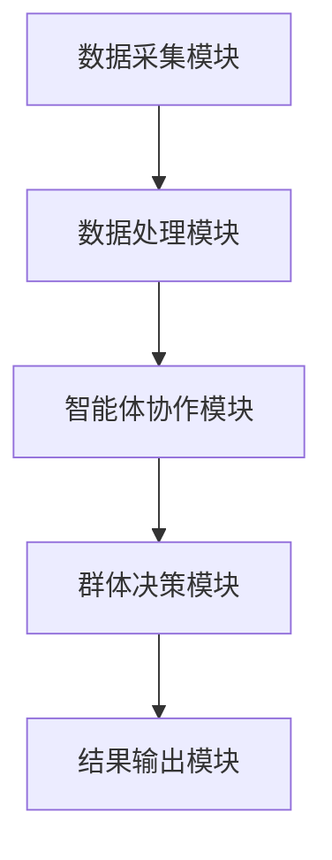

                 


# 智能体群体智慧在识别价值陷阱中的应用：避免投资误区

> 关键词：智能体群体智慧、价值陷阱、投资决策、分布式计算、群体决策算法

> 摘要：智能体群体智慧是一种利用多个智能体协作来解决复杂问题的方法。在投资领域，智能体群体智慧能够有效识别价值陷阱，帮助投资者避免误区。本文将详细探讨智能体群体智慧的核心概念、算法实现、系统架构设计以及在投资中的应用案例，通过实际案例分析和代码实现，展示智能体群体智慧在识别价值陷阱中的优势。

---

## 第1章：智能体群体智慧概述

### 1.1 智能体的基本概念

#### 1.1.1 智能体的定义与特征

智能体（Agent）是一种能够感知环境并采取行动以实现目标的实体。智能体可以是软件程序、机器人或其他自主系统，具备以下特征：
- **自主性**：智能体能够独立决策和行动。
- **反应性**：智能体能够感知环境并做出实时反应。
- **协作性**：智能体可以与其他智能体协作完成任务。
- **学习能力**：智能体能够通过经验改进自身性能。

#### 1.1.2 群体智能的基本原理

群体智能（Swarm Intelligence）是指多个智能体通过协作完成复杂任务的现象。其核心在于个体之间的简单交互能够产生复杂的群体行为。群体智能的关键特征包括：
- **去中心化**：群体智能没有中央控制机构，个体之间通过局部交互完成任务。
- **涌现性**：群体智能的行为是通过个体简单规则的相互作用自然产生的。
- **鲁棒性**：群体智能在部分个体失效时仍能保持整体功能。

### 1.2 智能体在投资中的应用

#### 1.2.1 投资中的信息不对称问题

投资领域存在大量信息不对称问题，投资者需要依赖数据和分析来做出决策。智能体群体智慧能够通过分布式计算和协作学习，帮助投资者更全面地理解和分析市场信息。

#### 1.2.2 智能体在投资决策中的作用

智能体可以在投资决策中扮演多种角色：
- **数据收集与处理**：智能体能够实时收集市场数据，并进行预处理和特征提取。
- **分布式计算**：通过多个智能体的协作，实现复杂的投资模型计算。
- **风险评估与预警**：智能体能够通过群体决策算法识别潜在风险，帮助投资者避免价值陷阱。

### 1.3 价值陷阱的定义与特征

#### 1.3.1 价值陷阱的定义

价值陷阱是指那些表面上看似具有投资价值，实则存在隐藏问题或风险的资产或公司。投资者如果未能识别这些陷阱，可能会导致重大损失。

#### 1.3.2 价值陷阱的常见类型

价值陷阱可以分为以下几种类型：
- **财务造假**：公司通过虚假财务报告掩盖实际经营状况。
- **行业周期性**：行业处于下行周期，公司短期内看似估值合理，但长期前景不佳。
- **管理层问题**：公司管理层存在严重问题，影响公司长期发展。

#### 1.3.3 价值陷阱的识别挑战

识别价值陷阱的挑战包括：
- **信息不透明**：公司可能隐藏负面信息或夸大正面信息。
- **复杂性**：价值陷阱的识别需要综合分析多个因素，包括财务数据、行业趋势、管理层能力等。
- **动态变化**：市场环境和公司状况不断变化，增加了识别的难度。

### 1.4 智能体群体智慧的核心优势

#### 1.4.1 高效性

智能体群体智慧通过分布式计算和协作学习，能够快速处理大量数据，提高投资决策的效率。

#### 1.4.2 分布式决策

智能体群体智慧采用去中心化的决策方式，避免了单点故障，提高了系统的鲁棒性。

#### 1.4.3 多维度数据处理

智能体群体智慧能够整合多个数据源的信息，进行全面分析，帮助投资者更全面地识别价值陷阱。

---

## 第2章：智能体群体智慧的理论基础

### 2.1 群体智能的基本原理

#### 2.1.1 群体智能的数学模型

群体智能的数学模型可以通过以下步骤构建：
1. **个体行为建模**：定义每个智能体的行为规则，例如趋近中心、远离障碍等。
2. **群体行为建模**：通过个体行为的组合，模拟群体的总体行为。
3. **目标函数定义**：定义群体行为的优化目标，例如寻找目标位置。

#### 2.1.2 群体智能的算法基础

常见的群体智能算法包括：
- **粒子群优化（PSO）**：通过粒子的运动寻找全局最优解。
- **蚂蚁算法（ACO）**：模拟蚂蚁觅食过程，解决路径优化问题。
- **鱼群算法（FSA）**：模拟鱼群的运动规律，解决优化问题。

#### 2.1.3 价值陷阱识别的理论框架

价值陷阱识别的理论框架可以通过以下步骤构建：
1. **数据预处理**：对市场数据进行清洗和特征提取。
2. **群体决策模型**：利用群体智能算法对多个智能体的决策进行整合。
3. **风险评估**：根据群体决策结果，评估投资标的的风险等级。

### 2.2 智能体的通信与协作机制

#### 2.2.1 智能体之间的通信协议

智能体之间的通信协议需要满足以下要求：
- **高效性**：确保智能体之间的通信快速且低延迟。
- **安全性**：防止恶意攻击和信息泄露。
- **兼容性**：支持多种智能体类型和通信方式。

#### 2.2.2 分布式决策算法

分布式决策算法可以通过以下步骤实现：
1. **任务分配**：将决策任务分解为多个子任务，分配给不同的智能体。
2. **局部决策**：每个智能体根据自己的信息做出局部决策。
3. **全局整合**：将局部决策结果整合，形成全局决策。

### 2.3 价值陷阱识别的理论框架

#### 2.3.1 价值陷阱的识别模型

价值陷阱识别模型可以通过以下步骤构建：
1. **数据收集**：收集目标公司的财务数据、行业信息、管理层背景等。
2. **特征提取**：提取关键特征，例如财务指标、行业趋势、管理层能力等。
3. **群体决策**：利用群体智能算法对多个特征进行综合评估，识别潜在的价值陷阱。

#### 2.3.2 智能体群体智慧在模型中的应用

智能体群体智慧在价值陷阱识别中的应用包括：
- **分布式计算**：利用多个智能体协作完成复杂的数据分析任务。
- **群体决策**：通过群体决策算法整合多个智能体的决策结果，提高识别的准确性。

---

## 第3章：智能体群体智慧的算法实现

### 3.1 分布式计算与智能体协作

#### 3.1.1 分布式计算的基本原理

分布式计算是指将计算任务分配到多个计算节点上，通过协作完成任务。其基本原理包括：
- **任务分解**：将整体任务分解为多个子任务。
- **任务分配**：将子任务分配给不同的计算节点。
- **结果整合**：将各节点的计算结果整合，形成最终结果。

#### 3.1.2 智能体协作的实现方法

智能体协作的实现方法包括：
- **基于消息传递的协作**：通过消息传递实现智能体之间的协作。
- **基于共享内存的协作**：通过共享内存实现智能体之间的协作。
- **基于分布式数据库的协作**：通过分布式数据库实现智能体之间的协作。

### 3.2 群体决策算法

#### 3.2.1 基于投票的群体决策

基于投票的群体决策是一种简单有效的群体决策方法。其实现步骤如下：
1. **收集决策**：每个智能体根据自己的信息做出决策。
2. **投票统计**：统计各个决策的票数。
3. **结果确定**：根据投票结果确定最终决策。

#### 3.2.2 基于共识的群体决策

基于共识的群体决策是一种更复杂的群体决策方法。其实现步骤如下：
1. **初始决策**：每个智能体提出自己的决策。
2. **协商与调整**：智能体之间通过协商和调整，逐步趋同。
3. **达成共识**：当所有智能体达成一致时，确定最终决策。

### 3.3 价值陷阱识别的算法设计

#### 3.3.1 数据预处理与特征提取

数据预处理包括：
- **数据清洗**：去除无效数据和异常值。
- **数据标准化**：将数据标准化到统一的范围。

特征提取包括：
- **财务指标提取**：提取如净利润率、资产负债率等财务指标。
- **行业趋势提取**：提取行业的发展趋势和竞争状况。
- **管理层能力提取**：提取管理层的背景和历史表现。

#### 3.3.2 群体智慧算法的实现步骤

群体智慧算法的实现步骤包括：
1. **智能体初始化**：为每个智能体分配初始状态和任务。
2. **局部计算**：每个智能体根据自己的数据进行局部计算。
3. **信息共享**：智能体之间共享计算结果和信息。
4. **全局决策**：通过群体决策算法整合局部结果，形成最终决策。

### 3.4 算法实现的代码示例

#### 3.4.1 Python实现的分布式计算示例

```python
import threading

# 定义智能体类
class Agent:
    def __init__(self, id, data):
        self.id = id
        self.data = data
        self.result = None

    def process(self):
        # 局部计算
        self.result = sum(self.data) / len(self.data)

# 创建多个智能体
agents = [Agent(i, [i*2, i*3]) for i in range(4)]

# 定义任务完成信号
class TaskCompletionSignal:
    def __init__(self):
        self.count = 0
        self.lock = threading.Lock()

# 定义线程函数
def thread_func(agent, signal):
    agent.process()
    with signal.lock:
        signal.count += 1
        if signal.count == len(agents):
            print("所有智能体完成计算，结果汇总开始。")

# 启动线程
signal = TaskCompletionSignal()
threads = [threading.Thread(target=thread_func, args=(agent, signal)) for agent in agents]
for thread in threads:
    thread.start()

# 等待所有线程完成
for thread in threads:
    thread.join()

# 汇总结果
total_result = 0
for agent in agents:
    total_result += agent.result
average_result = total_result / len(agents)
print(f"最终结果：{average_result}")
```

#### 3.4.2 群体决策算法的代码实现

```python
import random

# 定义群体决策算法类
class SwarmIntelligence:
    def __init__(self, population, max_iterations=100):
        self.population = population  # 群体规模
        self.max_iterations = max_iterations  # 最大迭代次数

    def vote(self, candidates):
        # 基于投票的群体决策
        vote_count = {}
        for _ in range(self.population):
            # 每个个体随机选择一个候选
            candidate = random.choice(candidates)
            if candidate in vote_count:
                vote_count[candidate] += 1
            else:
                vote_count[candidate] = 1
        # 找出得票最多的候选
        max_votes = max(vote_count.values())
        winners = [candidate for candidate, count in vote_count.items() if count == max_votes]
        return winners

# 示例用法
si = SwarmIntelligence(10)
candidates = ['A', 'B', 'C', 'D']
winners = si.vote(candidates)
print(f"胜出者：{winners}")
```

---

## 第4章：智能体群体智慧的系统架构

### 4.1 系统整体架构设计

#### 4.1.1 系统模块划分

智能体群体智慧系统的模块划分包括：
- **数据采集模块**：负责收集市场数据。
- **数据处理模块**：负责数据的清洗和特征提取。
- **智能体协作模块**：负责智能体之间的协作和通信。
- **群体决策模块**：负责基于群体决策算法做出最终决策。
- **结果输出模块**：负责输出决策结果和相关分析报告。

#### 4.1.2 系统功能设计

系统功能设计包括：
- **数据采集**：实时采集股票、行业、公司等多源数据。
- **数据处理**：对数据进行清洗、标准化和特征提取。
- **智能体协作**：通过智能体之间的协作完成复杂的投资分析任务。
- **群体决策**：基于群体决策算法做出最终的投资决策。
- **结果输出**：输出决策结果、分析报告和风险预警。

#### 4.1.3 系统架构图



### 4.2 系统通信与接口设计

#### 4.2.1 智能体之间的通信接口

智能体之间的通信接口需要支持以下功能：
- **消息传递**：智能体之间通过消息传递共享数据和信息。
- **任务分配**：通过接口分配任务和协调计算。
- **结果汇总**：通过接口汇总各个智能体的计算结果。

#### 4.2.2 系统与外部数据源的接口

系统与外部数据源的接口需要支持：
- **数据订阅**：订阅实时市场数据。
- **数据查询**：查询历史数据和相关分析报告。
- **数据更新**：更新数据源和接口信息。

### 4.3 系统的可扩展性设计

#### 4.3.1 模块化设计

系统的模块化设计可以通过以下方式实现：
- **模块独立性**：每个模块的功能相对独立，便于单独开发和维护。
- **模块接口标准化**：通过标准化的接口实现模块之间的通信和协作。

#### 4.3.2 系统的扩展性实现

系统的扩展性可以通过以下方式实现：
- **动态加载模块**：支持动态加载新的模块和功能。
- **模块配置管理**：通过配置管理实现模块的灵活组合和扩展。

---

## 第5章：智能体群体智慧在投资中的应用案例

### 5.1 案例背景介绍

#### 5.1.1 案例选择的依据

案例选择的依据包括：
- **典型性**：案例能够典型体现智能体群体智慧的优势。
- **实用性**：案例具有实际投资价值和应用潜力。
- **可分析性**：案例数据丰富，便于分析和验证。

#### 5.1.2 案例的具体情况

案例的具体情况包括：
- **公司背景**：目标公司的行业、规模、财务状况等。
- **投资目标**：识别潜在的价值陷阱，避免投资误区。
- **数据来源**：包括财务数据、市场数据、行业报告等。

### 5.2 案例分析与实现

#### 5.2.1 数据收集与处理

数据收集与处理的步骤包括：
1. **数据采集**：通过多种数据源采集相关数据。
2. **数据清洗**：去除无效数据和异常值。
3. **特征提取**：提取关键特征，如财务指标、行业趋势等。

#### 5.2.2 智能体群体智慧的应用过程

智能体群体智慧的应用过程包括：
1. **任务分配**：将投资分析任务分配给多个智能体。
2. **局部计算**：每个智能体根据自己的数据进行局部分析。
3. **信息共享**：智能体之间共享计算结果和相关信息。
4. **群体决策**：通过群体决策算法整合局部结果，形成最终决策。

### 5.3 案例结果与分析

#### 5.3.1 实验结果展示

实验结果展示包括：
- **计算结果**：智能体群体智慧的计算结果和传统方法的对比。
- **识别准确率**：价值陷阱识别的准确率和误识别率。
- **决策效率**：智能体群体智慧的决策效率和传统方法的对比。

#### 5.3.2 结果分析与总结

结果分析与总结包括：
- **优势分析**：智能体群体智慧在识别价值陷阱中的优势。
- **问题与不足**：当前方法的局限性和改进方向。
- **经验总结**：总结智能体群体智慧在投资中的应用经验。

---

## 第6章：系统实现与优化

### 6.1 系统实现的详细步骤

#### 6.1.1 环境搭建

环境搭建的步骤包括：
1. **安装Python**：安装Python编程环境。
2. **安装依赖库**：安装必要的第三方库，如`threading`、`random`等。
3. **配置开发环境**：配置适合的开发环境，如PyCharm、Jupyter Notebook等。

#### 6.1.2 系统核心实现

系统核心实现包括：
- **智能体类的实现**：定义智能体类，实现数据处理和局部计算功能。
- **群体决策算法的实现**：实现基于投票和共识的群体决策算法。
- **系统架构设计**：实现数据采集、处理、协作、决策和输出模块。

#### 6.1.3 系统功能测试

系统功能测试包括：
- **单元测试**：测试每个模块的功能是否正常。
- **集成测试**：测试系统整体功能是否协同工作。
- **性能测试**：测试系统的处理能力和效率。

### 6.2 系统优化与性能提升

#### 6.2.1 系统优化策略

系统优化策略包括：
- **算法优化**：优化群体决策算法的效率和准确性。
- **通信优化**：优化智能体之间的通信效率，减少延迟。
- **资源优化**：优化系统资源的利用，减少浪费。

#### 6.2.2 优化效果分析

优化效果分析包括：
- **计算效率提升**：系统处理速度和效率的提升。
- **识别准确率提高**：价值陷阱识别准确率的提高。
- **资源利用率优化**：系统资源利用率的提升。

### 6.3 系统的测试与验证

#### 6.3.1 测试方法

系统的测试方法包括：
- **黑盒测试**：测试系统的外部功能和接口。
- **白盒测试**：测试系统的内部结构和逻辑。
- **性能测试**：测试系统的处理能力和效率。

#### 6.3.2 测试结果分析

测试结果分析包括：
- **功能测试结果**：系统功能是否正常实现。
- **性能测试结果**：系统的处理能力和效率是否达到预期。
- **用户体验测试结果**：系统的用户友好性和易用性。

---

## 第7章：总结与展望

### 7.1 总结

智能体群体智慧是一种高效的投资决策方法，通过分布式计算和群体决策算法，能够有效识别价值陷阱，帮助投资者避免投资误区。本文通过详细探讨智能体群体智慧的核心概念、算法实现、系统架构设计以及在投资中的应用案例，展示了智能体群体智慧在识别价值陷阱中的优势。

### 7.2 展望

未来，智能体群体智慧在投资中的应用将更加广泛和深入。随着技术的进步，智能体群体智慧将更加智能化和自动化，能够更好地应对复杂的投资环境和挑战。同时，智能体群体智慧与其他技术的结合也将进一步提升其在投资中的应用效果。

---

## 作者：AI天才研究院/AI Genius Institute & 禅与计算机程序设计艺术 /Zen And The Art of Computer Programming

