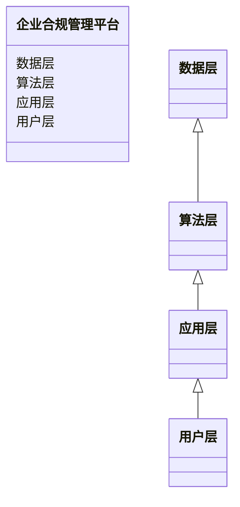
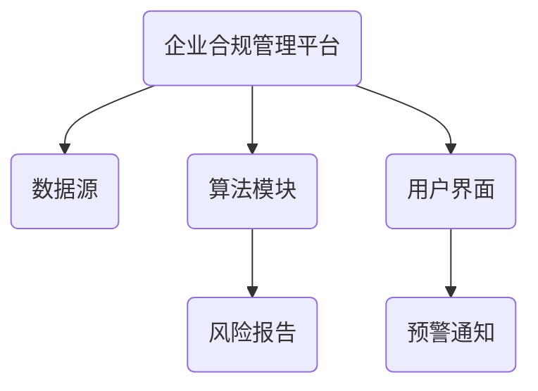
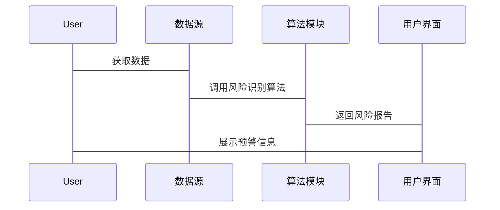

                 


# 构建智能企业合规管理平台：AI辅助风险识别

> 关键词：企业合规、AI、风险识别、机器学习、企业架构

> 摘要：随着企业数字化转型的深入，合规管理的重要性日益凸显。本文将探讨如何利用人工智能技术构建智能企业合规管理平台，特别是在风险识别领域的应用。通过分析AI在企业合规管理中的作用，结合具体案例和算法原理，阐述如何通过智能化手段提升企业合规管理效率和准确性。

---

# 第一部分: 背景介绍

## 第1章: 企业合规管理的背景介绍

### 1.1 企业合规管理的核心概念

企业合规管理是指企业为了遵守相关法律法规、行业标准及企业内部规章制度，确保经营行为合法、合规而进行的一系列管理活动。合规管理涉及企业战略、财务、法律、人力资源、信息技术等多个方面，是企业稳健运营的重要保障。

#### 1.1.1 合规管理的关键要素

- **法律合规**：确保企业行为符合国家法律法规。
- **行业标准**：遵循行业内的通用规范。
- **企业内部制度**：执行企业内部的规章制度。
- **风险管理**：识别、评估和应对合规风险。
- **合规文化建设**：培养全员合规意识。

#### 1.1.2 企业合规管理的现状

随着全球化和数字化的深入发展，企业面临的合规挑战日益复杂。传统合规管理依赖人工操作，存在效率低、覆盖面有限、难以实时监控等问题。特别是在数据量庞大、业务流程复杂的大型企业中，传统合规管理难以满足现代化需求。

#### 1.1.3 合规管理中的主要问题与挑战

- **数据分散**：企业数据分布在不同系统中，难以统一管理。
- **实时性不足**：传统合规管理难以实现实时监控和快速响应。
- **人工依赖**：大量依赖人工审查，效率低下且容易出错。
- **复杂性增加**：法律法规不断更新，合规要求日益复杂。
- **技术支撑不足**：缺乏智能化工具辅助合规管理。

---

### 1.2 AI在企业合规管理中的作用

人工智能技术的快速发展为企业合规管理提供了新的解决方案。AI能够通过自动化处理、智能分析和实时监控，显著提升合规管理的效率和准确性。

#### 1.2.1 AI技术在合规管理中的应用领域

- **风险识别**：通过AI算法分析企业数据，识别潜在的合规风险。
- **自动审核**：利用自然语言处理技术自动审查合同、文档，确保合规性。
- **实时监控**：通过机器学习模型实时监控企业行为，发现异常情况。
- **预测分析**：基于历史数据预测未来的合规风险，提前制定应对策略。

#### 1.2.2 AI辅助合规管理的优势

- **高效性**：AI能够快速处理大量数据，显著提高合规管理效率。
- **准确性**：通过算法分析，减少人为错误，提升合规判断的准确性。
- **实时性**：AI能够实时监控企业行为，及时发现和处理问题。
- **灵活性**：AI系统可以根据企业需求快速调整，适应不同场景。

#### 1.2.3 AI在合规管理中的潜在风险与应对

- **数据隐私问题**：AI系统需要处理大量敏感数据，需严格控制数据访问权限，确保数据安全。
- **算法偏见**：AI模型可能存在算法偏见，需定期检查和优化模型。
- **技术依赖**：过度依赖AI可能导致对人工审查的忽视，需建立人机结合的机制。

---

### 1.3 本章小结

企业合规管理是企业稳健发展的基石，但传统合规管理方式存在效率低、覆盖面有限等问题。AI技术的引入为合规管理带来了新的可能性，特别是在风险识别、自动审核和实时监控等方面展现出显著优势。然而，AI的应用也带来了数据隐私、算法偏见等挑战，需要企业在实践中加以应对。

---

# 第二部分: AI辅助风险识别的核心概念

## 第2章: 智能企业合规管理平台的定义与架构

### 2.1 智能企业合规管理平台的定义

智能企业合规管理平台是指利用人工智能技术构建的智能化系统，通过自动化处理、智能分析和实时监控，帮助企业识别、评估和应对合规风险，确保企业行为合法合规。

#### 2.1.1 平台的核心功能

- **风险识别**：通过AI算法分析企业数据，识别潜在的合规风险。
- **自动审核**：利用自然语言处理技术自动审查合同、文档，确保合规性。
- **实时监控**：通过机器学习模型实时监控企业行为，发现异常情况。
- **预测分析**：基于历史数据预测未来的合规风险，提前制定应对策略。

#### 2.1.2 平台的目标用户与适用场景

- **目标用户**：企业法务部门、合规部门、风险管理部门等。
- **适用场景**：企业内部合规审查、合同管理、风险管理、数据安全等。

---

### 2.2 AI辅助风险识别的原理

AI辅助风险识别是通过机器学习、自然语言处理等技术，对企业数据进行分析，识别潜在风险，并生成相应的预警和应对策略。

#### 2.2.1 风险识别的基本流程

1. **数据收集**：从企业内部系统中收集相关数据，包括财务数据、合同文本、业务流程数据等。
2. **数据预处理**：清洗数据，去除噪声，提取特征。
3. **模型训练**：利用机器学习算法训练风险识别模型。
4. **风险识别**：通过模型对数据进行分析，识别潜在风险。
5. **结果输出**：生成风险报告，提供预警和应对建议。

#### 2.2.2 AI在风险识别中的具体应用

- **合同风险识别**：通过自然语言处理技术分析合同文本，识别潜在的法律风险。
- **财务风险识别**：通过机器学习模型分析财务数据，识别财务异常情况。
- **合规风险预测**：基于历史数据，预测未来的合规风险。

#### 2.2.3 AI算法在风险识别中的作用

- **特征提取**：通过算法提取数据中的关键特征，为风险识别提供依据。
- **模式识别**：识别数据中的模式和趋势，发现潜在风险。
- **分类与预测**：利用分类算法对风险进行分类，预测未来的风险情况。

---

### 2.3 平台的架构设计

智能企业合规管理平台的架构设计需要考虑系统的可扩展性、灵活性和高效性。

#### 2.3.1 平台的整体架构

1. **数据层**：包括企业内部数据源、外部数据源等。
2. **算法层**：包括机器学习模型、自然语言处理模型等。
3. **应用层**：包括风险识别模块、自动审核模块等。
4. **用户层**：包括用户界面、预警通知等。

#### 2.3.2 数据流与信息处理流程

1. **数据收集**：从企业内部系统中收集相关数据。
2. **数据预处理**：清洗数据，提取特征。
3. **模型训练**：利用机器学习算法训练风险识别模型。
4. **风险识别**：通过模型对数据进行分析，识别潜在风险。
5. **结果输出**：生成风险报告，提供预警和应对建议。

#### 2.3.3 系统的可扩展性与灵活性

- **模块化设计**：系统模块化设计，便于功能扩展。
- **接口标准化**：系统接口标准化，便于与其他系统集成。
- **动态调整**：系统能够根据企业需求动态调整功能模块。

---

### 2.4 本章小结

智能企业合规管理平台通过AI技术实现了对企业合规管理的智能化支持。本文详细介绍了平台的核心功能、目标用户、风险识别的原理和平台的架构设计，为后续章节的深入分析奠定了基础。

---

# 第三部分: AI辅助风险识别的算法原理

## 第3章: 基于AI的风险识别算法

### 3.1 常见的AI算法概述

#### 3.1.1 机器学习算法

- **监督学习**：用于分类和回归问题。
- **无监督学习**：用于聚类和降维问题。
- **半监督学习**：结合监督学习和无监督学习。

#### 3.1.2 深度学习算法

- **神经网络**：包括卷积神经网络（CNN）、循环神经网络（RNN）等。
- **深度学习框架**：如TensorFlow、Keras等。

#### 3.1.3 自然语言处理算法

- **文本分类**：用于文本主题分类。
- **信息抽取**：用于从文本中提取关键信息。
- **情感分析**：用于分析文本情感倾向。

---

### 3.2 风险识别的算法选择与优化

#### 3.2.1 算法选择的原则

- **任务需求**：根据具体任务选择合适的算法。
- **数据特性**：考虑数据的规模、维度和分布。
- **计算资源**：考虑算法的计算复杂度和资源需求。

#### 3.2.2 算法优化的关键点

- **特征工程**：通过特征选择和特征提取提升模型性能。
- **模型调参**：通过网格搜索等方法优化模型参数。
- **模型集成**：通过集成学习提升模型的泛化能力。

#### 3.2.3 算法评估与性能分析

- **评估指标**：准确率、召回率、F1分数等。
- **性能优化**：通过交叉验证等方法优化模型性能。

---

### 3.3 基于AI的风险识别流程

#### 3.3.1 数据预处理

```python
import pandas as pd
import numpy as np

# 数据加载
data = pd.read_csv('risk_data.csv')

# 数据清洗
data = data.dropna()
data = data.replace({np.nan: 0})

# 特征提取
features = data[['feature1', 'feature2', 'feature3']]
target = data['target']
```

#### 3.3.2 模型训练与评估

```python
from sklearn.model import LogisticRegression

# 模型训练
model = LogisticRegression()
model.fit(features, target)

# 模型预测
predictions = model.predict(features)
```

---

### 3.4 本章小结

本文介绍了常见AI算法及其在风险识别中的应用，讨论了算法选择和优化的关键点，并详细讲解了基于AI的风险识别流程。通过这些算法和流程，企业可以更高效地识别和应对合规风险。

---

# 第四部分: 系统分析与架构设计

## 第4章: 企业合规管理平台的系统分析

### 4.1 问题场景介绍

企业合规管理平台需要解决以下问题：

- **数据分散**：企业数据分布在不同系统中，难以统一管理。
- **实时性不足**：传统合规管理难以实现实时监控和快速响应。
- **人工依赖**：大量依赖人工审查，效率低下且容易出错。

---

### 4.2 系统功能设计

#### 4.2.1 领域模型设计



---

### 4.3 系统架构设计

#### 4.3.1 系统架构图



---

### 4.4 系统接口设计

- **数据接口**：与企业内部系统对接，获取相关数据。
- **算法接口**：与AI算法模块对接，调用风险识别算法。
- **用户接口**：提供用户界面，展示风险报告和预警信息。

---

### 4.5 系统交互设计



---

### 4.6 本章小结

本文详细分析了企业合规管理平台的系统架构设计，包括领域模型设计、系统架构图、接口设计和交互设计。通过这些设计，企业可以构建一个高效、智能的合规管理平台。

---

# 第五部分: 项目实战

## 第5章: 企业合规管理平台的实现

### 5.1 环境安装

```bash
# 安装Python库
pip install numpy pandas scikit-learn
```

### 5.2 核心代码实现

#### 5.2.1 数据预处理

```python
import pandas as pd
import numpy as np

# 数据加载
data = pd.read_csv('risk_data.csv')

# 数据清洗
data = data.dropna()
data = data.replace({np.nan: 0})

# 特征提取
features = data[['feature1', 'feature2', 'feature3']]
target = data['target']
```

#### 5.2.2 模型训练

```python
from sklearn.model import LogisticRegression

# 模型训练
model = LogisticRegression()
model.fit(features, target)

# 模型预测
predictions = model.predict(features)
```

### 5.3 案例分析与详细解读

#### 5.3.1 案例分析

假设我们有一个企业合同文本数据集，需要识别合同中的法律风险。通过自然语言处理技术，我们可以自动提取合同中的关键条款，识别潜在的法律风险，并生成风险报告。

#### 5.3.2 代码应用解读与分析

```python
import pandas as pd
from sklearn.model import LogisticRegression

# 数据加载
data = pd.read_csv('contract_risk.csv')

# 数据清洗
data = data.dropna()
data = data.replace({np.nan: 0})

# 特征提取
features = data[['clause1', 'clause2', 'clause3']]
target = data['risk_level']

# 模型训练
model = LogisticRegression()
model.fit(features, target)

# 模型预测
predictions = model.predict(features)
```

### 5.4 项目小结

通过本章的实战，我们详细讲解了企业合规管理平台的核心代码实现和案例分析，展示了如何利用AI技术实现风险识别和合规管理。

---

# 第六部分: 总结与展望

## 第6章: 总结与展望

### 6.1 最佳实践 Tips

- **数据质量管理**：确保数据的准确性和完整性。
- **算法选择与优化**：根据具体任务选择合适的算法，并进行参数调优。
- **系统集成与扩展**：系统设计应模块化，便于功能扩展和与其他系统的集成。

### 6.2 本章小结

本文详细探讨了智能企业合规管理平台的构建过程，从背景介绍到算法原理，再到系统架构设计和项目实战，为读者提供了全面的指导。通过AI技术的应用，企业可以显著提升合规管理的效率和准确性。

### 6.3 注意事项

- **数据隐私保护**：在处理企业数据时，需严格遵守数据隐私保护法规。
- **模型解释性**：确保AI模型的可解释性，便于企业理解和信任。
- **持续优化**：定期更新模型和系统，适应法律法规和企业需求的变化。

### 6.4 拓展阅读

- **《机器学习实战》**：深入理解机器学习算法及其应用。
- **《深度学习》**：学习深度学习技术及其在各个领域的应用。
- **《自然语言处理入门》**：掌握自然语言处理技术及其在文本分析中的应用。

---

# 作者：AI天才研究院/AI Genius Institute & 禅与计算机程序设计艺术 /Zen And The Art of Computer Programming

