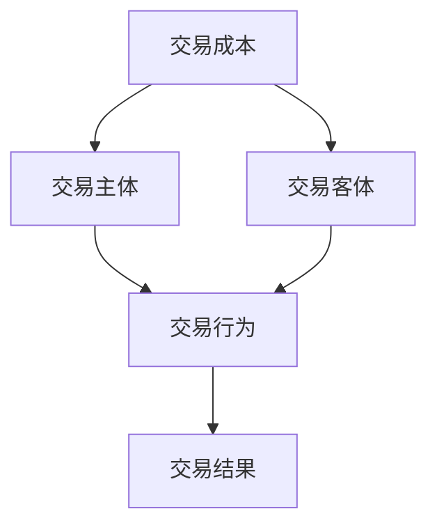
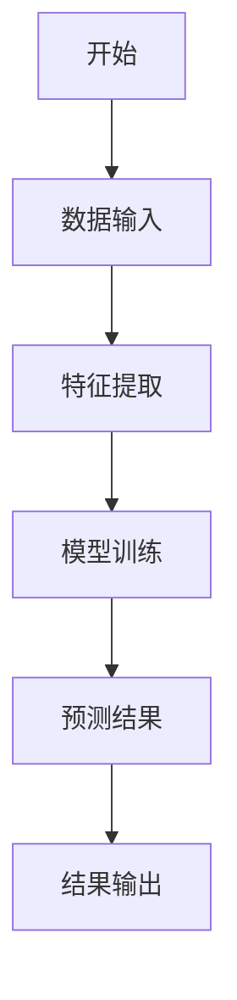
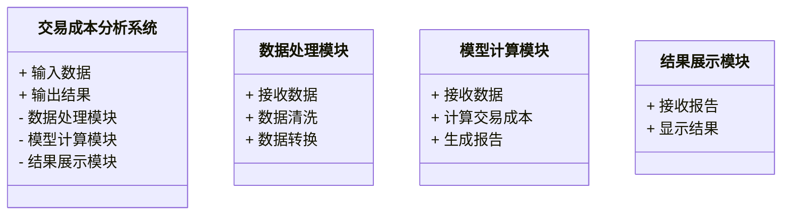
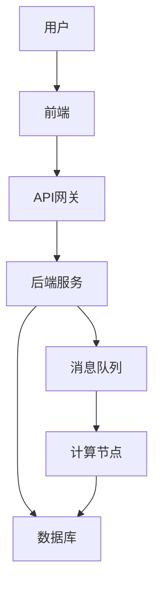
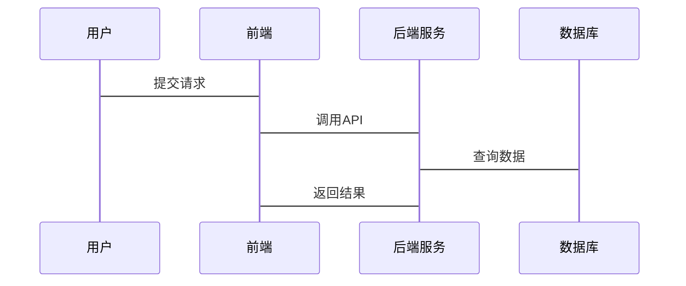

                 


# 金融市场交易成本分析与控制

> 关键词：交易成本，金融市场，系统架构，算法原理，交易策略

> 摘要：本文系统地分析了金融市场交易成本的构成、影响因素及其控制策略。通过介绍交易成本的核心概念、算法原理、系统架构设计和实际案例，本文为金融交易者和系统设计者提供了深入的理论支持和实践指导。文章还探讨了交易成本与市场效率的关系，提出了优化交易成本的实用方法。

---

# 第1章: 金融市场交易成本概述

## 1.1 交易成本的定义与分类

### 1.1.1 交易成本的定义

交易成本是指在金融市场上进行资产买卖过程中产生的各种费用和损耗，包括显性成本和隐性成本。显性成本通常指佣金、税费等可以直接量化的费用，而隐性成本则包括由于市场冲击、买卖价差等难以直接量化的损失。

$$ \text{交易成本} = \text{显性成本} + \text{隐性成本} $$

### 1.1.2 交易成本的主要分类

交易成本可以从不同的角度进行分类：

1. **按交易类型分类**：
   - 股票交易成本
   - 债券交易成本
   - 衍生品交易成本

2. **按成本性质分类**：
   - 固定成本：如佣金
   - 变动成本：如买卖价差

3. **按时间维度分类**：
   - 短期交易成本
   - 长期交易成本

### 1.1.3 交易成本与市场效率的关系

市场效率是指市场将信息转化为价格的速度和能力。交易成本过高会降低市场效率，因为高成本会阻碍信息的流通和价格的调整。因此，优化交易成本是提高市场效率的重要手段。

---

## 1.2 交易成本的影响因素

### 1.2.1 市场结构对交易成本的影响

金融市场的结构直接影响交易成本。例如，场内交易和场外交易的成本差异较大，场内交易通常成本较低，因为有集中市场和做市商的存在。

### 1.2.2 交易规模与成本的关系

交易规模越大，单位交易成本通常越低。例如，大额交易可以通过协商获得更好的价格，而小额交易可能面临更高的买卖价差。

### 1.2.3 交易频率与成本的关联

高频交易虽然可以降低信息不对称带来的成本，但高频交易本身也会产生较高的交易费用，如数据处理费用和网络延迟成本。

---

## 1.3 交易成本分析的理论基础

### 1.3.1 Modigliani-Miller定理

Modigliani-Miller定理指出，在完全市场中，公司的资本结构不会影响其价值，因为债务和股权的成本会自动调整以抵消杠杆效应带来的收益。

$$ V_L = V_U + D - D \times (1 - T_c) $$

其中，\( V_L \) 是杠杆公司的价值，\( V_U \) 是无杠杆公司的价值，\( D \) 是债务，\( T_c \) 是公司所得税率。

### 1.3.2 委托-代理理论

委托-代理理论指出，投资者（委托人）将资金委托给专业经理人（代理人）管理时，会产生代理成本。代理成本包括监督成本和剩余损失。

### 1.3.3 交易成本与资产定价的关系

交易成本会影响资产的定价。例如，高交易成本可能导致资产的需求减少，从而压低其价格。

---

## 1.4 交易成本与市场效率的平衡

### 1.4.1 市场效率的定义与衡量

市场效率可以通过信息传播速度、价格发现能力等指标衡量。高效率的市场能够快速反映新信息，降低交易成本。

### 1.4.2 交易成本对市场效率的影响

高交易成本会降低市场流动性，进而影响市场效率。例如，买卖价差过大可能导致市场参与者减少，降低市场的流动性。

### 1.4.3 如何在交易成本与市场效率之间寻求平衡

通过技术创新（如高频交易技术）和市场结构优化（如引入做市商制度），可以在降低交易成本的同时提高市场效率。

---

## 1.5 本章小结

本章介绍了交易成本的定义、分类及其影响因素，分析了交易成本与市场效率的关系，并提出了在两者之间寻求平衡的思路。

---

# 第2章: 交易成本的核心概念与联系

## 2.1 交易成本的核心构成

### 2.1.1 交易费用

交易费用包括佣金、税费等直接费用。

$$ \text{交易费用} = \text{佣金} + \text{税费} $$

### 2.1.2 信息成本

信息成本是指获取和处理市场信息的成本，包括数据订阅费和分析人员工资。

### 2.1.3 监管成本

监管成本是指遵守相关法律法规所产生的费用，包括合规审计费用。

---

## 2.2 交易成本的类型对比

### 2.2.1 直接成本与间接成本

| 类别 | 定义 | 示例 |
|------|------|------|
| 直接成本 | 与交易直接相关的费用 | 佣金、税费 |
| 间接成本 | 与交易相关的其他费用 | 数据处理费用、网络延迟成本 |

### 2.2.2 固定成本与可变成本

| 类别 | 定义 | 示例 |
|------|------|------|
| 固定成本 | 不随交易量变化的费用 | 佣金 |
| 可变成本 | 随交易量变化的费用 | 买卖价差 |

### 2.2.3 显性成本与隐性成本

| 类别 | 定义 | 示例 |
|------|------|------|
| 显性成本 | 可以直接量化的费用 | 佣金、税费 |
| 隐性成本 | 难以直接量化的损失 | 市场冲击、买卖价差 |

---

## 2.3 交易成本与收益的权衡

### 2.3.1 成本-收益分析框架

在进行交易决策时，交易者需要综合考虑成本和收益。例如，高频交易可以在短时间内获得收益，但同时也会产生较高的交易成本。

### 2.3.2 边际成本与边际收益的平衡

交易者应该在边际成本等于边际收益时停止交易，以实现收益最大化。

$$ \text{边际成本} = \text{边际收益} $$

### 2.3.3 成本异源性与收益的关系

成本异源性是指不同交易对手的成本差异。交易者应选择能够最小化成本异源性的交易策略。

---

## 2.4 交易成本的ER实体关系图



---

## 2.5 本章小结

本章详细分析了交易成本的核心构成、类型对比及其与收益的权衡，并通过ER实体关系图展示了交易成本的核心要素。

---

# 第3章: 交易成本分析的算法原理

## 3.1 交易成本分析的常用算法

### 3.1.1 最小二乘法

最小二乘法用于回归分析，可以用于预测资产价格和交易成本。

$$ \hat{y} = a + bx + e $$

其中，\( \hat{y} \) 是预测值，\( a \) 是截距，\( b \) 是斜率，\( x \) 是自变量，\( e \) 是误差项。

### 3.1.2 马科维茨均值-方差模型

马科维茨均值-方差模型用于优化投资组合的风险和收益。

$$ \min \sigma^2 \quad \text{s.t.} \quad \mu \geq r, \quad \mathbf{w}^T \mathbf{1} = 1 $$

其中，\( \sigma^2 \) 是方差，\( \mu \) 是期望收益，\( r \) 是目标收益，\( \mathbf{w} \) 是权重向量，\( \mathbf{1} \) 是全一向量。

### 3.1.3 时间序列分析法

时间序列分析法用于预测交易成本的变化趋势。

$$ ARIMA(p, d, q) $$

其中，\( p \) 是自回归阶数，\( d \) 是差分阶数，\( q \) 是移动平均阶数。

---

## 3.2 算法原理的mermaid流程图



---

## 3.3 算法实现与代码示例

### 3.3.1 最小二乘法的Python实现

```python
import numpy as np

# 输入数据
x = np.array([1, 2, 3, 4, 5])
y = np.array([2, 3, 5, 4, 6])

# 最小二乘法拟合
A = np.vstack([x, np.ones(len(x))])
beta = np.linalg.lstsq(A.T, y, rcond=None)[0]

# 回归方程
print(f"回归方程为：y = {beta[0]} * x + {beta[1]}")
```

### 3.3.2 马科维茨均值-方差模型的数学公式

$$ \min \sigma^2 \quad \text{s.t.} \quad \mathbf{w}^T \mathbf{\mu} \geq r, \quad \mathbf{w}^T \mathbf{1} = 1 $$

---

## 3.4 本章小结

本章介绍了交易成本分析的常用算法，包括最小二乘法、马科维茨均值-方差模型和时间序列分析法，并通过mermaid流程图和Python代码示例详细讲解了算法原理。

---

# 第4章: 交易成本分析的系统架构设计

## 4.1 交易成本分析的系统场景

交易成本分析系统需要处理大量的实时数据，包括价格、成交量、订单簿等信息。系统需要支持高频交易和大额交易，具备高效的计算能力和低延迟的处理能力。

---

## 4.2 系统功能设计

### 4.2.1 领域模型设计



---

## 4.3 系统架构设计



---

## 4.4 系统接口设计

系统接口设计包括数据接口、计算接口和展示接口。数据接口用于接收实时数据，计算接口用于调用交易成本分析算法，展示接口用于输出结果。

---

## 4.5 系统交互设计



---

## 4.6 本章小结

本章详细设计了交易成本分析系统的场景、功能、架构、接口和交互流程，为实际开发提供了参考。

---

# 第5章: 交易成本分析的项目实战

## 5.1 项目环境搭建

### 5.1.1 硬件环境

- CPU：多核处理器
- 内存：至少8GB
- 硬盘：高速SSD

### 5.1.2 软件环境

- 操作系统：Linux或Windows
- 开发工具：PyCharm或VS Code
- 数据库：MySQL或MongoDB
- 交易数据源：API接口或CSV文件

---

## 5.2 核心代码实现

### 5.2.1 数据处理模块

```python
import pandas as pd

# 读取CSV文件
df = pd.read_csv('交易数据.csv')

# 数据清洗
df.dropna(inplace=True)
df['时间'] = pd.to_datetime(df['时间'])
```

### 5.2.2 交易成本计算模块

```python
import numpy as np

# 计算买卖价差
df['买卖价差'] = df['买入价'] - df['卖出价']

# 计算平均交易成本
average_cost = df['买卖价差'].mean()
print(f"平均交易成本为：{average_cost}")
```

---

## 5.3 案例分析与解读

### 5.3.1 案例背景

假设我们有一个股票交易数据集，包括开盘价、收盘价、最高价、最低价和成交量。

### 5.3.2 数据分析

使用Python代码分析买卖价差和交易频率的关系。

```python
import matplotlib.pyplot as plt

# 绘制买卖价差分布图
plt.hist(df['买卖价差'], bins=20)
plt.title('买卖价差分布')
plt.xlabel('价差')
plt.ylabel('频数')
plt.show()
```

### 5.3.3 成本控制策略

根据数据分析结果，制定最优交易策略，例如选择低买卖价差的时间段进行交易。

---

## 5.4 本章小结

本章通过实际项目展示了交易成本分析的环境搭建、核心代码实现和案例分析，为读者提供了实践指导。

---

# 第6章: 交易成本分析的最佳实践

## 6.1 关键点总结

### 6.1.1 理论基础的重要性

理解交易成本的理论基础是优化交易成本的前提。

### 6.1.2 数据质量的影响

高质量的数据是准确分析交易成本的基础。

### 6.1.3 技术创新的作用

技术创新（如高频交易技术）是降低交易成本的重要手段。

---

## 6.2 小结

交易成本分析是一个复杂的系统工程，需要结合理论、算法和实际操作。通过不断优化交易策略和技术手段，可以有效降低交易成本，提高市场效率。

---

## 6.3 注意事项

- 数据隐私和安全问题
- 算法的可解释性和透明性
- 系统的稳定性和可靠性

---

## 6.4 拓展阅读

- 《金融市场与机构投资》
- 《算法交易：取胜秘诀与其对手》
- 《金融工程与风险管理》

---

## 6.5 本章小结

本章总结了交易成本分析的关键点，并提出了实际操作中的注意事项和拓展阅读方向。

---

# 附录

## 附录A: 数据来源与工具推荐

- 数据来源：金融数据API（如Yahoo Finance、Alpha Vantage）
- 开发工具：PyCharm、VS Code
- 可视化工具：Matplotlib、Seaborn
- 机器学习框架：Scikit-learn、TensorFlow

## 附录B: 交易成本计算的数学公式

$$ \text{总交易成本} = \sum_{i=1}^n \text{单笔交易成本}_i $$

---

# 作者：AI天才研究院 & 禅与计算机程序设计艺术

---

以上是《金融市场交易成本分析与控制》的完整目录和文章内容，涵盖从理论到实践的各个方面，结合了专业术语和实际案例，旨在为金融交易者和系统设计者提供深入的指导和启发。

