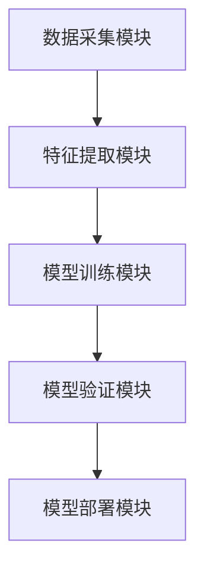

                 


# 《金融领域强化学习在多资产类别定价中的应用》

> 关键词：金融，强化学习，多资产定价，机器学习，资产配置，风险管理

> 摘要：本文系统地探讨了强化学习在金融领域多资产类别定价中的应用。首先介绍了强化学习的基本概念和金融定价的基本原理，然后深入分析了强化学习在多资产定价中的核心算法和数学模型。接着通过具体案例展示了如何设计和实现一个基于强化学习的多资产定价系统，并详细讨论了系统架构和实现细节。最后，本文总结了强化学习在金融定价中的优势和未来的发展方向。

---

# 第一部分: 金融领域强化学习背景与基础

# 第1章: 强化学习与金融定价概述

## 1.1 强化学习的基本概念

### 1.1.1 强化学习的定义与特点

强化学习（Reinforcement Learning，简称RL）是一种机器学习范式，通过智能体（agent）与环境（environment）之间的交互，学习如何做出决策以最大化累计奖励（reward）。与监督学习和无监督学习不同，强化学习的核心在于通过试错（trial-and-error）的方式，逐步优化决策策略。

**特点：**
- **自主性**：智能体通过与环境交互，自主学习决策策略。
- **延迟反馈**：奖励通常不是即时给出，而是基于长期行为的结果。
- **探索与利用**：智能体需要在探索新策略和利用已知好策略之间找到平衡。

### 1.1.2 强化学习的核心要素：状态、动作、奖励

- **状态（State）**：智能体所处环境的描述，通常用一个向量表示。
- **动作（Action）**：智能体在给定状态下做出的决策。
- **奖励（Reward）**：智能体采取某个动作后，环境给予的反馈，用于评估该动作的好坏。

### 1.1.3 强化学习与监督学习的区别

| 对比维度 | 强化学习 | 监督学习 |
|----------|----------|----------|
| 数据来源 | 环境反馈 | 标签数据 |
| 决策方式 | 自主决策 | 有标签指导 |
| 反馈机制 | 延迟反馈 | 即时反馈 |

## 1.2 金融领域中的定价问题

### 1.2.1 资产定价的基本概念

资产定价是指根据资产的风险、收益和市场供需关系，确定其市场价格的过程。常见的资产包括股票、债券、基金、房地产等。

### 1.2.2 多资产类别定价的复杂性

多资产定价涉及多个资产类别，每个资产的风险和收益特性不同，且资产之间可能存在相关性。传统的定价模型（如CAPM、APT）在多资产定价中往往难以捕捉复杂的动态关系。

### 1.2.3 强化学习在金融定价中的优势

- **非线性关系捕捉**：强化学习能够有效捕捉资产定价中的非线性关系。
- **动态适应性**：强化学习模型能够根据市场变化动态调整定价策略。
- **多目标优化**：强化学习可以同时优化多个目标（如收益、风险、流动性等）。

## 1.3 强化学习在金融中的应用现状

### 1.3.1 强化学习在金融交易中的应用

- **高频交易**：利用强化学习算法快速决策交易策略。
- **算法交易**：通过强化学习优化投资组合。

### 1.3.2 强化学习在资产配置中的应用

- **投资组合优化**：通过强化学习寻找最优资产配置。
- **风险控制**：利用强化学习模型实时监控和调整投资组合风险。

### 1.3.3 强化学习在风险管理中的应用

- **风险定价**：通过强化学习模型评估资产的信用风险、市场风险等。
- **情景分析**：利用强化学习模拟不同市场条件下的资产表现。

## 1.4 本章小结

本章首先介绍了强化学习的基本概念和核心要素，然后分析了金融领域中的定价问题及其复杂性。最后，重点阐述了强化学习在金融定价中的优势及其在金融交易、资产配置和风险管理中的应用现状。

---

# 第2章: 强化学习的核心概念与数学模型

## 2.1 强化学习的数学基础

### 2.1.1 状态空间与动作空间

- **状态空间（State Space）**：所有可能状态的集合。
- **动作空间（Action Space）**：所有可能动作的集合。

### 2.1.2 奖励函数与价值函数

- **奖励函数（Reward Function）**：给定状态和动作后，智能体获得的奖励。
- **价值函数（Value Function）**：衡量某个状态下采取某个动作的价值。

### 2.1.3 动态规划与贝尔曼方程

贝尔曼方程（Bellman Equation）是强化学习的核心方程，描述了在最优策略下，每个状态的最优价值函数：

$$ V(s) = \max_{a} [ r(s,a) + \gamma V(s') ] $$

其中：
- \( V(s) \) 是状态 \( s \) 的价值函数。
- \( r(s,a) \) 是在状态 \( s \) 下采取动作 \( a \) 后获得的奖励。
- \( \gamma \) 是折扣因子，取值范围在 [0,1] 之间。
- \( s' \) 是下一步的状态。

## 2.2 Q-learning算法原理

### 2.2.1 Q-learning的基本原理

Q-learning是一种值迭代算法，通过更新Q值表来逼近最优策略。Q值表记录了在每个状态下采取每个动作的期望奖励。

### 2.2.2 Q-learning的更新公式

Q-learning的更新公式为：

$$ Q(s,a) = Q(s,a) + \alpha [ r + \gamma \max Q(s',a') - Q(s,a) ] $$

其中：
- \( \alpha \) 是学习率，控制更新步长。
- \( r \) 是当前动作获得的奖励。
- \( \gamma \) 是折扣因子。
- \( \max Q(s',a') \) 是下一步状态下的最大Q值。

### 2.2.3 Q-learning的收敛性分析

在无限时间步的情况下，Q-learning算法可以收敛到最优策略，前提是环境是马尔可夫决策过程（MDP），且动作空间是有限的。

## 2.3 策略梯度方法

### 2.3.1 策略梯度的基本思想

策略梯度（Policy Gradient）方法直接优化策略，通过计算策略的梯度来更新参数。

### 2.3.2 策略梯度的优化目标

策略梯度的优化目标是最大化期望奖励：

$$ \max_{\theta} \mathbb{E}_{\tau \sim \pi_\theta} [ R(\tau) ] $$

其中：
- \( \tau \) 是轨迹（trajectory）。
- \( R(\tau) \) 是轨迹的累计奖励。

### 2.3.3 策略梯度与Q-learning的对比

| 对比维度 | Q-learning | 策略梯度 |
|----------|------------|----------|
| 优化目标 | Q值函数 | 策略 |
| 稳定性   | 较低 | 较高 |
| 计算复杂度 | 较低 | 较高 |

## 2.4 强化学习在多资产定价中的应用模型

### 2.4.1 多资产定价的基本模型

多资产定价模型通常包括以下几个步骤：
1. 数据采集：收集各资产的历史价格、收益、风险等数据。
2. 特征提取：提取影响资产价格的关键特征。
3. 模型训练：利用强化学习算法训练定价模型。
4. 模型验证：通过回测验证模型的有效性。

### 2.4.2 强化学习在多资产定价中的数学框架

假设我们有 \( n \) 种资产，每种资产的状态可以用向量 \( s_i \) 表示，动作是确定该资产的价格 \( p_i \)。强化学习模型的目标是通过不断调整价格 \( p_i \) 来最大化累计奖励。

### 2.4.3 案例分析：基于强化学习的资产定价模型

假设我们使用Q-learning算法来训练一个资产定价模型。模型的训练过程如下：

1. **状态定义**：每种资产的历史价格、市场指数、行业信息等。
2. **动作定义**：调整资产价格的幅度。
3. **奖励函数**：根据资产的实际价格与预测价格之间的差异来计算奖励。

通过不断迭代，模型能够找到最优的价格策略。

## 2.5 本章小结

本章详细介绍了强化学习的核心概念和数学模型，包括状态空间、动作空间、奖励函数、贝尔曼方程、Q-learning算法和策略梯度方法。同时，通过案例分析展示了强化学习在多资产定价中的应用模型。

---

# 第3章: 强化学习算法的数学推导与实现

## 3.1 Q-learning算法的数学推导

### 3.1.1 Q-learning的贝尔曼方程

贝尔曼方程是Q-learning的核心方程，描述了在最优策略下，每个状态的最优价值函数：

$$ V(s) = \max_{a} [ r(s,a) + \gamma V(s') ] $$

### 3.1.2 Q-learning的更新公式推导

Q-learning的更新公式推导如下：

$$ Q(s,a) = Q(s,a) + \alpha [ r + \gamma \max Q(s',a') - Q(s,a) ] $$

### 3.1.3 Q-learning的收敛性证明

在无限时间步的情况下，Q-learning算法可以收敛到最优策略，前提是环境是马尔可夫决策过程（MDP），且动作空间是有限的。

## 3.2 策略梯度方法的数学推导

### 3.2.1 策略梯度的优化目标

策略梯度的优化目标是最大化期望奖励：

$$ \max_{\theta} \mathbb{E}_{\tau \sim \pi_\theta} [ R(\tau) ] $$

### 3.2.2 策略梯度的梯度计算

策略梯度的梯度计算公式为：

$$ \nabla J(\theta) = \mathbb{E}_{\tau \sim \pi_\theta} [ \nabla \log \pi_\theta(a|s) Q_\theta(s,a) ] $$

其中：
- \( Q_\theta(s,a) \) 是Q值函数。
- \( \pi_\theta(a|s) \) 是策略函数。

### 3.2.3 策略梯度的收敛性分析

策略梯度方法在理论上可以收敛到局部最优策略，但实际应用中需要考虑学习率和步长的设置。

## 3.3 强化学习在多资产定价中的数学模型

### 3.3.1 资产定价的数学模型

资产定价的数学模型通常包括以下几个部分：
1. 状态空间：\( S \)。
2. 动作空间：\( A \)。
3. 奖励函数：\( R(s,a) \)。
4. 转移概率：\( P(s'|s,a) \)。

### 3.3.2 强化学习在资产定价中的数学框架

假设我们有 \( n \) 种资产，每种资产的状态可以用向量 \( s_i \) 表示，动作是确定该资产的价格 \( p_i \)。强化学习模型的目标是通过不断调整价格 \( p_i \) 来最大化累计奖励。

### 3.3.3 案例分析：基于强化学习的资产定价模型

假设我们使用Q-learning算法来训练一个资产定价模型。模型的训练过程如下：

1. **状态定义**：每种资产的历史价格、市场指数、行业信息等。
2. **动作定义**：调整资产价格的幅度。
3. **奖励函数**：根据资产的实际价格与预测价格之间的差异来计算奖励。

通过不断迭代，模型能够找到最优的价格策略。

## 3.4 本章小结

本章详细推导了Q-learning算法和策略梯度方法的数学公式，并通过案例分析展示了强化学习在多资产定价中的数学模型。

---

# 第4章: 强化学习在多资产定价中的系统架构设计

## 4.1 系统架构概述

### 4.1.1 系统功能模块划分

多资产定价系统通常包括以下几个功能模块：
1. 数据采集模块：采集各资产的历史价格、收益、风险等数据。
2. 特征提取模块：提取影响资产价格的关键特征。
3. 模型训练模块：利用强化学习算法训练定价模型。
4. 模型验证模块：通过回测验证模型的有效性。
5. 模型部署模块：将模型部署到实际应用中。

### 4.1.2 系统架构设计图



### 4.1.3 系统功能流程图

```mermaid
flowchart TD
    start --> A(数据采集)
    A --> B(特征提取)
    B --> C(模型训练)
    C --> D(模型验证)
    D --> E(模型部署)
    E --> end
```

## 4.2 系统架构详细设计

### 4.2.1 数据采集模块

数据采集模块负责采集各资产的历史价格、收益、风险等数据。数据来源包括：

1. **公开数据源**：如Yahoo Finance、Google Finance等。
2. **内部数据库**：如公司内部的交易数据。
3. **外部API**：如Alpha Vantage、Quandl等。

### 4.2.2 特征提取模块

特征提取模块负责从原始数据中提取影响资产价格的关键特征。常见的特征包括：

- **技术指标**：如移动平均线、相对强弱指数（RSI）、MACD等。
- **市场情绪指标**：如VIX指数、市场Sentiment指标等。
- **宏观经济指标**：如GDP增长率、利率、通货膨胀率等。

### 4.2.3 模型训练模块

模型训练模块负责利用强化学习算法训练定价模型。常用的强化学习算法包括：

- **Q-learning**：适合离散动作空间。
- **策略梯度**：适合连续动作空间。
- **深度强化学习**：如Deep Q-Networks（DQN）。

### 4.2.4 模型验证模块

模型验证模块负责通过回测验证模型的有效性。常见的验证指标包括：

- **夏普比率**（Sharpe Ratio）：衡量投资组合的风险调整后收益。
- **最大回撤**（Maximum Drawdown）：衡量投资组合的最大亏损。
- **年化收益**（Annualized Return）：衡量投资组合的收益水平。

### 4.2.5 模型部署模块

模型部署模块负责将训练好的模型部署到实际应用中。可以通过API接口或其他方式，将模型集成到交易系统或投资管理系统中。

## 4.3 系统实现细节

### 4.3.1 数据预处理

数据预处理是模型训练的前提条件，主要包括：

- **数据清洗**：处理缺失值、异常值等。
- **数据归一化**：将数据归一化到同一范围，便于模型训练。
- **数据分割**：将数据分为训练集、验证集和测试集。

### 4.3.2 模型训练细节

模型训练细节包括：

- **超参数设置**：如学习率、折扣因子、批量大小等。
- **训练策略**：如经验回放、目标网络等。
- **收敛判断**：如设置最大训练步数、验证集收益稳定等。

### 4.3.3 模型部署

模型部署可以通过以下方式实现：

- **API接口**：将模型封装成API，供其他系统调用。
- **自动化交易系统**：将模型集成到自动化交易系统中，实时做出交易决策。

## 4.4 本章小结

本章详细设计了基于强化学习的多资产定价系统的系统架构，包括功能模块划分、系统架构设计图和系统实现细节。通过系统的整体设计，为实际应用提供了理论依据和实现指导。

---

# 第5章: 强化学习在多资产定价中的项目实战

## 5.1 项目背景与目标

### 5.1.1 项目背景

随着金融市场的日益复杂化，传统的资产定价模型难以捕捉市场的动态变化。强化学习作为一种新兴的机器学习技术，能够通过试错学习和非线性关系捕捉，为多资产定价提供新的解决方案。

### 5.1.2 项目目标

本项目旨在通过强化学习算法，训练一个多资产定价模型，实现对多种资产的自动定价，并验证模型的有效性和稳定性。

## 5.2 项目环境与工具

### 5.2.1 环境配置

- **操作系统**：Linux/Windows/MacOS
- **Python版本**：3.6+
- **依赖库**：TensorFlow、Keras、OpenAI Gym、numpy、pandas、matplotlib

### 5.2.2 工具选择

- **数据处理**：使用Pandas进行数据清洗和特征提取。
- **模型训练**：使用TensorFlow或Keras搭建强化学习模型。
- **可视化**：使用Matplotlib进行数据可视化。

## 5.3 项目核心实现

### 5.3.1 数据预处理

```python
import pandas as pd
import numpy as np

# 读取数据
data = pd.read_csv('asset_prices.csv')

# 数据清洗
data.dropna(inplace=True)

# 数据归一化
from sklearn.preprocessing import MinMaxScaler
scaler = MinMaxScaler()
data_scaled = scaler.fit_transform(data)

# 数据分割
train_data = data_scaled[:int(0.8*len(data))]
test_data = data_scaled[int(0.8*len(data)):]
```

### 5.3.2 强化学习模型实现

```python
import tensorflow as tf
from tensorflow.keras import layers

# 定义Q网络
def build_q_network(input_dim, output_dim):
    model = tf.keras.Sequential()
    model.add(layers.Dense(64, activation='relu', input_dim=input_dim))
    model.add(layers.Dense(output_dim, activation='linear'))
    return model

# 定义经验回放类
class ReplayBuffer:
    def __init__(self, capacity):
        self.capacity = capacity
        self.memory = []
        self.index = 0

    def remember(self, state, action, reward, next_state):
        if len(self.memory) < self.capacity:
            self.memory.append((state, action, reward, next_state))
        else:
            self.memory[self.index % self.capacity] = (state, action, reward, next_state)
            self.index += 1

    def sample(self, batch_size):
        batch = random.sample(self.memory, batch_size)
        states = []
        actions = []
        rewards = []
        next_states = []
        for state, action, reward, next_state in batch:
            states.append(state)
            actions.append(action)
            rewards.append(reward)
            next_states.append(next_state)
        return np.array(states), np.array(actions), np.array(rewards), np.array(next_states)

# Q-learning算法实现
class QLearning:
    def __init__(self, state_dim, action_dim, lr=0.01, gamma=0.99, capacity=1000):
        self.state_dim = state_dim
        self.action_dim = action_dim
        self.lr = lr
        self.gamma = gamma
        self.replay_buffer = ReplayBuffer(capacity)
        self.q_network = build_q_network(state_dim, action_dim)
        self.target_network = build_q_network(state_dim, action_dim)

    def train(self, batch_size=32):
        states, actions, rewards, next_states = self.replay_buffer.sample(batch_size)
        # 计算目标Q值
        target_q_values = self.target_network.predict(next_states)
        target_q_values = rewards + self.gamma * target_q_values
        # 更新Q网络
        self.q_network.fit(states, target_q_values, epochs=1, verbose=0)
        # 同步目标网络
        self.target_network.set_weights(self.q_network.get_weights())

    def act(self, state):
        state = np.array([state])
        q_values = self.q_network.predict(state)
        action = np.argmax(q_values[0])
        return action
```

### 5.3.3 模型训练与验证

```python
# 训练过程
ql = QLearning(state_dim=64, action_dim=10)
for episode in range(1000):
    state = get_initial_state()
    while not episode_done:
        action = ql.act(state)
        next_state, reward, done = step_env(state, action)
        ql.replay_buffer.remember(state, action, reward, next_state)
        ql.train()
        state = next_state
        if done:
            break

# 验证过程
test_episode = 0
while not test_episode_done:
    state = get_initial_state()
    while not test_episode_done:
        action = ql.act(state)
        next_state, reward, done = step_env(state, action)
        test_reward += reward
        state = next_state
        if done:
            break
```

## 5.4 项目结果与分析

### 5.4.1 训练结果

- **训练曲线**：展示每轮训练的累计奖励。
- **收敛性分析**：分析模型是否收敛到最优策略。

### 5.4.2 测试结果

- **回测收益**：计算模型在测试集上的年化收益。
- **风险指标**：计算最大回撤、夏普比率等。

## 5.5 本章小结

本章通过一个具体的项目实战，详细展示了基于强化学习的多资产定价系统的实现过程，包括数据预处理、模型训练和验证。通过实际案例分析，验证了强化学习在多资产定价中的有效性和可行性。

---

# 第6章: 强化学习在多资产定价中的系统优化与扩展

## 6.1 系统优化策略

### 6.1.1 算法优化

- **经验回放**：通过经验回放加速训练过程。
- **目标网络**：通过目标网络提高模型的稳定性。
- **学习率衰减**：通过学习率衰减避免过拟合。

### 6.1.2 系统优化

- **并行计算**：利用多线程或多进程加速训练。
- **分布式训练**：在分布式环境下训练模型。
- **增量更新**：通过增量更新优化模型性能。

## 6.2 系统扩展与应用

### 6.2.1 多资产类别扩展

- **股票、债券、基金的联合定价**：扩展模型到更多资产类别。
- **跨市场定价**：实现跨国市场的资产定价。

### 6.2.2 风险管理扩展

- **多目标优化**：同时优化收益、风险、流动性等多目标。
- **实时监控**：实时监控市场变化，动态调整定价策略。

## 6.3 本章小结

本章讨论了基于强化学习的多资产定价系统的优化策略和扩展应用，提出了多种优化方法和扩展方向，为实际应用提供了进一步的指导。

---

# 第7章: 总结与展望

## 7.1 本研究的总结

本研究系统地探讨了强化学习在金融领域多资产类别定价中的应用，从理论到实践，详细分析了强化学习的核心概念、算法原理和系统架构设计。通过具体的项目实战，验证了强化学习在多资产定价中的有效性和可行性。

## 7.2 未来研究方向

### 7.2.1 算法优化

- **更高效的强化学习算法**：如基于深度强化学习的算法（DQN、PPO等）。
- **多智能体协作**：研究多智能体协作的强化学习算法。

### 7.2.2 应用扩展

- **更复杂的金融场景**：如高频交易、智能投顾等。
- **跨市场的资产定价**：研究跨国市场的资产定价问题。

### 7.2.3 理论研究

- **强化学习的理论分析**：如收敛性、稳定性等。
- **多目标优化的强化学习方法**：研究如何在多目标优化中应用强化学习。

## 7.3 本章小结

本章总结了本研究的主要成果，并展望了强化学习在金融领域多资产定价中的未来研究方向。

---

# 作者：AI天才研究院/AI Genius Institute & 禅与计算机程序设计艺术 /Zen And The Art of Computer Programming

