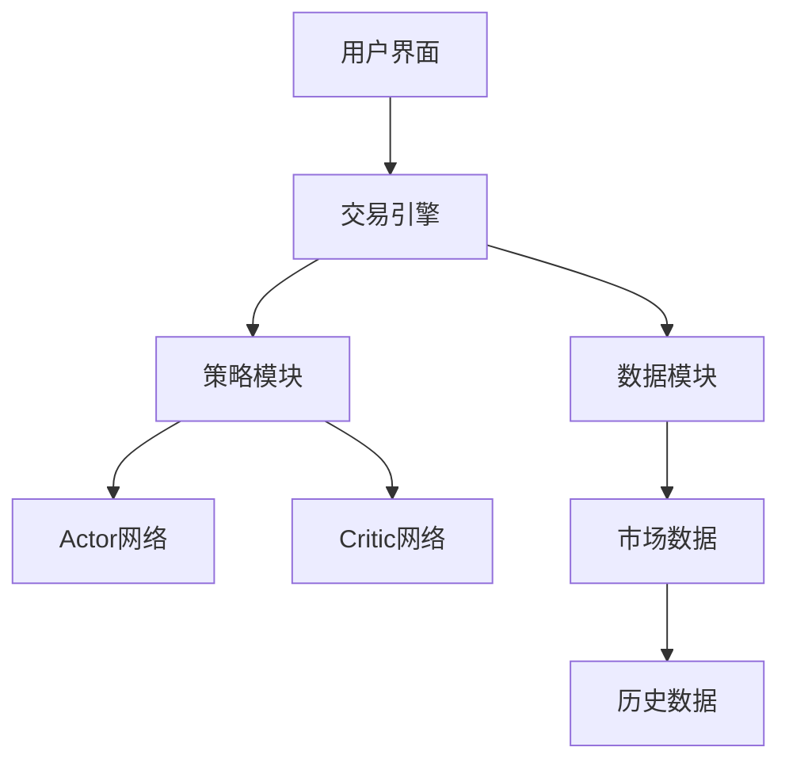
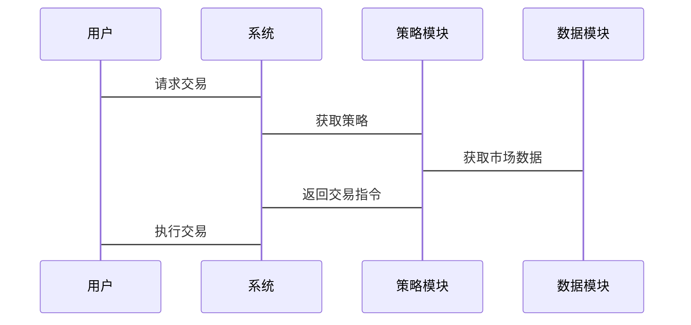

                 


# 《金融领域强化学习的探索与实践》

## 关键词：
强化学习、金融领域、算法原理、数学模型、系统架构、项目实战、投资组合优化

## 摘要：
本文深入探讨强化学习在金融领域的应用，从基础概念到核心算法，再到系统架构和项目实战，详细阐述如何利用强化学习解决金融中的复杂问题。通过具体案例分析，本文揭示了强化学习在投资组合优化、交易策略制定以及风险控制中的潜力，并展望了未来的发展方向。

---

# 第1章: 强化学习与金融领域的背景介绍

## 1.1 强化学习的基本概念
### 1.1.1 强化学习的定义与核心概念
强化学习（Reinforcement Learning, RL）是一种机器学习范式，通过智能体与环境的交互，学习最优策略以最大化累积奖励。其核心概念包括状态（State）、动作（Action）、奖励（Reward）和策略（Policy）。

### 1.1.2 金融领域中的问题背景
金融领域涉及复杂的决策问题，如股票交易、投资组合优化和风险管理。这些任务通常涉及高度不确定性和非线性关系，适合强化学习的应用。

### 1.1.3 强化学习在金融中的应用前景
强化学习在金融中的潜力巨大，尤其是在高频交易和动态投资组合管理中，可以通过实时交互和策略优化实现收益最大化。

## 1.2 金融领域的强化学习问题
### 1.2.1 金融交易中的强化学习问题
- 交易时机的选择
- 动态市场环境中的策略调整

### 1.2.2 投资组合优化中的强化学习应用
- 资产分配问题
- 风险与收益的平衡

### 1.2.3 风险控制与决策优化
- 风险评估与管理
- 稳定的收益策略优化

## 1.3 强化学习的核心要素
### 1.3.1 状态空间的定义
- 金融市场数据的特征提取
- 状态表示的维度选择

### 1.3.2 动作空间的构建
- 动作的定义与范围
- 动作空间的离散化与连续化

### 1.3.3 奖励函数的设计
- 奖励的定义与计算
- 奖励函数的优化

## 1.4 强化学习与金融的结合
### 1.4.1 强化学习在金融中的优势
- 实时交互与动态调整
- 非线性关系的建模能力

### 1.4.2 金融领域强化学习的挑战
- 环境的不确定性和噪声
- 高维状态空间的处理难度

### 1.4.3 未来发展趋势与研究方向
- 多智能体强化学习
- 跨时间步的策略优化

## 1.5 本章小结
本章介绍了强化学习的基本概念和在金融领域中的应用前景，强调了强化学习在金融交易和投资组合优化中的潜力，并分析了相关挑战和未来研究方向。

---

# 第2章: 强化学习的核心算法与原理

## 2.1 马尔可夫决策过程（MDP）
### 2.1.1 MDP的定义与组成部分
马尔可夫决策过程由状态空间、动作空间、转移概率矩阵和奖励函数组成。其核心是通过策略最大化累积奖励。

### 2.1.2 状态转移概率矩阵
状态转移概率矩阵描述了当前状态转移到下一个状态的概率，是强化学习中的关键组件。

### 2.1.3 策略与价值函数的关系
策略定义了动作选择的概率分布，而价值函数衡量了策略在状态下的期望累积奖励。

## 2.2 Q-learning算法
### 2.2.1 Q-learning的基本原理
Q-learning通过更新Q值表来学习最优策略，适用于离散状态和动作空间。

### 2.2.2 Q-learning的更新公式
$$ Q(s, a) \leftarrow Q(s, a) + \alpha [r + \gamma \max Q(s', a') - Q(s, a)] $$

### 2.2.3 Q-learning在金融中的应用
- 股票交易策略
- 投资组合优化

## 2.3 策略梯度方法
### 2.3.1 策略梯度的基本思想
策略梯度通过优化策略的参数，直接最大化累积奖励的期望值。

### 2.3.2 策略梯度的优化方法
- 暂存变量法（Actor-Critic架构）
- 自然梯度法

### 2.3.3 策略梯度在金融交易中的应用
- 动态资产分配
- 风险控制

## 2.4 Actor-Critic架构
### 2.4.1 Actor-Critic的原理
Actor-Critic结合了策略评估和策略改进，通过两个网络分别估计价值函数和优化策略。

### 2.4.2 Actor-Critic的优势
- 稳定的训练过程
- 高效的策略优化

### 2.4.3 Actor-Critic在金融中的应用
- 复杂环境中的策略优化
- 多智能体协作

## 2.5 实例分析：股票交易策略
### 2.5.1 强化学习在股票交易中的应用
- 状态表示：股票价格、成交量、技术指标
- 动作空间：买入、卖出、持有
- 奖励函数：收益最大化

### 2.5.2 算法选择与实现
- 使用Q-learning实现简单的交易策略
- 使用Actor-Critic实现复杂的动态策略

## 2.6 本章小结
本章详细介绍了强化学习的核心算法，包括Q-learning和策略梯度方法，并通过实例展示了它们在金融交易中的应用。

---

# 第3章: 强化学习的数学模型与公式

## 3.1 状态空间与动作空间的数学描述
### 3.1.1 状态空间的维度与结构
- 离散状态空间
- 连续状态空间

### 3.1.2 动作空间的数学表示
- 离散动作空间
- 连续动作空间

## 3.2 奖励函数的数学模型
### 3.2.1 即时奖励与累积奖励
$$ R = \sum_{t=0}^{T} \gamma^t r_t $$

### 3.2.2 奖励函数的设计原则
- 可区分性
- 可学习性

## 3.3 Q-learning的数学推导
### 3.3.1 Q值更新的公式
$$ Q(s, a) \leftarrow Q(s, a) + \alpha [r + \gamma \max Q(s', a') - Q(s, a)] $$

### 3.3.2 Q值的收敛性分析
- 稳定性分析
- 收敛性证明

## 3.4 策略梯度的数学推导
### 3.4.1 策略梯度的目标函数
$$ J(\theta) = \mathbb{E}_{\tau \sim \pi_\theta} [R(\tau)] $$

### 3.4.2 策略梯度的计算
$$ \nabla J(\theta) = \mathbb{E}_{\tau \sim \pi_\theta} [\nabla \log \pi_\theta(a|s) Q_\theta(s, a)] $$

## 3.5 Actor-Critic架构的数学模型
### 3.5.1 Actor网络的优化目标
$$ J(\theta) = \mathbb{E}_{\tau \sim \pi_\theta} [Q_\phi(s, a)] $$

### 3.5.2 Critic网络的优化目标
$$ L(\phi) = \mathbb{E}_{(s, a, r, s')} [(Q_\phi(s, a) - (r + \gamma Q_\phi(s', a')))^2] $$

## 3.6 实际案例中的数学应用
### 3.6.1 投资组合优化的数学模型
- 资产配置问题的数学表达
- 风险-收益曲线的优化

### 3.6.2 股票交易策略的数学实现
- 状态特征的提取与处理
- 动作选择的数学规则

## 3.7 本章小结
本章通过数学推导和实例分析，详细阐述了强化学习在金融领域中的数学模型和公式，为后续的系统设计和项目实现奠定了基础。

---

# 第4章: 强化学习的系统分析与架构设计

## 4.1 系统分析与设计
### 4.1.1 问题场景介绍
- 股票交易系统的设计
- 投资组合优化系统的设计

### 4.1.2 系统功能设计
- 状态采集模块
- 动作选择模块
- 奖励计算模块
- 策略优化模块

### 4.1.3 领域模型的Mermaid类图
```mermaid
classDiagram
    class State {
        price: float
        volume: float
        indicators: list
    }
    class Action {
        buy: bool
        sell: bool
        hold: bool
    }
    class Reward {
        value: float
    }
    class Strategy {
        choose_action(): Action
        update_policy(): void
    }
    class System {
        collect_state(): State
        execute_action(action: Action): Reward
        update_model(): void
    }
    Strategy <|-- System
    System <|-- collect_state()
    System <|-- execute_action()
    System <|-- update_model()
```

### 4.1.4 系统架构的Mermaid架构图


### 4.1.5 系统接口设计
- 输入接口：市场数据接口、用户输入接口
- 输出接口：交易指令接口、收益报告接口

### 4.1.6 系统交互的Mermaid序列图


## 4.2 系统架构设计
### 4.2.1 分层架构设计
- 数据层：市场数据处理
- 战略层：策略选择与优化
- 应用层：用户交互与系统控制

### 4.2.2 微服务架构设计
- 状态采集服务
- 动作选择服务
- 奖励计算服务
- 策略优化服务

### 4.2.3 模块化设计
- 核心算法模块
- 数据处理模块
- 系统控制模块

## 4.3 本章小结
本章通过系统分析与架构设计，展示了强化学习在金融系统中的应用，为后续的项目实现提供了清晰的框架。

---

# 第5章: 强化学习的项目实战

## 5.1 环境安装与配置
### 5.1.1 环境需求
- Python 3.6+
- TensorFlow/PyTorch
- OpenAI Gym
- 股票数据接口（如Yahoo Finance）

### 5.1.2 安装步骤
1. 安装Python和必要的库
2. 安装TensorFlow/PyTorch
3. 安装OpenAI Gym
4. 安装股票数据接口

## 5.2 系统核心实现
### 5.2.1 核心代码实现
```python
import gym
import numpy as np
from tensorflow.keras import layers

# 定义强化学习环境
env = gym.make('StockTrading-v0')

# 定义策略网络
def policy_network(state_space, action_space):
    model = keras.Sequential()
    model.add(layers.Dense(64, activation='relu', input_dim=state_space))
    model.add(layers.Dense(action_space, activation='softmax'))
    return model

# 定义策略梯度算法
class PolicyGradient:
    def __init__(self, state_space, action_space):
        self.model = policy_network(state_space, action_space)
        self.optimizer = keras.optimizers.Adam(learning_rate=0.01)
    
    def train(self, states, actions, rewards):
        y_pred = self.model.predict(np.array(states))
        y_true = np.array(actions)
        loss = np.mean(-np.log(y_pred[np.arange(len(y_pred)), y_true]))
        loss += 0.01 * np.mean(y_pred, axis=1).std()
        self.model.optimizer.minimize(loss, var_list=self.model.trainable_weights)

# 初始化算法
pg = PolicyGradient(env.observation_space.shape[0], env.action_space.n)

# 训练过程
for episode in range(1000):
    state = env.reset()
    done = False
    while not done:
        action = pg.model.predict(np.array([state]))[0]
        action = np.random.choice(env.action_space.n, p=action)
        next_state, reward, done, _ = env.step(action)
        pg.train([state], [action], [reward])
        state = next_state
```

### 5.2.2 代码解读与分析
- 策略网络的定义：使用Dense层构建策略网络，输出动作的概率分布。
- 策略梯度算法的实现：通过梯度下降优化策略网络，最大化累积奖励。

## 5.3 项目实战
### 5.3.1 环境搭建与数据获取
- 使用OpenAI Gym模拟股票交易环境
- 获取真实股票数据作为训练数据

### 5.3.2 算法实现与训练
- 使用策略梯度方法训练交易策略
- 调整超参数以优化性能

### 5.3.3 实际案例分析
- 训练结果的可视化
- 策略在实际市场中的表现分析

## 5.4 项目小结
本章通过实战项目展示了强化学习在金融中的具体应用，详细讲解了环境搭建、算法实现和案例分析的过程。

---

# 第6章: 强化学习的最佳实践与注意事项

## 6.1 最佳实践
### 6.1.1 数据预处理的重要性
- 数据清洗
- 特征工程

### 6.1.2 策略设计的注意事项
- 状态空间的设计
- 动作空间的定义
- 奖励函数的优化

### 6.1.3 算法选择的建议
- 根据问题选择合适的算法
- 结合实际场景进行调整

## 6.2 小结
强化学习在金融中的应用需要结合理论与实践，注重数据处理和算法优化。

## 6.3 注意事项
### 6.3.1 风险控制
- 避免过度拟合
- 控制交易频率

### 6.3.2 环境设计的合理性
- 状态和动作的设计要合理
- 奖励函数的定义要清晰

### 6.3.3 模型的可解释性
- 确保模型的可解释性
- 避免黑箱模型的风险

## 6.4 拓展阅读
### 6.4.1 强化学习的书籍推荐
- 《Reinforcement Learning: Theory and Algorithms》
- 《Deep Reinforcement Learning》

### 6.4.2 金融领域的相关论文
- "Deep Reinforcement Learning for Portfolio Allocation"
- "Reinforcement Learning in Stock Trading"

## 6.5 本章小结
本章总结了强化学习在金融应用中的最佳实践和注意事项，并推荐了相关阅读材料。

---

# 作者：AI天才研究院/AI Genius Institute & 禅与计算机程序设计艺术 /Zen And The Art of Computer Programming

---

希望这篇文章能为您提供有价值的信息，并对强化学习在金融领域的应用有更深入的理解。如需进一步探讨或获取更多细节，请随时联系我。

