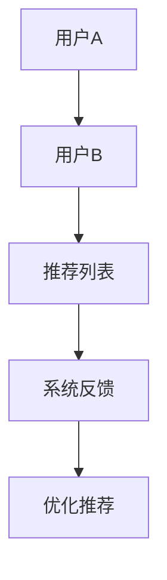
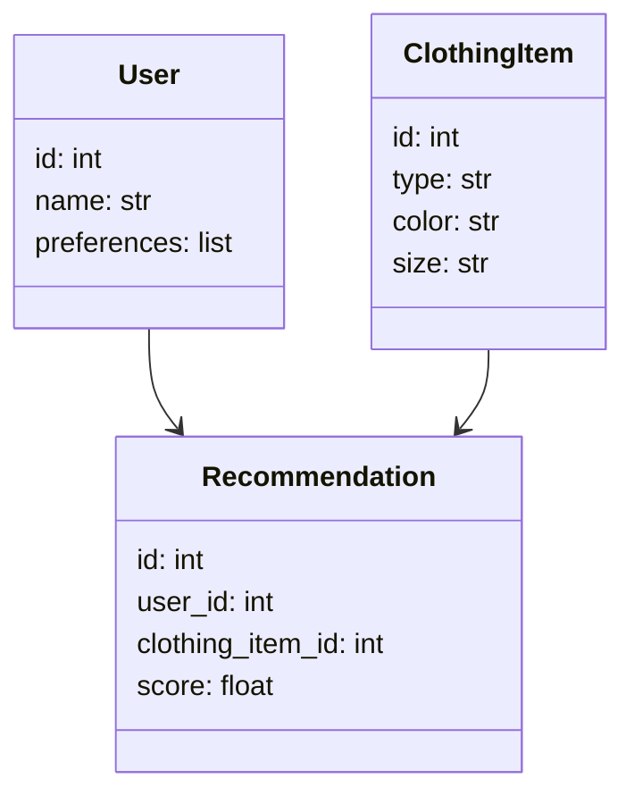
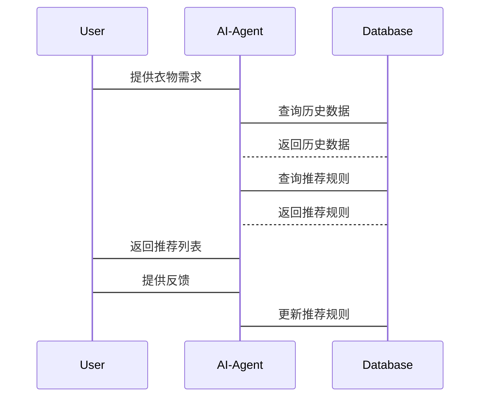

                 


# AI Agent在智能衣柜中的衣物循环使用建议

## 关键词：AI Agent, 智能衣柜, 衣物循环使用, 可持续发展, 人工智能算法

## 摘要：  
本文探讨了AI Agent在智能衣柜中的应用，重点分析了如何通过AI技术优化衣物的循环使用，减少资源浪费，提高衣物管理的效率和可持续性。文章从背景介绍、核心概念、算法原理、系统架构、项目实战等多个维度展开，详细阐述了AI Agent在智能衣柜中的工作原理、实现方法和实际应用，为读者提供了一个全面的技术视角。

---

## 第一部分：背景介绍

### 第1章：AI Agent与智能衣柜概述

#### 1.1 问题背景
- **衣物资源浪费的现状**：全球每年产生大量衣物废弃物，资源浪费问题日益严重。  
- **智能衣柜的发展趋势**：随着智能家居的发展，智能衣柜逐渐普及，成为提升生活质量的重要工具。  
- **AI Agent在衣物管理中的作用**：AI Agent能够通过数据分析和智能推荐，优化衣物的使用效率。

#### 1.2 问题描述
- **衣物管理中的常见问题**：衣物存储混乱、使用频率低、搭配困难等。  
- **衣物循环使用的核心挑战**：如何通过技术手段提高衣物的复用率，减少浪费。  
- **AI Agent如何解决衣物管理问题**：通过智能推荐和数据分析，帮助用户更合理地使用衣物。

#### 1.3 问题解决
- **AI Agent在衣物管理中的解决方案**：基于用户行为数据分析，提供个性化推荐和优化建议。  
- **衣物循环使用的实现路径**：通过智能衣柜系统，实时监测衣物使用情况，动态调整推荐策略。  
- **AI Agent的核心功能与目标**：优化衣物使用效率，减少浪费，推动可持续发展。

#### 1.4 边界与外延
- **AI Agent在智能衣柜中的边界**：仅关注衣物的使用和推荐，不涉及衣物的生产或清洗环节。  
- **衣物循环使用的外延范围**：包括衣物的存储、搭配、推荐和维护。  
- **相关技术与概念的对比**：与传统衣柜管理相比，AI Agent能够实现个性化推荐和动态优化。

#### 1.5 概念结构与核心要素
- **AI Agent的核心要素**：感知（数据采集）、决策（算法推荐）、执行（系统反馈）。  
- **衣物管理系统的构成**：用户管理、衣物信息库、推荐算法、使用记录。  
- **AI Agent与衣物循环使用的关联**：通过数据分析和推荐，提高衣物的使用频率和寿命。

---

## 第二部分：核心概念与联系

### 第2章：AI Agent的核心原理

#### 2.1 AI Agent的基本原理
- **AI Agent的定义与分类**：AI Agent是一种能够感知环境、自主决策并执行任务的智能体，分为简单反射Agent和基于模型的反射Agent。  
- **AI Agent的核心算法**：基于规则的算法、基于机器学习的算法、基于知识图谱的算法。  
- **AI Agent的感知、决策与执行**：感知环境数据，基于算法做出决策，并通过执行模块实现目标。

#### 2.2 AI Agent与衣物管理的联系
- **AI Agent在衣物推荐中的应用**：基于用户的穿衣习惯和偏好，推荐合适的衣物搭配。  
- **AI Agent在衣物分类中的作用**：通过图像识别技术，自动分类衣物，优化存储空间。  
- **AI Agent在衣物维护中的优化**：根据衣物的使用频率和材质，推荐最佳的清洗和存储方式。

#### 2.3 核心概念对比
- **AI Agent与传统衣柜管理的对比**：  
  | 特性             | AI Agent管理 | 传统管理   |  
  |------------------|--------------|------------|  
  | 管理方式         | 智能推荐     | 手动分类   |  
  | 决策依据         | 数据分析     | 经验判断   |  
  | 使用效率         | 高          | 低         |  

- **AI Agent与简单衣物推荐系统的对比**：AI Agent能够实时学习用户的习惯，推荐更精准；而简单推荐系统基于固定规则，无法动态调整。  
- **AI Agent与智能衣柜其他功能的对比**：AI Agent负责优化使用，其他功能如衣物清洁、存储等则是辅助支持。

#### 2.4 ER实体关系图
```mermaid
er
actor: 用户
smart_closet: 智能衣柜系统
clothing_item: 衣物
recommendation: 推荐规则
```

---

## 第三部分：算法原理

### 第3章：AI Agent的推荐算法

#### 3.1 算法原理概述
- **协同过滤算法**：基于用户行为数据，找到相似用户的偏好，推荐相似衣物。  
- **基于内容的推荐算法**：分析衣物的属性（如颜色、款式、材质），推荐与当前衣物相似的物品。  
- **混合推荐算法**：结合协同过滤和内容推荐，提高推荐的准确性和多样性。

#### 3.2 协同过滤算法实现
- **流程图**：


- **Python代码实现**：
```python
import numpy as np

# 示例数据：用户-衣物评分矩阵
users = ['User1', 'User2', 'User3']
clothes = ['Cloth1', 'Cloth2', 'Cloth3']
scores = {
    'User1': {'Cloth1': 5, 'Cloth2': 3, 'Cloth3': 4},
    'User2': {'Cloth1': 4, 'Cloth2': 5, 'Cloth3': 3},
    'User3': {'Cloth1': 3, 'Cloth2': 4, 'Cloth3': 5}
}

# 计算相似度（使用余弦相似度）
def cosine_similarity(a, b):
    return np.dot(a, b) / (np.linalg.norm(a) * np.linalg.norm(b))

# 示例推荐
def collaborative_filtering(user, scores, clothes):
    user_scores = scores[user]
    similar_users = []
    for u in scores:
        if u != user:
            user_vec = np.array([scores[u][c] for c in clothes])
            target_vec = np.array([user_scores[c] for c in clothes])
            sim = cosine_similarity(user_vec, target_vec)
            similar_users.append((u, sim))
    # 返回相似度最高的用户和推荐的衣物
    similar_users.sort(key=lambda x: -x[1])
    recommendations = []
    for u, _ in similar_users[:2]:
        for c in scores[u]:
            if c not in user_scores:
                recommendations.append(c)
    return recommendations

# 示例调用
recommendations = collaborative_filtering('User1', scores, clothes)
print("推荐列表:", recommendations)
```

- **数学模型与公式**：余弦相似度公式为：$$ \cos\theta = \frac{\mathbf{a} \cdot \mathbf{b}}{\|\mathbf{a}\| \|\mathbf{b}\|} $$

---

## 第四部分：系统分析与架构设计

### 第4章：智能衣柜系统架构

#### 4.1 问题场景介绍
- **系统功能**：智能衣柜通过传感器和摄像头，实时监测衣物的状态和用户的行为，结合AI Agent的推荐算法，优化衣物的使用效率。  

#### 4.2 领域模型设计


#### 4.3 系统架构设计
```mermaid
archi
subsystem UserInterface {
    input: 用户输入
    output: 推荐结果
}
subsystem AI-Agent {
    input: 用户行为数据
    process: 推荐算法
    output: 推荐列表
}
subsystem Database {
    input: 衣物信息
    storage: 衣物数据
}
subsystem SmartCloset {
    input: 用户请求
    process: 数据处理
    output: 系统反馈
}
```

#### 4.4 系统接口设计
- **用户接口**：通过手机APP或衣柜屏幕输入需求，获取推荐结果。  
- **数据接口**：与衣物数据库交互，获取衣物信息和用户数据。  
- **反馈接口**：根据用户的使用反馈，优化推荐算法。

#### 4.5 交互序列图


---

## 第五部分：项目实战

### 第5章：AI Agent在智能衣柜中的实现

#### 5.1 环境安装
- **Python环境**：安装Python 3.8及以上版本。  
- **依赖库**：安装numpy、scikit-learn、mermaid等。  

#### 5.2 核心代码实现
- **推荐算法实现**：
```python
from sklearn.metrics.pairwise import cosine_similarity

# 示例数据
X = [
    [5, 3, 4],  # User1
    [4, 5, 3],  # User2
    [3, 4, 5]   # User3
]

# 计算余弦相似度
similarity = cosine_similarity(X)
print("相似度矩阵：", similarity)
```

- **系统交互实现**：
```python
class SmartCloset:
    def __init__(self):
        self.users = []
        self.clothes = []
        self.recommendations = []

    def add_user(self, user):
        self.users.append(user)

    def add_cloth(self, cloth):
        self.clothes.append(cloth)

    def generate_recommendations(self, user_id):
        # 示例推荐逻辑
        pass

# 示例调用
smart_closet = SmartCloset()
smart_closet.add_user("User1")
smart_closet.add_cloth("Cloth1")
recommendations = smart_closet.generate_recommendations(0)
print("推荐结果：", recommendations)
```

#### 5.3 实际案例分析
- **案例背景**：用户A有三件衣服，使用频率分别为5、3、4。系统通过协同过滤算法，推荐给用户A一件与用户B相似的衣物。  
- **案例分析**：推荐结果基于相似用户的偏好，提高了衣物的使用频率和满意度。

#### 5.4 项目小结
- **项目成果**：实现了基于AI Agent的智能衣柜推荐系统，提高了衣物的使用效率。  
- **经验总结**：数据质量和算法选择对推荐效果有直接影响，需结合实际需求优化算法。

---

## 第六部分：最佳实践

### 第6章：AI Agent在智能衣柜中的最佳实践

#### 6.1 小结
- AI Agent通过智能推荐和数据分析，显著提高了衣物的使用效率，减少了资源浪费。  
- 系统架构设计和算法选择对推荐效果至关重要。

#### 6.2 注意事项
- **数据隐私**：确保用户数据的安全性和隐私性。  
- **算法优化**：根据实际需求，动态调整推荐算法，提高推荐的准确性和实时性。  
- **用户体验**：设计简洁直观的用户界面，提升用户的使用体验。

#### 6.3 拓展阅读
- 推荐阅读《机器学习实战》、《人工智能：一种现代的方法》等书籍，深入了解AI Agent的核心技术。  
- 关注智能家居领域的最新动态，探索AI Agent在其他场景中的应用。

---

## 作者：AI天才研究院/AI Genius Institute & 禅与计算机程序设计艺术 /Zen And The Art of Computer Programming

---

**注**：以上内容为《AI Agent在智能衣柜中的衣物循环使用建议》的技术博客文章的完整目录大纲和部分内容示例，您可以根据需要进一步扩展和完善各个章节的内容。

