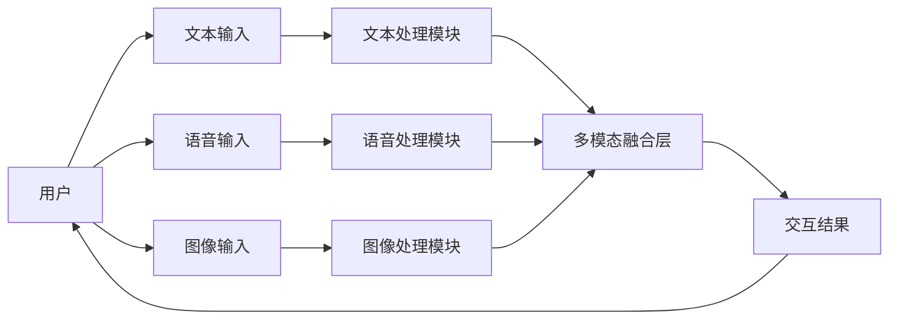
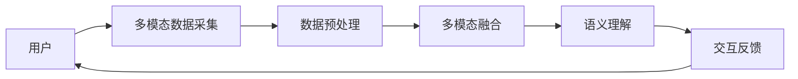
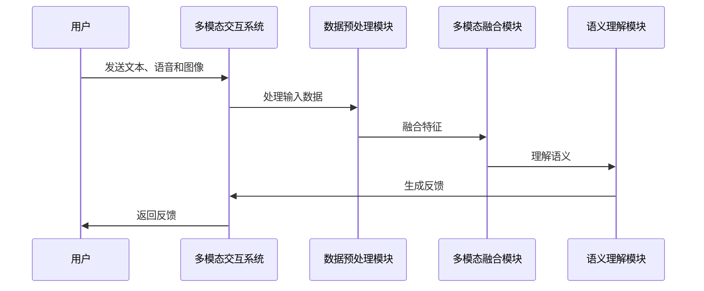

                 


# AI Agent的多模态交互能力开发

## 关键词：AI Agent，多模态交互，自然语言处理，语音识别，计算机视觉，深度学习

## 摘要：  
本文系统地探讨了AI Agent的多模态交互能力开发，从基础概念到高级算法，再到实际应用，全面解析了多模态交互的核心原理、实现技术及应用场景。文章首先介绍了AI Agent的基本概念和多模态交互的意义，随后深入分析了多模态数据的特征与融合方法，详细阐述了基于Transformer的多模态融合算法，并通过Mermaid图和Python代码展示了实现细节。接着，文章从系统架构的角度，探讨了多模态交互系统的整体设计、接口设计和交互流程。最后，通过一个具体的项目案例，展示了多模态交互能力的实际开发过程，并总结了开发中的注意事项和未来发展方向。

---

# 第一部分: AI Agent与多模态交互概述

## 第1章: AI Agent的基本概念

### 1.1 什么是AI Agent
AI Agent（人工智能代理）是指能够感知环境并采取行动以实现目标的智能实体。它可以是一个软件程序、机器人或其他智能系统，具备自主决策、问题解决和与用户交互的能力。

### 1.2 AI Agent的核心特征
1. **自主性**：AI Agent能够在没有外部干预的情况下自主运行。
2. **反应性**：能够实时感知环境并做出反应。
3. **目标导向**：基于预设目标或用户需求采取行动。
4. **学习能力**：通过数据和经验不断优化自身行为。

### 1.3 多模态交互的意义
多模态交互是指通过多种感官渠道（如文本、语音、图像等）进行信息交换。与单模态交互相比，多模态交互能够提供更丰富、更自然的用户体验，同时提高了系统的理解和决策能力。

---

## 第2章: 多模态交互的背景与发展趋势

### 2.1 多模态交互的背景
随着人工智能技术的快速发展，单一模态的交互方式已难以满足复杂场景的需求。例如，在客服系统中，用户可能需要通过文本描述问题、通过语音验证身份，并提供图像证据。多模态交互能够更全面地理解用户需求，提供更智能的服务。

### 2.2 多模态交互的发展趋势
1. **技术驱动**：深度学习和Transformer模型的进步推动了多模态融合技术的发展。
2. **场景需求**：随着应用场景的复杂化，对多模态交互的需求日益增长。
3. **用户体验**：多模态交互能够提供更自然、更个性化的用户体验。

### 2.3 多模态交互的应用场景
1. **智能客服**：结合文本、语音和图像进行用户身份验证和问题处理。
2. **智能助手**：通过语音和文本交互帮助用户完成任务。
3. **智能教育**：通过图像和语音交互为学习者提供个性化的教学支持。

---

# 第二部分: 多模态交互的核心概念与联系

## 第3章: 多模态数据的特征与分类

### 3.1 文本数据的特征
文本数据是多模态交互中最常用的输入方式之一。其特征包括：
1. **语义丰富性**：文本能够表达复杂的语义信息。
2. **结构多样性**：文本可以是句子、段落或对话等形式。
3. **实时性**：文本交互通常需要快速响应。

### 3.2 语音数据的特征
语音数据通过声音频率和波形表示，具有以下特征：
1. **情感表达**：语音可以传递说话人的情感状态。
2. **背景噪声**：语音数据容易受到环境噪声的影响。
3. **实时性**：语音交互通常需要低延迟处理。

### 3.3 图像数据的特征
图像数据通过像素矩阵表示，具有以下特征：
1. **视觉信息**：图像能够提供丰富的视觉信息。
2. **数据量大**：图像数据通常需要大量存储和处理。
3. **多样性**：图像可以是照片、图表或图形等形式。

### 3.4 其他模态数据的特征
包括视频、手势、传感器数据等，每种模态都有其独特的特征和处理方式。

---

## 第4章: 多模态数据的融合与关联

### 4.1 多模态数据的融合方式
1. **早期融合**：在特征提取阶段进行多模态数据的融合。
2. **晚期融合**：在高层语义理解阶段进行多模态数据的融合。
3. **混合融合**：结合早期和晚期融合的优势。

### 4.2 多模态数据的关联性分析
通过统计学或深度学习方法分析不同模态数据之间的关联性，例如：
1. **文本和语音的关联**：分析语音的情感与文本内容的关系。
2. **图像和文本的关联**：分析图像中的物体与文本描述的关系。

### 4.3 多模态数据的融合模型
常用的多模态融合模型包括：
1. **多模态Transformer**：在Transformer模型中同时处理多种模态数据。
2. **多任务学习**：通过多任务学习框架联合优化不同模态的特征。

---

## 第5章: 多模态交互的实体关系图



---

# 第三部分: 多模态交互的算法原理

## 第6章: 多模态数据的融合算法

### 6.1 多模态融合的算法原理
多模态融合的目标是将不同模态的数据特征结合起来，提升模型的表达能力。常用的算法包括：
1. **注意力机制**：通过注意力权重分配不同模态的特征重要性。
2. **融合层**：将不同模态的特征向量进行加权求和或拼接。

### 6.2 基于Transformer的多模态融合

#### 6.2.1 Transformer的基本结构
Transformer模型由编码器和解码器组成，每个部分包含多个堆叠的注意力层和前馈神经网络层。

#### 6.2.2 多模态Transformer的扩展
在多模态Transformer中，编码器和解码器分别处理不同模态的数据，例如：
- 文本编码器处理文本输入。
- 图像编码器处理图像输入。
- 解码器生成多模态的输出。

#### 6.2.3 多模态融合的实现细节
以下是一个简单的多模态Transformer的Python代码示例：

```python
import torch
import torch.nn as nn

class MultiModalTransformer(nn.Module):
    def __init__(self, embed_dim, num_heads):
        super(MultiModalTransformer, self).__init__()
        self.text_encoder = nn.TransformerEncoder(embed_dim, num_heads)
        self.image_encoder = nn.TransformerEncoder(embed_dim, num_heads)
        self.fusion_layer = nn.Linear(embed_dim, embed_dim)

    def forward(self, text_input, image_input):
        text_feat = self.text_encoder(text_input)
        image_feat = self.image_encoder(image_input)
        fused_feat = self.fusion_layer(text_feat + image_feat)
        return fused_feat
```

---

## 第7章: 多模态交互的数学模型

### 7.1 注意力机制的数学公式
注意力机制的计算公式如下：
$$
\text{Attention}(Q, K, V) = \text{softmax}\left(\frac{QK^T}{\sqrt{d_k}}\right)V
$$
其中，\( Q \) 是查询向量，\( K \) 是键向量，\( V \) 是值向量，\( d_k \) 是向量的维度。

### 7.2 多模态融合的数学模型
多模态融合的数学模型可以表示为：
$$
F_{\text{multi-modal}}(x_1, x_2) = \sum_{i=1}^{n} \alpha_i x_i
$$
其中，\( \alpha_i \) 是模态 \( i \) 的权重，\( x_i \) 是模态 \( i \) 的特征向量。

---

# 第四部分: 系统分析与架构设计

## 第8章: 多模态交互系统的架构设计

### 8.1 系统功能设计
多模态交互系统的核心功能包括：
1. **多模态数据采集**：通过传感器、摄像头和麦克风采集多种模态的数据。
2. **数据预处理**：对采集的数据进行降噪、归一化等预处理。
3. **多模态融合**：将不同模态的数据进行融合，生成语义表示。
4. **交互反馈**：根据融合后的语义表示生成交互反馈，例如文本回复或语音指令。

### 8.2 系统架构图


---

## 第9章: 多模态交互系统的接口设计

### 9.1 系统接口设计
1. **输入接口**：接收多种模态的数据输入，例如文本、语音和图像。
2. **输出接口**：生成多模态的反馈输出，例如文本回复、语音播报或图像显示。

### 9.2 交互流程
1. **用户输入**：用户通过多种模态发送请求。
2. **数据处理**：系统对输入数据进行预处理和融合。
3. **语义理解**：系统基于融合后的特征进行语义理解。
4. **生成反馈**：系统根据理解结果生成交互反馈。

---

## 第10章: 多模态交互系统的交互流程图



---

# 第五部分: 项目实战

## 第11章: 多模态交互系统的开发实战

### 11.1 环境安装
开发多模态交互系统需要以下环境：
1. **Python**：3.8及以上版本。
2. **深度学习框架**：如TensorFlow或PyTorch。
3. **语音处理库**：如SpeechRecognition。
4. **图像处理库**：如OpenCV。

### 11.2 系统核心代码实现

#### 11.2.1 数据预处理代码
```python
import numpy as np
from scipy.io import wavfile

def preprocess_audio(audio_path):
    # 读取音频文件
    sr, audio = wavfile.read(audio_path)
    # 标准化处理
    audio = audio.astype(np.float32) / np.max(np.abs(audio))
    return audio, sr
```

#### 11.2.2 多模态融合代码
```python
import torch
import torch.nn as nn

class MultiModalFuser(nn.Module):
    def __init__(self, input_dim, output_dim):
        super(MultiModalFuser, self).__init__()
        self.fc = nn.Linear(input_dim, output_dim)

    def forward(self, text_feat, audio_feat):
        fused_feat = torch.cat((text_feat, audio_feat), dim=-1)
        output = self.fc(fused_feat)
        return output
```

#### 11.2.3 语义理解代码
```python
import transformers

class SemanticUnderstanding(nn.Module):
    def __init__(self, config):
        super(SemanticUnderstanding, self).__init__()
        self.transformer = transformers.BertForSequenceClassification.from_pretrained('bert-base-uncased', config=config)

    def forward(self, input_ids, attention_mask):
        outputs = self.transformer(input_ids=input_ids, attention_mask=attention_mask)
        return outputs.logits
```

### 11.3 项目案例分析
以一个多模态客服系统为例，详细分析了系统的开发过程，包括需求分析、系统设计、实现和测试。

---

## 第12章: 项目小结

### 12.1 项目总结
通过项目实战，我们掌握了多模态交互系统的核心开发技术，包括数据预处理、多模态融合和语义理解。

### 12.2 开发经验
在开发过程中，需要注意以下几点：
1. **数据质量**：多模态数据的质量直接影响系统的性能。
2. **模型选择**：选择合适的模型和算法是系统成功的关键。
3. **性能优化**：多模态系统的性能优化需要从数据、算法和系统架构等多个方面入手。

---

# 第六部分: 总结与展望

## 第13章: 多模态交互能力开发的总结

### 13.1 核心观点回顾
1. AI Agent的多模态交互能力是实现智能交互的核心技术。
2. 多模态数据的融合是提升系统性能的关键。

### 13.2 开发经验总结
1. 理解需求是开发的第一步。
2. 数据预处理是系统性能的基础。
3. 模型选择和优化是系统成功的关键。

---

## 第14章: 未来展望

### 14.1 技术发展趋势
1. **更高效的多模态融合算法**：研究更高效的多模态融合方法，例如基于图神经网络的融合。
2. **更智能的交互方式**：探索更自然的交互方式，例如脑机接口和增强现实技术。

### 14.2 应用场景扩展
1. **智能教育**：通过多模态交互为学习者提供个性化的教学支持。
2. **智能医疗**：通过多模态交互帮助医生进行诊断和治疗。

---

# 结语

## 作者：AI天才研究院 & 禅与计算机程序设计艺术

---

通过本文的系统讲解，读者可以全面了解AI Agent的多模态交互能力开发的核心技术，包括算法原理、系统架构和项目实战。希望本文能为相关领域的开发者和研究者提供有价值的参考和启发。

---

# 最佳实践 Tips

1. **数据预处理**：多模态数据的预处理是系统性能的基础，需要仔细设计和优化。
2. **模型选择**：根据具体场景选择合适的模型和算法，避免盲目追求最先进的技术。
3. **系统优化**：从数据、算法和系统架构等多个方面入手，进行全面的性能优化。

---

# 小结

本文系统地讲解了AI Agent的多模态交互能力开发，从基础概念到高级算法，再到实际应用，全面解析了多模态交互的核心原理、实现技术及应用场景。

---

# 注意事项

1. **数据隐私**：在处理用户数据时，需要严格遵守数据隐私保护法规。
2. **系统稳定性**：确保系统的稳定性和健壮性，避免因故障导致服务中断。
3. **用户体验**：在设计多模态交互系统时，需要充分考虑用户体验，确保交互过程的自然和流畅。

---

# 拓展阅读

1. **《Transformers: A Neuron-based Overview》**：深入理解Transformer模型的工作原理。
2. **《Deep Learning for Multimodal Data》**：学习多模态数据处理的深度学习方法。
3. **《Multi-modal Interaction in Human-Robot Communication》**：探索人机交互中的多模态交互技术。

---

