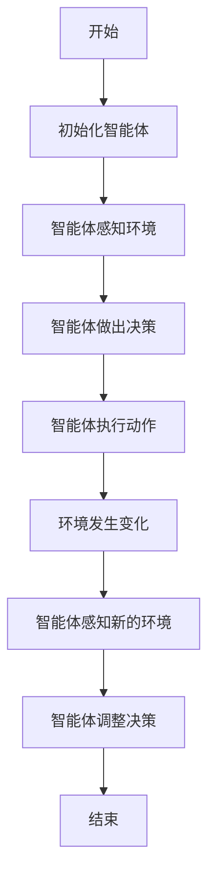
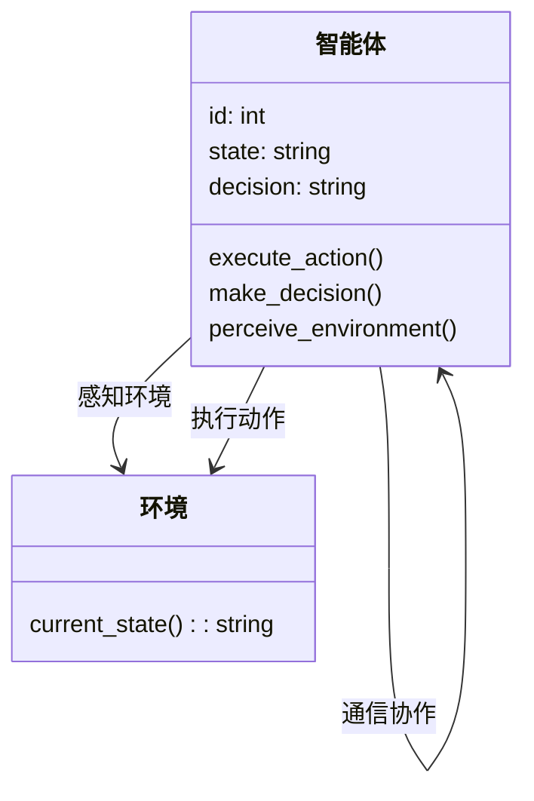
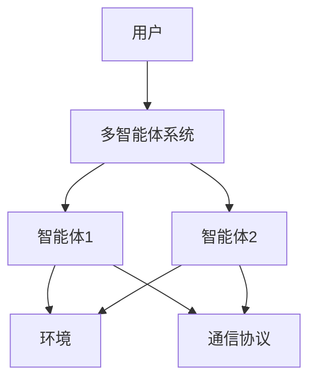
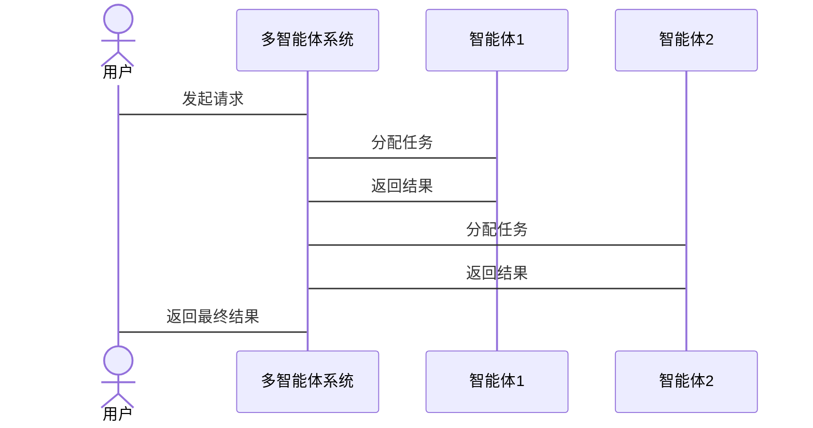

                 


# AI多智能体如何提升对公司长期盈利能力的评估

## 关键词：AI多智能体、长期盈利能力、企业决策优化、分布式系统、协作算法

## 摘要：AI多智能体系统通过优化企业资源分配、提升决策效率和增强竞争力，显著提升了公司长期盈利能力。本文详细探讨了AI多智能体系统的背景、核心概念、算法原理、系统架构设计、项目实战以及最佳实践，为读者提供了一套系统化的方法论，帮助企业在复杂多变的市场环境中实现可持续增长。

---

# 第一部分: AI多智能体与公司长期盈利能力评估的背景介绍

## 第1章: AI多智能体系统概述

### 1.1 什么是AI多智能体系统
#### 1.1.1 多智能体系统的定义
AI多智能体系统（Multi-Agent System, MAS）是由多个智能体（Agent）组成的分布式系统，这些智能体能够通过协作和通信，共同完成复杂任务。每个智能体都有一定的自主性，能够感知环境、做出决策并执行动作。

#### 1.1.2 多智能体系统的核心特点
- **自主性**：每个智能体都能独立感知环境并做出决策。
- **协作性**：智能体之间通过通信和协作完成共同目标。
- **分布性**：系统由多个智能体组成，不存在集中控制节点。
- **反应性**：智能体能够实时感知环境变化并做出响应。

#### 1.1.3 多智能体与单智能体的区别
| 特性 | 单智能体 | 多智能体 |
|------|----------|----------|
| 控制方式 | 中央控制 | 分布式控制 |
| 任务处理 | 独立完成 | 协作完成 |
| 信息处理 | 单点处理 | 分布式处理 |

### 1.2 AI多智能体系统的应用场景
#### 1.2.1 企业级应用的潜力
- **资源优化配置**：通过多智能体系统优化企业内部资源分配。
- **决策支持**：利用多智能体系统的协作能力提升企业决策效率。
- **风险控制**：通过实时协作降低企业运营风险。

#### 1.2.2 多智能体在企业决策中的作用
- **分布式决策**：多智能体系统能够快速响应市场变化，提高决策效率。
- **协作优化**：通过智能体之间的协作，实现资源的最优配置。
- **实时反馈**：多智能体系统能够实时感知市场变化，提供及时反馈。

#### 1.2.3 多智能体系统的未来趋势
- **智能化升级**：随着AI技术的发展，多智能体系统将更加智能化。
- **边缘计算结合**：多智能体系统与边缘计算的结合将提升系统的实时性和响应速度。
- **跨领域应用**：多智能体系统将被应用于更多领域，如金融、制造、物流等。

### 1.3 多智能体系统与公司长期盈利能力的关系
#### 1.3.1 多智能体系统如何优化企业资源
- **资源分配优化**：通过多智能体系统的协作，实现资源的最优分配。
- **成本控制**：通过实时反馈和协作，降低企业的运营成本。
- **效率提升**：多智能体系统的协作能够提高企业的整体效率。

#### 1.3.2 多智能体系统如何提升决策效率
- **分布式决策**：多智能体系统能够快速响应市场变化，提高决策效率。
- **协作优化**：通过智能体之间的协作，实现决策的最优化。
- **实时反馈**：多智能体系统能够实时感知市场变化，提供及时反馈。

#### 1.3.3 多智能体系统如何增强企业竞争力
- **快速响应**：多智能体系统能够快速响应市场变化，增强企业的竞争力。
- **资源优化配置**：通过多智能体系统的协作，实现资源的最优配置，增强企业的竞争力。
- **决策优化**：通过协作优化，实现决策的最优化，增强企业的竞争力。

## 第2章: 多智能体系统的核心概念与联系

### 2.1 多智能体系统的结构与协作机制
#### 2.1.1 多智能体系统的组成结构
- **智能体**：系统的最基本单元，能够独立感知环境并做出决策。
- **环境**：智能体所处的外部环境，包括物理环境和信息环境。
- **通信协议**：智能体之间通信的规则和标准。

#### 2.1.2 多智能体系统的协作机制
- **直接协作**：智能体之间直接通信并协作完成任务。
- **间接协作**：智能体通过共享信息或中间媒介进行协作。
- **基于规则的协作**：智能体根据预定义的规则进行协作。

#### 2.1.3 多智能体系统的通信协议
- **异步通信**：智能体之间通过消息队列进行通信。
- **同步通信**：智能体之间通过共享内存或数据库进行通信。
- **事件驱动通信**：智能体之间通过事件触发进行通信。

### 2.2 多智能体系统的核心要素
#### 2.2.1 智能体的定义与属性
- **智能体的定义**：智能体是一个能够感知环境并做出决策的实体。
- **智能体的属性**：包括自主性、反应性、协作性和学习能力。

#### 2.2.2 智能体的决策模型
- **基于规则的决策模型**：根据预定义的规则做出决策。
- **基于学习的决策模型**：通过机器学习算法学习决策策略。
- **基于推理的决策模型**：通过逻辑推理做出决策。

#### 2.2.3 智能体的环境感知
- **环境感知方式**：包括传感器数据、历史数据和外部信息。
- **环境模型构建**：智能体根据感知到的信息构建环境模型。
- **环境变化响应**：智能体根据环境变化调整决策和行为。

### 2.3 多智能体系统的ER实体关系图
```mermaid
er
actor(用户) --> 多智能体系统
多智能体系统 --> 环境
多智能体系统 --> 智能体
智能体 --> 决策模型
智能体 --> 通信协议
```

## 第3章: 多智能体系统的算法原理

### 3.1 多智能体系统的典型算法
#### 3.1.1 分布式计算算法
- **分布式计算算法**：通过分布式计算实现智能体之间的协作。
- **具体实现**：使用分布式计算框架，如MapReduce，实现智能体之间的数据处理和计算。

#### 3.1.2 强化学习算法
- **强化学习算法**：通过强化学习训练智能体的决策策略。
- **具体实现**：使用Q-learning算法，通过智能体与环境的交互，学习最优策略。

#### 3.1.3 协作优化算法
- **协作优化算法**：通过协作优化实现智能体之间的资源分配和任务调度。
- **具体实现**：使用协作优化算法，如遗传算法，实现智能体之间的协作优化。

### 3.2 多智能体系统的算法流程图


### 3.3 多智能体系统的数学模型
#### 3.3.1 问题建模
$$ \text{目标函数} = \sum_{i=1}^{n} a_i x_i $$

#### 3.3.2 分布式计算
$$ \text{分布式计算} = \sum_{i=1}^{n} \frac{x_i}{n} $$

#### 3.3.3 强化学习
$$ Q(s, a) = r + \gamma \max_{a'} Q(s', a') $$

### 3.4 多智能体系统的代码示例
```python
class Agent:
    def __init__(self, id):
        self.id = id
        self.state = None
        self.decision = None

    def感知环境(self, environment):
        self.state = environment.current_state()

    def 做出决策(self):
        if self.state == '目标1':
            self.decision = '动作1'
        elif self.state == '目标2':
            self.decision = '动作2'

    def 执行动作(self):
        if self.decision == '动作1':
            # 执行动作1
        elif self.decision == '动作2':
            # 执行动作2

def 多智能体协作(agents):
    for agent in agents:
        agent.感知环境(environment)
        agent.做出决策()
        agent.执行动作()
```

## 第4章: 系统分析与架构设计

### 4.1 问题场景介绍
#### 4.1.1 项目背景
在现代企业中，资源分配和决策优化是提升长期盈利能力的关键因素。通过AI多智能体系统，企业可以实现资源的最优配置和决策的快速响应。

#### 4.1.2 系统目标
- **资源优化配置**：通过多智能体系统优化企业内部资源分配。
- **决策支持**：利用多智能体系统的协作能力提升企业决策效率。
- **风险控制**：通过实时协作降低企业运营风险。

### 4.2 系统功能设计
#### 4.2.1 领域模型设计


#### 4.2.2 系统架构设计


### 4.3 系统接口设计
#### 4.3.1 系统接口
- **智能体接口**：提供感知环境、做出决策和执行动作的方法。
- **环境接口**：提供当前环境状态的方法。

#### 4.3.2 通信协议
- **HTTP接口**：智能体之间通过HTTP协议进行通信。
- **消息队列**：智能体之间通过消息队列进行异步通信。

### 4.4 系统交互设计
#### 4.4.1 系统交互流程图


## 第5章: 项目实战

### 5.1 环境安装
#### 5.1.1 安装Python
```bash
sudo apt-get install python3
```

#### 5.1.2 安装相关库
```bash
pip install numpy
pip install matplotlib
pip install scikit-learn
```

### 5.2 系统核心实现源代码
```python
class Agent:
    def __init__(self, id):
        self.id = id
        self.state = None
        self.decision = None

    def perceive_environment(self, environment):
        self.state = environment.current_state()

    def make_decision(self):
        if self.state == '目标1':
            self.decision = '动作1'
        elif self.state == '目标2':
            self.decision = '动作2'

    def execute_action(self):
        if self.decision == '动作1':
            print(f"智能体{self.id}执行动作1")
        elif self.decision == '动作2':
            print(f"智能体{self.id}执行动作2")

def multi_agent_system():
    environment = Environment()
    agents = [Agent(1), Agent(2)]
    for agent in agents:
        agent.perceive_environment(environment)
        agent.make_decision()
        agent.execute_action()

class Environment:
    def current_state(self):
        return '目标1'
```

### 5.3 代码应用解读与分析
- **Agent类**：表示一个智能体，包含感知环境、做出决策和执行动作的方法。
- **multi_agent_system函数**：实现多智能体系统的协作，包括智能体的初始化、感知环境、做出决策和执行动作。
- **Environment类**：表示环境，提供当前环境状态的方法。

### 5.4 实际案例分析
#### 5.4.1 案例背景
某制造企业希望通过多智能体系统优化生产流程，提高生产效率。

#### 5.4.2 系统设计
- **智能体1**：负责原材料采购和库存管理。
- **智能体2**：负责生产调度和生产计划。
- **环境**：提供市场变化和生产需求的信息。

#### 5.4.3 实施步骤
1. 智能体1感知环境，做出采购决策。
2. 智能体2感知环境，做出生产计划。
3. 智能体1和智能体2协作，优化资源分配。
4. 系统执行动作，实现生产流程的优化。

### 5.5 项目小结
通过多智能体系统的协作，企业能够实现资源的最优配置和决策的快速响应，显著提升长期盈利能力。

## 第6章: 最佳实践、小结、注意事项和拓展阅读

### 6.1 最佳实践
- **智能体设计**：智能体的设计要简洁明了，避免过于复杂。
- **通信协议**：选择合适的通信协议，确保智能体之间的高效协作。
- **算法选择**：根据具体场景选择合适的算法，如分布式计算和强化学习。

### 6.2 小结
本文详细探讨了AI多智能体系统如何提升对公司长期盈利能力的评估，从背景介绍到项目实战，为读者提供了一套系统化的方法论。

### 6.3 注意事项
- **系统设计**：系统设计要充分考虑智能体之间的协作和通信。
- **算法选择**：算法选择要根据具体场景，避免盲目使用。
- **系统优化**：系统优化要注重效率和可扩展性。

### 6.4 拓展阅读
- **推荐书籍**：《Multi-Agent Systems: Algorithmic, Complexity, and Synthesis》
- **推荐论文**：《A Survey of Multi-Agent Reinforcement Learning》
- **推荐网站**：[Multi-Agent Systems Research](https://www.mas.com)

---

## 作者：AI天才研究院/AI Genius Institute & 禅与计算机程序设计艺术 /Zen And The Art of Computer Programming

