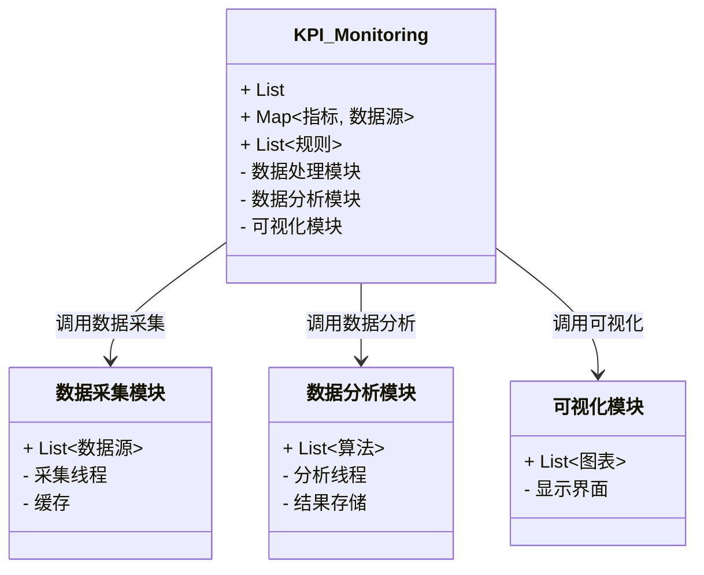
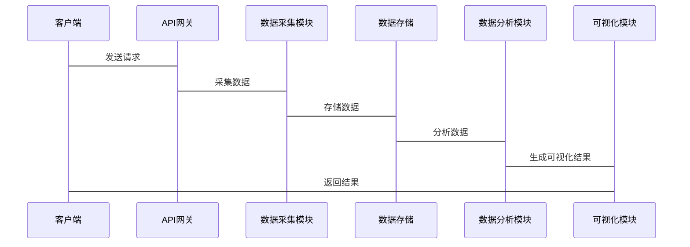

                 


# AI驱动的企业战略执行监控：KPI智能分解与实时追踪

## 关键词：
- AI驱动，企业战略，KPI分解，实时追踪，智能监控，机器学习，数据可视化

## 摘要：
本文章详细探讨了如何利用人工智能技术优化企业的战略执行监控，重点介绍了KPI的智能分解与实时追踪方法。通过分析传统KPI分解与实时追踪的局限性，结合机器学习算法和系统架构设计，提出了一种高效、智能的解决方案。文章内容涵盖背景介绍、核心概念、算法原理、系统设计、项目实战及未来展望，旨在为企业提供一套AI驱动的战略执行监控体系。

---

# 第一部分：背景与概念

## 第1章：AI驱动的企业战略执行监控

### 1.1 企业战略执行监控的必要性

#### 1.1.1 企业战略执行的传统挑战
企业在执行战略时，常常面临以下挑战：
- **目标分解不明确**：战略目标难以分解为具体可执行的KPI。
- **数据孤岛问题**：各部门数据分散，难以形成统一的监控体系。
- **实时性不足**：传统监控方式通常依赖定期报告，无法实时反馈。

#### 1.1.2 AI如何提升战略执行效率
人工智能技术在企业战略执行中的优势：
- **自动化分解**：通过机器学习算法自动分解战略目标为具体KPI。
- **实时分析**：利用流数据处理技术实时监控KPI的变化。
- **智能预测**：基于历史数据预测未来趋势，提前制定应对策略。

#### 1.1.3 KPI智能分解与实时追踪的优势
- **提高效率**：AI能够快速分解和追踪KPI，减少人工干预。
- **增强洞察**：通过智能分析，发现隐藏在数据中的关键问题。
- **动态调整**：实时监控使企业能够快速响应变化，优化执行策略。

---

## 第2章：KPI的定义与分类

### 2.1 KPI的基本概念

#### 2.1.1 KPI的核心定义
KPI（Key Performance Indicators）是衡量企业战略执行效果的重要指标。常见的KPI包括：
- **财务类KPI**：如净利润率、投资回报率等。
- **客户类KPI**：如客户满意度、客户保留率等。
- **运营类KPI**：如生产效率、订单处理时间等。
- **创新类KPI**：如新产品开发周期、研发投入占比等。

#### 2.1.2 KPI的分类与应用场景
不同类别的KPI适用于不同的业务场景：
- **财务类KPI**：适用于评估企业的盈利能力。
- **客户类KPI**：适用于评估客户满意度和忠诚度。
- **运营类KPI**：适用于评估业务流程的效率。
- **创新类KPI**：适用于评估企业的创新能力。

#### 2.1.3 KPI在企业战略中的重要性
- **战略分解**：通过KPI将战略目标分解为可执行的任务。
- **目标追踪**：通过KPI实时监控战略执行的进展。
- **绩效评估**：通过KPI评估战略执行的效果。

---

## 第3章：传统KPI分解与实时追踪的局限性

### 3.1 传统KPI分解方法的不足

#### 3.1.1 人工分解的低效性
- **耗时耗力**：传统KPI分解通常需要大量人工参与。
- **主观性强**：分解过程依赖主观判断，缺乏客观依据。
- **灵活性差**：难以快速适应业务变化。

#### 3.1.2 数据分析的局限性
- **数据孤岛**：各部门数据分散，难以形成统一的分析视角。
- **分析深度不足**：传统分析方法难以深入挖掘数据背后的规律。
- **缺乏预测性**：无法提前预测潜在问题。

### 3.2 传统实时追踪的挑战

#### 3.2.1 数据采集的延迟性
- **数据采集周期长**：传统方法通常依赖定期报告，无法实时反馈。
- **数据不完整**：实时数据采集过程中可能面临数据丢失或不准确的问题。

#### 3.2.2 数据处理的复杂性
- **数据清洗困难**：需要人工处理大量脏数据。
- **数据格式多样**：不同来源的数据格式不同，难以统一处理。

#### 3.2.3 数据分析的滞后性
- **分析结果滞后**：传统方法通常需要等到数据积累到一定程度后才能进行分析，导致反应速度慢。
- **缺乏预测能力**：无法基于实时数据进行预测，难以提前采取行动。

### 3.3 AI驱动的解决方案优势

#### 3.3.1 高效性
- **自动化分解**：AI算法可以快速分解战略目标为具体KPI。
- **实时分析**：AI能够实时处理数据，提供即时反馈。

#### 3.3.2 准确性
- **数据驱动决策**：AI通过大量数据进行分析，结果更准确。
- **模型优化**：通过机器学习算法不断优化模型，提高预测精度。

#### 3.3.3 灵活性
- **快速适应变化**：AI模型可以快速调整以适应业务变化。
- **多维度分析**：AI能够从多个维度进行分析，提供更全面的洞察。

---

# 第二部分：AI驱动的KPI智能分解方法

## 第4章：KPI智能分解的核心概念

### 4.1 智能分解的基本原理

#### 4.1.1 数据驱动的分解方法
AI驱动的KPI分解方法基于以下原理：
- **数据预处理**：对原始数据进行清洗和转换，使其适合模型输入。
- **特征提取**：提取关键特征，用于模型训练。
- **模型训练**：使用机器学习算法训练模型，学习KPI的分解规律。
- **结果解释**：将模型输出的结果解释为具体的KPI分解方案。

#### 4.1.2 分解结果的评估标准
评估KPI分解结果的标准包括：
- **准确性**：分解结果与实际数据的吻合程度。
- **可解释性**：分解结果是否易于理解和解释。
- **实用性**：分解结果是否能够指导实际业务操作。

### 4.2 基于机器学习的KPI分解模型

#### 4.2.1 机器学习在KPI分解中的应用
常用的机器学习算法包括：
- **线性回归**：用于预测连续型KPI。
- **决策树**：用于分类和预测。
- **随机森林**：用于特征重要性分析和分类。
- **支持向量机（SVM）**：用于分类问题。

#### 4.2.2 常见的分解算法介绍
- **线性回归**：适用于线性关系明显的KPI分解。
- **随机森林**：适用于非线性关系复杂的KPI分解。
- **XGBoost**：适用于需要高精度预测的场景。

#### 4.2.3 模型训练与优化
- **数据预处理**：包括数据清洗、特征工程等。
- **模型选择**：根据具体场景选择合适的算法。
- **模型调优**：通过交叉验证优化模型参数。

### 4.3 分解结果的可视化与解释

#### 4.3.1 数据可视化方法
常用的可视化方法包括：
- **折线图**：展示KPI随时间的变化趋势。
- **柱状图**：比较不同维度的KPI值。
- **热力图**：展示KPI的重要性和影响程度。

#### 4.3.2 分解结果的可解释性
- **特征重要性分析**：通过模型输出特征重要性，了解哪些因素对KPI影响最大。
- **分解路径可视化**：用流程图展示KPI分解的步骤。

---

## 第5章：KPI实时追踪的实现技术

### 5.1 实时数据采集与处理

#### 5.1.1 数据源的多样性
实时数据可能来自以下渠道：
- **数据库**：如关系型数据库、NoSQL数据库。
- **API接口**：如第三方服务接口。
- **物联网设备**：如传感器、智能终端。

#### 5.1.2 数据预处理方法
- **数据清洗**：去除重复数据、处理缺失值。
- **数据转换**：将数据转换为适合模型输入的格式。
- **数据归约**：通过降维技术减少数据量。

#### 5.1.3 数据流处理技术
常用的数据流处理框架包括：
- **Kafka**：用于实时数据流的高效传输。
- **Flume**：用于日志数据的采集和传输。
- **Storm**：用于实时数据流的处理和分析。

### 5.2 基于流数据的实时分析

#### 5.2.1 流数据处理框架
常用的流数据处理框架包括：
- **Apache Flink**：适用于分布式流数据处理。
- **Apache Kafka**：适用于高吞吐量的实时数据流。
- **Apache Spark Streaming**：适用于基于Spark框架的实时流处理。

#### 5.2.2 实时分析算法
- **滑动窗口算法**：用于处理时间窗口内的数据。
- **增量学习算法**：用于动态更新模型参数。
- **在线学习算法**：适用于实时数据流的在线学习。

---

# 第三部分：系统架构与设计

## 第6章：系统架构设计

### 6.1 问题场景介绍
企业需要一个实时监控系统，能够自动分解战略目标为KPI，并实时追踪这些KPI的变化。

### 6.2 系统功能设计

#### 6.2.1 领域模型
领域模型的mermaid类图如下：


#### 6.2.2 系统架构
系统架构的mermaid架构图如下：
```mermaid
archiecture
    client --> API网关: 请求
    API网关 --> 数据采集模块: 数据采集
    数据采集模块 --> 数据存储: 数据存储
    数据存储 --> 数据分析模块: 数据分析
    数据分析模块 --> 可视化模块: 可视化
    可视化模块 --> 客户端: 返回结果
```

#### 6.2.3 系统接口设计
主要接口包括：
- 数据采集接口：用于从各种数据源采集实时数据。
- 数据分析接口：用于对实时数据进行分析，生成KPI分解结果。
- 可视化接口：用于将分析结果可视化，展示给用户。

#### 6.2.4 系统交互
系统交互的mermaid序列图如下：


---

# 第四部分：项目实战

## 第7章：项目实战

### 7.1 环境安装

#### 7.1.1 安装Python
```bash
python --version
pip install --upgrade pip
```

#### 7.1.2 安装必要的库
```bash
pip install numpy pandas scikit-learn matplotlib
```

### 7.2 核心实现

#### 7.2.1 数据预处理
```python
import pandas as pd
import numpy as np

# 加载数据
data = pd.read_csv('data.csv')

# 数据清洗
data = data.dropna()
data = data.drop_duplicates()

# 特征工程
from sklearn.preprocessing import StandardScaler
scaler = StandardScaler()
scaled_data = scaler.fit_transform(data)
```

#### 7.2.2 模型训练
```python
from sklearn.ensemble import RandomForestRegressor
from sklearn.model_selection import train_test_split

# 划分训练集和测试集
X_train, X_test, y_train, y_test = train_test_split(scaled_data, target_data, test_size=0.2)

# 训练模型
model = RandomForestRegressor()
model.fit(X_train, y_train)

# 预测结果
y_pred = model.predict(X_test)
```

#### 7.2.3 结果可视化
```python
import matplotlib.pyplot as plt

plt.scatter(y_test, y_pred)
plt.xlabel('真实值')
plt.ylabel('预测值')
plt.title('KPI分解结果')
plt.show()
```

### 7.3 案例分析

#### 7.3.1 案例背景
某企业希望通过AI驱动的KPI分解来优化销售预测。

#### 7.3.2 数据分析
通过机器学习模型，预测未来的销售趋势，并分解为具体的KPI。

#### 7.3.3 可视化结果
生成的可视化图表展示了预测值与实际值的对比，帮助企业更好地理解销售趋势。

---

# 第五部分：最佳实践与未来展望

## 第8章：最佳实践

### 8.1 小结
- **高效性**：AI驱动的KPI分解与实时追踪提高了企业的监控效率。
- **准确性**：机器学习模型能够提供更准确的预测结果。
- **灵活性**：AI系统能够快速适应业务变化，提供实时反馈。

### 8.2 注意事项
- **数据质量**：确保数据的准确性和完整性。
- **模型优化**：定期更新模型，保持其预测能力。
- **系统维护**：定期检查系统，确保其稳定运行。

### 8.3 拓展阅读
- **机器学习算法**：深入学习常用的机器学习算法及其应用。
- **实时数据处理**：研究实时数据处理技术，如流数据处理框架。
- **可视化工具**：探索更多的可视化工具和方法，提高数据展示效果。

---

# 作者：AI天才研究院/AI Genius Institute & 禅与计算机程序设计艺术 /Zen And The Art of Computer Programming

---

通过以上详细的内容，读者可以系统地了解AI驱动的企业战略执行监控，掌握KPI智能分解与实时追踪的核心技术，为企业优化战略执行提供有力支持。

