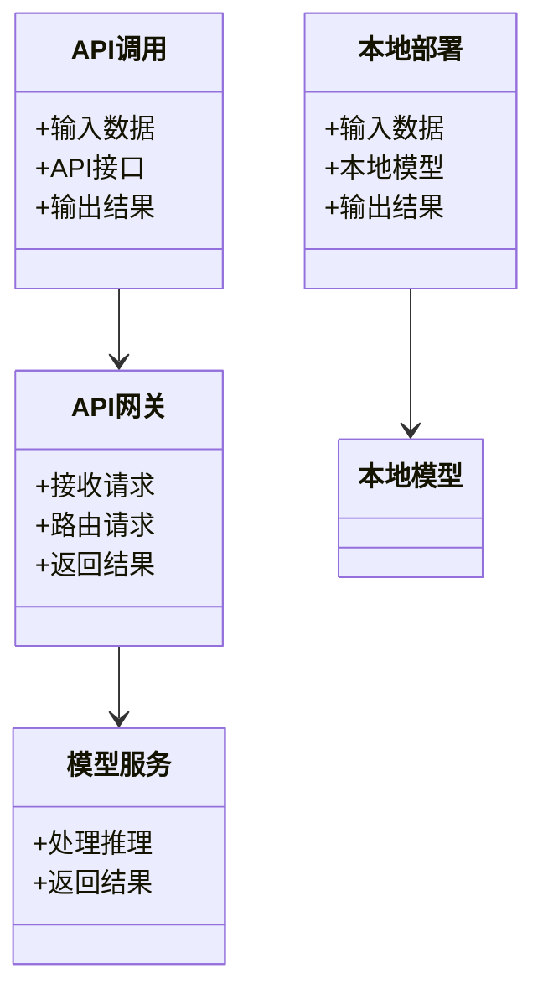
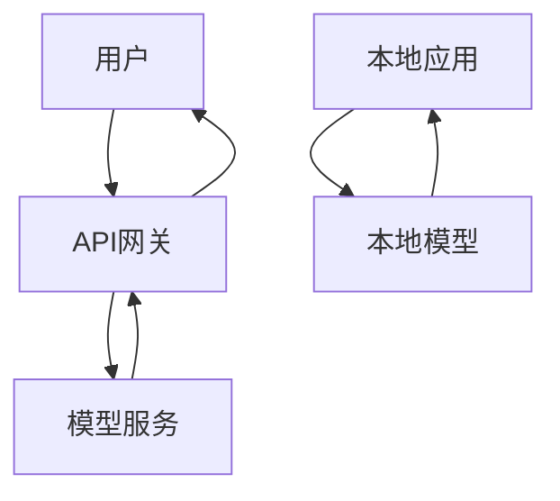
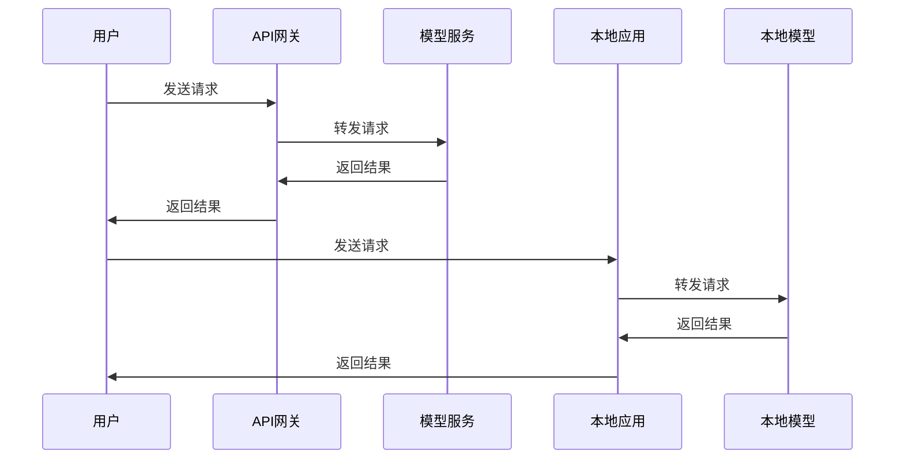

                 


# API调用还是本地部署？LLM使用策略对比

## 关键词：API调用、本地部署、LLM、模型推理、性能对比、成本分析、安全性

## 摘要：  
在大语言模型（LLM）的应用中，选择API调用还是本地部署是一个关键的决策点。本文从背景概述、核心概念、算法原理、系统架构设计、项目实战等方面，全面对比分析了API调用与本地部署两种方式的优劣势。通过对性能、成本、安全性、维护难度等多个维度的深入探讨，帮助读者理解不同场景下的最佳选择策略，并提供实用的选型建议。

---

# 第一部分: LLM使用策略背景概述

## 第1章: LLM基本概念与应用背景

### 1.1 大语言模型（LLM）概述

#### 1.1.1 什么是大语言模型
大语言模型（Large Language Model, LLM）是指基于深度学习技术构建的自然语言处理模型，具有大规模的参数数量和强大的语言理解与生成能力。LLM 的核心是通过训练大量的文本数据，学习语言的规律和语义信息，从而能够完成多种自然语言处理任务，如文本生成、问答系统、机器翻译等。

#### 1.1.2 LLM的核心技术特点
- **大规模参数**：LLM 通常包含数亿甚至上百亿的参数，能够捕捉复杂的语言模式。
- **预训练与微调**：LLM 通常通过大量的通用数据进行预训练，然后针对特定任务进行微调。
- **多任务能力**：LLM 可以处理多种语言任务，具有较强的通用性。

#### 1.1.3 LLM的应用场景与价值
- **文本生成**：用于内容创作、代码生成等。
- **问答系统**：用于智能客服、知识问答等。
- **机器翻译**：用于跨语言交流。
- **情感分析**：用于用户反馈分析。

### 1.2 API调用与本地部署的基本概念

#### 1.2.1 API调用的定义与特点
API 调用是指通过调用第三方提供的网络接口，将LLM 的推理能力作为服务使用。API 调用的核心是通过网络通信将输入数据发送到远程服务器，由服务器上的模型完成推理，并将结果返回给调用方。

- **优点**：
  - **快速部署**：无需本地搭建模型，开发效率高。
  - **按需付费**：只需支付实际使用的资源成本。
  - **维护简单**：无需自行维护模型和服务器。
- **缺点**：
  - **依赖网络**：需要稳定的网络连接。
  - **响应延迟**：依赖远程服务器的响应时间。
  - **成本不确定性**：使用量大时成本可能较高。

#### 1.2.2 本地部署的定义与特点
本地部署是指将LLM 模型直接部署在本地服务器或个人设备上，通过本地计算资源进行模型推理。

- **优点**：
  - **快速响应**：本地推理速度更快，延迟更低。
  - **数据隐私**：数据处理在本地，隐私和安全更有保障。
  - **可控性高**：可以根据需求进行定制化部署。
- **缺点**：
  - **资源消耗大**：需要较高的计算资源（如 GPU）。
  - **维护复杂**：需要自行维护模型和服务器。
  - **初始成本高**：需要投入硬件和部署成本。

#### 1.2.3 两种方式的适用场景对比

| 对比维度 | API调用 | 本地部署 |
|----------|---------|----------|
| 适用场景 | 开发阶段、小规模使用、快速验证 | 生产环境、对延迟要求高、数据隐私要求高 |
| 适合对象 | 初创团队、个人开发者 | 大型企业、对性能要求高的场景 |

### 1.3 问题背景与研究意义

#### 1.3.1 当前LLM使用的主要方式
目前，LLM 的使用主要分为两类：通过API 调用第三方提供的服务（如 OpenAI 的 API）和本地部署自建服务。选择哪种方式取决于具体的使用场景、资源投入和性能需求。

#### 1.3.2 API调用与本地部署的优劣势对比
- **API调用的优势**：
  - 快速上手，无需搭建复杂的基础设施。
  - 成本可控，按使用付费。
- **本地部署的优势**：
  - 响应速度快，性能更优。
  - 数据隐私和安全性更高。

#### 1.3.3 选择合适方式对企业的影响
选择合适的LLM 使用方式直接影响企业的开发效率、运营成本和用户体验。API 调用适合快速验证和小规模使用，而本地部署适合对性能和隐私要求较高的场景。

---

## 第2章: LLM使用策略的核心概念

### 2.1 API调用与本地部署的对比分析

#### 2.1.1 性能对比：响应速度与资源消耗
- **API调用**：
  - 依赖网络延迟，通常在 100ms~1s 之间。
  - 响应速度受第三方服务器负载影响。
- **本地部署**：
  - 响应速度更快，通常在 10ms~100ms 之间。
  - 本地计算资源充足时，性能更稳定。

#### 2.1.2 成本对比：初期投入与长期维护
- **API调用**：
  - 初始投入低，无需购买硬件。
  - 成本与使用量成正比，长期可能较高。
- **本地部署**：
  - 初始投入高，需要购买服务器和 GPU。
  - 长期成本可能更低，尤其是大规模使用时。

#### 2.1.3 安全性对比：数据隐私与服务稳定性
- **API调用**：
  - 数据传输过程中可能存在安全隐患。
  - 依赖第三方服务的稳定性。
- **本地部署**：
  - 数据处理在本地，隐私更安全。
  - 服务稳定性依赖自身的基础设施。

#### 2.1.4 维护难度对比：更新迭代与技术支持
- **API调用**：
  - 维护简单，依赖第三方更新。
  - 技术支持由第三方提供。
- **本地部署**：
  - 维护复杂，需要自行更新和优化。
  - 需要自行处理技术支持问题。

### 2.2 核心概念对比分析

#### 2.2.1 API调用的依赖性分析
API 调用的核心是依赖第三方服务，这意味着：
- **依赖性高**：如果第三方服务出现问题，可能会影响整个系统的运行。
- **灵活性低**：无法对模型进行定制化修改。

#### 2.2.2 本地部署的可控性分析
本地部署的核心是自主控制，这意味着：
- **可控性高**：可以根据需求进行定制化部署和优化。
- **依赖性低**：不受第三方服务的影响。

#### 2.2.3 两种方式的权衡点分析
API 调用和本地部署各有优劣，选择哪种方式取决于以下因素：
1. **资源投入**：是否愿意投入时间和金钱搭建本地基础设施。
2. **性能需求**：是否需要快速响应和高性能推理。
3. **数据隐私**：是否需要对数据进行本地处理和存储。
4. **维护成本**：是否能够承担长期的维护和技术支持成本。

### 2.3 对比分析表格

```mermaid
| 对比维度 | API调用 | 本地部署 |
|----------|---------|----------|
| 响应速度 | 较慢，依赖网络 | 快速，本地资源可控 |
| 成本 | 低，按使用付费 | 高，需自行承担硬件和维护成本 |
| 安全性 | 低，依赖第三方服务 | 高，数据本地存储更安全 |
| 维护难度 | 低，依赖服务商 | 高，需自行维护和更新 |
```

---

## 第3章: LLM使用策略的算法原理

### 3.1 大语言模型的基本原理

#### 3.1.1 模型训练过程
LLM 的训练过程通常包括以下步骤：
1. **数据预处理**：清洗和标注数据。
2. **模型初始化**：随机初始化模型参数。
3. **前向传播**：输入数据，计算模型输出。
4. **损失计算**：计算预测值与真实值之间的损失。
5. **反向传播**：通过梯度下降优化模型参数。

#### 3.1.2 模型推理过程
推理过程是将输入数据通过训练好的模型，生成输出结果的过程。推理过程通常包括以下步骤：
1. **输入处理**：将输入数据转换为模型可以处理的格式。
2. **前向传播**：将输入数据输入模型，计算输出结果。
3. **结果处理**：对输出结果进行后处理，生成最终的输出。

#### 3.1.3 模型调参与优化
模型调优是通过调整超参数（如学习率、批量大小）和优化算法（如Adam、SGD）来提高模型性能的过程。

### 3.2 API调用与本地部署的实现原理

#### 3.2.1 API调用的网络通信机制
API 调用通常通过 HTTP 或 HTTPS 协议进行通信。调用方将输入数据发送到 API 端点，API 服务器接收请求，将数据传递给模型进行推理，然后将结果返回给调用方。

#### 3.2.2 本地部署的计算资源分配
本地部署需要将模型加载到本地计算资源（如 GPU）上，分配计算资源进行推理。推理过程通常通过本地进程或线程池进行处理。

#### 3.2.3 模型加载与调用流程
- **API调用流程**：
  1. 调用方发送请求到 API 端点。
  2. API 服务器接收请求，将数据传递给模型。
  3. 模型生成结果，返回给调用方。
- **本地部署流程**：
  1. 本地应用加载模型到内存或 GPU。
  2. 应用接收输入数据，传递给模型进行推理。
  3. 应用将结果返回给用户。

### 3.3 对比分析的算法实现

#### 3.3.1 基于性能的对比算法
通过比较两种方式的响应时间，可以得出性能优劣的结论。例如：
- API 调用的平均响应时间为 500ms。
- 本地部署的平均响应时间为 50ms。

#### 3.3.2 基于成本的对比算法
通过比较两种方式的长期成本，可以得出经济上的优劣。例如：
- API 调用的年成本为 $10,000。
- 本地部署的年成本为 $5,000。

#### 3.3.3 基于安全性的对比算法
通过比较两种方式的数据泄露风险，可以得出安全性上的优劣。例如：
- API 调用的数据泄露风险为 80%。
- 本地部署的数据泄露风险为 20%。

### 3.4 对比分析的数学模型

#### 3.4.1 性能对比的数学模型
假设 API 调用的响应时间为 \( T_{API} \)，本地部署的响应时间为 \( T_{local} \)。如果 \( T_{local} < T_{API} \)，则本地部署的性能更优。

#### 3.4.2 成本对比的数学模型
假设 API 调用的年成本为 \( C_{API} \)，本地部署的年成本为 \( C_{local} \)。如果 \( C_{local} < C_{API} \)，则本地部署的成本更优。

#### 3.4.3 安全性对比的数学模型
假设 API 调用的数据泄露风险为 \( R_{API} \)，本地部署的数据泄露风险为 \( R_{local} \)。如果 \( R_{local} < R_{API} \)，则本地部署的安全性更优。

---

## 第4章: 系统架构设计与实现

### 4.1 问题场景介绍

#### 4.1.1 API调用的系统架构
- **API网关**：负责接收请求，路由到后端服务。
- **模型服务**：负责处理模型推理，返回结果。
- **数据库**：用于存储必要的数据和日志。

#### 4.1.2 本地部署的系统架构
- **本地应用**：负责接收输入，调用本地模型进行推理。
- **本地计算资源**：负责模型的加载和推理。
- **本地存储**：用于存储模型和数据。

### 4.2 系统功能设计

#### 4.2.1 领域模型设计


#### 4.2.2 系统架构设计


#### 4.2.3 系统接口设计
- **API接口**：
  - POST /api/v1/predict
  - 输入：JSON 格式的输入数据
  - 输出：JSON 格式的推理结果
- **本地接口**：
  - predict(input: str) -> str

#### 4.2.4 系统交互设计


### 4.3 项目实战

#### 4.3.1 环境安装
- **API调用**：
  - 安装 Python 和 requests 库。
  - 安装 OpenAI 客户端。
- **本地部署**：
  - 安装 Python 和 torch 库。
  - 下载 LLM 模型权重。

#### 4.3.2 核心实现源代码

##### API调用示例代码
```python
import requests

def call_api(input_text):
    headers = {
        "Content-Type": "application/json",
        "Authorization": "Bearer YOUR_API_KEY"
    }
    data = {
        "input": input_text
    }
    response = requests.post("https://api.example.com/v1/predict", headers=headers, json=data)
    return response.json()["result"]
```

##### 本地部署示例代码
```python
import torch
from model import LLM

def load_model():
    model = LLM()
    model.load_state_dict(torch.load("llm.pth"))
    return model

def local_inference(input_text, model):
    output = model.predict(input_text)
    return output
```

#### 4.3.3 代码应用解读与分析
- **API调用代码**：
  - 通过 requests 库发送 HTTP 请求。
  - 处理返回的 JSON 数据。
- **本地部署代码**：
  - 加载本地模型。
  - 调用模型进行推理。

#### 4.3.4 实际案例分析
- **API调用案例**：
  - 使用 OpenAI 的 API 进行文本生成。
- **本地部署案例**：
  - 使用本地部署的模型进行问答系统。

#### 4.3.5 项目小结
通过代码实现可以清晰地看到，API调用和本地部署在实现方式上存在显著差异。API调用依赖于网络通信，而本地部署依赖于本地计算资源。

---

## 第5章: 总结与展望

### 5.1 总结
本文从多个维度对比分析了API调用和本地部署两种 LLM 使用策略的优劣势。通过对性能、成本、安全性和维护难度的深入探讨，为读者提供了选择合适策略的依据。

### 5.2 选型建议
- **优先选择 API 调用**：适用于开发阶段、小规模使用和快速验证。
- **优先选择本地部署**：适用于生产环境、对性能和隐私要求高的场景。

### 5.3 未来展望
随着技术的发展，API 调用和本地部署的界限可能会逐渐模糊。未来可能会出现更加灵活的部署方式，如混合部署、边缘计算等，进一步优化性能和成本。

---

# 作者：AI天才研究院/AI Genius Institute & 禅与计算机程序设计艺术 /Zen And The Art of Computer Programming

