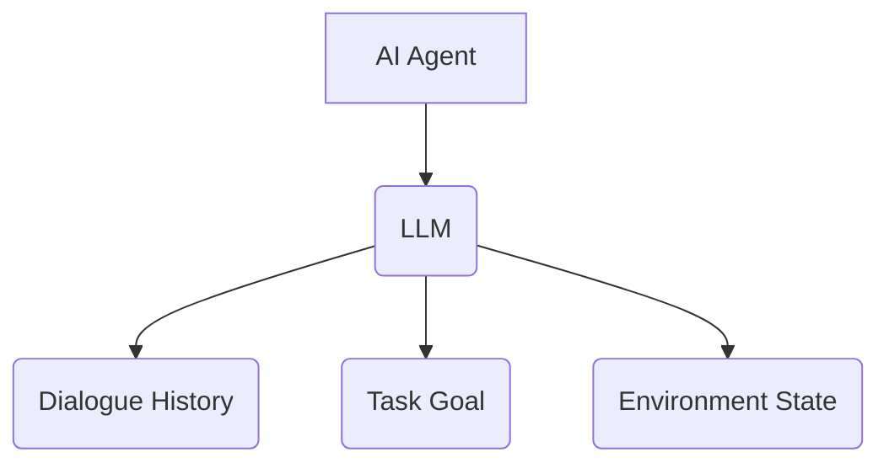
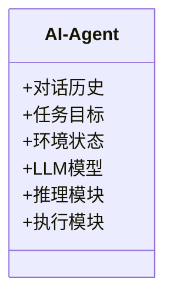
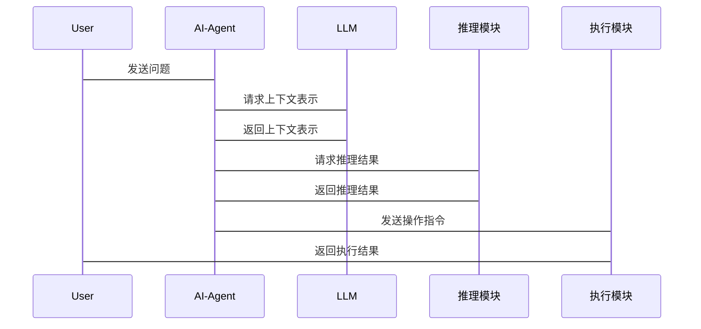

                 


# LLM在AI Agent上下文理解中的应用

## 关键词
- Large Language Models (LLM)
- AI Agent
- Context Understanding
- Natural Language Processing (NLP)
- Transformer Models

## 摘要
本文探讨了大型语言模型（LLM）在AI代理（AI Agent）上下文理解中的应用。通过分析LLM的基本原理、AI Agent的结构及其在上下文理解中的作用，本文详细讲解了如何利用LLM提升AI代理的自然语言处理能力。文章从背景介绍、核心概念、算法原理、系统架构到项目实战，逐步展开，结合实际案例和代码示例，深入剖析了LLM在上下文理解中的应用及其面临的挑战与解决方案。

---

# 第1章 背景介绍

## 1.1 问题背景

### 1.1.1 AI Agent的发展历程
AI Agent是一种智能体，能够感知环境并执行任务。从专家系统到基于机器学习的Agent，AI Agent经历了从规则驱动到数据驱动的演变。随着深度学习的发展，AI Agent的能力得到了显著提升。

### 1.1.2 上下文理解在AI Agent中的重要性
上下文理解是AI Agent与人类交互的关键。通过理解对话历史、任务背景和用户意图，AI Agent能够提供更精准的服务。例如，在客服系统中，理解上下文可以帮助AI Agent更好地解决用户问题。

### 1.1.3 LLM的崛起与应用
LLM如GPT-3、PaLM等模型的出现，使得自然语言处理能力大幅提升。这些模型具有强大的上下文理解和生成能力，为AI Agent的应用提供了新的可能性。

## 1.2 问题描述

### 1.2.1 AI Agent上下文理解的核心问题
AI Agent需要在动态环境中理解上下文，包括对话历史、任务目标和环境状态。传统方法依赖规则或少量训练数据，难以处理复杂场景。

### 1.2.2 当前技术的局限性
现有的NLP模型在处理复杂上下文时表现有限，且难以适应多任务和动态环境。AI Agent的响应往往缺乏连贯性和上下文相关性。

### 1.2.3 LLM在解决这些问题中的潜力
LLM通过自注意力机制和大规模预训练，能够捕捉长距离依赖关系，理解复杂的上下文信息。这使得AI Agent能够更准确地理解用户意图和环境信息。

## 1.3 问题解决

### 1.3.1 LLM如何增强上下文理解
LLM通过上下文窗口和自注意力机制，能够理解对话历史和任务背景。这使得AI Agent能够生成连贯且相关的响应。

### 1.3.2 LLM在AI Agent中的具体应用
LLM可以用于对话生成、任务规划和环境推理。例如，在智能音箱中，LLM帮助AI Agent理解用户的上下文并生成适当的回复。

### 1.3.3 LLM的优势与挑战
优势包括强大的上下文理解和通用性。挑战包括计算资源消耗和模型调优的复杂性。

## 1.4 边界与外延

### 1.4.1 上下文理解的边界
上下文理解的范围和深度受限于模型的训练数据和计算能力。例如，模型可能无法处理超出训练范围的复杂任务。

### 1.4.2 LLM应用的边界
LLM适用于需要自然语言处理的场景，但在需要实时推理或处理新数据的任务中可能表现不佳。

### 1.4.3 相关技术的外延
结合知识图谱和强化学习可以进一步提升LLM的上下文理解和任务执行能力。

## 1.5 概念结构与核心要素组成

### 1.5.1 AI Agent的构成要素
AI Agent由感知模块、推理模块和执行模块组成。感知模块负责理解上下文，推理模块制定策略，执行模块执行任务。

### 1.5.2 上下文理解的核心要素
上下文包括对话历史、任务目标和环境状态。这些要素帮助AI Agent理解和生成相关文本。

### 1.5.3 LLM在其中的角色与作用
LLM作为AI Agent的感知模块，负责理解和生成文本。它通过上下文理解帮助AI Agent制定更精准的策略。

## 1.6 本章小结
本章介绍了AI Agent和上下文理解的基本概念，分析了LLM在AI Agent中的潜力和挑战。接下来的章节将详细探讨LLM的原理及其在上下文理解中的应用。

---

# 第2章 核心概念与联系

## 2.1 核心概念原理

### 2.1.1 LLM的基本原理
LLM基于Transformer架构，通过自注意力机制捕捉上下文信息。模型通过大量数据预训练，具备强大的文本生成和理解能力。

### 2.1.2 AI Agent的核心机制
AI Agent通过感知、推理和执行模块完成任务。感知模块负责理解环境信息，推理模块制定策略，执行模块执行动作。

### 2.1.3 上下文理解的实现方式
上下文理解通过分析对话历史、任务目标和环境信息，生成连贯的响应。LLM通过自注意力机制实现上下文感知。

## 2.2 概念属性特征对比

### 2.2.1 LLM与传统NLP模型的对比
| 特性       | LLM                | 传统NLP模型          |
|------------|--------------------|----------------------|
| 模型结构     | 基于Transformer     | 基于RNN或CNN         |
| 上下文能力   | 强大的上下文理解   | 较弱的上下文理解     |
| 训练数据     | 大规模            | 较小规模             |
| 应用场景     | 多任务通用         | 专一任务             |

### 2.2.2 AI Agent与传统专家系统的对比
| 特性       | AI Agent           | 传统专家系统         |
|------------|--------------------|----------------------|
| 决策方式     | 数据驱动           | 规则驱动             |
| 适应性       | 高                 | 低                   |
| 复杂性       | 高                 | 低                   |

### 2.2.3 上下文理解的特征分析
上下文理解具有动态性、关联性和情境性。动态性指上下文随时间变化，关联性指信息间的联系，情境性指上下文依赖于具体场景。

## 2.3 ER实体关系



---

# 第3章 算法原理讲解

## 3.1 算法原理概述

### 3.1.1 LLM的训练过程
LLM通过自监督学习预训练，使用大规模文本数据进行无监督学习。训练目标是预测下一个词，通过交叉熵损失函数优化模型。

### 3.1.2 自注意力机制
自注意力机制通过计算词与词之间的关系，生成上下文表示。公式如下：

$$
\text{Attention}(Q, K, V) = \text{softmax}\left(\frac{QK^T}{\sqrt{d_k}}\right)V
$$

其中，$Q$、$K$和$V$分别是查询、键和值向量，$d_k$是向量维度。

## 3.2 代码实现

### 3.2.1 代码示例

```python
import torch
import torch.nn as nn

class MultiHeadAttention(nn.Module):
    def __init__(self, embed_dim, num_heads):
        super().__init__()
        self.num_heads = num_heads
        self.head_dim = embed_dim // num_heads
        self.all_head_dim = embed_dim
        
        self.query = nn.Linear(embed_dim, embed_dim)
        self.key = nn.Linear(embed_dim, embed_dim)
        self.value = nn.Linear(embed_dim, embed_dim)
        
        self.dropout = nn.Dropout(0.1)
        
    def forward(self, x, mask=None):
        batch_size, seq_len, embed_dim = x.size()
        
        # 前向投影
        query = self.query(x)
        key = self.key(x)
        value = self.value(x)
        
        # 分割头
        query = query.view(batch_size, seq_len, self.num_heads, self.head_dim)
        key = key.view(batch_size, seq_len, self.num_heads, self.head_dim)
        value = value.view(batch_size, seq_len, self.num_heads, self.head_dim)
        
        # 转置
        query = query.permute(0, 2, 1, 3)
        key = key.permute(0, 2, 1, 3)
        value = value.permute(0, 2, 1, 3)
        
        # 计算点积
        attention_scores = (query @ key.transpose(-2, -1)) / (self.head_dim ** 0.5)
        
        if mask is not None:
            attention_scores = attention_scores.masked_fill(mask == 0, -float('inf'))
        
        attention_weights = torch.softmax(attention_scores, dim=-1)
        
        # 加权求和
        weighted_value = attention_weights @ value
        
        # 拼接头
        weighted_value = weighted_value.permute(0, 2, 1, 3)
        weighted_value = weighted_value.view(batch_size, seq_len, self.all_head_dim)
        
        return weighted_value
```

### 3.2.2 代码解读与分析
该代码实现了多头注意力机制，将输入的嵌入向量分割成多个头，计算每个头的注意力权重，最终生成加权后的值向量。多头机制增强了模型捕捉不同上下文信息的能力。

---

# 第4章 数学模型

## 4.1 关键公式

### 4.1.1 注意力机制公式
注意力权重计算公式：
$$
\alpha_i = \text{softmax}(\sum_{j} w_{ij} e_{ij})
$$

其中，$w_{ij}$是权重，$e_{ij}$是查询和键的相似度。

### 4.1.2 变换矩阵
嵌入向量的线性变换：
$$
Q = xW_q, \quad K = xW_k, \quad V = xW_v
$$

### 4.1.3 最终输出
加权求和：
$$
\text{Output} = \sum_{i} \alpha_i V_i
$$

## 4.2 公式推导

假设输入序列为$x_1, x_2, ..., x_n$，每个词的嵌入向量为$d$维。通过线性变换得到查询、键和值向量：

$$
Q = [q_1, q_2, ..., q_n], \quad K = [k_1, k_2, ..., k_n], \quad V = [v_1, v_2, ..., v_n]
$$

计算注意力权重：
$$
\alpha_{ij} = \frac{\exp(q_i \cdot k_j^T)}{\sum_{m} \exp(q_i \cdot k_m^T)}
$$

最终输出：
$$
\text{Output} = \sum_{j=1}^n \alpha_{ij} v_j
$$

---

# 第5章 系统分析与架构设计

## 5.1 问题场景介绍
在智能客服系统中，AI Agent需要理解用户的上下文，包括对话历史、问题类型和用户意图，以提供准确的响应。

## 5.2 项目介绍

### 5.2.1 项目目标
开发一个基于LLM的智能客服AI Agent，能够理解对话上下文并生成准确的回复。

### 5.2.2 系统功能设计



## 5.3 系统架构设计

### 5.3.1 系统架构图

```mermaid
container AI-Agent {
    component LLM {
        +输入：对话历史
        +输出：上下文表示
    }
    component 推理模块 {
        +输入：上下文表示
        +输出：推理结果
    }
    component 执行模块 {
        +输入：推理结果
        +输出：操作指令
    }
}
```

### 5.3.2 系统接口设计
AI Agent与外部系统交互，接收用户输入并发送执行指令。接口包括：

- 输入接口：接收用户消息和系统反馈。
- 输出接口：发送AI Agent的响应和操作指令。

## 5.4 系统交互流程

### 5.4.1 交互流程图



---

# 第6章 项目实战

## 6.1 环境安装

### 6.1.1 安装Python和依赖
```bash
pip install torch transformers
```

## 6.2 系统核心实现

### 6.2.1 实现代码

```python
from transformers import AutoTokenizer, AutoModelForCausalLM

model_name = "gpt2"
tokenizer = AutoTokenizer.from_pretrained(model_name)
model = AutoModelForCausalLM.from_pretrained(model_name)

def generate_response(context, model, tokenizer):
    inputs = tokenizer.encode(context + tokenizer.eos_token, return_tensors='pt')
    outputs = model.generate(inputs, max_length=100, do_sample=True)
    response = tokenizer.decode(outputs[0], skip_special_tokens=True)
    return response

# 示例上下文
context = "用户询问如何重置密码。"
response = generate_response(context, model, tokenizer)
print(response)
```

### 6.2.2 代码解读
上述代码加载预训练的GPT-2模型，定义了一个生成响应的函数。通过给定上下文，生成相关的回复。

## 6.3 实际案例分析

### 6.3.1 案例一
**上下文**: 用户询问如何重置密码。
**响应**: "您可以访问我们的网站，点击忘记密码，按照提示操作即可。"

### 6.3.2 案例二
**上下文**: 用户提到订单延迟，询问解决方案。
**响应**: "我们已记录您的问题，将在24小时内为您处理，请您保持关注邮件通知。"

## 6.4 项目小结
通过代码示例和实际案例，展示了LLM在AI Agent上下文理解中的应用。模型能够根据上下文生成相关的响应，提升用户体验。

---

# 第7章 总结与展望

## 7.1 小结
本文详细探讨了LLM在AI Agent上下文理解中的应用，从背景介绍到项目实战，系统地分析了LLM的优势和挑战。通过实际案例，展示了LLM在提升AI Agent能力中的潜力。

## 7.2 注意事项
在实际应用中，需要注意模型的计算资源消耗和调优，确保模型在实时环境中的高效运行。

## 7.3 拓展阅读
建议进一步阅读关于Transformer模型和大语言模型的论文，深入了解上下文理解和生成的机制。

## 7.4 作者
作者：AI天才研究院 & 禅与计算机程序设计艺术

---

# 附录
## 附录A: 参考文献
1. Vaswani, Ashish, et al. "Attention is all you need." arXiv preprint arXiv:1706.03798 (2017).
2. Radford, Alec, et al. "Language models are few-shot learners." arXiv preprint arXiv:1909.08899 (2019).

## 附录B: 代码仓库
GitHub仓库：[LLM-AI-Agent-Context-Understanding](https://github.com/yourusername/LLM-AI-Agent-Context-Understanding)

---

以上是《LLM在AI Agent上下文理解中的应用》的技术博客文章的完整目录和内容大纲。希望对您有所帮助！

