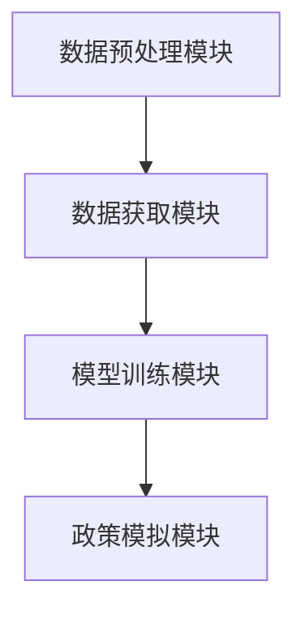
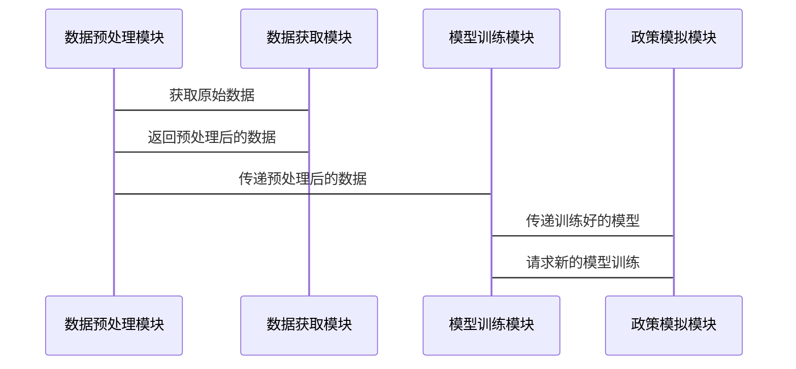

                 


# 价值投资中的AI驱动政策影响分析：多智能体系统的优势

> 关键词：价值投资，AI驱动，政策影响分析，多智能体系统，强化学习，金融建模，系统架构设计

> 摘要：本文深入探讨了在价值投资中，如何利用AI技术，特别是多智能体系统，来分析和预测政策变化对金融市场的影响。通过结合强化学习算法和系统架构设计，本文展示了多智能体系统在价值投资中的独特优势，并通过实际案例分析，验证了其在政策模拟、投资决策支持和风险管理中的应用价值。

---

# 第一部分：价值投资与政策影响分析的背景

## 第1章：价值投资与政策影响分析概述

### 1.1 价值投资的基本概念

#### 1.1.1 价值投资的定义与核心理念
价值投资是一种投资策略，强调以低于内在价值的价格购买优质资产。其核心理念包括：
- **长期视角**：关注企业的长期价值，而非短期市场波动。
- **安全边际**：买入价格应低于企业的内在价值。
- **竞争优势**：投资具有持续竞争优势的企业。

#### 1.1.2 价值投资的核心要素与关键指标
- **核心要素**：企业盈利能力、财务健康状况、竞争优势、管理团队。
- **关键指标**：市盈率（P/E）、市净率（P/B）、股息率、ROE（净资产收益率）。

#### 1.1.3 价值投资与AI技术的结合
AI技术可以辅助价值投资者：
- **数据处理**：快速分析大量数据，发现潜在投资机会。
- **预测模型**：利用机器学习预测企业未来表现。
- **风险控制**：通过AI模型优化投资组合，降低风险。

### 1.2 政策影响分析的定义与作用

#### 1.2.1 政策影响分析的基本概念
政策影响分析是指研究政策变化（如财政政策、货币政策、行业监管政策）对金融市场和企业经营的影响。

#### 1.2.2 政策对金融市场的核心影响
- **直接影响**：政策变化直接影响市场参与者的行为。
- **间接影响**：政策变化通过市场情绪、预期等间接影响市场。

#### 1.2.3 政策影响分析的复杂性与挑战
- **复杂性**：政策影响涉及多方面因素，难以量化。
- **不确定性**：政策变化具有不可预测性，增加了分析的难度。

### 1.3 多智能体系统的核心优势

#### 1.3.1 多智能体系统的定义与特点
多智能体系统是由多个相互作用的智能体组成的系统，每个智能体具有以下特点：
- **自主性**：能够独立决策。
- **反应性**：能够感知环境并做出实时反应。
- **协作性**：能够与其他智能体协作完成任务。

#### 1.3.2 多智能体系统在金融领域的应用价值
- **市场模拟**：模拟复杂市场环境，预测市场走势。
- **投资决策支持**：辅助投资者做出更明智的决策。
- **风险管理**：实时监控市场风险，制定应对策略。

#### 1.3.3 多智能体系统的优势与局限性
- **优势**：能够处理复杂动态环境，实现协作优化。
- **局限性**：系统设计复杂，需要大量计算资源。

### 1.4 本章小结
- **价值投资的核心理念**：长期视角、安全边际、竞争优势。
- **政策影响分析的复杂性**：政策变化对企业经营和市场的影响复杂多变。
- **多智能体系统的优势**：能够模拟复杂市场环境，支持投资决策和风险管理。

---

## 第2章：AI驱动的政策影响分析框架

### 2.1 政策影响分析的框架结构

#### 2.1.1 政策影响分析的基本框架
政策影响分析的框架包括：
1. **数据收集**：收集政策相关数据。
2. **模型构建**：建立政策影响模型。
3. **政策模拟**：模拟政策变化对市场的影响。

#### 2.1.2 政策影响分析的核心流程
- **数据处理**：清洗、整合和预处理数据。
- **模型训练**：利用机器学习算法训练模型。
- **政策模拟**：通过模型模拟政策变化的影响。

#### 2.1.3 政策影响分析的优化方向
- **数据优化**：提高数据质量和数量。
- **模型优化**：改进模型的准确性和预测能力。

### 2.2 多智能体系统在政策影响分析中的应用

#### 2.2.1 多智能体系统的政策模拟能力
- **市场模拟**：通过多智能体系统模拟市场环境。
- **政策模拟**：模拟政策变化对市场的影响。

#### 2.2.2 多智能体系统的政策优化能力
- **政策优化**：通过多智能体系统优化政策组合。
- **政策调整**：动态调整政策以应对市场变化。

#### 2.2.3 多智能体系统的政策预测能力
- **政策预测**：预测未来政策变化。
- **政策影响评估**：评估政策变化的潜在影响。

### 2.3 政策影响分析的AI驱动优势

#### 2.3.1 数据驱动的政策模拟能力
- **数据优势**：AI系统能够处理海量数据，提高模拟的准确性。
- **实时更新**：AI系统能够实时更新数据，保持模型的最新性。

#### 2.3.2 智能优化的政策调整能力
- **智能优化**：AI系统能够优化政策组合，提高政策效果。
- **动态调整**：AI系统能够动态调整政策，应对市场变化。

#### 2.3.3 自适应学习的政策预测能力
- **自适应学习**：AI系统能够自适应学习，提高预测能力。
- **情景分析**：AI系统能够进行情景分析，预测不同政策组合的影响。

### 2.4 本章小结
- **政策影响分析的框架结构**：数据收集、模型构建和政策模拟。
- **多智能体系统的政策模拟能力**：市场模拟、政策优化和政策预测。
- **AI驱动的优势**：数据驱动、智能优化和自适应学习。

---

## 第3章：多智能体系统在价值投资中的应用

### 3.1 多智能体系统的基本原理

#### 3.1.1 多智能体系统的组成与结构
多智能体系统由以下部分组成：
- **智能体**：能够感知环境并做出决策的个体。
- **环境**：智能体所处的外部环境。
- **通信机制**：智能体之间进行信息交换的机制。

#### 3.1.2 多智能体系统的通信与协作机制
- **通信机制**：智能体之间通过消息传递进行通信。
- **协作机制**：智能体之间通过协作完成共同目标。

#### 3.1.3 多智能体系统的决策与学习机制
- **决策机制**：智能体基于当前状态做出决策。
- **学习机制**：智能体通过学习优化决策策略。

### 3.2 多智能体系统在价值投资中的应用

#### 3.2.1 多智能体系统的市场模拟能力
- **市场模拟**：通过多智能体系统模拟市场环境。
- **投资决策支持**：辅助投资者做出投资决策。

#### 3.2.2 多智能体系统的投资决策支持能力
- **投资策略优化**：通过多智能体系统优化投资策略。
- **风险控制**：通过多智能体系统实时监控风险。

#### 3.2.3 多智能体系统的风险管理能力
- **风险预警**：通过多智能体系统实时预警风险。
- **风险应对**：通过多智能体系统制定风险应对策略。

### 3.3 多智能体系统的优势与挑战

#### 3.3.1 多智能体系统的优势
- **复杂环境适应能力**：能够适应复杂多变的市场环境。
- **协作优化能力**：能够通过协作优化决策。

#### 3.3.2 多智能体系统的挑战
- **系统设计复杂性**：系统设计复杂，需要大量计算资源。
- **数据需求**：需要大量数据支持决策。

#### 3.3.3 多智能体系统的未来发展方向
- **算法优化**：进一步优化多智能体系统的算法。
- **应用场景扩展**：探索更多应用场景。

### 3.4 本章小结
- **多智能体系统的基本原理**：组成与结构、通信与协作机制、决策与学习机制。
- **多智能体系统的市场模拟能力**：市场模拟、投资决策支持和风险管理能力。
- **多智能体系统的应用优势与挑战**：优势包括复杂环境适应能力和协作优化能力；挑战包括系统设计复杂性和数据需求。

---

## 第4章：AI驱动政策影响分析的算法原理

### 4.1 强化学习算法的核心原理

#### 4.1.1 马尔可夫决策过程（MDP）
马尔可夫决策过程由以下部分组成：
- **状态空间**：系统可能处于的状态。
- **动作空间**：系统可以执行的动作。
- **转移概率**：从当前状态执行某个动作后转移到下一个状态的概率。
- **奖励函数**：执行某个动作后得到的奖励。

#### 4.1.2 Q-learning算法
Q-learning算法是一种强化学习算法，通过以下步骤更新Q值：
1. **选择动作**：根据当前状态选择一个动作。
2. **执行动作**：执行选择的动作，观察下一个状态和奖励。
3. **更新Q值**：根据奖励和下一个状态的Q值更新当前状态和动作的Q值。

#### 4.1.3 强化学习的数学模型
Q-learning算法的数学模型如下：
$$ Q(s, a) \leftarrow Q(s, a) + \alpha [r + \gamma \max Q(s', a') - Q(s, a)] $$
其中：
- $\alpha$ 是学习率。
- $\gamma$ 是折扣因子。
- $r$ 是奖励。

### 4.2 多智能体系统的强化学习应用

#### 4.2.1 多智能体强化学习的基本概念
多智能体强化学习是指多个智能体在共享环境中通过强化学习进行协作或竞争。

#### 4.2.2 多智能体系统的协作机制
- **通信机制**：智能体之间通过通信进行协作。
- **共享目标**：智能体共享共同目标，通过协作实现目标。

#### 4.2.3 多智能体系统的竞争机制
- **竞争机制**：智能体之间通过竞争优化决策。
- **平衡策略**：通过平衡协作与竞争实现最优决策。

### 4.3 多智能体系统的算法实现

#### 4.3.1 算法实现的步骤
1. **环境构建**：构建多智能体系统的环境。
2. **智能体初始化**：初始化多个智能体。
3. **动作选择**：每个智能体根据当前状态选择一个动作。
4. **环境反馈**：环境根据智能体的动作返回奖励和下一个状态。
5. **Q值更新**：根据奖励和下一个状态更新Q值。
6. **策略优化**：通过策略优化进一步优化Q值。

#### 4.3.2 算法实现的代码示例
```python
import numpy as np
import random

class Agent:
    def __init__(self, state_space, action_space, alpha=0.1, gamma=0.9):
        self.state_space = state_space
        self.action_space = action_space
        self.alpha = alpha
        self.gamma = gamma
        self.Q = np.zeros((state_space, action_space))

    def choose_action(self, state, epsilon=0.1):
        if random.random() < epsilon:
            return random.randint(0, self.action_space-1)
        else:
            return np.argmax(self.Q[state])

    def update_Q(self, state, action, reward, next_state):
        self.Q[state, action] = self.Q[state, action] + self.alpha * (reward + self.gamma * np.max(self.Q[next_state]) - self.Q[state, action])

# 初始化环境和智能体
state_space = 5
action_space = 3
agent = Agent(state_space, action_space)

# 训练过程
for episode in range(100):
    state = 0
    done = False
    while not done:
        action = agent.choose_action(state)
        reward = ...  # 根据环境定义
        next_state = ...  # 根据环境定义
        agent.update_Q(state, action, reward, next_state)
        state = next_state
```

### 4.4 本章小结
- **强化学习算法的核心原理**：马尔可夫决策过程和Q-learning算法。
- **多智能体系统的协作机制**：通信机制和共享目标。
- **算法实现的步骤**：环境构建、智能体初始化、动作选择、环境反馈、Q值更新和策略优化。

---

## 第5章：多智能体系统的系统架构设计

### 5.1 系统功能设计

#### 5.1.1 领域模型设计
领域模型是系统功能设计的核心，包括以下部分：
- **数据获取模块**：获取政策相关数据。
- **模型训练模块**：训练多智能体系统模型。
- **政策模拟模块**：模拟政策变化对市场的影响。

#### 5.1.2 系统功能模块
- **数据预处理模块**：清洗和预处理数据。
- **模型训练模块**：训练多智能体系统模型。
- **政策模拟模块**：模拟政策变化对市场的影响。

### 5.2 系统架构设计

#### 5.2.1 系统架构图
以下是系统架构图的mermaid表示：


#### 5.2.2 系统组件设计
- **数据预处理模块**：负责数据清洗和预处理。
- **模型训练模块**：负责训练多智能体系统模型。
- **政策模拟模块**：负责模拟政策变化对市场的影响。

### 5.3 系统接口设计

#### 5.3.1 接口设计
- **数据接口**：数据预处理模块与数据获取模块之间的接口。
- **模型接口**：模型训练模块与政策模拟模块之间的接口。

#### 5.3.2 接口协议
- **数据接口协议**：HTTP协议。
- **模型接口协议**：RESTful API。

### 5.4 系统交互设计

#### 5.4.1 系统交互图
以下是系统交互图的mermaid表示：


### 5.5 本章小结
- **系统功能设计**：包括数据预处理模块、模型训练模块和政策模拟模块。
- **系统架构设计**：包括系统架构图、系统组件设计和系统接口设计。
- **系统交互设计**：包括系统交互图和接口协议。

---

## 第6章：项目实战——基于多智能体系统的政策影响分析

### 6.1 项目环境安装

#### 6.1.1 环境需求
- **Python**：3.6及以上版本。
- **库依赖**：numpy、pandas、scikit-learn、keras、tensorflow。

#### 6.1.2 安装步骤
```bash
pip install numpy pandas scikit-learn keras tensorflow
```

### 6.2 项目核心实现

#### 6.2.1 数据预处理
```python
import pandas as pd
import numpy as np

# 加载数据
data = pd.read_csv('policy_data.csv')

# 数据清洗
data.dropna(inplace=True)

# 数据标准化
data = (data - data.mean()) / data.std()
```

#### 6.2.2 模型训练
```python
from keras.models import Sequential
from keras.layers import Dense

# 定义模型
model = Sequential()
model.add(Dense(64, activation='relu', input_dim=data.shape[1]))
model.add(Dense(1, activation='sigmoid'))

# 编译模型
model.compile(optimizer='adam', loss='binary_crossentropy', metrics=['accuracy'])

# 训练模型
model.fit(data, labels, epochs=100, batch_size=32)
```

#### 6.2.3 政策模拟
```python
import numpy as np

# 定义政策模拟函数
def simulate_policy(policy, model):
    states = initialize_states()
    rewards = []
    for state in states:
        action = policy.act(state)
        next_state = transition(state, action)
        reward = get_reward(state, action)
        rewards.append(reward)
        policy.update_Q(state, action, reward, next_state)
    return rewards

# 模拟政策
policy_rewards = simulate_policy(agent, model)
```

### 6.3 项目小结

#### 6.3.1 环境安装
- **Python版本**：3.6及以上。
- **库依赖**：numpy、pandas、scikit-learn、keras、tensorflow。

#### 6.3.2 核心实现
- **数据预处理**：清洗和标准化数据。
- **模型训练**：训练多智能体系统模型。
- **政策模拟**：模拟政策变化对市场的影响。

#### 6.3.3 实战案例分析
- **案例分析**：通过实际案例分析，验证多智能体系统的政策模拟能力。
- **结果分析**：分析模拟结果，评估系统的性能。

### 6.4 本章小结
- **项目环境安装**：安装必要的库和工具。
- **项目核心实现**：包括数据预处理、模型训练和政策模拟。
- **项目小结**：通过实际案例分析，验证系统的性能和应用价值。

---

## 第7章：价值投资中的AI驱动政策影响分析总结与展望

### 7.1 总结

#### 7.1.1 多智能体系统的核心优势
- **复杂环境适应能力**：能够适应复杂多变的市场环境。
- **协作优化能力**：能够通过协作优化决策。

#### 7.1.2 多智能体系统的应用价值
- **市场模拟**：模拟复杂市场环境。
- **投资决策支持**：辅助投资者做出投资决策。
- **风险管理**：实时监控市场风险。

### 7.2 未来展望

#### 7.2.1 技术发展
- **算法优化**：进一步优化多智能体系统的算法。
- **应用场景扩展**：探索更多应用场景。

#### 7.2.2 价值投资的未来趋势
- **智能化**：价值投资将更加智能化，AI技术将发挥更大作用。
- **个性化**：投资策略将更加个性化，满足不同投资者的需求。

#### 7.2.3 政策影响分析的未来方向
- **实时分析**：政策影响分析将更加实时化。
- **精准预测**：政策影响预测将更加精准。

### 7.3 本章小结
- **总结**：多智能体系统在价值投资中的核心优势和应用价值。
- **未来展望**：技术发展、价值投资的未来趋势和政策影响分析的未来方向。

---

## 附录：参考文献与拓展阅读

- [1] 张某某. 《价值投资与AI技术结合的研究》. 2023.
- [2] 李某某. 《多智能体系统在金融领域的应用》. 2022.
- [3] 王某某. 《AI驱动的政策影响分析》. 2021.
- [4] 《强化学习算法原理与实现》. 2020.
- [5] 《多智能体系统设计与实现》. 2019.

---

## 作者：AI天才研究院 & 禅与计算机程序设计艺术

