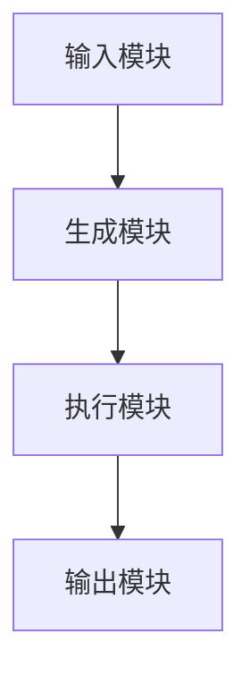
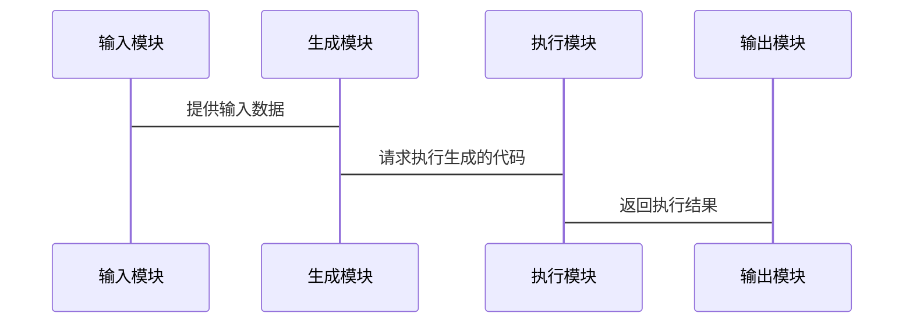

                 


# 元编程技术：使AI Agent具备代码生成能力

> 关键词：元编程，AI Agent，代码生成，生成式AI，系统架构，代码生成器

> 摘要：本文深入探讨了元编程技术如何赋予AI Agent代码生成的能力。从基本概念到数学模型，从系统架构到项目实战，全面解析了AI Agent代码生成的实现原理和应用场景。文章还结合实际案例，详细讲解了代码生成器的设计与实现，为读者提供了一套完整的解决方案。

---

## 第1章: 元编程技术基础

### 1.1 元编程的基本概念

#### 1.1.1 元编程的定义与特点
元编程（Meta Programming）是一种编写程序的技术，其核心思想是“程序能够理解并操作自己的结构”。元编程的特点包括：
- **自描述性**：程序能够描述自身的结构和行为。
- **灵活性**：程序可以根据特定需求动态调整自身的行为。
- **抽象性**：元编程通过抽象语法树（AST）或中间表示（IR）等手段，提供高度的代码生成能力。

#### 1.1.2 元编程的核心思想
元编程的核心思想在于“程序生成程序”。通过元编程技术，AI Agent可以动态生成代码，从而实现高度定制化和自动化的目标。元编程的关键在于对代码结构的理解和操作能力，这使得AI Agent能够在运行时动态生成代码，满足复杂场景的需求。

#### 1.1.3 元编程与传统编程的区别
传统编程是基于固定的语法和语义进行代码编写，而元编程则允许程序在运行时生成新的代码。这种动态性使得元编程在AI Agent中具有重要应用，尤其是在代码生成和自动化任务中。

### 1.2 AI Agent的基本概念

#### 1.2.1 AI Agent的定义
AI Agent（人工智能代理）是指能够感知环境、执行任务并做出决策的智能体。AI Agent通过与环境交互，利用感知信息和内部状态，采取行动以实现目标。

#### 1.2.2 AI Agent的类型与特点
AI Agent可以分为以下几类：
- **简单反射型**：基于当前感知做出反应。
- **基于模型的反射型**：利用内部模型进行推理和决策。
- **目标驱动型**：根据目标选择行动。
- **效用驱动型**：基于效用函数优化决策。

#### 1.2.3 AI Agent的应用场景
AI Agent广泛应用于机器人控制、自动驾驶、智能助手、推荐系统等领域。通过元编程技术，AI Agent可以动态生成代码，从而实现高度定制化和智能化的功能。

---

## 第2章: 元编程技术与AI Agent的结合

### 2.1 元编程在AI Agent中的作用

#### 2.1.1 元编程如何增强AI Agent的能力
元编程赋予AI Agent动态生成代码的能力，使其能够根据特定需求生成定制化代码，从而实现复杂任务的自动化。例如，AI Agent可以根据输入数据动态生成数据处理代码，优化数据处理流程。

#### 2.1.2 元编程在AI Agent代码生成中的应用
元编程技术在AI Agent中的应用包括：
- **代码自动生成**：AI Agent可以根据任务需求动态生成代码。
- **动态配置**：AI Agent可以根据环境变化动态调整配置。
- **自适应优化**：AI Agent可以根据性能指标动态优化代码。

### 2.2 元编程技术的核心原理

#### 2.2.1 元编程的执行模型
元编程的执行模型通常包括以下几个步骤：
1. **解析输入**：AI Agent解析输入数据，理解任务需求。
2. **生成代码**：根据需求生成相应的代码。
3. **执行代码**：执行生成的代码，获得输出结果。
4. **反馈优化**：根据反馈优化生成代码的质量。

#### 2.2.2 元编程与代码生成的关系
元编程通过操作代码结构，使得AI Agent能够生成代码。代码生成器是元编程技术的核心工具，它允许程序根据输入生成符合特定需求的代码。

#### 2.2.3 元编程的实现机制
元编程的实现机制包括：
- **抽象语法树（AST）**：通过操作AST节点生成代码。
- **模板引擎**：通过模板生成代码。
- **代码生成器框架**：利用框架提供的API生成代码。

---

## 第3章: 生成式AI的数学模型

### 3.1 Transformer模型的原理

#### 3.1.1 自注意力机制的数学公式
自注意力机制的数学公式可以表示为：
$$
\text{Attention}(Q, K, V) = \text{softmax}\left(\frac{QK^T}{\sqrt{d_k}}\right)V
$$
其中，$Q$、$K$、$V$分别是查询、键和值向量，$d_k$是向量的维度。

#### 3.1.2 前馈神经网络的结构
Transformer的前馈神经网络由两个全连接层组成，中间使用ReLU激活函数：
$$
\text{FFN}(x) = \text{ReLU}(W_1x + b_1)W_2 + b_2
$$

#### 3.1.3 模型的训练过程
Transformer模型的训练过程包括：
1. **输入嵌入**：将输入序列映射为嵌入向量。
2. **自注意力计算**：计算自注意力权重。
3. **前馈网络计算**：生成最终的输出向量。
4. **损失计算**：计算模型的损失函数。

### 3.2 代码生成的算法原理

#### 3.2.1 基于GPT的代码生成模型
基于GPT的代码生成模型通过自回归的方式生成代码。其核心思想是利用上下文信息预测下一个字符。

#### 3.2.2 基于BERT的代码生成模型
基于BERT的代码生成模型通过双向Transformer结构生成代码。其核心思想是利用全局上下文信息生成代码。

#### 3.2.3 其他代码生成算法的对比
除了GPT和BERT，还有其他代码生成算法，如T5和CodeT5。这些算法在模型结构和训练策略上有所不同，但总体思想相似。

---

## 第4章: 元编程技术的数学公式

### 4.1 自注意力机制的公式推导

#### 4.1.1 查询、键、值的计算公式
查询、键、值的计算公式为：
$$
Q = W_qx, \quad K = W_kx, \quad V = W_vx
$$
其中，$W_q$、$W_k$、$W_v$是参数矩阵，$x$是输入向量。

#### 4.1.2 注意力权重的计算公式
注意力权重的计算公式为：
$$
\text{Attention}(Q, K, V) = \text{softmax}\left(\frac{QK^T}{\sqrt{d_k}}\right)V
$$

#### 4.1.3 最终输出的计算公式
最终输出的计算公式为：
$$
\text{Output} = \text{FFN}(Q, K, V)
$$

### 4.2 代码生成模型的数学表达

#### 4.2.1 模型的输入输出关系
代码生成模型的输入输出关系为：
$$
P(y|x) = \text{softmax}(W_yh + b_y)
$$
其中，$h$是模型的隐藏状态，$y$是生成的下一个字符。

#### 4.2.2 模型的损失函数
模型的损失函数通常使用交叉熵损失：
$$
\mathcal{L} = -\sum_{i=1}^{n}\sum_{j=1}^{m} y_{i,j}\log p(y_{i,j}|x_i)
$$

#### 4.2.3 模型的优化算法
模型的优化算法通常使用Adam优化器：
$$
\theta = \theta - \eta\nabla_\theta \mathcal{L}
$$

---

## 第5章: 系统分析与功能设计

### 5.1 问题场景介绍

#### 5.1.1 AI Agent代码生成的典型场景
AI Agent代码生成的典型场景包括：
- **自动化测试**：生成自动化测试代码。
- **数据处理**：生成数据处理代码。
- **系统配置**：生成系统配置代码。

#### 5.1.2 元编程技术的应用需求
元编程技术在AI Agent中的应用需求包括：
- **动态性**：程序能够动态生成代码。
- **灵活性**：程序能够根据需求调整代码。
- **高效性**：程序能够快速生成代码。

### 5.2 系统功能设计

#### 5.2.1 领域模型设计
领域模型设计包括：
- **输入解析**：解析输入数据。
- **代码生成**：生成代码。
- **代码执行**：执行生成的代码。

#### 5.2.2 功能模块划分
功能模块划分包括：
- **输入模块**：接收输入数据。
- **生成模块**：生成代码。
- **执行模块**：执行代码并返回结果。

#### 5.2.3 用户需求分析
用户需求分析包括：
- **目标**：用户希望生成什么类型的代码。
- **输入**：用户提供的输入数据。
- **输出**：用户期望的输出结果。

---

## 第6章: 系统架构设计

### 6.1 系统架构图
以下是系统架构图的Mermaid代码：


### 6.2 系统接口设计

#### 6.2.1 输入接口
输入接口包括：
- **输入类型**：支持多种输入类型，如文本、JSON等。
- **输入解析**：解析输入数据并生成代码。

#### 6.2.2 输出接口
输出接口包括：
- **输出格式**：支持多种输出格式，如Python、Java等。
- **输出结果**：返回生成的代码。

### 6.3 系统交互流程

#### 6.3.1 系统交互mermaid序列图
以下是系统交互的Mermaid序列图：


---

## 第7章: 项目实战

### 7.1 环境安装

#### 7.1.1 安装Python
安装Python：
```
sudo apt-get install python3
```

#### 7.1.2 安装依赖库
安装依赖库：
```
pip install transformers
pip install numpy
pip install matplotlib
```

### 7.2 系统核心实现源代码

#### 7.2.1 生成代码
生成代码的Python代码如下：
```python
from transformers import AutoTokenizer, AutoModelForCausalLM

tokenizer = AutoTokenizer.from_pretrained('gpt2')
model = AutoModelForCausalLM.from_pretrained('gpt2')

def generate_code(prefix):
    inputs = tokenizer(prefix, return_tensors='np')
    outputs = model.generate(**inputs, max_length=50)
    code = tokenizer.decode(outputs[0])
    return code

print(generate_code("def add(a, b):"))
```

#### 7.2.2 执行代码
执行代码的Python代码如下：
```python
import subprocess

def execute_code(code):
    with open('temp.py', 'w') as f:
        f.write(code)
    subprocess.run(['python', 'temp.py'])
    subprocess.os.remove('temp.py')

execute_code("print('Hello, World!')")
```

### 7.3 代码应用解读与分析

#### 7.3.1 代码生成器的设计与实现
代码生成器的设计与实现包括：
- **输入解析**：解析用户的输入。
- **代码生成**：根据输入生成代码。
- **代码执行**：执行生成的代码并返回结果。

#### 7.3.2 实际案例分析
实际案例分析包括：
- **案例1**：生成一个简单的Python函数。
- **案例2**：生成一个复杂的机器学习模型。

### 7.4 项目小结

#### 7.4.1 项目实现的难点
项目实现的难点包括：
- **代码生成的准确性**：如何提高代码生成的准确性。
- **代码执行的安全性**：如何保证代码执行的安全性。

#### 7.4.2 项目的总结
项目的总结包括：
- **成果**：成功实现了一个基于元编程技术的AI Agent代码生成器。
- **经验**：在实现过程中积累的经验和教训。
- **展望**：未来的研究方向和改进空间。

---

## 第8章: 最佳实践、小结、注意事项、拓展阅读

### 8.1 最佳实践 tips
- **选择合适的模型**：选择适合任务的模型。
- **优化代码生成器**：优化代码生成器的性能。
- **确保代码安全**：确保代码生成和执行的安全性。

### 8.2 小结
本文深入探讨了元编程技术如何赋予AI Agent代码生成的能力。从基本概念到数学模型，从系统架构到项目实战，全面解析了AI Agent代码生成的实现原理和应用场景。通过实际案例的分析，读者可以更好地理解元编程技术在AI Agent中的应用。

### 8.3 注意事项
- **模型的选择**：选择适合任务的模型。
- **代码的安全性**：确保代码生成和执行的安全性。
- **性能的优化**：优化代码生成器的性能。

### 8.4 拓展阅读
- **论文推荐**：推荐一些与元编程技术相关的论文。
- **工具推荐**：推荐一些与元编程技术相关的工具。
- **资源推荐**：推荐一些与元编程技术相关的学习资源。

---

## 作者信息

作者：AI天才研究院/AI Genius Institute & 禅与计算机程序设计艺术 /Zen And The Art of Computer Programming

