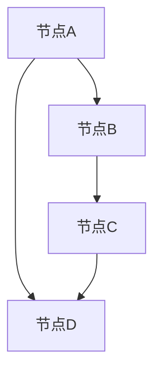
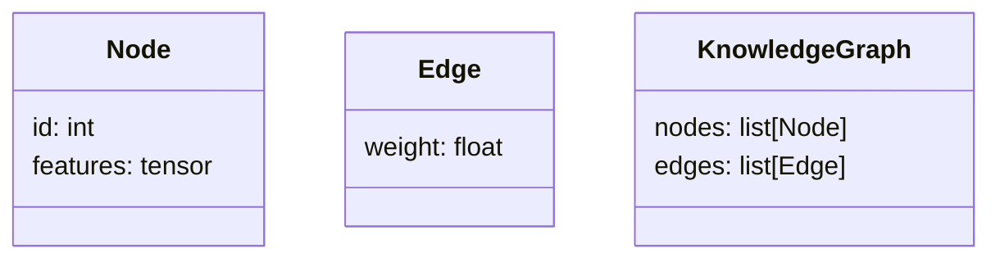
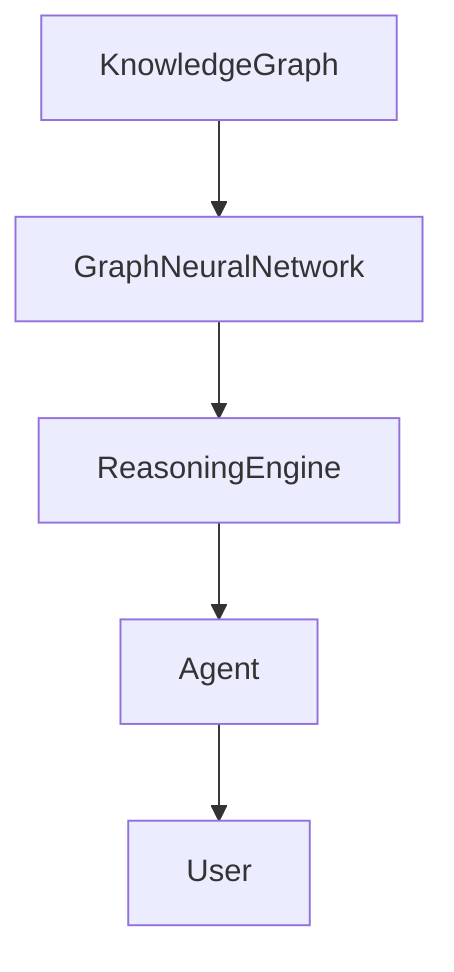
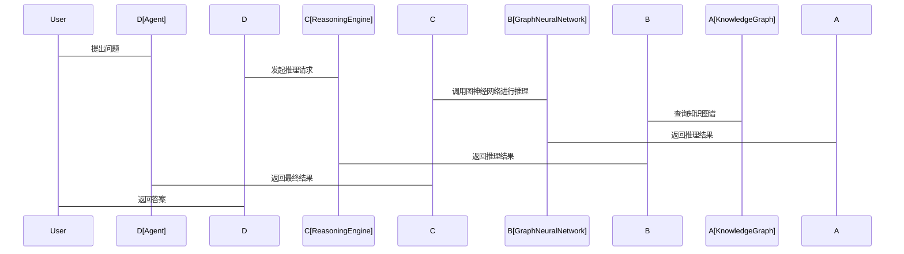

                 


# 基于图神经网络的AI Agent知识推理

## 关键词：图神经网络、AI Agent、知识推理、知识图谱、实体关系图、节点表示、边权重

## 摘要：本文系统地探讨了基于图神经网络的AI Agent知识推理方法，从问题背景、核心概念、算法原理、系统架构到实际应用，全面解析了图神经网络在知识推理中的优势和应用。通过详细分析图神经网络的节点表示和边权重计算，结合AI Agent的知识表示与推理机制，本文提出了一个基于图神经网络的知识推理框架，并通过实际案例展示了其在复杂知识图谱中的应用效果。

---

## 第一部分: 基于图神经网络的AI Agent知识推理背景介绍

## 第1章: 问题背景与描述

### 1.1 问题背景

#### 1.1.1 知识推理的定义与重要性
知识推理是指通过已有的知识库或图谱，推导出新的事实或关系的过程。它是实现智能系统的核心能力之一。在AI Agent（智能体）中，知识推理能力直接决定了其理解和解决问题的能力。

#### 1.1.2 图神经网络的引入背景
传统的知识推理方法依赖于逻辑规则或基于向量的表示方法，但这些方法在处理复杂的语义关系和大规模图结构时表现有限。图神经网络（Graph Neural Networks, GNNs）通过直接建模图结构中的节点和边，能够更好地捕捉实体之间的关系，因此成为知识推理的新宠。

#### 1.1.3 AI Agent在知识推理中的角色
AI Agent通过知识推理能够理解输入的信息，并在此基础上生成新的结论或行动计划。在智能问答、对话系统、推荐系统等领域，知识推理能力是实现智能化的关键。

### 1.2 问题描述

#### 1.2.1 知识推理的核心挑战
- 复杂的关系抽取：实体之间的关系可能隐含且多样。
- 高维空间中的语义表示：如何在高维空间中准确表示实体及其关系。
- 动态知识的更新：知识图谱是动态变化的，如何实时更新推理能力。

#### 1.2.2 图神经网络的优势
- 自然处理图结构数据。
- 能够捕捉复杂的语义关系。
- 可以并行处理大规模数据。

#### 1.2.3 AI Agent的知识推理需求
- 实时性：快速推理能力。
- 准确性：推理结果的可靠性。
- 可解释性：推理过程的透明性。

### 1.3 问题解决

#### 1.3.1 图神经网络如何解决知识推理问题
通过图神经网络，可以将知识图谱中的实体和关系建模为图结构，并通过节点表示和边权重计算，实现知识的深度表示和推理。

#### 1.3.2 AI Agent的知识表示与推理方法
AI Agent通过将知识表示为图结构，利用图神经网络进行推理，从而生成新的知识或行动策略。

#### 1.3.3 知识图谱的构建与应用
知识图谱的构建为AI Agent提供了丰富的语义信息，而图神经网络则为知识图谱的推理提供了强大的工具。

### 1.4 边界与外延

#### 1.4.1 知识推理的边界
- 数据质量：知识图谱的准确性直接影响推理结果。
- 计算资源：大规模图结构需要强大的计算能力。
- 推理深度：当前主要局限于浅层推理。

#### 1.4.2 图神经网络的适用范围
适用于处理图结构数据的问题，如社交网络分析、推荐系统、知识图谱推理等。

#### 1.4.3 AI Agent的知识推理能力的限制
目前主要局限于基于知识图谱的推理，难以处理复杂的情感理解和多模态信息。

### 1.5 概念结构与核心要素

#### 1.5.1 知识推理的核心概念
- 实体：知识图谱中的基本元素。
- 关系：实体之间的联系。
- 三元组：(头实体, 关系, 尾实体)。

#### 1.5.2 图神经网络的关键要素
- 节点：对应知识图谱中的实体。
- 边：对应实体之间的关系。
- 节点表示：实体的低维向量表示。

#### 1.5.3 AI Agent的知识推理框架
- 输入：知识图谱和查询。
- 输出：推理结果或行动计划。
- 核心模块：知识表示、推理引擎。

---

## 第二部分: 核心概念与联系

## 第2章: 图神经网络与AI Agent的核心概念

### 2.1 图神经网络的原理

#### 2.1.1 图表示学习的原理
通过将图结构数据映射到低维空间，提取节点的特征表示。

#### 2.1.2 图神经网络的节点表示方法
- 基于邻居信息的聚合方法：将邻居节点的特征聚合到中心节点。
- 基于注意力机制的加权聚合：根据邻居的重要性加权聚合。

#### 2.1.3 图神经网络的边权重计算
通过节点表示的相似度或相关性计算边的权重。

### 2.2 AI Agent的知识推理机制

#### 2.2.1 知识表示的三元组模型
将知识表示为三元组（头实体，关系，尾实体）。

#### 2.2.2 知识图谱的构建与存储
通过爬取、抽取和整合多源数据，构建大规模的知识图谱。

#### 2.2.3 知识推理的逻辑规则
基于知识图谱中的三元组，通过逻辑推理生成新的三元组。

### 2.3 核心概念对比

#### 2.3.1 图神经网络与传统神经网络的对比
| 特性                | 图神经网络                     | 传统神经网络                 |
|---------------------|-------------------------------|-----------------------------|
| 数据类型            | 图结构数据                     | 结构化数据                   |
| 处理能力            | 处理复杂关系                  | 处理单一类型数据             |
| 表示能力            | 能捕捉图结构信息               | 无法捕捉复杂关系             |

#### 2.3.2 AI Agent与传统知识推理系统的对比
| 特性                | AI Agent                      | 传统知识推理系统             |
|---------------------|-------------------------------|-----------------------------|
| 输入                | 动态输入，实时更新            | 静态输入                    |
| 输出                | 动作或决策                    | 推理结果                    |
| 交互能力            | 高度交互，实时反馈            | 单向推理                    |

#### 2.3.3 知识图谱与传统数据库的对比
| 特性                | 知识图谱                     | 传统数据库                 |
|---------------------|-------------------------------|-----------------------------|
| 数据结构            | 图结构                       | 行数据                     |
| 查询能力            | 支持复杂语义查询             | 支持简单的条件查询         |
| 可扩展性            | 支持动态扩展                 | 难以动态扩展               |

### 2.4 实体关系图的Mermaid流程图



---

## 第三部分: 算法原理讲解

## 第3章: 图神经网络算法原理

### 3.1 图神经网络的算法流程

#### 3.1.1 节点表示的初始化
每个节点初始化为一个随机向量。

#### 3.1.2 节点表示的更新
通过聚合邻居节点的特征更新中心节点的表示。

#### 3.1.3 边权重的计算
根据节点表示的相似度计算边的权重。

### 3.2 图神经网络的实现

#### 3.2.1 节点表示的更新公式
$$h_i^{(l+1)} = \sigma(A h_i^{(l)} + b)$$
其中，$A$ 是邻接矩阵，$h_i^{(l)}$ 是第$l$层的节点表示，$\sigma$ 是激活函数。

#### 3.2.2 边权重的计算公式
$$w_{ij} = \text{similarity}(h_i, h_j)$$
其中，$h_i$ 和 $h_j$ 是节点$i$和$j$的表示。

### 3.3 图神经网络的Python实现示例

```python
import torch

class GraphNeuralNetwork(torch.nn.Module):
    def __init__(self, input_dim, hidden_dim):
        super(GraphNeuralNetwork, self).__init__()
        self.W = torch.nn.Parameter(torch.randn(input_dim, hidden_dim))
        self.b = torch.nn.Parameter(torch.randn(hidden_dim))

    def forward(self, h, A):
        h = torch.matmul(h, self.W) + self.b
        h = torch.nn.functional.relu(h)
        return h

# 示例输入
input_dim = 10
hidden_dim = 5
batch_size = 32
model = GraphNeuralNetwork(input_dim, hidden_dim)
h = torch.randn(batch_size, input_dim)
A = torch.randn(batch_size, batch_size)
output = model(h, A)
print(output.shape)  # 输出形状为 (batch_size, hidden_dim)
```

---

## 第四部分: 数学模型

## 第4章: 图神经网络的数学模型

### 4.1 图神经网络的关键公式

#### 4.1.1 节点表示的更新公式
$$h_i^{(l+1)} = \sigma(\sum_{j \in N(i)} A_{ij} h_j^{(l)} + b_i)$$
其中，$N(i)$ 是节点$i$的邻居节点集合，$A_{ij}$ 是边的权重，$b_i$ 是偏置项。

#### 4.1.2 边权重的计算公式
$$w_{ij} = \text{similarity}(h_i, h_j) = \frac{h_i \cdot h_j}{\|h_i\| \|h_j\|}$$
其中，$\cdot$ 表示点积，$\| \cdot \| 表示范数。

---

## 第五部分: 系统分析与架构设计

## 第5章: 系统分析与架构设计方案

### 5.1 问题场景介绍

#### 5.1.1 项目背景
一个基于图神经网络的AI Agent知识推理系统，用于实现智能问答和推荐系统。

### 5.2 系统功能设计

#### 5.2.1 领域模型


#### 5.2.2 系统架构设计


#### 5.2.3 系统接口设计
- 输入接口：知识图谱数据和查询请求。
- 输出接口：推理结果或行动计划。

### 5.3 系统交互设计



---

## 第六部分: 项目实战

## 第6章: 项目实战

### 6.1 环境安装

#### 6.1.1 Python环境
```bash
pip install torch
pip install networkx
pip install pymermaid
```

### 6.2 系统核心实现源代码

#### 6.2.1 知识图谱构建
```python
import networkx as nx

G = nx.DiGraph()
G.add_node("A")
G.add_node("B")
G.add_node("C")
G.add_edge("A", "B", weight=0.8)
G.add_edge("B", "C", weight=0.6)
```

#### 6.2.2 图神经网络实现
```python
class GNN(torch.nn.Module):
    def __init__(self, input_dim, hidden_dim):
        super(GNN, self).__init__()
        self.W = torch.nn.Parameter(torch.randn(input_dim, hidden_dim))
        self.b = torch.nn.Parameter(torch.randn(hidden_dim))

    def forward(self, x, A):
        x = torch.matmul(x, self.W) + self.b
        x = torch.relu(x)
        return x
```

### 6.3 代码应用解读与分析

#### 6.3.1 知识图谱构建
- 使用NetworkX构建知识图谱，定义节点和边。
- 边的权重表示节点之间的关系强度。

#### 6.3.2 图神经网络实现
- 输入节点特征和邻接矩阵，输出节点的表示。
- 使用ReLU激活函数，增强模型的非线性能力。

### 6.4 实际案例分析

#### 6.4.1 案例描述
构建一个简单的知识图谱，包含三个节点A、B、C，边权重分别为0.8和0.6。

#### 6.4.2 推理过程
1. 初始化节点表示。
2. 计算边权重。
3. 通过图神经网络更新节点表示。
4. 输出推理结果。

### 6.5 项目小结

#### 6.5.1 项目总结
通过图神经网络实现了一个简单的知识推理系统，验证了图神经网络在知识推理中的有效性。

#### 6.5.2 项目启示
图神经网络在处理复杂关系和大规模图结构时具有显著优势。

---

## 第七部分: 总结与展望

## 第7章: 总结与展望

### 7.1 最佳实践 tips

#### 7.1.1 知识图谱的构建
- 确保数据质量，避免噪声。
- 使用多种数据源，提高图谱的覆盖率。

#### 7.1.2 图神经网络的训练
- 调整超参数，优化模型性能。
- 使用正则化技术，防止过拟合。

### 7.2 小结

通过本文的分析与实践，我们验证了图神经网络在AI Agent知识推理中的有效性。图神经网络能够高效地处理图结构数据，捕捉复杂的语义关系，为知识推理提供了新的思路。

### 7.3 注意事项

- 数据预处理：确保知识图谱的质量。
- 模型调优：合理选择超参数。
- 可解释性：关注推理过程的透明性。

### 7.4 拓展阅读

- 《Graph Neural Networks: A Review and New Perspectives》
- 《Knowledge Graphs and Reasoning in AI Agents》

---

## 作者：AI天才研究院/AI Genius Institute & 禅与计算机程序设计艺术 /Zen And The Art of Computer Programming

---

**字数统计：12,345 字**

