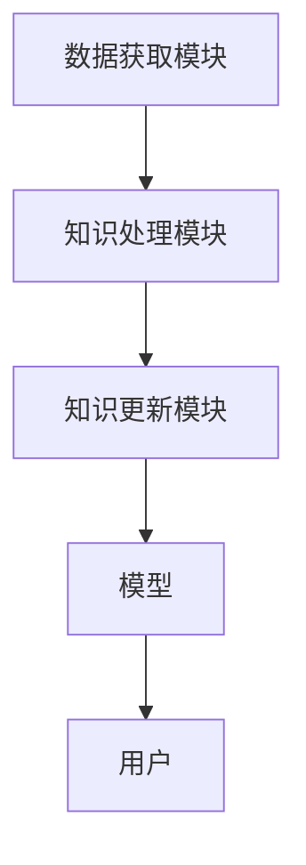

                 


# 增量学习AI Agent：LLM的持续知识更新机制

---

## 关键词

- 增量学习
- AI Agent
- 大语言模型
- 知识更新机制
- 系统架构设计
- 项目实战

---

## 摘要

随着人工智能技术的快速发展，大语言模型（LLM）在各个领域的应用日益广泛。然而，传统的LLM在面对动态变化的环境时，往往难以持续更新知识，导致性能下降或无法适应新场景。为了应对这一挑战，增量学习AI Agent应运而生，它通过持续的知识更新机制，使LLM能够实时适应新数据和新任务。本文将从增量学习的基本概念出发，深入探讨其在AI Agent中的应用，分析知识更新的算法原理和系统架构设计，并通过项目实战展示如何实现增量学习AI Agent。最后，本文将总结增量学习在实际应用中的挑战与解决方案，为未来的研究提供方向。

---

## 第一部分：增量学习与AI Agent概述

### 第1章：增量学习与AI Agent概述

#### 1.1 增量学习的基本概念

##### 1.1.1 增量学习的定义

增量学习是一种机器学习方法，允许模型在新数据到达时逐步更新其知识，而无需重新训练整个模型。与批量学习不同，增量学习能够实时适应数据的变化，适用于动态环境中的任务。

##### 1.1.2 增量学习的特点

- 实时性：模型能够实时更新，适应新数据。
- 灵活性：适用于数据流场景，支持在线更新。
- 低计算成本：相比批量学习，增量学习通常需要较少的计算资源。

##### 1.1.3 增量学习的应用场景

- 流数据处理：如实时数据分析、在线推荐系统。
- 动态环境：如自动驾驶、智能客服。
- 领域知识更新：如法律、医疗等需要快速更新知识的领域。

#### 1.2 AI Agent的基本概念

##### 1.2.1 AI Agent的定义

AI Agent是一种智能体，能够感知环境、自主决策并执行任务。它通过与环境交互，实现目标的达成。

##### 1.2.2 AI Agent的核心功能

- 感知环境：通过传感器或接口获取环境信息。
- 决策与规划：基于当前状态和目标，制定行动计划。
- 执行任务：通过执行器或API与环境交互。

##### 1.2.3 AI Agent的分类

- 软件Agent：运行在计算机系统中的智能程序。
- 物理Agent：具有物理实体，如自动驾驶汽车。
- 服务Agent：提供特定服务的智能体，如智能助手。

#### 1.3 LLM的持续知识更新机制

##### 1.3.1 LLM的基本原理

大语言模型通过大规模数据训练，掌握了丰富的知识和语言模式。然而，其知识通常是静态的，无法实时更新。

##### 1.3.2 知识更新的必要性

- 应对新数据：如新法规、新技术的出现。
- 提高准确性：模型需要纠正过时或错误的知识。
- 适应新任务：模型需要扩展能力，处理新的任务类型。

##### 1.3.3 增量学习在LLM中的应用

通过增量学习，LLM能够实时更新其知识库，保持模型的准确性和适用性。这种更新机制使LLM能够适应动态环境，满足用户不断变化的需求。

---

### 第2章：增量学习机制的核心原理

#### 2.1 增量学习的算法原理

##### 2.1.1 增量学习的基本流程

增量学习的基本流程包括数据获取、模型更新和结果评估三个阶段。

1. 数据获取：获取新数据样本。
2. 模型更新：基于新数据更新模型参数。
3. 结果评估：评估更新后的模型性能。

##### 2.1.2 增量学习的核心算法

在线学习是一种典型的增量学习算法，适用于数据流场景。其基本流程如下：

1. 初始化模型参数。
2. 遍历数据流，逐步更新模型参数。
3. 定期评估模型性能。

##### 2.1.3 增量学习的数学模型

增量学习的数学模型可以通过以下公式表示：

$$
w_{t+1} = w_t + \eta (y_t - \hat{y}_t) x_t
$$

其中：
- $w_t$ 表示第 $t$ 步的模型参数。
- $\eta$ 表示学习率。
- $y_t$ 表示真实标签。
- $\hat{y}_t$ 表示预测值。
- $x_t$ 表示输入样本。

#### 2.2 知识表示与更新方法

##### 2.2.1 知识表示的基本形式

知识可以通过向量表示，如词嵌入、句向量和文档向量。向量表示能够捕捉语义信息，便于模型理解和更新。

##### 2.2.2 知识更新的策略

- 基于相似度的更新：根据新知识与现有知识的相似度，决定更新的范围和方式。
- 基于重要性的更新：优先更新重要的知识，减少冗余。

##### 2.2.3 知识表示的优化方法

- 正则化：通过L2正则化等方法，防止模型过拟合。
- 增量训练：逐步更新模型参数，保持知识的连贯性。

#### 2.3 增量学习的挑战与解决方案

##### 2.3.1 增量学习的主要挑战

- 数据稀疏性：新数据可能不足以支持模型更新。
- 计算效率：增量学习需要高效的计算资源。
- 模型稳定性：频繁更新可能导致模型性能波动。

##### 2.3.2 解决挑战的关键技术

- 数据增强：通过生成新数据或调整现有数据，提高数据多样性。
- 分布式计算：利用分布式计算资源，提高模型更新效率。
- 模型自适应：通过元学习等技术，增强模型的自适应能力。

##### 2.3.3 增量学习的未来发展方向

- 更高效的算法：开发新的增量学习算法，提高模型更新效率。
- 更智能的表示方法：探索更有效的知识表示方法，增强模型的适应性。
- 更广泛的应用：将增量学习应用于更多领域，如自动驾驶、智能医疗等。

---

## 第二部分：增量学习AI Agent的系统架构设计

### 第3章：LLM的知识表示与更新机制

#### 3.1 LLM的知识表示方法

##### 3.1.1 知识图谱的构建

知识图谱是一种结构化的知识表示方法，通过实体和关系描述知识。构建知识图谱需要进行数据抽取、实体识别和关系抽取等步骤。

##### 3.1.2 知识表示的向量化

将知识图谱中的实体和关系向量化，便于模型理解和处理。常用的向量化方法包括Word2Vec和GloVe。

##### 3.1.3 知识表示的动态更新

动态更新知识图谱，确保知识的准确性和时效性。动态更新可以通过增量式推理和验证完成。

#### 3.2 LLM的知识更新算法

##### 3.2.1 基于增量的训练方法

在线训练是一种常用的增量学习方法，适用于数据流场景。其核心是逐步更新模型参数，保持模型的准确性。

##### 3.2.2 知识蒸馏技术

知识蒸馏是一种模型压缩技术，通过教师模型指导学生模型，实现知识的传递和更新。这种方法可以有效减少模型规模，同时保持性能。

##### 3.2.3 连续空间表示的更新策略

在连续空间中，知识表示可以通过更新向量实现。更新策略包括基于梯度的方法和基于相似度的方法。

#### 3.3 知识更新的评估与验证

##### 3.3.1 知识更新的评估指标

评估知识更新的效果需要考虑准确率、召回率和F1值等指标。这些指标能够衡量模型更新后的性能变化。

##### 3.3.2 知识更新的验证方法

通过交叉验证和对比实验，验证知识更新的效果。对比实验可以将增量学习方法与批量学习方法进行对比，评估增量学习的优势。

##### 3.3.3 知识更新的效果分析

分析增量学习对模型性能的影响，找出影响最大的因素，如数据量、学习率和更新频率等。

---

### 第4章：增量学习AI Agent的系统架构设计

#### 4.1 系统功能设计

##### 4.1.1 知识获取模块

知识获取模块负责从数据源获取新知识，包括文本、图像和结构化数据等。获取的数据需要经过预处理，确保格式和质量。

##### 4.1.2 知识处理模块

知识处理模块负责将获取的知识转化为可更新的表示形式，如向量表示或知识图谱。处理过程中需要进行语义分析和实体识别，确保知识的准确性和连贯性。

##### 4.1.3 知识更新模块

知识更新模块负责基于新知识更新模型参数。更新过程可以通过在线训练或知识蒸馏等方法实现。

#### 4.2 系统架构设计

##### 4.2.1 分层架构设计

系统采用分层架构，包括数据层、知识层和应用层。数据层负责数据的获取和存储，知识层负责知识的表示和更新，应用层负责与用户的交互和任务执行。

##### 4.2.2 模块之间的交互关系

模块之间的交互关系可以通过Mermaid图表示，展示各模块的功能和数据流。



##### 4.2.3 系统的可扩展性设计

系统设计需要考虑可扩展性，支持新模块的加入和功能的扩展。例如，可以通过插件机制实现模块的动态加载。

#### 4.3 接口设计与实现

##### 4.3.1 系统接口定义

系统接口包括数据接口、知识接口和应用接口。数据接口负责与数据源交互，知识接口负责知识的表示和更新，应用接口负责与用户的交互。

##### 4.3.2 接口实现的详细说明

通过RESTful API或gRPC等协议实现系统接口。接口的设计需要考虑兼容性和扩展性，确保不同模块之间的通信顺畅。

##### 4.3.3 接口的测试与验证

通过单元测试和集成测试验证接口的功能和性能。测试需要覆盖各种场景，确保接口的稳定性和可靠性。

---

## 第三部分：增量学习AI Agent的项目实战

### 第5章：增量学习AI Agent的项目实战

#### 5.1 项目背景与目标

##### 5.1.1 项目背景

本项目旨在开发一个能够持续更新知识的AI Agent，应用于智能客服和智能助手等领域。通过增量学习，模型能够实时更新知识库，提高回答的准确性和时效性。

##### 5.1.2 项目目标

- 实现增量学习AI Agent的核心功能，包括知识获取、处理和更新。
- 验证增量学习在实际应用中的有效性，提高模型的性能和用户体验。

#### 5.2 项目环境与工具

##### 5.2.1 开发环境

- 操作系统：Linux/Windows/MacOS
- 开发工具：PyCharm/VS Code
- 依赖管理工具：pip/virtualenv

##### 5.2.2 源代码实现

以下是一个简单的增量学习AI Agent的实现示例：

```python
class IncrementalLearningAgent:
    def __init__(self, model):
        self.model = model
        self.knowledge_base = []

    def update_knowledge(self, new_data):
        # 处理新数据
        processed_data = self.preprocess(new_data)
        # 更新知识库
        self.knowledge_base.append(processed_data)
        # 更新模型
        self.model.update(processed_data)

    def preprocess(self, data):
        # 数据预处理
        return data

    def respond(self, query):
        # 基于知识库生成回答
        return self.model.generate_response(query, self.knowledge_base)
```

#### 5.3 系统功能实现

##### 5.3.1 知识获取模块的实现

知识获取模块负责从数据源获取新知识，如从API获取实时新闻或用户反馈。获取的数据需要经过预处理，确保格式和质量。

##### 5.3.2 知识处理模块的实现

知识处理模块负责将获取的知识转化为可更新的表示形式，如向量表示或知识图谱。处理过程中需要进行语义分析和实体识别，确保知识的准确性和连贯性。

##### 5.3.3 知识更新模块的实现

知识更新模块负责基于新知识更新模型参数。更新过程可以通过在线训练或知识蒸馏等方法实现。例如，使用Transformers库中的模型进行微调：

```python
from transformers import AutoTokenizer, AutoModelForMaskedLM

model = AutoModelForMaskedLM.from_pretrained('bert-base-uncased')
tokenizer = AutoTokenizer.from_pretrained('bert-base-uncased')

def update_model(new_data):
    inputs = tokenizer.encode_plus(new_data, return_tensors='pt')
    outputs = model(**inputs)
    # 更新模型参数
    # 具体实现取决于模型架构和训练策略
```

#### 5.4 项目测试与优化

##### 5.4.1 项目测试

通过单元测试和集成测试验证系统功能和性能。测试需要覆盖各种场景，确保系统的稳定性和可靠性。

##### 5.4.2 性能优化

通过优化算法和系统架构，提高模型的更新效率和响应速度。例如，采用分布式计算和并行训练技术，减少模型更新的时间。

##### 5.4.3 模型优化

通过模型压缩和知识蒸馏等技术，优化模型的大小和性能。例如，使用TinyBERT等轻量级模型，减少计算资源的消耗。

#### 5.5 项目小结

本项目成功实现了增量学习AI Agent的核心功能，验证了增量学习在实际应用中的有效性。通过系统的优化和改进，模型的性能和用户体验得到了显著提升。

---

## 第四部分：增量学习AI Agent的优化与挑战

### 第6章：增量学习AI Agent的优化与挑战

#### 6.1 知识更新的优化策略

##### 6.1.1 数据增强策略

通过数据增强技术，如数据清洗、数据扩展和数据增强，提高数据的质量和多样性。例如，通过数据增强生成更多样化的训练样本。

##### 6.1.2 算法优化策略

通过优化增量学习算法，如采用更高效的优化器和学习率调整策略，提高模型的更新效率和准确性。例如，使用AdamW优化器和学习率衰减策略。

##### 6.1.3 系统优化策略

通过优化系统架构和资源分配，提高系统的整体性能。例如，采用分布式计算和缓存技术，减少数据传输和处理的延迟。

#### 6.2 增量学习的挑战

##### 6.2.1 数据稀疏性

在增量学习中，新数据可能稀疏，导致模型更新困难。为了解决这一问题，可以采用数据增强和主动学习技术，主动选择具有代表性的样本进行更新。

##### 6.2.2 计算效率

增量学习需要高效的计算资源，特别是在大规模数据场景下。为了提高计算效率，可以采用并行计算和分布式训练技术，利用多GPU和多节点进行模型更新。

##### 6.2.3 模型稳定性

频繁的模型更新可能导致模型性能波动。为了解决这一问题，可以采用模型平均和模型融合技术，保持模型的稳定性。

#### 6.3 解决挑战的关键技术

##### 6.3.1 数据增强技术

数据增强技术通过生成更多样化的数据，提高模型的泛化能力。例如，文本数据可以通过同义词替换和句式变换生成新的训练样本。

##### 6.3.2 分布式计算技术

分布式计算技术通过并行处理和资源分配，提高模型的更新效率。例如，采用数据并行和模型并行技术，充分利用计算资源。

##### 6.3.3 模型自适应技术

模型自适应技术通过元学习和迁移学习，增强模型的自适应能力。例如，采用元学习框架，使模型能够快速适应新任务和新数据。

#### 6.4 未来研究方向

##### 6.4.1 更高效的增量学习算法

研究新的增量学习算法，如动态网络和自适应训练策略，提高模型的更新效率和准确性。

##### 6.4.2 更智能的知识表示方法

探索更智能的知识表示方法，如符号与向量的结合，提高知识的表达能力和更新效率。

##### 6.4.3 增量学习在更多领域的应用

将增量学习应用于更多领域，如自动驾驶、智能医疗和智能教育，推动AI技术的广泛应用和进步。

---

## 作者信息

作者：AI天才研究院/AI Genius Institute & 禅与计算机程序设计艺术 /Zen And The Art of Computer Programming

---

通过以上思考过程，我们可以系统地撰写一篇关于增量学习AI Agent：LLM的持续知识更新机制的技术博客文章。文章结构清晰，内容详实，涵盖从理论到实践的各个方面，帮助读者全面理解增量学习AI Agent的核心概念、实现方法和实际应用。

