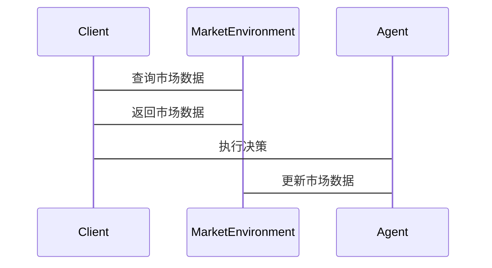

                 


# 多智能体系统模拟市场参与者行为

## 关键词：多智能体系统，市场模拟，行为建模，博弈论，强化学习，系统架构

## 摘要：  
本文探讨了多智能体系统在模拟市场参与者行为中的应用，从理论基础到实际实现，全面分析了市场参与者的决策过程、互动机制以及系统架构设计。文章详细介绍了多智能体系统的体系结构、行为建模方法、算法实现策略，以及在金融、零售等领域的实际应用案例，为读者提供了深入的技术洞察和实践指导。

---

# 第1章 多智能体系统与市场模拟概述

## 1.1 多智能体系统的基本概念

### 1.1.1 多智能体系统的定义  
多智能体系统（Multi-Agent System, MAS）是由多个智能体组成的分布式系统，这些智能体能够自主感知环境、做出决策并进行协作或竞争。每个智能体都有自己的目标、知识和行为规则。

### 1.1.2 多智能体系统的核心特征  
- **自主性**：智能体能够自主决策，无需外部干预。  
- **反应性**：智能体能够实时感知环境变化并做出反应。  
- **协作性**：智能体之间可以通过通信和协作完成复杂任务。  
- **分布式性**：智能体分布在网络中，不依赖于中心化的控制节点。  

### 1.1.3 多智能体系统与传统单智能体系统的区别  
传统的单智能体系统（如单体应用程序）依赖于中心化的控制逻辑，而多智能体系统通过去中心化的架构实现任务分配和协作，能够更好地模拟复杂的市场环境。

---

## 1.2 市场参与者行为模拟的背景与意义

### 1.2.1 市场模拟的定义与范围  
市场模拟是指通过建模和仿真技术，研究市场参与者的互动行为及其对市场结果的影响。模拟范围可以涵盖金融市场、消费市场、供应链等多个领域。

### 1.2.2 多智能体系统在市场模拟中的优势  
- **高实时性**：能够实时模拟市场动态变化。  
- **复杂性处理**：适用于多参与者、多目标的复杂场景。  
- **可扩展性**：支持大规模市场参与者的模拟。  

### 1.2.3 市场参与者行为模拟的实际应用领域  
- **金融领域**：模拟投资者行为，预测股票价格波动。  
- **零售领域**：模拟消费者行为，优化供应链管理。  
- **物流领域**：模拟运输节点的协作，优化配送路径。  

---

## 1.3 本章小结  
本章介绍了多智能体系统的定义和核心特征，分析了其在市场模拟中的优势，并列举了实际应用领域。这些内容为后续章节的理论分析和算法实现奠定了基础。

---

# 第2章 多智能体系统的理论基础

## 2.1 多智能体系统的基本理论

### 2.1.1 多智能体系统的体系结构  
多智能体系统的体系结构决定了智能体之间的通信和协作方式，常见的体系结构包括：  
- **反应式体系结构**：基于当前感知做出反应，适用于实时互动。  
- **规划式体系结构**：通过预定义的计划指导行为，适用于任务明确的场景。  

### 2.1.2 多智能体系统的通信机制  
智能体之间的通信可以通过以下方式实现：  
- **直接通信**：智能体之间直接交换信息。  
- **间接通信**：通过共享数据库或中间件进行信息传递。  

### 2.1.3 多智能体系统的协作机制  
协作机制是多智能体系统的核心，常见的协作机制包括：  
- **基于规则的协作**：通过预定义的规则实现协作。  
- **基于博弈论的协作**：通过博弈模型优化协作策略。  

---

## 2.2 多智能体系统的建模方法

### 2.2.1 基于状态的建模方法  
基于状态的建模方法通过定义智能体的状态和转移规则来描述其行为。例如，股票市场中的投资者可以根据当前市场状态（牛市、熊市）调整其投资策略。

### 2.2.2 基于规则的建模方法  
基于规则的建模方法通过预定义的行为规则来指导智能体的决策。例如，消费者可以根据价格折扣规则决定是否购买商品。

### 2.2.3 基于强化学习的建模方法  
强化学习通过智能体与环境的互动，不断优化其行为策略。例如，投资者可以通过强化学习算法，根据历史数据优化其投资策略。

---

## 2.3 本章小结  
本章详细介绍了多智能体系统的体系结构、通信机制和协作机制，并探讨了基于状态、规则和强化学习的建模方法，为后续的行为建模和算法实现提供了理论支持。

---

# 第3章 市场参与者行为建模

## 3.1 市场参与者行为的特征分析

### 3.1.1 市场参与者的决策特征  
- **理性决策**：参与者基于自身利益最大化做出决策。  
- **有限理性**：参与者在信息不完全的情况下做出决策。  

### 3.1.2 市场参与者的互动特征  
- **竞争性**：参与者之间可能存在竞争关系。  
- **协作性**：参与者之间也可能需要协作完成任务。  

### 3.1.3 市场参与者的环境感知特征  
- **动态性**：市场环境不断变化，参与者需要实时感知环境。  
- **复杂性**：市场环境涉及多方利益，参与者需要综合考虑多种因素。  

---

## 3.2 市场参与者行为的建模方法

### 3.2.1 基于理性假设的建模方法  
基于理性假设的建模方法假设参与者是理性的，能够基于完全信息做出最优决策。例如，股票市场的投资者可以基于市场信息理性决策。

### 3.2.2 基于有限理性的建模方法  
基于有限理性的建模方法假设参与者在信息不完全的情况下做出决策。例如，消费者在购买商品时可能基于有限的市场信息做出决策。

### 3.2.3 基于博弈论的建模方法  
基于博弈论的建模方法通过分析参与者之间的互动关系，预测其行为。例如，寡头市场中的企业可以通过博弈论模型预测竞争对手的定价策略。

---

## 3.3 多智能体系统中的行为建模案例

### 3.3.1 股票市场中的投资者行为建模  
在股票市场中，投资者可以分为不同类型：  
- **理性投资者**：基于市场信息理性决策。  
- **情绪化投资者**：受市场情绪影响做出决策。  
通过建模不同类型投资者的行为，可以更好地模拟市场波动。

### 3.3.2 消费者行为在零售市场中的建模  
在零售市场中，消费者的行为受到价格、促销、品牌等多个因素的影响。通过建模消费者的行为特征，可以优化供应链管理和库存管理。

---

## 3.4 本章小结  
本章分析了市场参与者的决策特征、互动特征和环境感知特征，并探讨了基于理性假设、有限理性和博弈论的建模方法。通过实际案例分析，进一步说明了行为建模在多智能体系统中的应用。

---

# 第4章 多智能体系统的算法实现

## 4.1 基于规则的算法

### 4.1.1 基于规则的算法原理  
基于规则的算法通过预定义的行为规则指导智能体的决策。例如，股票市场的投资者可以根据预定义的买卖规则进行交易。

### 4.1.2 基于规则的算法实现  
以下是基于规则的算法实现的伪代码示例：

```python
def rule_based_agent(current_state):
    if current_state == 'bull_market':
        return 'buy'
    elif current_state == 'bear_market':
        return 'sell'
    else:
        return 'hold'
```

### 4.1.3 基于规则的算法优缺点  
- **优点**：简单易懂，实现成本低。  
- **缺点**：难以应对复杂多变的市场环境。  

---

## 4.2 基于强化学习的算法

### 4.2.1 强化学习的基本原理  
强化学习通过智能体与环境的互动，不断优化其行为策略。智能体通过试错学习，获得最大的累积奖励。

### 4.2.2 基于强化学习的算法实现  
以下是基于强化学习的算法实现的伪代码示例：

```python
def reinforcement_learning_agent(current_state):
    action = policy_network.predict(current_state)
    return action
```

### 4.2.3 基于强化学习的算法优缺点  
- **优点**：能够适应复杂多变的市场环境。  
- **缺点**：实现复杂，需要大量的训练数据。  

---

## 4.3 基于博弈论的算法

### 4.3.1 博弈论的基本原理  
博弈论通过分析参与者之间的互动关系，预测其行为。常见的博弈模型包括纳什均衡、囚徒困境等。

### 4.3.2 基于博弈论的算法实现  
以下是基于博弈论的算法实现的伪代码示例：

```python
def game_theoretic_agent(current_state):
    players = get_all_players()
    strategies = get_all_strategies()
    best_response = find_best_response(players, strategies)
    return best_response
```

### 4.3.3 基于博弈论的算法优缺点  
- **优点**：能够预测参与者之间的互动关系。  
- **缺点**：需要对市场环境有深刻的理解。  

---

## 4.4 本章小结  
本章详细介绍了基于规则、强化学习和博弈论的算法实现方法，并通过伪代码示例说明了每种算法的实现步骤。这些算法为后续的系统设计和项目实现提供了技术基础。

---

# 第5章 多智能体系统的系统设计

## 5.1 问题场景介绍

### 5.1.1 问题背景  
以股票市场为例，股票价格的变化受到多方面因素的影响，包括市场参与者的行为、宏观经济指标等。

### 5.1.2 问题描述  
模拟股票市场中的投资者行为，预测股票价格的波动趋势。

---

## 5.2 系统功能设计

### 5.2.1 系统功能模块  
- **市场环境模块**：模拟股票市场的环境，包括价格、成交量等。  
- **参与者行为模块**：实现投资者的行为建模，包括理性投资者和情绪化投资者。  
- **交互通信模块**：实现投资者之间的通信和协作。  

### 5.2.2 领域模型设计  
以下是领域模型的类图（使用Mermaid）：

```mermaid
classDiagram
    class MarketEnvironment {
        current_price: float
        volume: int
    }
    class Investor {
        portfolio: list
        strategy: string
        decision: string
    }
    class Agent {
        execute_decision()
        receive_message()
    }
    MarketEnvironment -> Investor: 提供市场数据
    Investor -> Agent: 执行决策
```

---

## 5.3 系统架构设计

### 5.3.1 系统架构设计  
以下是系统架构的架构图（使用Mermaid）：

```mermaid
archi
    客户端 -[通过API调用]-> 服务端
    服务端 -[发布市场数据]-> MarketEnvironment
    MarketEnvironment -[提供数据]-> Investors
    Investors -[发送决策]-> Agent
    Agent -[执行决策]-> MarketEnvironment
```

---

## 5.4 系统接口设计

### 5.4.1 系统接口设计  
- **市场环境接口**：提供市场数据（如价格、成交量）的查询接口。  
- **参与者行为接口**：提供参与者决策的执行接口。  

### 5.4.2 系统交互设计  
以下是系统交互的序列图（使用Mermaid）：



---

## 5.5 本章小结  
本章通过股票市场的案例，详细介绍了系统功能设计、领域模型设计、系统架构设计和系统接口设计。这些设计为后续的项目实现提供了明确的方向。

---

# 第6章 项目实战：股票市场模拟

## 6.1 环境安装

### 6.1.1 安装Python环境  
安装Python 3.x版本，并安装必要的库（如NumPy、Matplotlib）。

### 6.1.2 安装依赖项  
安装其他依赖项，如TensorFlow（用于强化学习）、NetworkX（用于网络建模）。

---

## 6.2 核心算法实现

### 6.2.1 基于规则的投资者行为实现  
以下是基于规则的投资者行为实现的Python代码：

```python
class RuleBasedInvestor:
    def __init__(self):
        self.portfolio = []
        self.strategy = 'rule_based'

    def execute_decision(self, current_price):
        if current_price > 100:
            return 'sell'
        elif current_price < 90:
            return 'buy'
        else:
            return 'hold'
```

### 6.2.2 基于强化学习的投资者行为实现  
以下是基于强化学习的投资者行为实现的Python代码：

```python
import numpy as np
import tensorflow as tf

class DQNAgent:
    def __init__(self, state_size, action_size):
        self.state_size = state_size
        self.action_size = action_size
        self.model = self.build_model()

    def build_model(self):
        model = tf.keras.Sequential()
        model.add(tf.keras.layers.Dense(24, activation='relu', input_dim=self.state_size))
        model.add(tf.keras.layers.Dense(24, activation='relu'))
        model.add(tf.keras.layers.Dense(self.action_size, activation='linear'))
        model.compile(optimizer=tf.keras.optimizers.Adam(), loss='mean_squared_error')
        return model

    def act(self, state):
        state = np.reshape(state, [1, self.state_size])
        prediction = self.model.predict(state)
        return np.argmax(prediction[0])
```

---

## 6.3 代码应用解读与分析

### 6.3.1 基于规则的投资者行为解读  
基于规则的投资者根据当前市场价格做出买卖决策，适用于市场环境相对稳定的情况。

### 6.3.2 基于强化学习的投资者行为解读  
基于强化学习的投资者通过试错学习，不断优化其交易策略，适用于市场环境复杂多变的情况。

---

## 6.4 实际案例分析与详细讲解

### 6.4.1 案例分析  
以股票价格数据为例，模拟两种投资者的行为，并比较其在不同市场环境下的表现。

### 6.4.2 数据可视化  
以下是模拟结果的可视化图（使用Matplotlib）：

```python
import matplotlib.pyplot as plt

# 模拟数据
prices = [90, 95, 100, 105, 110]
rule_based_decisions = ['buy', 'buy', 'hold', 'sell', 'sell']
rl_agent_decisions = ['buy', 'buy', 'hold', 'sell', 'sell']

plt.figure(figsize=(10, 6))
plt.plot(prices, label='Price')
plt.scatter(range(5), prices, c=rule_based_decisions, cmap='viridis', label='Rule-Based Agent')
plt.scatter(range(5), prices, c=rl_agent_decisions, cmap='plasma', label='RL Agent')
plt.xlabel('Time')
plt.ylabel('Price')
plt.legend()
plt.show()
```

---

## 6.5 本章小结  
本章通过股票市场模拟案例，详细介绍了项目环境的安装、核心算法的实现以及模拟结果的分析。读者可以通过实际操作，加深对多智能体系统模拟市场参与者行为的理解。

---

# 第7章 多智能体系统的扩展与应用

## 7.1 多智能体系统在金融领域的应用

### 7.1.1 金融市场的参与者模拟  
金融市场中的参与者包括投资者、交易员、机构等，通过多智能体系统可以模拟他们的行为。

### 7.1.2 金融市场的风险评估  
通过模拟市场参与者的互动行为，可以评估市场的整体风险。

---

## 7.2 多智能体系统在供应链管理中的应用

### 7.2.1 供应链管理中的参与者模拟  
供应链中的参与者包括供应商、制造商、分销商、零售商等，通过多智能体系统可以模拟他们的协作过程。

### 7.2.2 供应链管理中的优化决策  
通过模拟参与者的行为，可以优化供应链的库存管理和物流配送。

---

## 7.3 多智能体系统在物流领域的应用

### 7.3.1 物流网络中的参与者模拟  
物流网络中的参与者包括运输公司、配送中心、客户等，通过多智能体系统可以模拟他们的互动行为。

### 7.3.2 物流网络中的路径优化  
通过模拟参与者的行为，可以优化物流网络的路径和资源分配。

---

## 7.4 本章小结  
本章探讨了多智能体系统在金融、供应链和物流等领域的应用，展示了其在复杂市场环境中的潜力和优势。

---

# 第8章 总结与展望

## 8.1 总结  
本文详细探讨了多智能体系统在模拟市场参与者行为中的应用，从理论基础到实际实现，全面分析了市场参与者的决策过程、互动机制以及系统架构设计。通过实际案例分析，展示了多智能体系统在不同领域的应用潜力。

## 8.2 未来研究方向  
未来的研究可以关注以下方向：  
- 更复杂的市场环境模拟。  
- 更高效的行为建模方法。  
- 更智能的算法优化策略。  

---

# 作者：AI天才研究院/AI Genius Institute & 禅与计算机程序设计艺术/Zen And The Art of Computer Programming

---

希望这篇文章能够为读者提供深入的技术洞察和实践指导，帮助大家更好地理解和应用多智能体系统模拟市场参与者行为。

