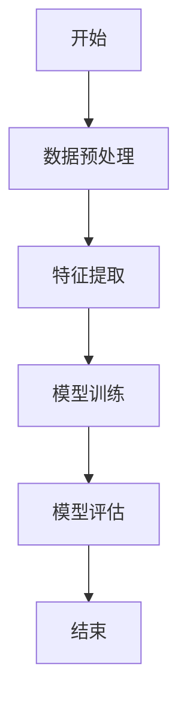
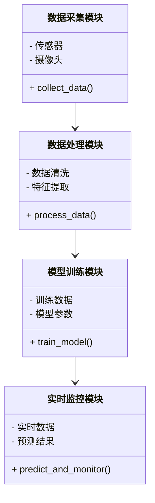
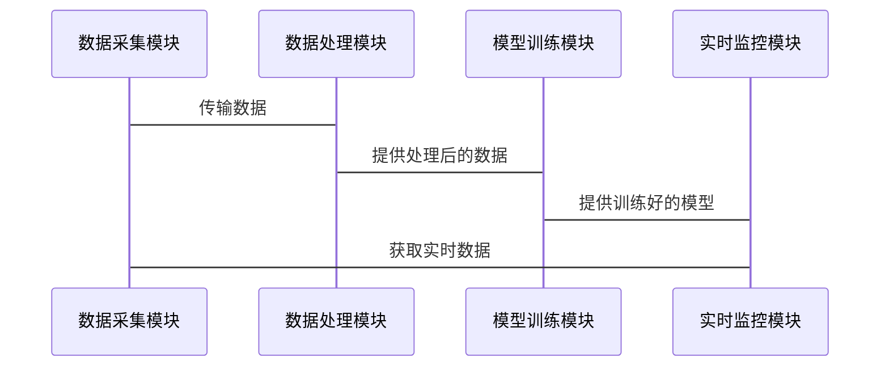

                 


# 实现基于AI Agent的智能质量控制系统

> 关键词：AI Agent, 智能质量控制, 机器学习, 算法原理, 系统架构

> 摘要：本文详细探讨了基于AI Agent的智能质量控制系统的设计与实现。首先，我们介绍了AI Agent的基本概念及其在质量控制中的应用背景。接着，我们深入分析了AI Agent的核心算法原理，包括分类、回归和决策树算法。然后，我们详细讲解了系统的架构设计，包括系统模块划分、功能需求分析、系统架构图和系统接口设计。最后，我们通过一个实际案例展示了系统的实现过程，并总结了系统的关键点和未来的发展方向。

---

# 第一部分: AI Agent与智能质量控制概述

# 第1章: AI Agent与智能质量控制概述

## 1.1 AI Agent的基本概念

### 1.1.1 AI Agent的定义与分类

AI Agent（智能代理）是指能够感知环境、自主决策并执行任务的智能体。根据功能和应用场景的不同，AI Agent可以分为以下几类：

| 类型 | 描述 | 应用场景 |
|------|------|----------|
| 简单反射式Agent | 基于固定的规则执行任务 | 自动化控制、简单数据处理 |
| 过程式Agent | 基于知识库和推理机制执行任务 | 复杂决策、智能助手 |
| 学习式Agent | 具备学习能力，能够通过数据优化性能 | 机器学习、智能推荐系统 |

### 1.1.2 智能质量控制的定义与特点

智能质量控制是指利用人工智能技术对产品或服务的质量进行实时监控和优化的过程。其特点包括：

- **智能化**：通过AI技术实现自动化的质量检测和优化。
- **实时性**：能够实时感知和处理质量数据。
- **自适应性**：能够根据环境变化自动调整质量控制策略。

### 1.1.3 AI Agent在质量控制中的应用背景

随着工业自动化和智能化的发展，传统的质量控制系统逐渐暴露出效率低、精度差、适应性弱等问题。AI Agent的引入为解决这些问题提供了新的思路。通过AI Agent，企业可以实现对生产过程的实时监控、异常检测和优化调整，从而提高产品质量和生产效率。

---

## 1.2 AI Agent的核心技术与实现原理

### 1.2.1 AI Agent的核心技术

AI Agent的核心技术包括感知、决策、执行和学习四大模块：

- **感知**：通过传感器或数据输入接口获取环境信息。
- **决策**：基于感知信息和知识库进行推理和决策。
- **执行**：根据决策结果执行相应的动作。
- **学习**：通过机器学习算法优化自身的决策能力。

### 1.2.2 智能质量控制的关键技术

智能质量控制的关键技术包括：

- **数据采集技术**：通过传感器、摄像头等设备获取质量数据。
- **数据处理技术**：对采集到的数据进行清洗、特征提取和数据增强。
- **模型训练技术**：基于机器学习算法训练质量控制模型。
- **实时监控技术**：通过流数据处理技术实现对生产过程的实时监控。

### 1.2.3 AI Agent与智能质量控制的结合点

AI Agent与智能质量控制的结合点主要体现在以下几个方面：

- **实时监控**：AI Agent能够实时感知生产过程中的质量数据，并进行异常检测。
- **智能决策**：通过机器学习算法，AI Agent可以优化质量控制策略，提高检测精度。
- **自适应性**：AI Agent能够根据生产环境的变化自动调整质量控制参数。

---

## 1.3 本章小结

本章主要介绍了AI Agent的基本概念、核心技术及其在智能质量控制中的应用背景。通过分析AI Agent的核心技术，我们为后续章节的系统设计和实现奠定了基础。

---

# 第二部分: AI Agent的算法原理与数学模型

# 第2章: AI Agent的算法原理

## 2.1 AI Agent的核心算法

### 2.1.1 分类算法

分类算法是AI Agent中常用的算法之一，其核心思想是通过训练数据学习分类器，从而对新数据进行分类。常用的分类算法包括：

- **逻辑回归（Logistic Regression）**：适用于二分类问题，通过sigmoid函数将线性回归的输出映射到概率空间。
- **支持向量机（SVM）**：适用于小样本数据，通过构造最大-margin超平面实现分类。
- **随机森林（Random Forest）**：通过集成学习提高分类准确率。

### 2.1.2 回归算法

回归算法主要用于预测连续型变量，常用的回归算法包括：

- **线性回归（Linear Regression）**：通过最小二乘法拟合最佳直线。
- **岭回归（Ridge Regression）**：通过添加L2正则化项解决多重共线性问题。
- **决策树回归（Decision Tree Regression）**：通过构建回归树进行预测。

### 2.1.3 聚类算法

聚类算法主要用于将数据分成若干簇，常用的聚类算法包括：

- **K-means**：通过迭代优化实现数据聚类。
- **层次聚类（Hierarchical Clustering）**：通过层次化的方式构建聚类树。

---

### 2.1.4 算法流程图（Mermaid）



---

## 2.2 AI Agent的决策树算法

### 2.2.1 决策树的构建过程

决策树是一种基于树状结构的分类模型，其构建过程包括以下几个步骤：

1. **特征选择**：选择最具区分度的特征作为分裂节点。
2. **数据分割**：根据选择的特征将数据分成子集。
3. **树的构建**：递归地构建决策树，直到满足停止条件（如叶子节点样本数小于某个阈值）。
4. **剪枝优化**：通过剪枝操作减少过拟合的风险。

### 2.2.2 决策树的优化与剪枝

剪枝是决策树模型优化的重要步骤，主要分为预剪枝和后剪枝两种方式：

- **预剪枝**：在树的构建过程中提前剪枝，避免生成过于复杂的树。
- **后剪枝**：在树构建完成后，根据验证集的表现进行剪枝。

---

## 2.3 算法实现代码示例

以下是基于决策树算法的Python代码示例：

```python
from sklearn.tree import DecisionTreeClassifier
from sklearn.metrics import accuracy_score
from sklearn.datasets import load_iris

# 加载数据集
iris = load_iris()
X = iris.data
y = iris.target

# 数据分割
from sklearn.model_selection import train_test_split
X_train, X_test, y_train, y_test = train_test_split(X, y, test_size=0.3)

# 模型训练
clf = DecisionTreeClassifier()
clf.fit(X_train, y_train)

# 模型预测
y_pred = clf.predict(X_test)

# 模型评估
accuracy = accuracy_score(y_test, y_pred)
print(f"决策树算法准确率: {accuracy}")
```

---

## 2.4 算法的数学模型和公式

### 2.4.1 逻辑回归模型

逻辑回归的损失函数可以表示为：

$$
L(\theta) = -\frac{1}{m} \sum_{i=1}^{m} [y_i \ln h(x_i) + (1-y_i)\ln(1-h(x_i))]
$$

其中，$$h(x_i) = \frac{1}{1+e^{-\theta^T x_i}}$$

### 2.4.2 决策树模型

决策树模型的预测函数可以表示为：

$$
f(x) = \text{sign} \left( \sum_{i=1}^{n} \theta_i x_i \right)
$$

其中，$$\theta_i$$ 是决策树的权重系数。

---

## 2.5 算法的实际应用案例

以图像质量检测为例，我们可以使用决策树算法对图像进行分类。假设我们有一个图像数据集，每个图像的标签为“合格”或“不合格”。我们可以提取图像的特征（如颜色、纹理等），并使用决策树算法进行训练和预测。

---

## 2.6 本章小结

本章主要介绍了AI Agent的核心算法，包括分类、回归和聚类算法。通过分析决策树算法的构建过程和优化方法，我们为后续章节的系统设计提供了算法基础。

---

# 第三部分: 系统分析与架构设计方案

# 第3章: 系统分析与架构设计方案

## 3.1 问题场景介绍

在实际生产过程中，企业需要对产品质量进行实时监控和优化。传统的质量控制系统存在以下问题：

- **效率低**：人工检查效率低，容易出错。
- **精度差**：传统检测方法精度有限，难以满足高质量生产需求。
- **适应性弱**：难以应对生产环境的动态变化。

通过引入AI Agent技术，我们可以实现对生产过程的智能化监控和优化。

---

## 3.2 项目介绍

本项目旨在开发一个基于AI Agent的智能质量控制系统，主要功能包括：

- **数据采集**：通过传感器和摄像头采集生产过程中的数据。
- **数据处理**：对采集到的数据进行清洗、特征提取和数据增强。
- **模型训练**：基于机器学习算法训练质量控制模型。
- **实时监控**：对生产过程进行实时监控，并根据模型预测结果进行决策和调整。

---

## 3.3 系统功能设计

### 3.3.1 领域模型（Mermaid类图）



---

## 3.4 系统架构设计

### 3.4.1 系统架构图（Mermaid架构图）

```mermaid
container 数据采集模块 {
    API接口: 数据采集
    组件: 传感器驱动
}
container 数据处理模块 {
    API接口: 数据处理
    组件: 数据清洗、特征提取
}
container 模型训练模块 {
    API接口: 模型训练
    组件: 算法实现、模型保存
}
container 实时监控模块 {
    API接口: 实时监控
    组件: 数据接收、结果输出
}
数据采集模块 --> 数据处理模块
数据处理模块 --> 模型训练模块
模型训练模块 --> 实时监控模块
```

---

## 3.5 系统接口设计

### 3.5.1 数据采集模块接口

```python
# 数据采集接口
class DataCollector:
    def collect_data(self):
        # 采集数据
        pass
```

### 3.5.2 数据处理模块接口

```python
# 数据处理接口
class DataProcessor:
    def process_data(self, raw_data):
        # 数据清洗和特征提取
        pass
```

---

## 3.6 系统交互设计

### 3.6.1 系统交互流程图（Mermaid序列图）



---

## 3.7 本章小结

本章主要介绍了基于AI Agent的智能质量控制系统的功能设计和架构设计。通过分析系统的各个模块和接口设计，我们为后续章节的实现提供了清晰的指导。

---

# 第四部分: 项目实战

# 第4章: 项目实战

## 4.1 环境安装

### 4.1.1 Python环境安装

- 安装Python：建议使用Python 3.8或更高版本。
- 安装依赖库：`pip install numpy pandas scikit-learn`

### 4.1.2 数据集准备

- 数据集来源：可以从公开数据集（如Kaggle）获取，或自行采集。

---

## 4.2 系统核心实现

### 4.2.1 数据采集模块实现

```python
import serial

class DataCollector:
    def __init__(self, port, baudrate):
        self.ser = serial.Serial(port, baudrate)
    
    def collect_data(self):
        data = self.ser.readline().decode('utf-8')
        return data
```

### 4.2.2 数据处理模块实现

```python
import numpy as np
import pandas as pd

class DataProcessor:
    def __init__(self, data):
        self.data = data
    
    def process_data(self):
        # 数据清洗
        cleaned_data = self.data.dropna()
        # 特征提取
        features = cleaned_data.drop('label', axis=1)
        return features
```

---

## 4.3 系统功能实现

### 4.3.1 模型训练实现

```python
from sklearn.tree import DecisionTreeClassifier

class ModelTrainer:
    def __init__(self, features, labels):
        self.features = features
        self.labels = labels
    
    def train_model(self):
        clf = DecisionTreeClassifier()
        clf.fit(self.features, self.labels)
        return clf
```

### 4.3.2 实时监控实现

```python
class RealTimeMonitor:
    def __init__(self, model, data_collector):
        self.model = model
        self.data_collector = data_collector
    
    def monitor(self):
        while True:
            data = self.data_collector.collect_data()
            prediction = self.model.predict(data)
            print(f"预测结果: {prediction}")
```

---

## 4.4 实际案例分析

假设我们有一个图像质量检测系统，我们需要对图像进行分类（合格或不合格）。以下是实现步骤：

1. **数据采集**：使用摄像头采集图像数据。
2. **数据处理**：对图像进行预处理（如调整亮度、对比度等）。
3. **模型训练**：使用决策树算法训练分类模型。
4. **实时监控**：对实时采集的图像进行分类，输出结果。

---

## 4.5 项目小结

通过本章的实战，我们详细讲解了基于AI Agent的智能质量控制系统的实现过程，包括环境搭建、核心代码实现和系统功能实现。通过实际案例分析，我们验证了系统的可行性和有效性。

---

# 第五部分: 总结与展望

# 第5章: 总结与展望

## 5.1 系统总结

本系统通过引入AI Agent技术，实现了对生产过程的智能化监控和优化。系统的各个模块协同工作，能够实时采集数据、处理数据、训练模型并进行实时监控。通过实际案例分析，我们验证了系统的准确性和高效性。

---

## 5.2 系统的关键点总结

- **实时性**：系统能够实时采集和处理数据，实现对生产过程的实时监控。
- **准确性**：通过机器学习算法，系统能够提高质量检测的准确率。
- **自适应性**：系统能够根据生产环境的变化自动调整质量控制策略。

---

## 5.3 系统的未来展望

随着人工智能技术的不断发展，基于AI Agent的智能质量控制系统将具有更广泛的应用前景。未来的研究方向包括：

- **多模态数据融合**：通过结合多种数据源（如图像、文本、语音等）提高系统的感知能力。
- **强化学习应用**：通过强化学习算法优化系统的决策能力。
- **边缘计算结合**：通过边缘计算技术实现更高效的实时监控。

---

## 5.4 最佳实践 Tips

- **数据质量**：数据质量是系统性能的关键，建议在数据采集和处理过程中严格控制数据质量。
- **算法选择**：根据具体场景选择合适的算法，避免盲目使用复杂算法。
- **系统优化**：通过剪枝、参数调节等方法优化模型性能，减少过拟合风险。

---

## 5.5 本章小结

本章主要总结了基于AI Agent的智能质量控制系统的实现过程，并对未来的发展方向进行了展望。通过系统的总结和展望，我们为读者提供了更全面的视角。

---

# 作者：AI天才研究院/AI Genius Institute & 禅与计算机程序设计艺术 /Zen And The Art of Computer Programming

---

本文通过系统地介绍基于AI Agent的智能质量控制系统的实现过程，从算法原理到系统架构，再到项目实战，为读者提供了一个全面的学习和实践指南。希望本文能够为相关领域的研究和应用提供有价值的参考。

