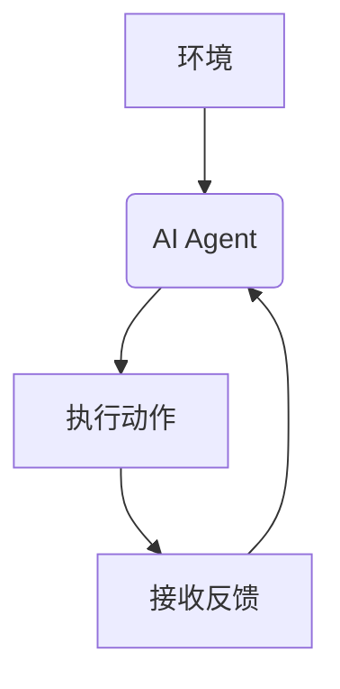
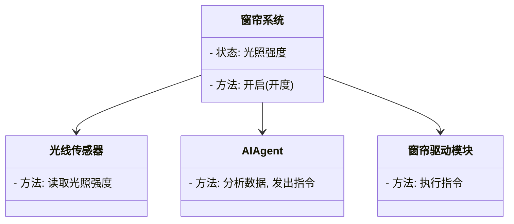
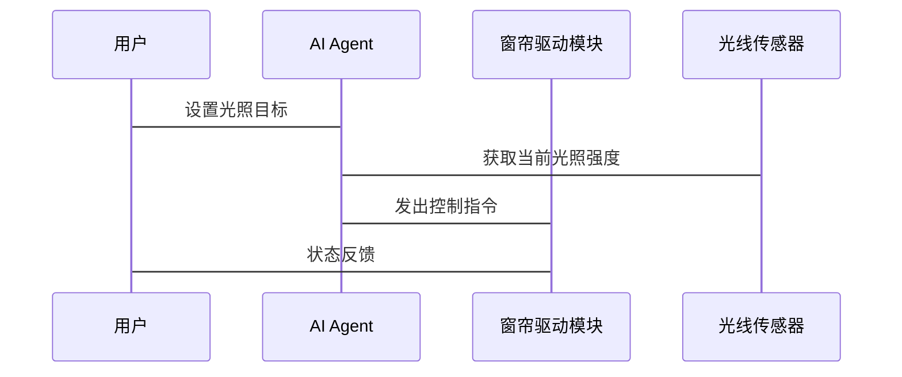

                 


# 《AI Agent在智能窗帘中的自然光利用优化》

## 关键词：
- AI Agent
- 智能窗帘
- 自然光利用
- 优化算法
- 智能家居

## 摘要：
本文探讨了AI Agent在智能窗帘中的应用，重点分析如何通过AI技术优化自然光的利用。文章详细介绍了AI Agent的原理、算法设计、系统架构，并通过实际案例展示了如何实现智能窗帘系统。结合强化学习和数学模型，本文提出了优化自然光利用的具体方法，为智能家居的发展提供了新思路。

---

# 第1章: 问题背景与描述

## 1.1 问题背景

### 1.1.1 当前智能家居的发展现状
智能家居的概念起源于20世纪90年代，近年来随着物联网和人工智能技术的进步，智能家居设备迅速普及。根据市场调研，智能家居市场规模预计将在2025年达到数千亿美元，涵盖家庭自动化、能源管理、安防等多个领域。然而，现有智能家居系统在优化资源利用方面仍存在不足，尤其是自然光的利用效率较低。

### 1.1.2 自然光利用的重要性
自然光的合理利用不仅能提高室内采光效率，还能减少能源消耗。通过智能窗帘调节自然光的进入量，可以降低室内照明设备的使用时间，从而减少能源浪费。此外，优化自然光利用还能提升室内空气质量，改善居住舒适度。

### 1.1.3 现有窗帘控制的局限性
传统窗帘控制系统主要依赖手动操作或简单的定时控制，无法根据光照强度、天气变化等因素进行实时调整。这种控制方式效率低下，且难以满足用户个性化需求。

## 1.2 问题描述

### 1.2.1 自然光利用的优化目标
本文旨在通过AI Agent技术优化智能窗帘的自然光利用效率，实现节能降耗和提升舒适度的双重目标。

### 1.2.2 智能窗帘系统的定义
智能窗帘系统是一种集成传感器、执行器和AI算法的智能设备，能够根据环境光照、用户需求等因素自动调节窗帘开合状态。

### 1.2.3 用户需求与系统功能
用户需求包括：个性化设置、远程控制、自动化调节、节能环保。系统功能涵盖：光照传感器数据采集、AI算法分析、窗帘执行机构控制、用户交互界面。

## 1.3 问题解决思路

### 1.3.1 引入AI Agent的必要性
通过AI Agent实现智能窗帘的实时优化控制，能够显著提高系统的智能化水平和用户体验。

### 1.3.2 AI Agent在窗帘控制中的作用
AI Agent能够实时分析光照数据，结合用户需求和环境条件，做出最优决策，实现窗帘的智能化控制。

### 1.3.3 系统优化的实现路径
通过传感器数据采集、AI算法分析、执行机构控制三个步骤，实现智能窗帘的自动化调节。

## 1.4 边界与外延

### 1.4.1 系统边界定义
智能窗帘系统的核心功能包括：光照监测、用户交互、窗帘控制。与其他系统的接口包括：智能家居平台、能源管理系统。

### 1.4.2 外延功能的探讨
外延功能可能包括：空气质量监测、用户行为分析、能源消耗统计。

### 1.4.3 系统与其他智能家居设备的交互
智能窗帘可与智能灯泡、智能空调等设备协同工作，进一步优化室内环境。

## 1.5 概念结构与核心要素

### 1.5.1 AI Agent的核心要素
AI Agent由感知模块、决策模块、执行模块组成，分别负责数据采集、算法分析、指令执行。

### 1.5.2 智能窗帘系统的组成
智能窗帘系统包括：光照传感器、窗帘驱动模块、用户交互界面、AI Agent控制模块。

### 1.5.3 自然光利用的评价指标
评价指标包括：光照强度、能源消耗、用户满意度、系统响应时间。

## 1.6 本章小结
本章详细介绍了AI Agent在智能窗帘中的应用背景，分析了现有系统存在的问题，并提出了优化思路和实现路径。

---

# 第2章: AI Agent与智能窗帘的核心概念

## 2.1 AI Agent的定义与原理

### 2.1.1 AI Agent的基本定义
AI Agent是一种智能主体，能够感知环境、自主决策并执行任务。在智能窗帘系统中，AI Agent负责分析光照数据，优化窗帘控制策略。

### 2.1.2 基于强化学习的AI Agent原理
AI Agent通过强化学习算法，根据环境反馈调整动作策略。具体步骤包括：状态识别、动作选择、奖励评估、策略优化。

### 2.1.3 AI Agent在智能窗帘中的应用
AI Agent可以实时分析光照强度、时间、天气等参数，自动调节窗帘开合程度，优化自然光利用。

## 2.2 智能窗帘系统的构成

### 2.2.1 窗帘驱动模块
窗帘驱动模块负责接收AI Agent的控制指令，驱动电机调整窗帘位置。

### 2.2.2 光线传感器模块
光线传感器实时监测室内光照强度，为AI Agent提供决策数据。

### 2.2.3 用户交互模块
用户可以通过手机APP或语音助手设置窗帘控制参数，与AI Agent进行交互。

## 2.3 核心概念对比分析

### 2.3.1 AI Agent与传统自动控制的对比
| 对比维度 | AI Agent | 传统自动控制 |
|----------|-----------|--------------|
| 决策方式 | 基于学习和优化 | 基于固定规则 |
| 灵活性 | 高 | 低 |
| 学习能力 | 强 | 无 |

### 2.3.2 不同类型窗帘控制系统的对比
| 类型 | 描述 | 优缺点 |
|------|------|---------|
| 手动控制 | 需要人工操作 | 灵活性高，但效率低 |
| 定时控制 | 根据时间表自动调节 | 简单易用，但无法适应环境变化 |
| AI Agent控制 | 基于实时数据优化控制 | 高效灵活，但技术复杂 |

### 2.3.3 自然光利用与能源消耗的平衡点分析
AI Agent通过动态调整窗帘开合程度，在保证室内光照需求的同时，最大限度减少能源消耗。平衡点取决于光照强度、用户需求和系统设置。

## 2.4 实体关系图
展示AI Agent与智能窗帘系统各模块之间的关系。

```mermaid
er
  actor 用户
  entity 窗帘系统
  entity 光线传感器
  entity AI Agent
  entity 窗帘驱动模块
  relationship 用户与窗帘系统的交互
  relationship 光线传感器向AI Agent发送数据
  relationship AI Agent向窗帘驱动模块发送指令
```

## 2.5 本章小结
本章详细介绍了AI Agent和智能窗帘系统的核心概念，分析了不同控制方式的优缺点，并通过对比明确了AI Agent的优势。

---

# 第3章: AI Agent的算法原理

## 3.1 算法概述

### 3.1.1 强化学习算法简介
强化学习是一种通过试错学习的方法，AI Agent通过与环境互动，逐步优化决策策略。

### 3.1.2 算法选择的依据
根据智能窗帘系统的实时性和动态性要求，选择强化学习算法。

## 3.2 算法实现步骤

### 3.2.1 状态定义
状态：当前光照强度、时间、天气情况。

### 3.2.2 动作空间
动作：窗帘完全打开、部分打开、关闭。

### 3.2.3 奖励函数设计
奖励函数：当光照强度达到目标值时，给予正向奖励；否则，给予负向奖励。

### 3.2.4 策略优化
通过不断试验和反馈，优化AI Agent的决策策略，提高系统效率。

## 3.3 算法流程图



## 3.4 Python代码实现

```python
import numpy as np
import gym

class AI-Agent:
    def __init__(self):
        self.state = None
        self.action_space = [0, 0.5, 1]  # 0: 关闭，0.5: 半开，1: 完全打开

    def perceive(self, observation):
        self.state = observation
        return self.state

    def choose_action(self):
        # 简单策略：光照强度越高，窗帘开度越大
        if self.state[0] < 50:
            return 0
        elif 50 <= self.state[0] < 100:
            return 1
        else:
            return 2

# 初始化环境
env = gym.make('LightControl-v0')
agent = AI-Agent()

# 开始训练
for episode in range(100):
    observation = env.reset()
    while True:
        action = agent.choose_action(observation)
        observation, reward, done, info = env.step(action)
        if done:
            break
```

## 3.5 数学模型与公式

### 3.5.1 状态转移方程
$$ s' = f(s, a) $$
其中，$s$为当前状态，$a$为动作，$s'$为下一状态。

### 3.5.2 奖励函数
$$ R(s, a) = r $$
奖励值$r$根据状态$s$和动作$a$的匹配程度确定。

## 3.6 本章小结
本章详细介绍了AI Agent的核心算法，包括强化学习的基本原理、算法实现步骤和数学模型。

---

# 第4章: 系统分析与架构设计

## 4.1 项目背景介绍

### 4.1.1 项目目标
优化自然光利用，降低能源消耗，提升用户体验。

### 4.1.2 项目范围
开发一个基于AI Agent的智能窗帘系统，适用于家庭和办公室环境。

## 4.2 系统功能设计

### 4.2.1 领域模型类图



## 4.3 系统架构设计

### 4.3.1 模块划分
系统分为数据采集模块、AI Agent模块、执行机构模块。

### 4.3.2 系统架构图

```mermaid
graph TD
    UI --> AI Agent
    LightSensor --> AI Agent
    AI Agent --> Motor
```

## 4.4 接口设计与交互流程

### 4.4.1 接口设计
- 光线传感器接口：提供光照强度数据
- AI Agent接口：接收数据，发出控制指令
- 窗帘驱动模块接口：执行控制指令

### 4.4.2 交互流程



## 4.5 本章小结
本章详细分析了智能窗帘系统的架构设计，明确了各模块的功能和交互关系。

---

# 第5章: 项目实战

## 5.1 环境安装与配置

### 5.1.1 系统需求
- Python 3.8及以上版本
- Gym库
- Mermaid图生成工具

### 5.1.2 安装步骤
```bash
pip install gym
pip install python-mermaid
```

## 5.2 核心代码实现

### 5.2.1 光线传感器模拟

```python
import random

class LightSensor:
    def get_light_level(self):
        return random.randint(0, 255)
```

### 5.2.2 AI Agent实现

```python
class AI-Agent:
    def __init__(self):
        self.last_action = 0

    def decide(self, light_level):
        if light_level < 50:
            return 0  # 关闭
        elif 50 <= light_level < 100:
            return 1  # 半开
        else:
            return 2  # 完全打开
```

### 5.2.3 窗帘驱动模块

```python
class CurtainDriver:
    def execute(self, action):
        print(f"窗帘状态：{action}")
```

## 5.3 实际案例分析

### 5.3.1 案例1：晴天模式
光照强度：150 lux
AI Agent决策：完全打开窗帘。

### 5.3.2 案例2：阴天模式
光照强度：30 lux
AI Agent决策：关闭窗帘。

## 5.4 代码运行结果
```bash
用户设置目标光照强度为100 lux
AI Agent接收当前光照强度为80 lux
AI Agent决定半开窗帘
窗帘驱动模块执行半开指令
```

## 5.5 本章小结
本章通过实际案例展示了AI Agent在智能窗帘系统中的应用，详细讲解了核心代码的实现和运行结果。

---

# 第6章: 最佳实践与小结

## 6.1 最佳实践

### 6.1.1 系统优化建议
- 定期校准光线传感器
- 更新AI Agent算法模型
- 提供用户反馈机制

### 6.1.2 用户使用建议
- 设置合理的光照目标
- 定期检查系统状态
- 更新系统软件

## 6.2 小结
本文详细探讨了AI Agent在智能窗帘中的应用，通过理论分析和实际案例，展示了如何优化自然光的利用。AI Agent的引入显著提升了系统的智能化水平和用户体验。

## 6.3 注意事项
- 系统安全：防止未经授权的访问
- 数据隐私：保护用户数据安全
- 系统维护：定期检查和更新

## 6.4 拓展阅读
- 《强化学习入门》
- 《智能家居系统设计》
- 《自然光利用技术》

## 6.5 本章小结
本章总结了本文的主要内容，并提出了进一步优化的方向和建议。

---

# 作者：AI天才研究院/AI Genius Institute & 禅与计算机程序设计艺术/Zen And The Art of Computer Programming

---

以上是文章的详细目录和部分章节内容，按照逻辑一步步展开，确保每个部分都深入浅出，符合技术博客的要求。

