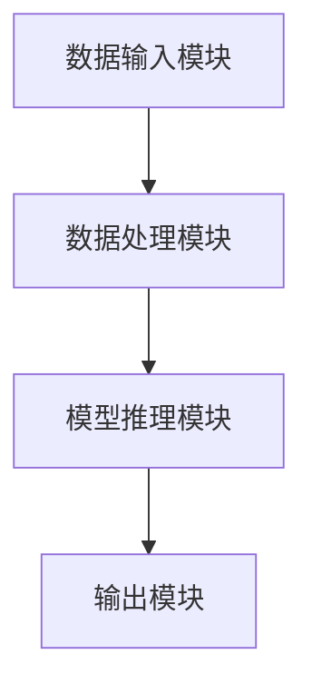
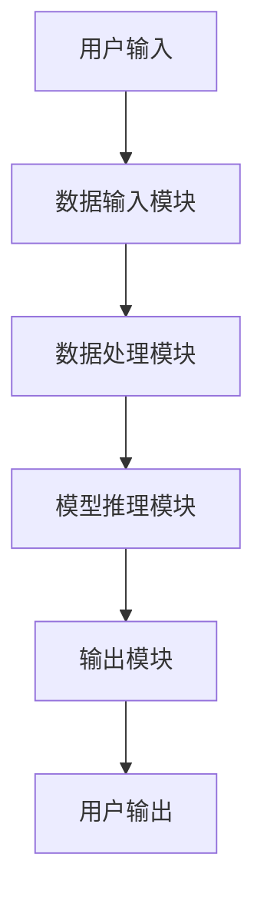

                 


# AI Agent的多模态内容理解与生成

> 关键词：AI Agent，多模态内容，内容理解，内容生成，深度学习，多模态融合

> 摘要：本文深入探讨了AI Agent在多模态内容理解与生成领域的应用，从基本概念到算法原理，再到系统架构和项目实战，全面分析了多模态内容处理的核心技术。通过详细讲解多模态数据的融合与分析、AI Agent的内容理解与生成机制，以及具体的算法实现，本文为读者提供了一套系统的学习和实践指南。

---

# 第1章: AI Agent与多模态内容理解与生成概述

## 1.1 AI Agent的基本概念

### 1.1.1 AI Agent的定义与特点
AI Agent（人工智能代理）是指能够感知环境、自主决策并执行任务的智能实体。AI Agent的核心特点包括：

- **自主性**：能够在没有外部干预的情况下自主完成任务。
- **反应性**：能够实时感知环境并做出响应。
- **目标导向性**：基于明确的目标或模糊的意图进行行为决策。
- **学习能力**：能够通过数据和经验不断优化自身的性能。

### 1.1.2 多模态内容的基本概念
多模态内容是指包含多种数据类型（如文本、图像、语音、视频、传感器数据等）的信息。与单一模态内容（如纯文本或纯图像）相比，多模态内容能够提供更丰富、更全面的信息表达方式。

### 1.1.3 AI Agent在多模态内容处理中的作用
AI Agent在多模态内容处理中扮演着关键角色，其主要作用包括：

- **数据融合**：将多种模态的数据进行整合，提取更深层次的语义信息。
- **内容理解**：通过多模态数据的分析，理解内容的含义和意图。
- **内容生成**：基于多模态数据，生成与原内容相关或扩展的新内容。

---

## 1.2 多模态内容理解与生成的背景

### 1.2.1 多模态数据的定义与分类
多模态数据可以分为以下几类：

- **文本模态**：包括自然语言文本、对话记录等。
- **图像模态**：包括图片、视频帧等。
- **语音模态**：包括音频信号、语音识别结果等。
- **传感器模态**：包括温度、湿度、地理位置等环境数据。

### 1.2.2 多模态内容理解与生成的挑战
多模态内容处理面临以下主要挑战：

- **数据异构性**：不同模态的数据具有不同的格式和语义结构。
- **语义关联性**：如何准确理解不同模态数据之间的语义关联。
- **计算复杂性**：多模态数据的处理通常需要较高的计算资源。

### 1.2.3 AI Agent在多模态内容处理中的应用前景
随着AI技术的不断发展，AI Agent在多模态内容处理中的应用前景广阔，包括：

- **智能客服**：通过多模态数据理解用户需求并生成相应的回复。
- **智能助手**：通过多模态数据提供更智能、更个性化的服务。
- **自动驾驶**：通过多模态数据（如图像、语音、传感器数据）实现更智能的驾驶辅助。

---

## 1.3 本章小结
本章从AI Agent的基本概念出发，介绍了多模态内容的定义与分类，并分析了AI Agent在多模态内容处理中的作用和挑战。通过对多模态内容处理背景的探讨，为后续章节的内容理解与生成奠定了基础。

---

# 第2章: 多模态内容理解的核心原理

## 2.1 多模态数据的融合与分析

### 2.1.1 多模态数据的融合方法
多模态数据的融合方法主要包括以下几种：

- **特征级融合**：将不同模态的数据转换为特征向量并进行融合。
- **决策级融合**：分别对不同模态的数据进行处理并生成决策，再对决策进行融合。
- **混合融合**：结合特征级和决策级融合的特点，进行混合融合。

### 2.1.2 多模态数据的特征提取
多模态数据的特征提取通常包括以下步骤：

1. **数据预处理**：对不同模态的数据进行标准化、归一化等预处理。
2. **特征编码**：将数据转换为特征向量，例如使用词嵌入（Word2Vec）对文本进行编码。
3. **特征融合**：将不同模态的特征向量进行融合，例如使用加法、乘法或注意力机制。

### 2.1.3 多模态数据的语义理解
多模态数据的语义理解通常依赖于深度学习模型，例如多模态Transformer模型。通过多模态数据的联合建模，模型能够更好地理解数据的语义。

---

## 2.2 AI Agent的内容理解机制

### 2.2.1 基于深度学习的内容理解
基于深度学习的内容理解方法通常包括以下步骤：

1. **数据输入**：将多模态数据输入到深度学习模型中。
2. **特征提取**：模型对输入数据进行特征提取。
3. **语义分析**：模型对提取的特征进行语义分析，生成语义表示。

### 2.2.2 多模态注意力机制
多模态注意力机制是一种用于多模态数据处理的重要技术，其基本原理如下：

- 对于每个模态的数据，计算其在其他模态中的注意力权重。
- 根据注意力权重对不同模态的数据进行加权求和，生成最终的语义表示。

### 2.2.3 知识图谱在内容理解中的应用
知识图谱是一种用于表示知识的图结构，其在内容理解中的应用包括：

- **实体识别**：通过知识图谱进行实体识别和关系抽取。
- **语义推理**：基于知识图谱进行语义推理，增强内容理解的深度。

---

## 2.3 本章小结
本章详细探讨了多模态数据的融合与分析方法，并介绍了AI Agent的内容理解机制。通过对多模态注意力机制和知识图谱的应用分析，为后续章节的内容生成奠定了基础。

---

# 第3章: 多模态内容生成的核心原理

## 3.1 多模态内容生成的挑战

### 3.1.1 多模态数据的生成难点
多模态数据的生成难点主要包括：

- **数据异构性**：不同模态的数据具有不同的生成方式和分布。
- **语义一致性**：生成的多模态数据需要在语义上保持一致。
- **生成多样性**：生成的多模态数据需要具有多样性和创造性。

### 3.1.2 多模态生成模型的分类
多模态生成模型的分类如下：

- **基于生成对抗网络（GAN）的生成模型**：通过生成器和判别器的对抗训练生成多模态数据。
- **基于变分自编码器（VAE）的生成模型**：通过编码器和解码器的协同工作生成多模态数据。
- **基于Transformer的生成模型**：通过自注意力机制生成多模态数据。

### 3.1.3 多模态生成模型的评估指标
多模态生成模型的评估指标包括：

- **生成质量**：生成内容的准确性和逼真度。
- **多样性**：生成内容的多样性和创造性。
- **语义一致性**：生成内容在不同模态之间的语义一致性。

---

## 3.2 AI Agent的内容生成机制

### 3.2.1 基于生成对抗网络的内容生成
基于生成对抗网络的内容生成机制包括以下步骤：

1. **生成器设计**：设计生成器的网络结构，例如多层感知机（MLP）或Transformer。
2. **判别器设计**：设计判别器的网络结构，通常为深度神经网络。
3. **对抗训练**：通过生成器和判别器的对抗训练，优化生成器的生成能力。

### 3.2.2 基于Transformer的多模态生成模型
基于Transformer的多模态生成模型通过自注意力机制实现多模态数据的联合生成，其主要步骤包括：

1. **输入处理**：将多模态数据输入到模型中。
2. **自注意力计算**：计算输入数据的自注意力权重。
3. **生成输出**：基于自注意力权重生成多模态输出。

### 3.2.3 多模态生成模型的优化方法
多模态生成模型的优化方法包括：

- **损失函数优化**：通过优化损失函数（如Wasserstein距离）提升生成质量。
- **正则化技术**：使用Dropout等正则化技术防止过拟合。
- **数据增强**：通过数据增强技术增加训练数据的多样性。

---

## 3.3 本章小结
本章分析了多模态内容生成的挑战，并介绍了AI Agent的内容生成机制。通过对生成对抗网络和Transformer模型的详细探讨，为后续章节的系统架构设计提供了理论基础。

---

# 第4章: 多模态内容理解的算法原理

## 4.1 多模态编码器的设计

### 4.1.1 多模态编码器的结构
多模态编码器的结构通常包括以下部分：

- **输入层**：接收多模态数据。
- **特征提取层**：对输入数据进行特征提取。
- **融合层**：将不同模态的特征进行融合。
- **编码器输出层**：生成最终的语义表示。

### 4.1.2 多模态编码器的训练方法
多模态编码器的训练方法包括：

- **端到端训练**：将编码器与下游任务（如分类、生成）联合训练。
- **预训练+微调**：先在大规模数据上预训练，再在特定任务上微调。

### 4.1.3 多模态编码器的性能评估
多模态编码器的性能评估指标包括：

- **编码效率**：编码器的计算效率和资源消耗。
- **编码质量**：编码器生成的语义表示的质量。
- **跨模态一致性**：不同模态数据在编码后的语义一致性。

---

## 4.2 多模态注意力机制的实现

### 4.2.1 多模态注意力机制的原理
多模态注意力机制的原理如下：

- 对于输入的多模态数据，计算每个模态在其他模态中的注意力权重。
- 根据注意力权重对不同模态的数据进行加权求和，生成最终的语义表示。

### 4.2.2 多模态注意力机制的实现细节
多模态注意力机制的实现细节包括：

- **注意力权重计算**：使用点积、加法等方法计算注意力权重。
- **注意力权重归一化**：对注意力权重进行归一化处理，例如使用Softmax函数。
- **注意力应用**：根据注意力权重对输入数据进行加权求和。

### 4.2.3 多模态注意力机制的优化方法
多模态注意力机制的优化方法包括：

- **权重初始化**：通过合理的权重初始化提升模型的性能。
- **注意力多样性**：引入多样性机制，防止注意力权重过于集中。
- **动态注意力**：根据输入数据的动态变化调整注意力权重。

---

## 4.3 本章小结
本章详细探讨了多模态内容理解的算法原理，重点介绍了多模态编码器的设计和多模态注意力机制的实现。通过对这些算法的深入分析，为后续章节的系统架构设计提供了技术支持。

---

# 第5章: 多模态内容生成的算法原理

## 5.1 多模态解码器的设计

### 5.1.1 多模态解码器的结构
多模态解码器的结构通常包括以下部分：

- **输入层**：接收多模态数据的语义表示。
- **解码器网络**：通过自注意力机制生成多模态输出。
- **输出层**：生成最终的多模态内容。

### 5.1.2 多模态解码器的训练方法
多模态解码器的训练方法包括：

- **端到端训练**：将解码器与上游任务（如编码器）联合训练。
- **预训练+微调**：先在大规模数据上预训练，再在特定任务上微调。

### 5.1.3 多模态解码器的性能评估
多模态解码器的性能评估指标包括：

- **生成质量**：生成内容的准确性和逼真度。
- **生成多样性**：生成内容的多样性和创造性。
- **语义一致性**：生成内容在不同模态之间的语义一致性。

---

## 5.2 多模态生成模型的实现细节

### 5.2.1 基于生成对抗网络的实现
基于生成对抗网络的实现细节包括：

- **生成器网络**：设计生成器的网络结构，例如多层感知机（MLP）或Transformer。
- **判别器网络**：设计判别器的网络结构，通常为深度神经网络。
- **对抗训练**：通过生成器和判别器的对抗训练，优化生成器的生成能力。

### 5.2.2 基于Transformer的实现
基于Transformer的实现细节包括：

- **自注意力机制**：计算输入数据的自注意力权重。
- **解码器网络**：基于自注意力权重生成多模态输出。
- **位置编码**：通过位置编码增强生成内容的位置信息。

---

## 5.3 本章小结
本章详细探讨了多模态内容生成的算法原理，重点介绍了多模态解码器的设计和多模态生成模型的实现。通过对这些算法的深入分析，为后续章节的系统架构设计提供了技术支持。

---

# 第6章: 多模态内容理解与生成的系统架构设计

## 6.1 问题场景介绍
多模态内容理解与生成的系统架构设计需要解决以下问题：

- **数据异构性**：不同模态的数据具有不同的格式和语义结构。
- **计算复杂性**：多模态数据的处理通常需要较高的计算资源。
- **语义一致性**：生成的多模态数据需要在语义上保持一致。

---

## 6.2 系统功能设计

### 6.2.1 领域模型设计
领域模型设计包括：

- **实体识别**：识别多模态数据中的实体及其关系。
- **语义分析**：分析多模态数据的语义含义。
- **内容生成**：生成与多模态数据相关的新内容。

### 6.2.2 系统功能模块
系统功能模块包括：

- **数据输入模块**：接收多模态数据。
- **数据处理模块**：对输入数据进行预处理和特征提取。
- **模型推理模块**：对输入数据进行语义理解或内容生成。
- **输出模块**：生成最终的输出结果。

---

## 6.3 系统架构设计

### 6.3.1 系统架构图
系统架构图如下：



### 6.3.2 系统接口设计
系统接口设计包括：

- **输入接口**：接收多模态数据。
- **输出接口**：生成最终的输出结果。
- **模型接口**：与外部模型进行交互。

---

## 6.4 系统交互设计

### 6.4.1 交互流程图
系统交互流程图如下：



### 6.4.2 交互设计细节
系统交互设计细节包括：

- **用户输入**：用户输入多模态数据。
- **数据处理**：系统对输入数据进行预处理和特征提取。
- **模型推理**：系统对处理后的数据进行语义理解或内容生成。
- **用户输出**：系统生成最终的输出结果并返回给用户。

---

## 6.5 本章小结
本章通过问题场景分析和系统功能设计，提出了多模态内容理解与生成的系统架构设计方案。通过对系统架构图和交互流程图的详细分析，为后续章节的项目实战提供了系统设计参考。

---

# 第7章: 多模态内容理解与生成的项目实战

## 7.1 环境安装

### 7.1.1 安装Python环境
安装Python环境的步骤如下：

1. 下载并安装Python 3.x版本。
2. 配置Python环境变量。

### 7.1.2 安装依赖库
安装依赖库的步骤如下：

1. 使用pip安装必要的深度学习库，例如：
   ```bash
   pip install numpy tensorflow keras
   ```

2. 安装多模态数据处理库，例如：
   ```bash
   pip install librosa scikit-image
   ```

---

## 7.2 系统核心实现

### 7.2.1 数据处理代码
数据处理代码示例：

```python
import numpy as np
import librosa
import tensorflow as tf

# 加载音频数据
audio_path = "audio.wav"
audio_data, sr = librosa.load(audio_path, sr=None, duration=3)

# 加载图像数据
image_path = "image.png"
image_data = tf.keras.preprocessing.image.load_img(image_path, target_size=(224, 224))

# 音频特征提取
audio_features = librosa.feature.mfcc(audio_data, sr=sr)

# 图像特征提取
image_features = tf.keras.applications.vgg16.preprocess_input(tf.keras.preprocessing.image.img_to_array(image_data))
```

### 7.2.2 模型实现代码
模型实现代码示例：

```python
from tensorflow.keras.layers import Input, Dense, Concatenate, Attention
from tensorflow.keras.models import Model

# 定义多模态编码器
input_audio = Input(shape=(100,))
input_image = Input(shape=(224, 224, 3))

# 音频特征提取
audio_features = Dense(64, activation="relu")(input_audio)

# 图像特征提取
image_features = Conv2D(64, (3,3), activation="relu")(input_image)

# 特征融合
features = Concatenate()([audio_features, Flatten()(image_features)])

# 编码器输出
encoder_output = Dense(128, activation="relu")(features)

# 定义多模态解码器
decoder_input = Input(shape=(128,))
decoder_output = Dense(64, activation="relu")(decoder_input)
decoder_output = Dense(100, activation="softmax")(decoder_output)

# 定义模型
model = Model(inputs=[input_audio, input_image], outputs=decoder_output)
model.compile(optimizer="adam", loss="categorical_crossentropy", metrics=["accuracy"])
```

---

## 7.3 实际案例分析

### 7.3.1 案例背景
本案例旨在通过多模态数据生成描述性的文本内容。

### 7.3.2 案例实现
案例实现步骤如下：

1. 加载多模态数据（如音频和图像）。
2. 对数据进行预处理和特征提取。
3. 使用多模态生成模型生成描述性文本。

### 7.3.3 案例结果
案例结果示例：

- 输入：音频和图像数据。
- 输出：描述性的文本内容，如“这是一段轻松愉快的音乐，配合美丽的风景画面，让人感到非常放松。”

---

## 7.4 项目总结
本章通过项目实战，详细介绍了多模态内容理解与生成的实现过程。通过对数据处理、模型实现和实际案例的分析，为读者提供了宝贵的实践经验。

---

# 第8章: 总结与展望

## 8.1 本章总结
本文从AI Agent的基本概念出发，深入探讨了多模态内容理解与生成的核心原理和系统架构设计。通过对多模态数据的融合与分析、AI Agent的内容理解与生成机制的详细讲解，本文为读者提供了一套系统的学习和实践指南。

## 8.2 未来展望
未来，随着AI技术的不断发展，多模态内容理解与生成领域将面临更多的机遇和挑战。以下是未来的发展方向：

- **多模态数据的高效处理**：研究如何更高效地处理多模态数据，降低计算复杂性。
- **多模态生成的多样性与一致性**：研究如何在保证生成内容多样性的同时，保持语义一致性。
- **AI Agent的智能化与自适应能力**：研究如何提升AI Agent的智能化水平，使其能够更好地适应复杂多变的环境。

---

# 作者：AI天才研究院 & 禅与计算机程序设计艺术

