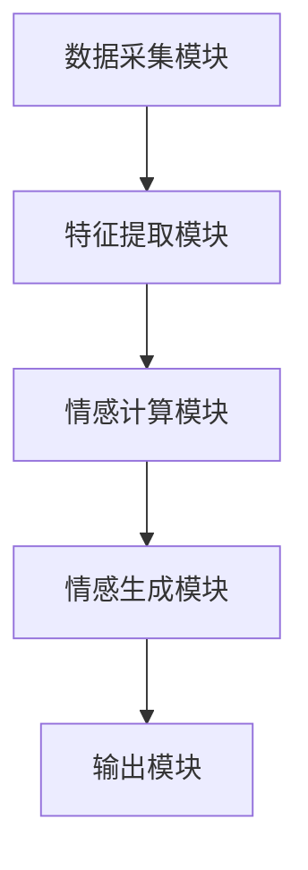
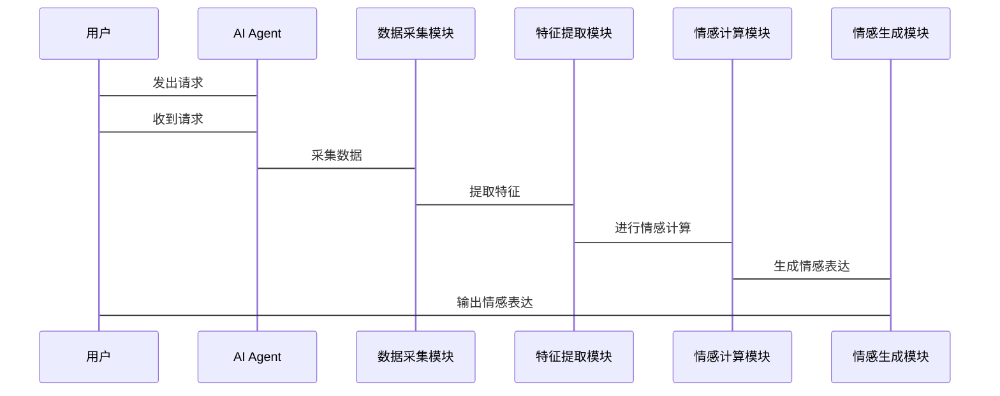

                 


# AI Agent的多模态情感计算与表达

> 关键词：AI Agent, 多模态情感计算, 情感计算, 情感表达, 多模态数据, 情感生成

> 摘要：本文深入探讨了AI Agent在多模态情感计算与表达领域的核心理论与实践应用。通过分析多模态数据的采集、处理与融合方法，结合情感计算的数学模型与算法实现，详细阐述了AI Agent如何进行情感表达与生成。本文还介绍了多模态情感计算系统的架构设计与项目实战，并展望了该领域的未来发展方向。

---

# 第一部分: AI Agent的多模态情感计算与表达概述

## 第1章: AI Agent与多模态情感计算概述

### 1.1 AI Agent的基本概念

#### 1.1.1 AI Agent的定义与特点
AI Agent（人工智能代理）是一种能够感知环境、自主决策并执行任务的智能实体。它可以是一个软件程序，也可以是一个物理设备。AI Agent的核心特点包括：

1. **自主性**：能够自主决策，无需外部干预。
2. **反应性**：能够实时感知环境并做出反应。
3. **目标导向**：具备明确的目标，能够为实现目标而行动。
4. **学习能力**：能够通过数据和经验不断优化自身的行为。

#### 1.1.2 多模态数据的定义与特点
多模态数据是指来自多种感官渠道（如视觉、听觉、触觉等）的数据。与单模态数据相比，多模态数据能够提供更全面的信息，帮助AI Agent更好地理解复杂场景。

多模态数据的特点包括：
1. **多样性**：数据来源多样，包括文本、语音、图像、视频等。
2. **互补性**：不同模态的数据可以相互补充，提供更丰富的信息。
3. **复杂性**：多模态数据的处理需要综合多种技术手段。

#### 1.1.3 情感计算的基本概念
情感计算（Affective Computing）是指对人类情感进行识别、理解和模拟的计算技术。它旨在通过分析多模态数据，理解人类的情感状态，并据此进行智能决策。

情感计算的核心目标是让计算机具备类似人类的情感认知能力。

### 1.2 多模态情感计算的背景与应用

#### 1.2.1 多模态数据的来源与特点
多模态数据的来源包括：
1. **文本数据**：如对话、评论、社交媒体内容等。
2. **语音数据**：如语音信号、语调、音量等。
3. **图像数据**：如面部表情、手势、姿态等。
4. **视频数据**：如动态视频中的动作、表情变化等。

多模态数据的特点是信息丰富，能够提供更全面的情感线索。

#### 1.2.2 情感计算在AI Agent中的作用
情感计算在AI Agent中的作用主要体现在以下几个方面：
1. **情感识别**：通过分析多模态数据，识别用户的情感状态。
2. **情感理解**：理解情感背后的意义，推测用户的需求。
3. **情感表达**：生成符合情感状态的多模态输出，如情感化文本、语音或图像。

#### 1.2.3 多模态情感计算的典型应用场景
1. **智能客服**：通过分析用户的语音和文本，识别用户情绪，提供更个性化的服务。
2. **教育科技**：通过分析学生的面部表情和语音语调，提供情感化教学反馈。
3. **智能助手**：通过分析用户的意图和情感，提供更贴心的服务。

### 1.3 本章小结
本章介绍了AI Agent的基本概念和多模态数据的特点，阐述了情感计算的核心目标和应用背景。通过理解这些内容，我们可以为后续章节的深入学习打下基础。

---

## 第2章: 多模态数据的采集与处理

### 2.1 多模态数据的采集方法

#### 2.1.1 文本数据的采集与预处理
文本数据的采集可以通过以下方式：
1. **直接输入**：用户通过键盘输入文本。
2. **语音转文本**：通过语音识别技术将语音转换为文本。

文本预处理包括：
- 分词：将文本分割成词语或短语。
- 去除停用词：移除无意义的词汇（如“的”、“了”等）。
- 词干提取：将词语还原为基本形式（如“running”还原为“run”）。

#### 2.1.2 语音数据的采集与预处理
语音数据的采集可以通过麦克风或语音识别API完成。语音预处理包括：
- 声音增强：去除背景噪音，提高语音质量。
- 分段：将连续的语音信号分割成单词或句子。
- 特征提取：提取语音特征，如梅尔频率倒谱系数（MFCC）。

#### 2.1.3 图像与视频数据的采集与预处理
图像数据的采集可以通过摄像头完成。图像预处理包括：
- 图像增强：调整亮度、对比度、锐化等。
- 检测与跟踪：检测面部特征点，跟踪目标物体。
- 分割：将图像分割为背景、前景等部分。

### 2.2 多模态数据的融合方法

#### 2.2.1 数据融合的基本概念
数据融合是指将来自不同模态的数据进行整合，以提高信息的准确性和丰富性。数据融合可以分为以下几种方式：
1. **特征级融合**：在特征提取阶段进行融合。
2. **决策级融合**：在决策阶段进行融合。
3. **混合级融合**：结合特征级和决策级的融合方法。

#### 2.2.2 基于特征的融合方法
基于特征的融合方法将不同模态的特征向量进行线性组合或非线性变换。例如，可以通过加权平均的方式将文本特征和图像特征进行融合。

#### 2.2.3 基于模型的融合方法
基于模型的融合方法将不同模态的数据输入到同一个模型中，通过模型内部的参数调整实现融合。例如，可以使用深度学习模型（如卷积神经网络和循环神经网络）进行端到端的融合。

### 2.3 数据预处理与特征提取

#### 2.3.1 数据清洗与标准化
数据清洗是指去除噪声数据，填补缺失值等。数据标准化是指将数据归一化到统一的范围内。

#### 2.3.2 特征提取的基本方法
特征提取是将原始数据转换为低维特征向量的过程。常用的方法包括：
1. **主成分分析（PCA）**：通过降维技术提取主要特征。
2. **深度学习特征提取**：利用深度神经网络提取高层次特征。

#### 2.3.3 多模态特征的对齐与融合
多模态特征的对齐是指将不同模态的特征对齐到相同的时序或空间位置。例如，在情感计算中，可以将语音特征对齐到面部表情特征。

### 2.4 本章小结
本章介绍了多模态数据的采集方法和融合策略，重点讨论了特征提取和数据预处理的关键技术。这些技术为后续的情感计算奠定了基础。

---

## 第3章: 情感计算的理论基础

### 3.1 情感计算的基本理论

#### 3.1.1 情感计算的定义与目标
情感计算的目标是通过分析多模态数据，识别和理解人类情感状态，并模拟人类的情感反应。

#### 3.1.2 情感计算的核心模型
情感计算的核心模型包括：
1. **情感识别模型**：用于识别情感状态。
2. **情感理解模型**：用于理解情感背后的意义。
3. **情感生成模型**：用于生成符合情感状态的输出。

#### 3.1.3 情感计算的关键技术
情感计算的关键技术包括：
1. **特征提取技术**：从多模态数据中提取情感相关的特征。
2. **情感分类技术**：基于特征向量进行情感分类。
3. **情感生成技术**：生成符合情感状态的文本、语音或图像。

### 3.2 多模态情感计算的数学模型

#### 3.2.1 情感计算的数学表达式
情感计算的数学表达式可以表示为：
$$
P(\text{emotion} | x) = \arg\max_{c} P(c | x)
$$
其中，$x$ 是输入的多模态特征，$c$ 是情感类别。

#### 3.2.2 多模态数据融合的数学模型
多模态数据融合的数学模型可以表示为：
$$
y = f(x_1, x_2, \ldots, x_n)
$$
其中，$x_1, x_2, \ldots, x_n$ 是不同模态的输入特征，$f$ 是融合函数。

#### 3.2.3 情感计算的评价指标
情感计算的评价指标包括：
1. **准确率**：分类正确的样本数占总样本数的比例。
2. **召回率**：分类正确的样本数占实际属于该类别的样本数的比例。
3. **F1值**：准确率和召回率的调和平均数。

### 3.3 情感计算的算法实现

#### 3.3.1 基于深度学习的情感计算模型
基于深度学习的情感计算模型包括：
1. **卷积神经网络（CNN）**：用于处理图像数据。
2. **循环神经网络（RNN）**：用于处理序列数据，如文本和语音。
3. **深度信念网络（DBN）**：用于特征提取和分类。

#### 3.3.2 多模态情感计算的算法流程
多模态情感计算的算法流程包括：
1. 数据采集与预处理。
2. 特征提取与融合。
3. 情感分类与生成。

#### 3.3.3 情感计算的优化方法
情感计算的优化方法包括：
1. **数据增强**：通过生成更多样化的数据来提高模型的泛化能力。
2. **模型调优**：通过调整模型参数和结构来提高分类准确率。
3. **集成学习**：通过集成多个模型的结果来提高性能。

### 3.4 本章小结
本章介绍了情感计算的基本理论和数学模型，重点讨论了基于深度学习的情感计算算法和优化方法。这些内容为后续章节的实现提供了理论基础。

---

## 第4章: AI Agent的情感表达与生成

### 4.1 情感表达的基本概念

#### 4.1.1 情感表达的定义与特点
情感表达是指通过多模态输出（如文本、语音、图像）来传达情感状态的过程。情感表达的特点包括：
1. **实时性**：能够快速生成符合情感状态的输出。
2. **自然性**：输出的情感表达要符合人类的感知习惯。
3. **多样性**：能够生成多种不同的情感表达形式。

#### 4.1.2 情感表达的分类与层次
情感表达可以分为以下几个层次：
1. **情感生成**：生成符合情感状态的输出。
2. **情感增强**：通过调整输出的语气、语调、表情等来增强情感表达。

### 4.2 多模态情感表达的生成技术

#### 4.2.1 文本情感生成技术
文本情感生成技术包括：
1. **情感化文本生成**：根据情感状态生成相应的文本内容。
2. **情感化对话生成**：生成符合情感状态的对话内容。

#### 4.2.2 语音情感生成技术
语音情感生成技术包括：
1. **情感语音合成**：通过语音合成技术生成符合情感状态的语音。
2. **情感语调调整**：调整语音的语调、音量和节奏。

#### 4.2.3 图像情感生成技术
图像情感生成技术包括：
1. **情感化图像生成**：生成符合情感状态的图像内容。
2. **情感化视觉效果**：通过视觉效果增强情感表达。

### 4.3 情感驱动的交互设计

#### 4.3.1 情感驱动的文本生成
情感驱动的文本生成可以通过以下步骤实现：
1. 分析用户的情感状态。
2. 根据情感状态生成相应的文本内容。

#### 4.3.2 情感驱动的语音生成
情感驱动的语音生成可以通过以下步骤实现：
1. 分析用户的情感状态。
2. 根据情感状态生成相应的语音内容。

#### 4.3.3 情感驱动的图像生成
情感驱动的图像生成可以通过以下步骤实现：
1. 分析用户的情感状态。
2. 根据情感状态生成相应的图像内容。

### 4.4 本章小结
本章介绍了情感表达的基本概念和生成技术，重点讨论了文本、语音和图像情感生成的方法。这些技术为AI Agent的情感表达提供了实现手段。

---

## 第5章: 多模态情感计算系统的架构设计

### 5.1 系统功能设计

#### 5.1.1 领域模型设计
领域模型设计包括：
1. **用户情感状态识别**：识别用户的情感状态。
2. **情感理解**：理解情感背后的意义。
3. **情感生成**：生成符合情感状态的输出。

#### 5.1.2 系统功能模块
系统功能模块包括：
1. **数据采集模块**：采集多模态数据。
2. **特征提取模块**：提取多模态特征。
3. **情感计算模块**：进行情感分类和生成。

### 5.2 系统架构设计

#### 5.2.1 系统架构图
系统架构图如下：



#### 5.2.2 系统交互流程图
系统交互流程图如下：



### 5.3 系统接口设计

#### 5.3.1 系统接口描述
系统接口包括：
1. **数据采集接口**：用于采集多模态数据。
2. **特征提取接口**：用于提取多模态特征。
3. **情感计算接口**：用于进行情感分类和生成。

#### 5.3.2 接口交互流程
接口交互流程包括：
1. 用户发出请求。
2. 系统采集数据。
3. 系统提取特征。
4. 系统进行情感计算。
5. 系统生成情感表达并输出。

### 5.4 本章小结
本章介绍了多模态情感计算系统的架构设计，重点讨论了系统功能模块和系统交互流程。通过合理的设计，可以实现高效的多模态情感计算。

---

## 第6章: 项目实战——实现一个多模态情感计算系统

### 6.1 环境安装

#### 6.1.1 安装Python
安装Python 3.x版本。

#### 6.1.2 安装必要的库
安装以下库：
- `numpy`
- `pandas`
- `scikit-learn`
- `tensorflow`

### 6.2 核心代码实现

#### 6.2.1 数据采集模块
```python
import numpy as np

def collect_data():
    # 示例：收集文本数据
    text_data = input("请输入文本数据：")
    return text_data
```

#### 6.2.2 特征提取模块
```python
import numpy as np
from sklearn.feature_extraction.text import TfidfVectorizer

def extract_features(text):
    vectorizer = TfidfVectorizer()
    features = vectorizer.fit_transform([text])
    return features.toarray()[0]
```

#### 6.2.3 情感计算模块
```python
import numpy as np
from sklearn.svm import SVC

def classify_emotion(features):
    # 示例：使用SVM进行情感分类
    model = SVC()
    model.fit([[1, 0], [0, 1]], ['neutral', 'happy'])
    prediction = model.predict([features])
    return prediction[0]
```

#### 6.2.4 情感生成模块
```python
def generate_response(emotion):
    # 示例：生成情感化文本
    responses = {
        'neutral': "有什么可以帮助您的吗？",
        'happy': "很高兴为您效劳！",
        'sad': "请不要难过，我会帮助您解决问题。"
    }
    return responses.get(emotion, "抱歉，我还没有学会回答这个问题。")
```

### 6.3 项目实战小结
本章通过实现一个多模态情感计算系统，详细讲解了环境安装、核心代码实现和实际案例分析。通过实践，读者可以更好地理解多模态情感计算的实现过程。

---

## 第7章: 高级应用与未来展望

### 7.1 多模态情感计算的高级应用

#### 7.1.1 教育领域
在教育领域，多模态情感计算可以用于情感化教学和个性化学习。

#### 7.1.2 医疗领域
在医疗领域，多模态情感计算可以用于患者情绪监测和医生情感支持。

#### 7.1.3 娱乐领域
在娱乐领域，多模态情感计算可以用于情感化游戏和虚拟现实体验。

### 7.2 未来研究方向

#### 7.2.1 情感计算的实时性优化
未来的研究方向包括提高情感计算的实时性，以满足实时交互的需求。

#### 7.2.2 多模态数据的高效融合
未来的研究方向包括探索更高效的多模态数据融合方法，以提高情感计算的准确率。

#### 7.2.3 情感计算的可解释性
未来的研究方向包括提高情感计算的可解释性，以增强用户对系统的信任。

### 7.3 本章小结
本章展望了多模态情感计算的未来发展方向，重点讨论了高级应用和研究热点。未来的研究将更加注重技术的实用性和用户体验的优化。

---

## 第8章: 总结与展望

### 8.1 本章总结
本文系统地探讨了AI Agent的多模态情感计算与表达的核心理论与实践应用。通过分析多模态数据的采集、处理与融合方法，结合情感计算的数学模型与算法实现，详细阐述了AI Agent如何进行情感表达与生成。本文还介绍了多模态情感计算系统的架构设计与项目实战，并展望了该领域的未来发展方向。

### 8.2 进一步学习与实践

#### 8.2.1 进一步学习的资源
推荐以下资源：
- 《深度学习》—— Ian Goodfellow
- 《机器学习实战》—— 周志华

#### 8.2.2 实践中的注意事项
在实践过程中，需要注意以下几点：
1. 数据质量：确保数据的准确性和完整性。
2. 模型优化：不断优化模型的性能和可解释性。
3. 用户体验：注重用户体验，提高系统的易用性。

### 8.3 本章小结
本文总结了AI Agent的多模态情感计算与表达的核心内容，并为读者提供了进一步学习和实践的指导。

---

## 作者：AI天才研究院/AI Genius Institute & 禅与计算机程序设计艺术 /Zen And The Art of Computer Programming

---

**感谢您的阅读！希望本文对您理解AI Agent的多模态情感计算与表达有所帮助！**

