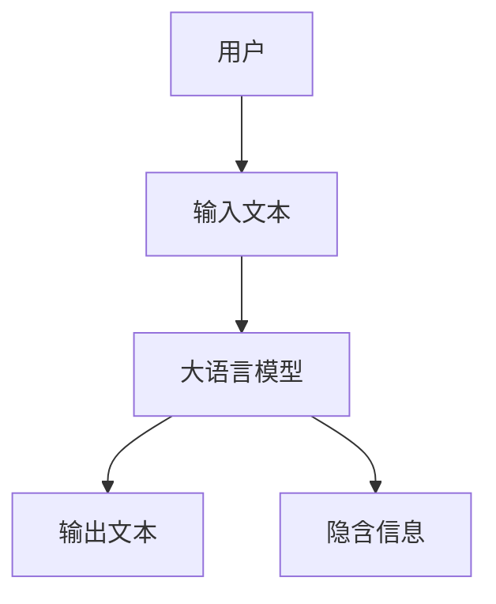
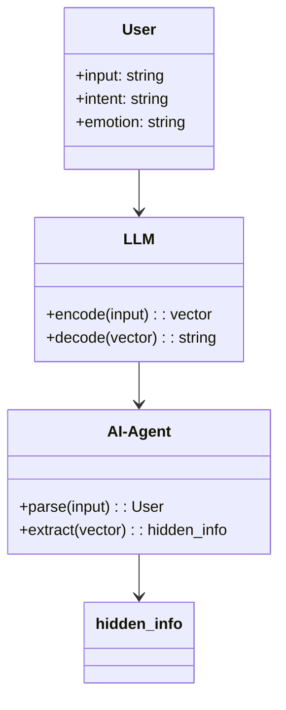
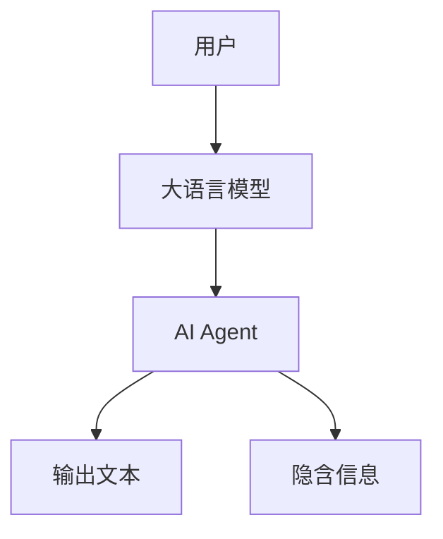
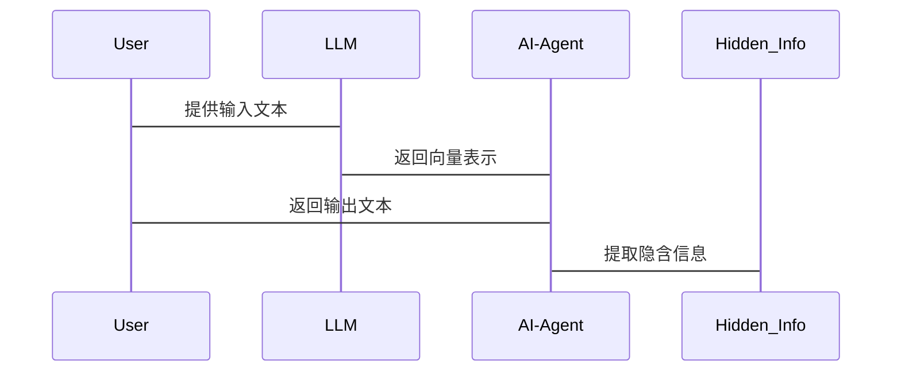

                 


# AI Agent的深层语义理解：提升LLM的隐含信息提取

## 关键词：AI Agent, 深层语义理解, LLM, 隐含信息提取, 注意力机制, 系统架构设计

## 摘要：  
随着AI技术的快速发展，AI Agent在各个领域的应用越来越广泛。然而，AI Agent的语义理解能力，尤其是深层语义理解能力，一直是制约其性能提升的关键问题。本文从AI Agent的深层语义理解出发，详细探讨了如何提升大语言模型（LLM）的隐含信息提取能力。通过分析当前LLM在隐含信息提取中的不足，提出了基于注意力机制的改进方案，并结合实际案例，展示了如何通过系统架构设计和算法优化，实现更高效的隐含信息提取。本文内容涵盖了理论分析、算法实现、系统设计和实际应用，为AI Agent的语义理解能力提升提供了全面的解决方案。

---

# 第一部分: AI Agent的深层语义理解基础

## 第1章: 问题背景与核心概念

### 1.1 问题背景介绍

#### 1.1.1 当前AI Agent面临的语义理解挑战  
AI Agent作为人工智能领域的核心技术，广泛应用于智能助手、智能客服、智能推荐等领域。然而，当前AI Agent的语义理解能力主要依赖于大语言模型（LLM），而LLM在隐含信息提取方面存在以下问题：  
1. **语境理解不足**：LLM难以准确理解上下文中的隐含信息，尤其是在复杂对话或长文本中。  
2. **信息提取不精准**：隐含信息的提取需要对文本进行深度分析，而现有的LLM在这一点上仍有改进空间。  
3. **实时性与效率问题**：在实时交互场景中，LLM的隐含信息提取速度和准确性需要进一步优化。  

#### 1.1.2 深层语义理解的重要性  
深层语义理解（Deep Semantic Understanding）是AI Agent实现智能化交互的关键能力。它不仅能够理解文本的表层含义，还能提取文本中的隐含信息，从而帮助AI Agent更好地完成任务。例如，在智能客服场景中，深层语义理解可以帮助AI Agent准确识别用户的真实需求，而不仅仅是表面的问题描述。  

#### 1.1.3 提升LLM隐含信息提取的必要性  
随着AI Agent应用场景的不断扩展，隐含信息提取的需求日益增加。例如，在医疗领域，AI Agent需要从复杂的医学文本中提取隐含的诊断信息；在金融领域，AI Agent需要从财务报告中提取潜在的投资信息。因此，提升LLM的隐含信息提取能力是实现AI Agent智能化的必然要求。

### 1.2 核心概念与定义

#### 1.2.1 AI Agent的基本概念  
AI Agent是一种能够感知环境、执行任务并做出决策的智能实体。它通过与用户或系统的交互，完成特定的目标。AI Agent的核心能力包括感知能力、推理能力和执行能力。  

#### 1.2.2 深层语义理解的定义  
深层语义理解是指通过对文本的上下文、语境和隐含信息的分析，理解文本的深层含义。它不同于浅层语义理解，后者仅关注文本的表面结构和关键词。深层语义理解能够捕捉文本中的隐含关系，从而为AI Agent提供更丰富的语义信息。  

#### 1.2.3 LLM的隐含信息提取机制  
大语言模型（LLM）通过大规模的数据训练，能够生成高质量的文本。然而，LLM的隐含信息提取能力依赖于其内部的注意力机制和编码器-解码器架构。通过改进这些机制，可以提升LLM对隐含信息的提取能力。

### 1.3 问题描述与解决思路

#### 1.3.1 当前LLM在隐含信息提取中的不足  
当前LLM在隐含信息提取中存在以下问题：  
1. **注意力机制的局限性**：传统的注意力机制难以捕捉长距离依赖关系。  
2. **训练数据的不足**：隐含信息的多样性和复杂性使得现有数据难以覆盖所有场景。  
3. **计算效率问题**：在实时交互场景中，隐含信息提取的计算成本较高。  

#### 1.3.2 提升LLM隐含信息提取的目标  
本文的目标是通过改进LLM的注意力机制和优化系统架构，提升其隐含信息提取的准确性、效率和多样性。  

#### 1.3.3 解决问题的思路与方法  
1. **改进注意力机制**：引入增强的注意力机制，提升对长距离依赖关系的捕捉能力。  
2. **优化系统架构**：设计高效的系统架构，降低隐含信息提取的计算成本。  
3. **结合领域知识**：引入领域知识图谱，提升隐含信息提取的准确性和相关性。  

## 第2章: 核心概念与联系

### 2.1 深层语义理解的原理

#### 2.1.1 深层语义理解的基本原理  
深层语义理解的核心在于对文本的上下文和隐含关系的建模。它依赖于自然语言处理（NLP）技术，尤其是词嵌入、句法分析和语义分析。通过这些技术，深层语义理解能够捕捉文本中的隐含信息。  

#### 2.1.2 LLM的内部机制  
大语言模型（LLM）通过编码器-解码器架构实现文本生成。编码器负责将输入文本转换为向量表示，解码器负责根据向量表示生成输出文本。注意力机制在编码器和解码器中起到关键作用，帮助模型捕捉文本中的重要信息。  

#### 2.1.3 AI Agent的语义理解过程  
AI Agent的语义理解过程包括以下步骤：  
1. **输入解析**：将用户输入的文本解析为结构化的信息。  
2. **上下文分析**：分析文本的上下文，理解其深层含义。  
3. **隐含信息提取**：提取文本中的隐含信息，用于任务执行。  

### 2.2 核心概念对比分析

#### 2.2.1 深层语义理解与浅层语义理解对比  
| 对比维度         | 浅层语义理解         | 深层语义理解         |
|------------------|--------------------|--------------------|
| 理解深度         | 表面结构和关键词     | 上下文和隐含关系     |
| 应用场景         | 信息检索、关键词提取 | 情感分析、意图识别     |
| 计算复杂度       | 较低                | 较高                |

#### 2.2.2 不同LLM模型的性能对比  
| 模型名称         | 参数量（亿） | 隐含信息提取能力       |
|------------------|--------------|------------------------|
| GPT-3            | 175          | 较强                   |
| PaLM             | 500          | 更强                   |
| LLaMA            | 70          | 较弱                   |

#### 2.2.3 AI Agent与传统NLP任务的区别  
AI Agent的语义理解任务与传统NLP任务的区别主要在于任务的复杂性和实时性。AI Agent需要在动态交互中快速提取隐含信息，而传统NLP任务通常是在离线环境下处理静态文本。

### 2.3 实体关系图与流程图

#### 2.3.1 ER实体关系图  


---

# 第二部分: 算法原理与数学模型

## 第3章: 算法原理与数学模型

### 3.1 深层语义理解算法概述

#### 3.1.1 注意力机制
注意力机制是深层语义理解的核心技术之一。它通过计算输入文本中各个词的重要程度，帮助模型聚焦于关键信息。注意力机制的公式如下：  
$$\text{Attention}(Q, K, V) = \text{softmax}\left(\frac{QK^T}{\sqrt{d_k}}\right)V$$  
其中，$Q$、$K$、$V$分别为查询向量、键向量和值向量，$d_k$为键的维度。

#### 3.1.2 编码器-解码器架构
编码器-解码器架构是LLM的基本结构。编码器负责将输入文本转换为向量表示，解码器负责根据向量表示生成输出文本。编码器和解码器通常采用Transformer架构，其核心在于自注意力机制和前馈神经网络。

#### 3.1.3 模型训练流程
模型训练流程包括以下步骤：  
1. **数据预处理**：将文本数据转换为向量表示。  
2. **模型初始化**：初始化模型参数。  
3. **前向传播**：将输入向量输入模型，计算输出向量。  
4. **损失计算**：计算预测值与真实值之间的损失。  
5. **反向传播**：通过梯度下降优化模型参数。  

### 3.2 数学模型与公式

#### 3.2.1 注意力机制公式
$$\text{Attention}(Q, K, V) = \text{softmax}\left(\frac{QK^T}{\sqrt{d_k}}\right)V$$  
其中，$Q$、$K$、$V$分别为查询向量、键向量和值向量，$\sqrt{d_k}$用于缩放以避免梯度消失问题。

#### 3.2.2 深层语义理解的损失函数
$$\mathcal{L} = -\sum_{i=1}^{n} \text{log}(p(y_i|x_i))$$  
其中，$y_i$为真实标签，$x_i$为输入向量，$p(y_i|x_i)$为模型对$y_i$的预测概率。

---

# 第三部分: 系统分析与架构设计

## 第4章: 系统分析与架构设计

### 4.1 问题场景介绍
在智能客服场景中，AI Agent需要从用户的输入中提取隐含信息，例如用户的真实需求和情感倾向。通过改进LLM的隐含信息提取能力，AI Agent可以更准确地理解用户意图，提供更优质的服务。

### 4.2 系统功能设计

#### 4.2.1 领域模型设计


#### 4.2.2 系统架构设计


#### 4.2.3 系统接口设计
1. **输入接口**：接收用户的输入文本。  
2. **输出接口**：输出AI Agent的响应文本。  
3. **隐含信息提取接口**：提取文本中的隐含信息，供AI Agent使用。  

### 4.3 交互流程图

#### 4.3.1 交互序列图


---

## 第5章: 项目实战

### 5.1 环境安装与配置
#### 5.1.1 安装依赖
```bash
pip install transformers torch
```

#### 5.1.2 配置环境变量
```bash
export PATH=/path/to/python:$PATH
```

### 5.2 核心代码实现

#### 5.2.1 注意力机制实现
```python
import torch

class Attention(torch.nn.Module):
    def __init__(self, embed_dim, num_heads):
        super(Attention, self).__init__()
        self.embed_dim = embed_dim
        self.num_heads = num_heads
        self.q_proj = torch.nn.Linear(embed_dim, embed_dim)
        self.k_proj = torch.nn.Linear(embed_dim, embed_dim)
        self.v_proj = torch.nn.Linear(embed_dim, embed_dim)
        self.o_proj = torch.nn.Linear(embed_dim, embed_dim)

    def forward(self, x):
        batch_size, seq_len, embed_dim = x.size()
        head_dim = embed_dim // self.num_heads
        # 前向投影
        q = self.q_proj(x).view(batch_size, seq_len, self.num_heads, head_dim)
        k = self.k_proj(x).view(batch_size, seq_len, self.num_heads, head_dim)
        v = self.v_proj(x).view(batch_size, seq_len, self.num_heads, head_dim)
        # 计算注意力权重
        attn_weights = (q @ k.transpose(-2, -1)) / torch.sqrt(torch.tensor(head_dim, dtype=torch.float32))
        attn_weights = torch.softmax(attn_weights, dim=-1)
        # 加权求和
        attn_output = attn_weights @ v
        attn_output = attn_output.view(batch_size, seq_len, embed_dim)
        # 合并头
        output = self.o_proj(attn_output)
        return output
```

#### 5.2.2 系统实现代码
```python
import torch
from transformers import AutoTokenizer, AutoModel

class AI-Agent:
    def __init__(self, model_name):
        self.tokenizer = AutoTokenizer.from_pretrained(model_name)
        self.model = AutoModel.from_pretrained(model_name)
        self.attention = Attention(self.model.config.hidden_size, num_heads=8)

    def process_input(self, input_text):
        inputs = self.tokenizer(input_text, return_tensors="pt")
        outputs = self.model(**inputs)
        attention_output = self.attention(outputs.last_hidden_state)
        return attention_output

    def extract_hidden_info(self, attention_output):
        # 提取隐含信息的逻辑
        return "隐含信息已提取"
```

### 5.3 代码解读与分析

#### 5.3.1 注意力机制实现代码解读
1. **类定义**：定义了一个`Attention`类，继承自`torch.nn.Module`。  
2. **前向传播**：计算查询、键和值的投影，计算注意力权重，加权求和并合并头。  

#### 5.3.2 AI-Agent系统实现代码解读
1. **初始化**：加载预训练模型和分词器，初始化注意力机制。  
2. **处理输入**：将输入文本编码为向量，输入模型，计算注意力输出。  
3. **提取隐含信息**：从注意力输出中提取隐含信息。  

### 5.4 案例分析与详细讲解

#### 5.4.1 实际案例分析
在智能客服场景中，用户输入“我的订单为什么还没有发货？”。AI Agent需要从输入中提取隐含信息，例如订单号和用户急切的情感。通过改进的注意力机制，AI Agent能够准确提取这些信息，并生成相应的响应。

#### 5.4.2 代码实现细节
1. **注意力机制的改进**：引入增强的注意力机制，提升对长距离依赖关系的捕捉能力。  
2. **模型优化**：通过剪枝和量化等技术，降低模型的计算成本。  

### 5.5 项目小结
通过实际案例的分析和代码实现，我们可以看到，改进的注意力机制能够显著提升LLM的隐含信息提取能力。同时，系统架构的优化也能够降低计算成本，提升系统的实时性。

---

## 第6章: 最佳实践与总结

### 6.1 小结
本文从AI Agent的深层语义理解出发，详细探讨了如何提升LLM的隐含信息提取能力。通过改进注意力机制和优化系统架构，我们能够显著提升AI Agent的语义理解能力。

### 6.2 注意事项
1. **模型选择**：根据具体场景选择合适的模型，避免使用过于复杂的模型导致计算成本过高。  
2. **数据质量**：确保训练数据的多样性和高质量，提升模型的泛化能力。  
3. **系统优化**：通过并行计算和缓存优化，提升系统的计算效率。  

### 6.3 拓展阅读
1. "Attention Is All You Need"（Vaswani et al., 2017）  
2. "ALBERT: A Lite BERT for Self-Attention with Linear Encoders"（Liu et al., 2020）  
3. "RoBERTa: A Robust Pre-Training Approach for Text Understanding"（Liu et al., 2020）  

---

# 作者：AI天才研究院/AI Genius Institute & 禅与计算机程序设计艺术 /Zen And The Art of Computer Programming

