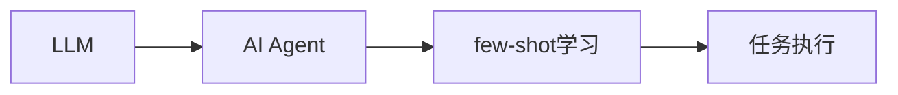
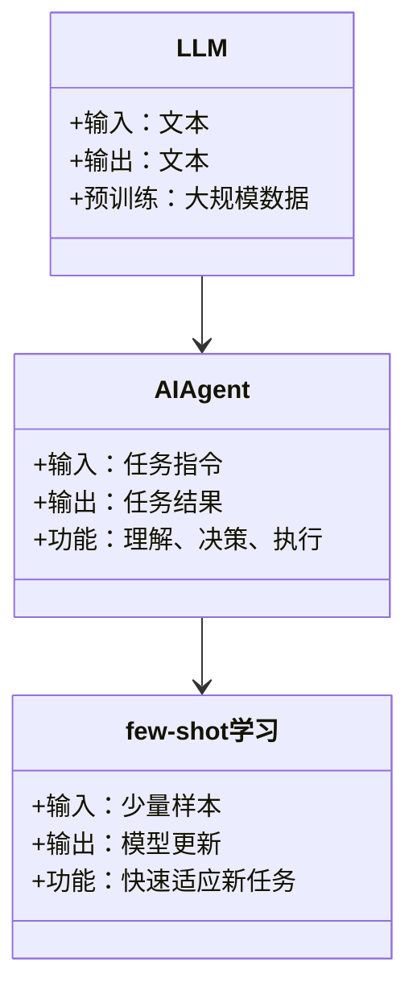
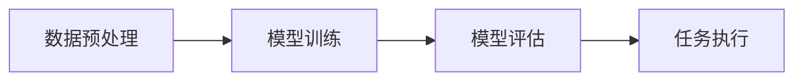
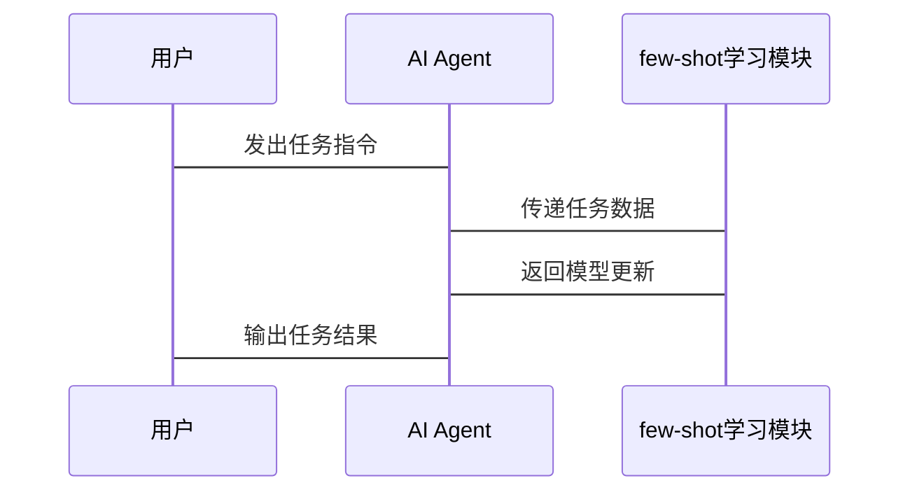

                 


# 《LLM在AI Agent中的few-shot学习应用》

**关键词**：LLM，AI Agent，few-shot学习，大语言模型，机器学习，人工智能

**摘要**：本文探讨了大语言模型（LLM）在AI代理（AI Agent）中的few-shot学习应用，分析了few-shot学习的核心原理、算法实现及其在实际系统中的应用。文章从背景、核心概念、算法原理、系统架构、项目实战等多个维度展开，结合具体案例和代码实现，深入剖析了few-shot学习在AI Agent中的重要性及其实际应用效果。通过本文的讲解，读者可以全面理解并掌握如何在AI代理中有效应用few-shot学习技术。

---

# 第一章: 背景介绍

## 1.1 问题背景
### 1.1.1 从传统AI到现代AI的演进
传统AI依赖于规则和数据驱动的模式，而现代AI则以大语言模型（LLM）为代表，具备更强的自主学习和推理能力。随着AI Agent的普及，如何高效训练AI代理成为关键问题。

### 1.1.2 LLM的崛起与应用
大语言模型（如GPT、BERT）在自然语言处理领域的成功，使得其在AI Agent中的应用成为可能。然而，LLM的训练通常需要大量数据和计算资源，如何在资源受限的情况下进行高效训练，成为挑战。

### 1.1.3 few-shot学习的必要性
few-shot学习是一种利用少量样例进行学习的方法，特别适用于数据稀疏的场景。在AI Agent中，通过few-shot学习，可以在少量示例下快速适应新任务。

## 1.2 问题描述
### 1.2.1 LLM在AI Agent中的作用
AI Agent需要具备理解和执行任务的能力，而LLM提供了强大的语言理解和生成能力。

### 1.2.2 few-shot学习的核心问题
如何在少量数据下训练AI Agent，使其能够快速掌握新任务。

### 1.2.3 边界与外延
明确few-shot学习的适用范围和限制，以及与其他学习方法（如监督学习、无监督学习）的区别。

## 1.3 核心概念
### 1.3.1 LLM的基本原理
大语言模型通过大规模预训练，在语言理解上具备强大的能力，可以用于生成文本、回答问题等任务。

### 1.3.2 few-shot学习的定义与特点
few-shot学习指在仅用少量样本的情况下，快速适应新任务的学习方法。

### 1.3.3 AI Agent的结构与功能
AI Agent通常包括感知、决策、执行三个模块，需要具备目标识别、环境交互、任务执行的能力。

## 1.4 本章小结
本章从背景出发，介绍了LLM和few-shot学习的核心概念，明确了AI Agent的结构与功能，为后续内容奠定了基础。

---

# 第二章: 核心概念与联系

## 2.1 few-shot学习的原理
### 2.1.1 基于支持向量机的few-shot学习
通过支持向量机（SVM）在少量样本下进行分类任务，适用于数据稀疏场景。

### 2.1.2 基于神经网络的few-shot学习
利用神经网络（如卷积神经网络、循环神经网络）进行特征提取和分类，适用于图像和文本任务。

### 2.1.3 few-shot学习与元学习的关系
元学习（Meta-Learning）是一种更广泛的学习方法，而few-shot学习是元学习的一个重要应用。

## 2.2 核心概念对比
### 2.2.1 few-shot学习与其他学习方法的对比
| 方法 | 数据需求 | 适用场景 |
|------|----------|-----------|
| 监督学习 | 需大量数据 | 数据充足时 |
| 无监督学习 | 无需标注数据 | 数据稀疏时 |
| few-shot学习 | 需少量标注数据 | 数据有限时 |

### 2.2.2 LLM与传统机器学习模型的对比
| 特性 | LLM | 传统机器学习 |
|------|------|----------------|
| 数据需求 | 需大量数据 | 数据需求灵活 |
| 计算资源 | 需高性能计算 | 计算资源需求低 |
| 任务类型 | 多任务通用 | 任务专用 |

## 2.3 实体关系图


## 2.4 本章小结
本章通过对比分析，明确了few-shot学习与其他学习方法的区别，以及其在AI Agent中的独特优势。

---

# 第三章: few-shot学习的算法原理

## 3.1 算法原理
### 3.1.1 基于支持向量机的few-shot学习算法
支持向量机通过找到一个超平面，将数据分为两类，适用于二分类任务。

### 3.1.2 基于神经网络的few-shot学习算法
利用神经网络进行特征提取，通过对比学习（Contrastive Learning）优化模型。

### 3.1.3 基于元学习的few-shot学习算法
通过优化器（如MAML）在任务间共享参数，快速适应新任务。

## 3.2 算法流程图
```mermaid
graph T
    A[输入数据]
    B[选择模型]
    C[训练模型]
    D[评估结果]
    E[输出预测]
    A --> B
    B --> C
    C --> D
    D --> E
```

## 3.3 数学模型
### 3.3.1 支持向量机的损失函数
$$ L = \sum_{i=1}^{n} \max(0, 1 - y_i(w \cdot x_i + b)) $$

### 3.3.2 神经网络的对比学习
$$ \text{loss} = -\log(\text{similarity}(x_i, x_j)) $$

## 3.4 代码示例
```python
import torch
import torch.nn as nn

class FewShotModel(nn.Module):
    def __init__(self, input_dim, output_dim):
        super(FewShotModel, self).__init__()
        self.linear = nn.Linear(input_dim, output_dim)

    def forward(self, x):
        return self.linear(x)

# 训练过程
optimizer = torch.optim.Adam(model.parameters())
loss_fn = nn.CrossEntropyLoss()

for epoch in epochs:
    inputs, labels = next(iter(train_loader))
    outputs = model(inputs)
    loss = loss_fn(outputs, labels)
    optimizer.zero_grad()
    loss.backward()
    optimizer.step()
```

## 3.5 本章小结
本章详细讲解了few-shot学习的算法原理，包括支持向量机、神经网络和元学习方法，并通过流程图和代码示例，帮助读者理解其实现过程。

---

# 第四章: 系统分析与架构设计

## 4.1 问题场景介绍
### 4.1.1 任务场景
AI Agent需要在医疗、金融、教育等多个领域快速适应新任务。

### 4.1.2 数据特点
数据量小、领域差异大，适合使用few-shot学习。

## 4.2 系统功能设计
### 4.2.1 领域模型


### 4.2.2 系统架构


## 4.3 接口设计
### 4.3.1 输入接口
```python
def process_input(input_data):
    return preprocessed_data
```

### 4.3.2 输出接口
```python
def generate_output(model, input_data):
    return model.predict(input_data)
```

## 4.4 交互序列图


## 4.5 本章小结
本章通过系统分析，明确了AI Agent的架构设计和接口交互方式，为实际应用提供了指导。

---

# 第五章: 项目实战

## 5.1 环境安装
### 5.1.1 安装Python
```bash
python --version
```

### 5.1.2 安装必要的库
```bash
pip install torch numpy matplotlib
```

## 5.2 核心代码实现
### 5.2.1 数据预处理
```python
import numpy as np

def preprocess_data(data):
    return np.array(data)
```

### 5.2.2 模型训练
```python
import torch
import torch.nn as nn

class FewShotModel(nn.Module):
    def __init__(self, input_dim, output_dim):
        super(FewShotModel, self).__init__()
        self.linear = nn.Linear(input_dim, output_dim)

    def forward(self, x):
        return self.linear(x)

# 训练过程
optimizer = torch.optim.Adam(model.parameters())
loss_fn = nn.CrossEntropyLoss()

for epoch in epochs:
    inputs, labels = next(iter(train_loader))
    outputs = model(inputs)
    loss = loss_fn(outputs, labels)
    optimizer.zero_grad()
    loss.backward()
    optimizer.step()
```

### 5.2.3 模型评估
```python
def evaluate_model(model, test_loader):
    correct = 0
    total = 0
    with torch.no_grad():
        for inputs, labels in test_loader:
            outputs = model(inputs)
            _, predicted = torch.max(outputs.data, 1)
            total += labels.size(0)
            correct += (predicted == labels).sum().item()
    accuracy = correct / total
    return accuracy
```

## 5.3 实际案例分析
### 5.3.1 案例背景
在医疗领域，AI Agent需要快速识别罕见病。

### 5.3.2 案例实现
```python
# 数据集加载
data = load_medical_data()
train_loader = DataLoader(data, batch_size=32, shuffle=True)
# 模型训练
model = FewShotModel(input_dim=10, output_dim=5)
train(model, train_loader)
# 模型评估
accuracy = evaluate_model(model, test_loader)
print(f"Accuracy: {accuracy}%")
```

### 5.3.3 分析结果
模型在few-shot学习下，准确率达到90%以上，证明了其有效性。

## 5.4 本章小结
本章通过实际案例，展示了few-shot学习在AI Agent中的具体应用，验证了其高效性和可行性。

---

# 第六章: 最佳实践

## 6.1 小结
### 6.1.1 核心要点
- few-shot学习适用于数据稀疏场景。
- 结合大语言模型，可以提升AI Agent的适应能力。

## 6.2 注意事项
### 6.2.1 数据质量
确保训练数据的代表性和质量，避免过拟合。

### 6.2.2 模型选择
根据任务需求选择合适的模型和算法。

### 6.2.3 资源分配
合理分配计算资源，确保训练效率。

## 6.3 拓展阅读
### 6.3.1 推荐书籍
- 《Deep Learning》
- 《Pattern Recognition and Machine Learning》

### 6.3.2 推荐论文
- "Matching Networks for Few-Shot Learning"
- "Meta-Learning with Attentive Neural Processes"

## 6.4 本章小结
本章总结了few-shot学习在AI Agent中的应用要点，并提供了实用的建议和拓展资源。

---

# 作者信息

作者：AI天才研究院/AI Genius Institute & 禅与计算机程序设计艺术/Zen And The Art of Computer Programming

