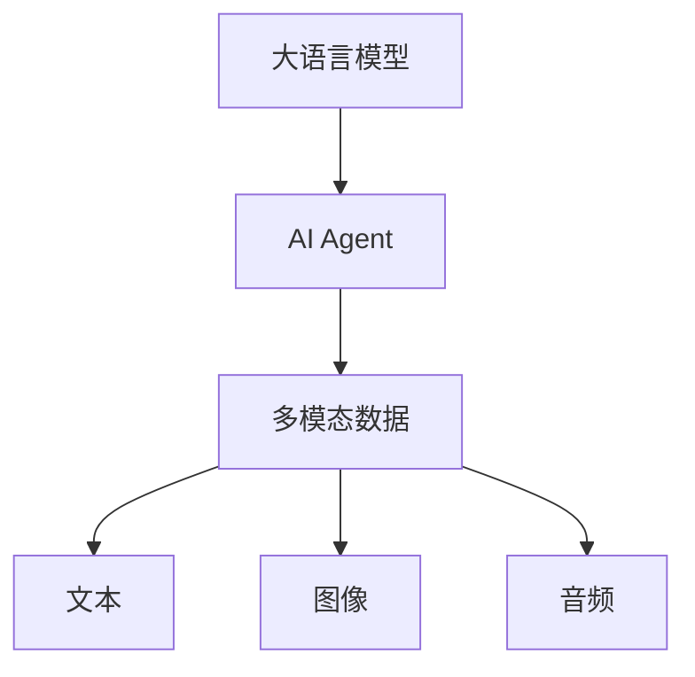
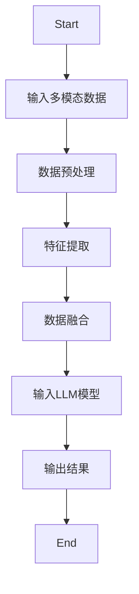
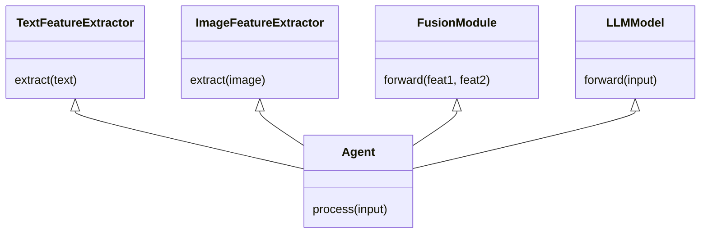
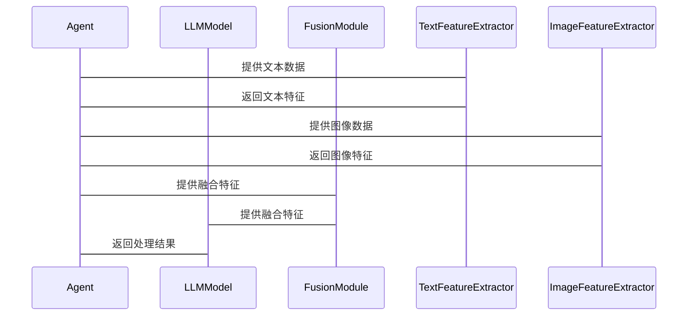
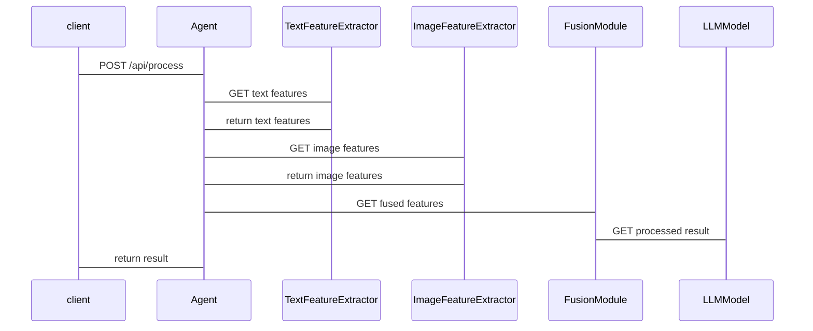

                 


---

# LLM驱动的AI Agent多模态融合处理

## 关键词：
- 大语言模型（LLM）
- AI Agent
- 多模态融合
- 系统架构设计
- 项目实战

## 摘要：
本文深入探讨了如何利用大语言模型（LLM）驱动的AI Agent实现多模态数据的融合处理。通过分析多模态融合的必要性、核心算法原理以及系统架构设计，本文详细介绍了如何构建一个能够处理文本、图像、音频等多种数据类型的智能系统。同时，文章还通过实际案例展示了如何在项目中实现这一技术，并提供了最佳实践建议，帮助读者更好地理解和应用这一前沿技术。

---

## 第一部分: 背景介绍

### 第1章: 问题背景与概念解析

#### 1.1 问题背景
##### 1.1.1 LLM与AI Agent的结合
大语言模型（LLM）如GPT系列、PaLM等，具备强大的文本生成和理解能力。AI Agent（智能体）是一种能够感知环境、执行任务并进行决策的智能系统。将LLM与AI Agent结合，可以充分发挥LLM的语言处理能力，赋予AI Agent更强大的对话和任务执行能力。

##### 1.1.2 多模态融合的必要性
现实世界中的数据是多模态的，例如图像、文本、语音等。单一模态的数据处理能力有限，而多模态融合能够提升系统的感知能力和决策能力。例如，在智能客服场景中，结合文本和语音数据可以更准确地理解用户需求。

##### 1.1.3 当前技术的挑战与不足
尽管LLM和AI Agent技术发展迅速，但它们在多模态数据处理方面仍存在不足。例如，如何高效地处理异构数据类型、如何实现多模态数据的协同优化等，是当前技术的主要挑战。

#### 1.2 问题描述
##### 1.2.1 LLM驱动AI Agent的核心问题
LLM驱动的AI Agent需要解决如何将多模态数据输入模型、如何处理数据异构性以及如何优化模型输出等问题。

##### 1.2.2 多模态数据处理的复杂性
多模态数据的异构性、数据量大、处理时间长等问题增加了数据融合的难度。

##### 1.2.3 现有解决方案的局限性
现有解决方案多集中于单一模态处理，缺乏跨模态协同优化的能力。

#### 1.3 问题解决
##### 1.3.1 多模态融合的基本思路
将不同模态的数据进行预处理、特征提取和融合，然后输入LLM进行统一处理。

##### 1.3.2 LLM在AI Agent中的作用
LLM作为AI Agent的核心模块，负责理解和生成多种模态的数据。

##### 1.3.3 端到端处理的实现路径
从数据输入、模型处理到结果输出，实现端到端的多模态融合处理。

#### 1.4 边界与外延
##### 1.4.1 技术边界
本文仅讨论LLM驱动的AI Agent的多模态融合处理，不涉及其他技术如视觉识别的细节。

##### 1.4.2 应用场景的外延
本文主要针对智能客服、多模态对话系统等场景，不包括自动驾驶等其他领域。

##### 1.4.3 相关技术的关联性
多模态融合处理与计算机视觉、自然语言处理密切相关。

#### 1.5 核心要素组成
##### 1.5.1 LLM模型
LLM负责理解和生成语言，是AI Agent的核心模块。

##### 1.5.2 多模态数据处理
包括数据预处理、特征提取和融合等步骤。

##### 1.5.3 AI Agent架构
AI Agent的架构设计决定了多模态融合的具体实现方式。

---

## 第二部分: 核心概念与联系

### 第2章: 核心概念原理

#### 2.1 LLM与多模态处理的关系
##### 2.1.1 LLM的基本原理
LLM通过大规模预训练，掌握了多种语言模式，能够生成和理解人类语言。

##### 2.1.2 多模态处理的核心机制
多模态处理涉及多种数据类型，需要对每种数据进行特征提取和融合。

##### 2.1.3 两者结合的创新点
通过多模态数据输入，LLM能够提供更丰富的语境信息，提升AI Agent的智能性。

#### 2.2 概念属性特征对比
##### 表2-1: LLM与传统NLP模型的对比
| 特性           | LLM                     | 传统NLP模型           |
|----------------|--------------------------|------------------------|
| 处理能力       | 强大的上下文理解和生成   | 较弱的上下文处理能力   |
| 模型规模       | 大规模参数              | 较小规模参数           |
| 适应性         | 高度适应多种语言任务    | 适应性有限             |

##### 表2-2: 单模态与多模态处理的对比
| 特性           | 单模态处理              | 多模态处理             |
|----------------|-------------------------|------------------------|
| 数据类型       | 单一类型（如文本）      | 多种类型（如文本、图像）|
| 处理复杂性     | 较低                   | 较高                   |
| 应用场景       | 简单任务（如文本分类）  | 复杂任务（如人机对话）  |

#### 2.3 ER实体关系图


---

## 第三部分: 算法原理

### 第3章: 算法原理讲解

#### 3.1 多模态数据融合算法
##### 3.1.1 算法流程


##### 3.1.2 特征提取与融合
- 文本特征提取：使用词嵌入（如BERT）提取文本特征。
- 图像特征提取：使用CNN提取图像特征。
- 融合方法：将文本和图像特征进行拼接或加权融合。

##### 3.1.3 Python核心代码示例
```python
import torch
import torch.nn as nn

# 文本特征提取
class TextFeatureExtractor:
    def __init__(self, model):
        self.model = model

    def extract(self, text):
        with torch.no_grad():
            features = self.model.encode(text)
        return features

# 图像特征提取
class ImageFeatureExtractor:
    def __init__(self, model):
        self.model = model

    def extract(self, image):
        with torch.no_grad():
            features = self.model.forward(image)
        return features

# 融合模块
class FusionModule(nn.Module):
    def __init__(self, input_dim1, input_dim2, output_dim):
        super(FusionModule, self).__init__()
        self.fc = nn.Linear(input_dim1 + input_dim2, output_dim)

    def forward(self, feat1, feat2):
        x = torch.cat((feat1, feat2), dim=-1)
        x = self.fc(x)
        return x
```

##### 3.1.4 数学模型和公式
多模态融合的数学模型如下：
$$
f_{\text{fusion}}(x_{\text{text}}, x_{\text{image}}) = W_{\text{text}}x_{\text{text}} + W_{\text{image}}x_{\text{image}} + b
$$
其中，$W_{\text{text}}$和$W_{\text{image}}$是对应的权重矩阵，$b$是偏置项。

##### 3.1.5 优化目标
优化目标是最小化损失函数：
$$
\mathcal{L} = \text{CrossEntropy}(y_{\text{pred}}, y_{\text{true}})
$$
其中，$y_{\text{pred}}$是模型预测结果，$y_{\text{true}}$是真实标签。

---

## 第四部分: 系统分析与架构设计

### 第4章: 系统架构设计

#### 4.1 系统功能设计
##### 4.1.1 功能模块
- 数据预处理模块
- 多模态融合模块
- LLM驱动模块
- 输出结果模块

##### 4.1.2 领域模型类图


#### 4.2 系统架构设计
##### 4.2.1 微服务架构
系统采用微服务架构，各个功能模块独立运行，通过API进行交互。

##### 4.2.2 系统交互流程


#### 4.3 接口设计
##### 4.3.1 RESTful API
```http
POST /api/process
Content-Type: application/json

{
    "text": "hello",
    "image": "base64"
}
```

##### 4.3.2 API交互流程


---

## 第五部分: 项目实战

### 第5章: 项目实战

#### 5.1 环境安装
##### 5.1.1 安装Python和相关库
```bash
pip install torch transformers mermaid4jupyter
```

#### 5.2 系统核心实现源代码
##### 5.2.1 数据预处理
```python
def preprocess(text, image):
    # 文本预处理
    text_features = text_processor.process(text)
    # 图像预处理
    image_features = image_processor.process(image)
    return text_features, image_features
```

##### 5.2.2 模型调用
```python
def call_llm(text_features, image_features):
    # 融合特征
    fused_features = fusion_module(text_features, image_features)
    # 输入LLM
    result = llm_model.generate(fused_features)
    return result
```

##### 5.2.3 结果解析
```python
def parse_result(result):
    # 解析LLM输出
    return result['output']
```

#### 5.3 代码应用解读与分析
##### 5.3.1 代码解读
- 文本预处理：将输入文本转换为特征向量。
- 图像预处理：将输入图像转换为特征向量。
- 融合特征：将文本和图像特征进行融合。
- 调用LLM：将融合特征输入LLM模型，生成结果。
- 解析结果：将LLM输出的结果进行解析。

##### 5.3.2 案例分析
- 输入：文本“我需要帮助”，图像“用户困惑表情”。
- 输出：解析后的结果为“用户需要帮助”。

#### 5.4 项目小结
项目通过预处理、特征融合、模型调用和结果解析，实现了LLM驱动的AI Agent多模态融合处理。代码示例展示了具体实现步骤，读者可以根据实际需求进行扩展和优化。

---

## 第六部分: 最佳实践

### 第6章: 最佳实践

#### 6.1 小结
- 多模态融合处理能够显著提升AI Agent的智能性。
- 本文提出了端到端的多模态融合处理方法，能够有效解决异构数据的处理问题。

#### 6.2 注意事项
- 数据预处理阶段需要确保数据质量。
- 模型调用阶段需要考虑计算资源的限制。
- 结果解析阶段需要结合具体场景进行调整。

#### 6.3 拓展阅读
- 《Large Language Models as Knowledge Graphs》
- 《Multi-Modal Transformer for Vision-Language Tasks》
- 《Designing Multi-Modal AI Systems》

---

## 作者：AI天才研究院/AI Genius Institute & 禅与计算机程序设计艺术 /Zen And The Art of Computer Programming

---

以上是关于《LLM驱动的AI Agent多模态融合处理》的技术博客文章的完整内容。文章按照目录大纲逐步展开，涵盖了背景介绍、核心概念、算法原理、系统架构设计、项目实战和最佳实践等多个部分，内容详实且逻辑清晰。

