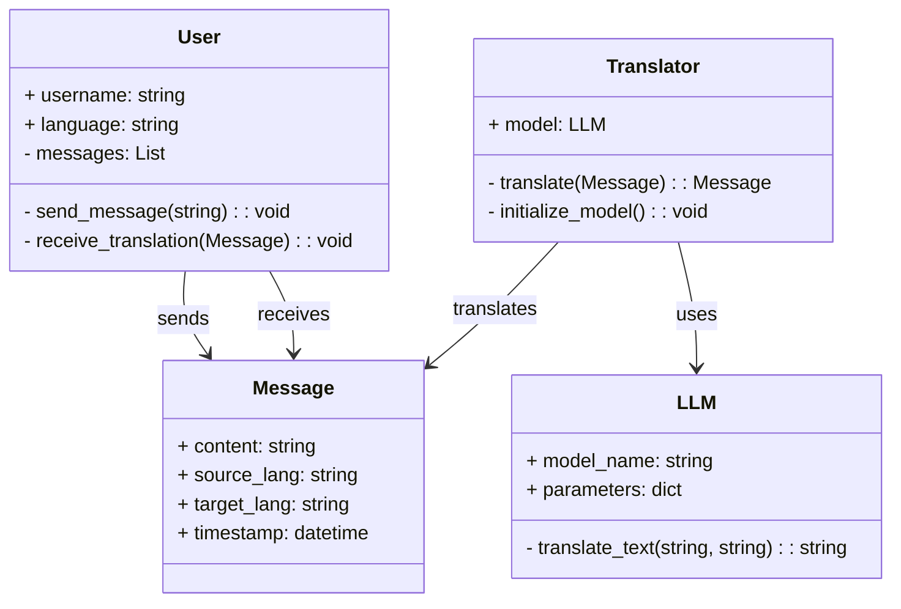
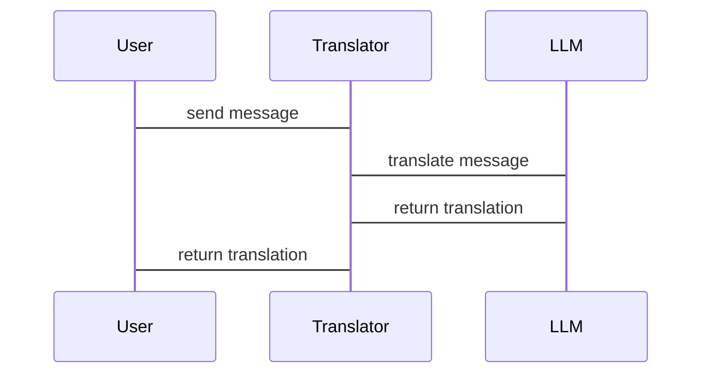

                 


# 实时翻译 AI Agent：LLM 在即时通讯中的语言转换

> **关键词**：实时翻译、AI Agent、LLM、大语言模型、即时通讯、语言转换

> **摘要**：  
> 在全球化背景下，实时翻译技术的需求日益增长。本文深入探讨了如何利用大语言模型（LLM）实现即时通讯中的语言转换。从背景到技术原理，从系统设计到项目实现，再到实际案例分析，本文为读者提供了全面的技术解读。通过分析 LLM 的核心算法、系统架构和应用场景，本文为开发者和研究人员提供了理论与实践相结合的参考。

---

# 第一部分: 实时翻译 AI Agent 的背景与概述

## 第1章: 实时翻译 AI Agent 概述

### 1.1 实时翻译的背景与需求

#### 1.1.1 全球化背景下的语言障碍
在全球化浪潮的推动下，跨国交流日益频繁。语言障碍成为阻碍高效沟通的主要问题之一。实时翻译技术的出现，为解决这一问题提供了新的可能性。

#### 1.1.2 即时通讯中的语言转换需求
即时通讯工具（如 WhatsApp、Telegram、微信等）已成为人们日常交流的重要工具。然而，不同用户使用不同语言进行交流时，语言转换的需求变得更加迫切。

#### 1.1.3 实时翻译的市场与应用场景
实时翻译技术的市场需求巨大，应用场景广泛，包括跨国企业、国际会议、旅游、社交网络等。通过实时翻译，用户可以在不同语言之间无缝沟通。

---

### 1.2 大语言模型（LLM）的概述

#### 1.2.1 LLM 的定义与特点
大语言模型（LLM，Large Language Model）是指基于深度学习技术训练的大型神经网络模型，能够理解和生成自然语言文本。其特点包括：
- **大规模训练数据**：通常基于数十亿甚至更多的文本数据进行训练。
- **多语言支持**：能够处理多种语言的文本。
- **上下文理解能力**：能够通过上下文理解语义。

#### 1.2.2 LLM 在实时翻译中的优势
LLM 在实时翻译中的优势主要体现在以下几个方面：
- **高精度**：通过大规模数据训练，模型能够实现高精度的翻译。
- **实时性**：基于高效的算法优化，模型可以在短时间内完成翻译任务。
- **多语言支持**：LLM 可以支持多种语言的翻译，满足不同用户的需求。

#### 1.2.3 LLM 的技术瓶颈与挑战
尽管 LLM 在实时翻译中表现出色，但仍面临一些技术瓶颈和挑战：
- **计算资源需求**：训练和推理需要大量的计算资源。
- **模型延迟**：在实时应用中，模型的推理时间可能会对用户体验造成影响。
- **语言适应性**：不同语言的语法和表达习惯差异较大，模型需要进行针对性优化。

---

### 1.3 实时翻译 AI Agent 的核心概念

#### 1.3.1 实时翻译的定义与实现方式
实时翻译是指在用户输入文本的瞬间，立即生成目标语言的翻译结果。其实现方式主要依赖于自然语言处理技术（NLP）和大语言模型（LLM）。

#### 1.3.2 AI Agent 的定义与功能特点
AI Agent（人工智能代理）是一种能够感知环境、执行任务的智能实体。实时翻译 AI Agent 的功能特点包括：
- **实时响应**：能够在用户输入后立即返回翻译结果。
- **多语言支持**：支持多种语言的翻译。
- **上下文理解**：能够根据上下文优化翻译结果。

#### 1.3.3 实时翻译 AI Agent 的系统架构
实时翻译 AI Agent 的系统架构通常包括以下几个模块：
- **输入处理模块**：接收用户的输入文本。
- **翻译模块**：利用 LLM 进行翻译。
- **输出模块**：将翻译结果返回给用户。

---

### 1.4 本章小结
本章主要介绍了实时翻译 AI Agent 的背景、核心概念和技术特点。通过分析 LLM 的优势与挑战，读者可以理解实时翻译 AI Agent 的技术基础和实现难点。

---

# 第二部分: 大语言模型（LLM）的原理与技术

## 第2章: LLM 的基本原理

### 2.1 大语言模型的结构与训练方法

#### 2.1.1 深度学习与神经网络基础
深度学习是一种基于人工神经网络的机器学习方法，其核心思想是通过多层非线性变换提取数据特征。神经网络的基本单元包括输入层、隐藏层和输出层。

#### 2.1.2 Transformer 模型的结构特点
Transformer 是一种基于自注意力机制的神经网络模型，由 Vaswani 等人在 2017 年提出。其核心思想是通过自注意力机制捕捉文本中的长距离依赖关系。

#### 2.1.3 大语言模型的训练流程
大语言模型的训练流程通常包括以下几个步骤：
1. **数据准备**：收集和整理大规模的多语言文本数据。
2. **模型构建**：搭建基于 Transformer 的神经网络模型。
3. **模型训练**：使用训练数据对模型进行参数优化。
4. **模型评估**：通过测试数据评估模型的性能。

---

### 2.2 LLM 的核心算法与优化

#### 2.2.1 注意力机制的实现原理
注意力机制是一种用于捕捉文本中关键词权重的方法。其数学表达式如下：

$$
\text{Attention}(Q, K, V) = \text{softmax}\left(\frac{QK^T}{\sqrt{d_k}}\right)V
$$

其中，$Q$、$K$、$V$ 分别是查询（Query）、键（Key）、值（Value）向量，$d_k$ 是键的维度。

#### 2.2.2 梯度下降与参数优化方法
梯度下降是一种常用的优化算法，用于最小化模型的损失函数。常用的梯度下降变体包括随机梯度下降（SGD）、Adam 优化器等。

#### 2.2.3 模型压缩与轻量化技术
为了提高模型的推理效率，通常需要对 LLM 进行压缩和轻量化处理。常用的技术包括剪枝、量化和模型蒸馏等。

---

### 2.3 LLM 的语言转换能力

#### 2.3.1 多语言模型的训练策略
多语言模型的训练策略通常包括：
1. **多任务学习**：在单一模型中同时训练多种语言的翻译任务。
2. **语言嵌入共享**：通过共享语言嵌入层，减少模型参数数量。

#### 2.3.2 语言转换的精度与效率优化
为了提高翻译的精度和效率，可以采用以下优化方法：
1. **动态调整批次大小**：根据 GPU 资源动态调整批次大小。
2. **使用缓存机制**：缓存频繁出现的翻译任务，减少重复计算。

#### 2.3.3 实时翻译中的误差分析与校正
实时翻译中的误差主要来源于以下几方面：
- **模型误差**：模型在训练过程中未能充分学习某些语言特征。
- **数据误差**：训练数据中的噪声或偏差。
- **环境误差**：计算资源不足导致的推理延迟。

---

### 2.4 本章小结
本章深入分析了 LLM 的基本原理、核心算法和优化技术。通过理解 LLM 的内部机制，读者可以更好地设计和实现实时翻译 AI Agent。

---

# 第三部分: 实时翻译 AI Agent 的设计与实现

## 第3章: 实时翻译 AI Agent 的系统设计

### 3.1 系统需求分析

#### 3.1.1 功能需求与性能指标
实时翻译 AI Agent 的主要功能包括：
- 支持多种语言的实时翻译。
- 提供高精度的翻译结果。
- 实现低延迟的推理过程。

#### 3.1.2 用户界面与交互设计
用户界面设计需要简洁直观，支持多种语言输入和输出。交互设计需要考虑用户体验，提供实时反馈和错误提示。

#### 3.1.3 系统的可扩展性与可维护性
系统设计需要考虑未来的扩展性，例如支持更多语言、优化模型性能等。

---

### 3.2 系统功能设计

#### 3.2.1 领域模型类图
以下是实时翻译 AI Agent 的领域模型类图：



---

#### 3.2.2 系统架构设计

以下是实时翻译 AI Agent 的系统架构图：


---

#### 3.2.3 系统接口设计
系统接口设计需要考虑以下几个方面：
- **输入接口**：接收用户输入的源语言文本和目标语言。
- **翻译接口**：调用 LLM 进行翻译。
- **输出接口**：将翻译结果返回给用户。

#### 3.2.4 系统交互流程

以下是系统交互流程图：



---

## 第4章: 项目实战

### 4.1 环境搭建

#### 4.1.1 安装必要的依赖
以下是一些常用的依赖库：
- **Python**：3.8+
- **TensorFlow** 或 **PyTorch**
- **Transformers**（Hugging Face）
- **Flask**（用于搭建 API）

#### 4.1.2 安装步骤
```bash
pip install transformers torch flask
```

---

### 4.2 系统核心实现

#### 4.2.1 翻译模块实现
以下是基于 Hugging Face Transformers 库的翻译模块实现：

```python
from transformers import AutoTokenizer, AutoModelForSeq2Seq
import torch

class Translator:
    def __init__(self, model_name, device="cpu"):
        self.model_name = model_name
        self.device = device
        self.tokenizer = AutoTokenizer.from_pretrained(model_name)
        self.model = AutoModelForSeq2Seq.from_pretrained(model_name).to(device)

    def translate(self, text, source_lang, target_lang):
        inputs = self.tokenizer(text, return_tensors="pt").to(self.device)
        inputs["src_lang"] = source_lang
        inputs["tgt_lang"] = target_lang
        outputs = self.model.generate(**inputs)
        translated_text = self.tokenizer.decode(outputs[0], skip_special_tokens=True)
        return translated_text
```

---

### 4.3 实际案例分析

#### 4.3.1 案例 1：英文到中文翻译
```python
translator = Translator("facebook/m2m100")
result = translator.translate("Hello world", "en", "zh")
print(result)  # 输出：你好，世界！
```

#### 4.3.2 案例 2：中文到法语翻译
```python
translator = Translator("facebook/m2m100")
result = translator.translate("你好，世界！", "zh", "fr")
print(result)  # 输出：Bonjour le monde !
```

---

## 第5章: 最佳实践与注意事项

### 5.1 开发经验总结
1. **选择合适的模型**：根据具体需求选择适合的 LLM 模型。
2. **优化计算资源**：通过模型压缩和优化算法降低计算成本。
3. **处理边缘情况**：例如，输入为空或目标语言不支持。

### 5.2 常见问题及解决方案
1. **模型推理延迟**：通过优化算法和使用更快的硬件（如 GPU）可以有效降低延迟。
2. **翻译精度问题**：通过微调模型和增加训练数据可以提高翻译精度。

### 5.3 未来研究方向
1. **多模态翻译**：结合图像、语音等多种模态信息，实现更智能的翻译。
2. **动态语言适应**：根据上下文动态调整翻译策略。

---

## 第6章: 本章小结

---

# 第四部分: 总结与展望

## 第7章: 总结与展望

### 7.1 本章小结
本文深入探讨了实时翻译 AI Agent 的实现方法，从背景到技术原理，从系统设计到项目实现，为读者提供了全面的技术解读。

### 7.2 未来展望
随着大语言模型技术的不断进步，实时翻译 AI Agent 的应用前景将更加广阔。未来的研究方向包括多模态翻译、动态语言适应和更高效的模型优化方法。

---

# 附录

## 附录 A: 参考文献

1. Vaswani, A., et al. "Attention Is All You Need." arXiv, 2017.
2. Radford, A., et al. "Language Models Are Few-Shot Learners." arXiv, 2020.

---

## 附录 B: 工具推荐

1. **Hugging Face Transformers**：https://huggingface.co/transformers
2. **PyTorch**：https://pytorch.org
3. **Flask**：https://flask.pocoo.org

---

## 附录 C: 术语表

1. **LLM**：大语言模型（Large Language Model）
2. **Transformer**：一种基于自注意力机制的神经网络模型
3. **序列到序列模型**：一种用于将输入序列映射到输出序列的模型

---

作者：AI天才研究院/AI Genius Institute & 禅与计算机程序设计艺术 /Zen And The Art of Computer Programming

