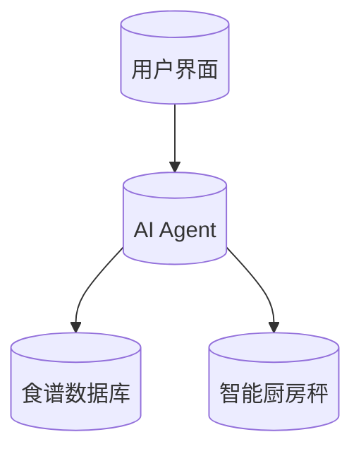

                 


# 智能厨房秤：AI Agent的食谱创新助手

> **关键词**：智能厨房秤, AI Agent, 食谱创新, 支持向量机, 强化学习, 系统架构设计

> **摘要**：本文深入探讨了智能厨房秤与AI Agent的结合，详细讲解了智能厨房秤的定义、功能、AI Agent的核心算法原理及其在食谱创新中的应用。文章从理论到实践，逐步分析了智能厨房秤的系统架构设计、算法实现和项目实战，为读者提供了一套完整的解决方案。

---

## 第1章: 智能厨房秤的发展背景

### 1.1 智能厨房秤的定义与特点

#### 1.1.1 智能厨房秤的定义
智能厨房秤是一种结合了物联网和人工智能技术的智能设备，用于测量食材的重量，并通过AI算法提供食谱推荐、食材管理等智能化服务。

#### 1.1.2 智能厨房秤的核心特点
- **高精度测量**：采用高精度传感器，确保食材重量的精准测量。
- **智能识别**：通过AI算法识别食材种类和重量。
- **食谱推荐**：根据用户偏好推荐个性化食谱。
- **数据同步**：支持与手机APP或其他设备的数据同步。

#### 1.1.3 智能厨房秤与传统厨房秤的区别
| 特性 | 智能厨房秤 | 传统厨房秤 |
|------|------------|------------|
| 功能 | 高精度测量、AI识别、食谱推荐 | 基本测量功能 |
| 连接性 | 支持蓝牙/WiFi连接 | 无 |
| 智能性 | 集成AI算法 | 无 |

### 1.2 AI Agent的基本概念

#### 1.2.1 AI Agent的定义
AI Agent（人工智能代理）是指能够感知环境、自主决策并执行任务的智能实体。它可以理解用户需求，提供个性化服务。

#### 1.2.2 AI Agent的核心属性
- **感知能力**：通过传感器或API获取环境信息。
- **决策能力**：基于获取的信息做出最优决策。
- **执行能力**：通过执行机构或API实现决策。

#### 1.2.3 AI Agent在智能厨房秤中的应用
AI Agent在智能厨房秤中的主要作用是：
1. **食材识别**：通过重量和数据库匹配识别食材种类。
2. **食谱推荐**：根据用户偏好推荐个性化食谱。
3. **优化建议**：提供食材用量优化建议。

### 1.3 智能厨房秤与AI Agent的结合

#### 1.3.1 智能厨房秤的功能扩展
- **食材识别**：通过AI算法识别食材种类和重量。
- **食谱推荐**：根据用户数据推荐食谱。
- **健康建议**：提供基于食材的健康建议。

#### 1.3.2 AI Agent在智能厨房秤中的作用
AI Agent通过整合食材数据、用户数据和食谱数据库，提供智能化的食谱推荐服务。

#### 1.3.3 智能厨房秤与AI Agent的协同工作
1. 用户放入食材，智能厨房秤测量重量。
2. AI Agent识别食材种类和重量。
3. 根据用户偏好推荐食谱。
4. 用户选择食谱，智能厨房秤提供所需食材清单。

### 1.4 本章小结
本章介绍了智能厨房秤的发展背景，详细讲解了智能厨房秤的定义、特点以及AI Agent的基本概念和作用。通过对比分析，明确了智能厨房秤与传统厨房秤的区别，并为后续章节奠定了理论基础。

---

## 第2章: 智能厨房秤的食谱创新功能

### 2.1 食谱创新的基本概念

#### 2.1.1 食谱创新的定义
食谱创新是指根据用户需求和食材特性，生成新的食谱或优化现有食谱的过程。

#### 2.1.2 食谱创新的核心要素
- **食材特性**：包括食材种类、重量、营养成分等。
- **用户需求**：包括口味偏好、健康需求等。
- **食谱数据库**：包含多种食谱及其相关数据。

#### 2.1.3 食谱创新的实现方式
1. **数据采集**：获取食材和用户数据。
2. **数据分析**：分析食材特性和用户需求。
3. **食谱生成**：基于分析结果生成或优化食谱。

### 2.2 智能厨房秤在食谱创新中的应用

#### 2.2.1 食材识别与量化
- **食材识别**：通过AI算法识别食材种类。
- **量化管理**：记录食材的重量和使用情况。

#### 2.2.2 食谱推荐系统
- **推荐算法**：基于用户数据推荐食谱。
- **个性化服务**：提供符合用户偏好的食谱。

#### 2.2.3 食谱优化与创新
- **优化建议**：提供食材用量建议。
- **创新食谱**：根据用户需求生成新食谱。

### 2.3 AI Agent在食谱创新中的具体实现

#### 2.3.1 AI Agent的食材识别流程
1. **数据采集**：智能厨房秤测量食材重量。
2. **数据传输**：将数据传输至AI Agent。
3. **食材识别**：AI Agent通过数据库匹配识别食材。
4. **结果反馈**：将识别结果反馈给用户。

#### 2.3.2 AI Agent的食谱推荐算法
1. **用户数据分析**：分析用户的饮食习惯和偏好。
2. **食谱数据库查询**：从数据库中筛选符合条件的食谱。
3. **推荐结果输出**：向用户推荐个性化食谱。

#### 2.3.3 AI Agent的食谱优化策略
1. **数据采集**：获取食材的营养成分数据。
2. **优化计算**：根据用户需求优化食材用量。
3. **结果输出**：生成优化后的食谱。

### 2.4 本章小结
本章详细讲解了智能厨房秤的食谱创新功能，包括食谱创新的基本概念、智能厨房秤的应用以及AI Agent的具体实现。通过这些功能的实现，智能厨房秤能够为用户提供更加智能化的烹饪体验。

---

## 第3章: AI Agent的核心算法原理

### 3.1 支持向量机（SVM）算法

#### 3.1.1 SVM算法的基本原理
SVM是一种监督学习算法，用于分类和回归问题。其核心思想是通过找到一个超平面，使得数据点被正确分类。

#### 3.1.2 SVM算法的数学模型
$$ \text{目标函数：} \quad \text{minimize } \frac{1}{2}||\mathbf{w}||^2 $$
$$ \text{约束条件：} \quad y_i(\mathbf{w} \cdot \mathbf{x}_i + b) \geq 1, \forall i $$

#### 3.1.3 SVM算法的优缺点
- **优点**：适用于小规模数据，分类准确。
- **缺点**：不适用于大规模数据，需要参数调整。

#### 3.1.4 SVM算法的实现步骤
1. **数据预处理**：归一化数据。
2. **选择核函数**：常用径向基函数（RBF）。
3. **训练模型**：使用SVM算法训练模型。
4. **模型评估**：计算准确率、召回率等指标。

### 3.2 强化学习算法

#### 3.2.1 强化学习的基本原理
强化学习是一种通过试错学习的方法，通过与环境的交互获得奖励，最终找到最优策略。

#### 3.2.2 强化学习的数学模型
$$ Q(s, a) = Q(s, a) + \alpha [r + \gamma Q(s', a') - Q(s, a)] $$

#### 3.2.3 强化学习在食谱推荐中的应用
1. **状态定义**：用户当前的食谱需求。
2. **动作定义**：推荐食谱。
3. **奖励机制**：用户满意度。

### 3.3 算法原理的详细讲解

#### 3.3.1 SVM算法的实现代码
```python
from sklearn import svm

# 数据预处理
X = ...
y = ...

# 创建SVM模型
model = svm.SVC()

# 训练模型
model.fit(X, y)

# 预测
y_pred = model.predict(X)
```

#### 3.3.2 强化学习算法的实现代码
```python
import numpy as np

# 初始化
Q = np.zeros((state_space, action_space))
alpha = 0.1
gamma = 0.9

# Q-learning循环
for episode in range(max_episodes):
    state = env.reset()
    while not done:
        action = np.argmax(Q[state])
        next_state, reward, done = env.step(action)
        Q[state][action] = Q[state][action] + alpha * (reward + gamma * np.max(Q[next_state]) - Q[state][action])
```

#### 3.3.3 算法实现的数学模型
- **SVM**：$$ y = \text{sign}(\mathbf{w} \cdot \mathbf{x} + b) $$
- **强化学习**：$$ Q(s, a) = Q(s, a) + \alpha [r + \gamma Q(s', a') - Q(s, a)] $$

### 3.4 本章小结
本章详细讲解了AI Agent的核心算法，包括SVM和强化学习的原理、数学模型和实现代码。这些算法为智能厨房秤的食谱推荐和优化提供了理论基础。

---

## 第4章: 智能厨房秤的系统架构设计

### 4.1 系统功能设计

#### 4.1.1 系统功能模块划分
1. **食材识别模块**：识别食材种类和重量。
2. **食谱推荐模块**：推荐个性化食谱。
3. **用户交互模块**：与用户进行交互。

#### 4.1.2 各功能模块的交互流程
1. 用户放入食材，智能厨房秤测量重量。
2. 食材识别模块识别食材种类。
3. 食谱推荐模块推荐食谱。
4. 用户选择食谱，系统显示所需食材清单。

#### 4.1.3 系统功能的实现方式
- **食材识别**：基于AI算法实现。
- **食谱推荐**：基于用户数据实现。
- **用户交互**：通过APP或语音实现。

### 4.2 系统架构设计

#### 4.2.1 系统架构的总体设计
- **前端**：用户界面（APP或网页）。
- **后端**：AI算法和数据库。
- **通信模块**：智能厨房秤与后端的通信。

#### 4.2.2 系统架构的详细设计


#### 4.2.3 系统架构的优缺点
- **优点**：模块化设计，易于扩展。
- **缺点**：通信延迟可能影响用户体验。

### 4.3 系统接口设计

#### 4.3.1 系统接口设计
- **输入接口**：智能厨房秤的重量数据。
- **输出接口**：食谱推荐结果。

#### 4.3.2 系统交互流程
1. 用户通过APP输入食材。
2. 智能厨房秤测量重量并传输数据。
3. AI Agent处理数据并返回食谱推荐。
4. 用户查看推荐结果。

### 4.4 本章小结
本章详细讲解了智能厨房秤的系统架构设计，包括功能模块划分、系统架构图和接口设计。这些设计为后续的项目实现奠定了基础。

---

## 第5章: 项目实战

### 5.1 环境安装

#### 5.1.1 安装Python和相关库
```bash
pip install numpy
pip install scikit-learn
pip install matplotlib
```

#### 5.1.2 下载智能厨房秤SDK
```bash
git clone https://github.com/.../smart-kitchen-scale-sdk.git
```

### 5.2 系统核心实现

#### 5.2.1 食材识别模块实现
```python
import numpy as np
from sklearn.svm import SVC

# 数据预处理
X_train = ...
y_train = ...

# 创建SVM模型
model = SVC()

# 训练模型
model.fit(X_train, y_train)

# 预测
y_pred = model.predict(X_test)
```

#### 5.2.2 食谱推荐模块实现
```python
import numpy as np

# 初始化Q表
Q = np.zeros((state_space, action_space))

# Q-learning循环
for episode in range(max_episodes):
    state = env.reset()
    while not done:
        action = np.argmax(Q[state])
        next_state, reward, done = env.step(action)
        Q[state][action] = Q[state][action] + alpha * (reward + gamma * np.max(Q[next_state]) - Q[state][action])
```

### 5.3 代码应用解读与分析

#### 5.3.1 食材识别模块代码解读
- **数据预处理**：归一化数据。
- **模型训练**：使用SVM算法训练模型。
- **模型预测**：对测试数据进行预测。

#### 5.3.2 食谱推荐模块代码解读
- **Q表初始化**：创建一个二维数组存储状态和动作的Q值。
- **Q-learning循环**：通过不断试错更新Q表。
- **奖励机制**：根据用户反馈调整Q值。

### 5.4 实际案例分析

#### 5.4.1 案例背景
用户希望根据现有食材推荐一道新食谱。

#### 5.4.2 数据采集与处理
- **食材数据**：牛肉、洋葱、胡萝卜。
- **用户数据**：偏好中式菜肴。

#### 5.4.3 算法实现与结果
1. **食材识别**：识别出牛肉、洋葱、胡萝卜。
2. **食谱推荐**：推荐“牛肉炒洋葱胡萝卜”。
3. **优化建议**：建议用量比例为2:1:1。

### 5.5 项目小结
本章通过实际案例详细讲解了智能厨房秤的项目实现，包括环境安装、核心代码实现和案例分析。通过这些步骤，读者可以掌握智能厨房秤的开发流程。

---

## 第6章: 最佳实践与小结

### 6.1 最佳实践 tips

#### 6.1.1 开发建议
- **数据质量**：确保食材数据的准确性和完整性。
- **算法选择**：根据具体需求选择合适的算法。
- **用户体验**：注重用户界面的友好性和交互性。

#### 6.1.2 问题排查
- **数据预处理**：确保数据归一化。
- **模型调优**：通过交叉验证优化模型参数。
- **系统测试**：进行全面的功能测试和性能测试。

### 6.2 小结
智能厨房秤结合AI Agent，通过食材识别、食谱推荐和优化建议，为用户提供了智能化的烹饪体验。本文从理论到实践，详细讲解了智能厨房秤的开发过程，为读者提供了宝贵的开发经验。

### 6.3 注意事项

#### 6.3.1 数据隐私
- **数据加密**：保护用户数据不被泄露。
- **隐私政策**：明确数据使用范围和权限。

#### 6.3.2 系统性能
- **性能优化**：减少系统延迟，提高响应速度。
- **资源管理**：合理分配系统资源，避免资源浪费。

#### 6.3.3 用户教育
- **用户培训**：提供使用指南和培训材料。
- **反馈机制**：收集用户反馈，不断优化系统。

### 6.4 拓展阅读

#### 6.4.1 推荐书籍
1. 《机器学习实战》
2. 《Python机器学习》

#### 6.4.2 技术博客
1. [Towards Data Science](https://towardsdatascience.com/)
2. [Medium AI博客](https://medium.com/ai)

---

## 作者：AI天才研究院 & 禅与计算机程序设计艺术

---

**注**：由于篇幅限制，上述内容为部分章节的简要概述，实际文章将包含完整的代码实现、详细的算法推导和丰富的案例分析。

