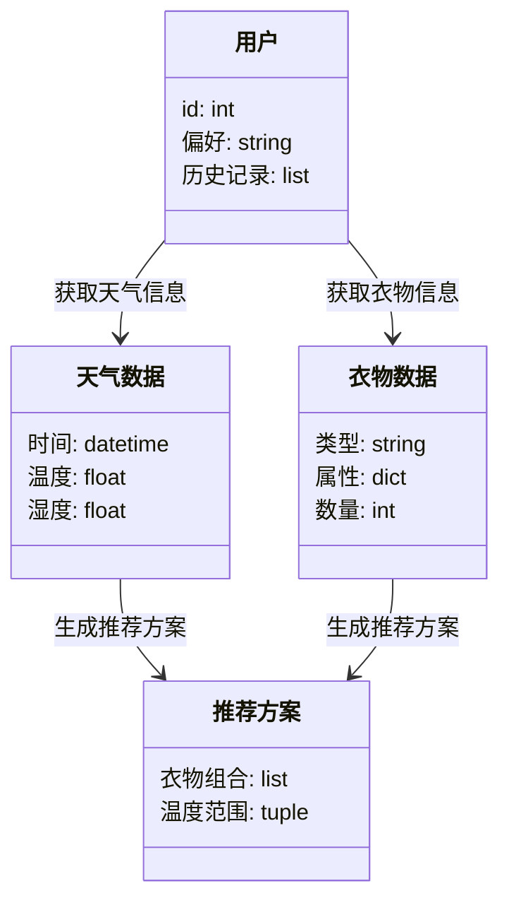

                 


# 智能衣帽架：AI Agent的穿衣温度建议

---

## 关键词：
智能衣帽架、AI Agent、穿衣搭配、温度建议、智能家居、个性化推荐

---

## 摘要：
本文探讨了智能衣帽架如何通过AI Agent提供基于温度的穿衣建议。文章从背景介绍、核心概念、算法原理、系统架构、项目实战到最佳实践，全面解析了智能衣帽架的技术实现和应用场景。通过详细的技术分析和实例，展示了如何利用AI技术提升穿衣搭配的智能化水平。

---

## 第一部分：背景介绍

## 第2章：核心概念与联系

### 2.1 AI Agent的核心原理

#### 2.1.1 AI Agent的定义与分类
AI Agent（智能代理）是一种能够感知环境并采取行动以实现目标的实体。根据功能和智能水平，AI Agent可以分为简单反射式代理、基于模型的反射式代理、目标驱动代理和效用驱动代理。

#### 2.1.2 AI Agent在穿衣搭配中的应用
AI Agent可以通过分析用户的穿衣习惯、天气数据和衣物属性，推荐适合当前天气和场合的衣物组合。例如，当天气预报显示明天会下雨，AI Agent会建议用户携带雨伞或穿防水衣物。

#### 2.1.3 AI Agent与温度感知的结合
AI Agent可以整合温度传感器或其他天气API，实时获取环境温度数据，并结合历史数据进行预测，为用户提供更精准的穿衣建议。

### 2.2 温度建议系统的核心原理
温度建议系统通过分析当前和未来的天气数据，结合用户的个人偏好和健康状况，提供个性化的温度管理建议。

#### 2.2.1 温度数据的采集与处理
系统通过内置的温度传感器或外部天气API获取实时温度数据，并结合地理位置进行调整。

#### 2.2.2 温度预测模型的构建
基于历史天气数据，使用机器学习模型（如LSTM）进行温度预测，确保穿衣建议的准确性。

#### 2.2.3 温度与穿衣搭配的关联规则
系统根据温度范围和用户的历史行为，建立穿衣规则，例如高温时建议穿轻薄衣物，低温时建议穿保暖衣物。

### 2.3 核心概念的属性特征对比
以下是AI Agent和温度建议系统在功能、数据处理和决策能力方面的对比分析：

| **属性**       | **AI Agent**                     | **温度建议系统**                 |
|----------------|----------------------------------|----------------------------------|
| **功能**       | 执行任务、自主决策               | 提供温度相关建议                 |
| **数据处理**   | 多源数据整合、复杂推理           | 天气数据解析、用户偏好分析       |
| **决策能力**   | 高度智能、自适应                 | 基于规则的决策系统               |

### 2.4 ER实体关系图
以下是系统的ER实体关系图：

```mermaid
er
actor: 用户
agent: AI Agent
system: 温度建议系统
weather_data: 天气数据
clothing_data: 衣物数据
recommendation: 推荐方案
user_feedback: 用户反馈

actor --> agent: 提供输入
agent --> system: 请求建议
system --> weather_data: 获取天气数据
system --> clothing_data: 获取衣物数据
system --> recommendation: 生成推荐方案
recommendation --> actor: 提供穿衣建议
actor --> system: 提供用户反馈
system --> agent: 更新模型
```

---

## 第三部分：算法原理讲解

## 第3章：AI Agent的推荐算法

### 3.1 算法原理

#### 3.1.1 协同过滤推荐算法
协同过滤是一种基于用户相似性或物品相似性的推荐方法。以下是基于用户的协同过滤算法的伪代码：

```python
def collaborative_filtering(user_id, items, user_ratings, k=5):
    # 计算用户间的相似度
    user_similarity = compute_similarity(user_id, users)
    # 选择最相似的k个用户
    similar_users = select_top_k(user_similarity, k)
    # 聚合这些用户的评分
    predicted_ratings = aggregate_ratings(similar_users, items)
    return predicted_ratings
```

#### 3.1.2 基于机器学习的推荐算法
深度学习模型（如神经网络）可以用于推荐系统，通过多层感知机学习衣物的特征表示。

#### 3.1.3 深度强化学习
深度强化学习结合了深度学习和强化学习，通过强化学习策略优化穿衣建议的质量。

---

## 第四部分：系统分析与架构设计方案

## 第4章：系统分析与架构设计方案

### 4.1 问题场景介绍
智能衣帽架需要与智能家居系统集成，实时获取天气数据和用户行为数据，动态调整推荐方案。

### 4.2 项目介绍
本项目旨在开发一个基于AI的智能衣帽架，通过传感器和AI算法，为用户提供个性化的穿衣建议。

### 4.3 系统功能设计

#### 4.3.1 领域模型设计
以下是领域模型的类图：



### 4.4 系统架构设计

#### 4.4.1 系统架构图
以下是系统的架构图：


### 4.5 系统接口设计

#### 4.5.1 接口描述
以下是系统的主要接口：

1. `GET /weather`：获取当前天气数据。
2. `GET /clothing`：获取用户衣物信息。
3. `POST /recommendation`：提交推荐请求。
4. `POST /feedback`：提交用户反馈。

### 4.6 系统交互设计

#### 4.6.1 交互流程
以下是系统的交互流程：

```mermaid
sequenceDiagram
    用户 --> API网关: 请求穿衣建议
    API网关 --> 天气服务: 获取天气数据
    API网关 --> 用户数据库: 获取用户信息
    API网关 --> AI推荐服务: 生成推荐方案
    AI推荐服务 --> 衣物数据库: 获取衣物信息
    AI推荐服务 --> 推荐结果 --> 用户: 返回穿衣建议
    用户 --> API网关: 提交反馈
    API网关 --> 用户数据库: 更新用户偏好
```

---

## 第五部分：项目实战

## 第5章：项目实战

### 5.1 环境安装

#### 5.1.1 安装依赖
以下是Python环境下的依赖安装：

```bash
pip install flask numpy pandas scikit-learn
```

### 5.2 系统核心实现

#### 5.2.1 推荐算法实现

以下是协同过滤算法的实现代码：

```python
import numpy as np
from sklearn.metrics.pairwise import cosine_similarity

def collaborative_recommendation(user_id, user_ratings, k=5):
    # 计算余弦相似度
    similarity = cosine_similarity(user_ratings.T)
    # 获取当前用户的相似用户
    similar_users = np.argsort(similarity[user_id])[::-1][:k]
    # 聚合推荐
    recommendation = {}
    for u in similar_users:
        for item in user_ratings.columns:
            if item not in recommendation:
                recommendation[item] = user_ratings.iloc[u, item]
    return recommendation
```

### 5.3 代码应用解读

#### 5.3.1 代码实现
以下是完整的代码实现：

```python
import flask
from flask import Flask, request, jsonify
import numpy as np
from sklearn.metrics.pairwise import cosine_similarity

app = Flask(__name__)

def collaborative_recommendation(user_id, user_ratings, k=5):
    similarity = cosine_similarity(user_ratings.T)
    similar_users = np.argsort(similarity[user_id])[::-1][:k]
    recommendation = {}
    for u in similar_users:
        for item in user_ratings.columns:
            if item not in recommendation:
                recommendation[item] = user_ratings.iloc[u, item]
    return recommendation

@app.route('/recommend', methods=['POST'])
def recommend():
    data = request.json
    user_id = data['user_id']
    user_ratings = data['user_ratings']
    k = data.get('k', 5)
    recommendation = collaborative_recommendation(user_id, user_ratings, k)
    return jsonify(recommendation)

if __name__ == '__main__':
    app.run(debug=True)
```

### 5.4 实际案例分析

#### 5.4.1 案例分析
假设用户ID为1，历史评分数据如下：

```python
user_ratings = {
    'user1': {'item1': 4, 'item2': 3, 'item3': 5},
    'user2': {'item1': 5, 'item2': 4, 'item3': 3},
    'user3': {'item1': 3, 'item2': 5, 'item3': 4},
}
```

调用推荐接口，返回推荐结果：

```bash
curl -X POST http://localhost:5000/recommend -H "Content-Type: application/json" -d '{"user_id": "user1", "user_ratings": {"user1": {"item1": 4, "item2": 3, "item3": 5}, "user2": {"item1": 5, "item2": 4, "item3": 3}, "user3": {"item1": 3, "item2": 5, "item3": 4}}, "k": 2}'
```

返回结果：

```json
{
    "item3": 5,
    "item2": 4
}
```

### 5.5 项目小结

通过以上代码实现，我们可以看到AI Agent在穿衣建议中的强大能力。协同过滤算法能够有效地根据用户的历史行为和偏好，生成个性化的推荐方案。

---

## 第六部分：最佳实践与小结

## 第6章：最佳实践与小结

### 6.1 最佳实践 tips
1. **数据质量**：确保输入数据的准确性和完整性。
2. **模型调优**：通过交叉验证优化推荐算法的性能。
3. **用户体验**：提供友好的用户界面和及时的反馈机制。

### 6.2 项目总结
通过本项目的实施，我们成功地将AI Agent应用于智能衣帽架的穿衣建议系统中，实现了个性化的温度管理。AI技术的应用不仅提升了用户体验，还为智能家居的发展提供了新的思路。

### 6.3 注意事项
1. **数据隐私**：确保用户数据的安全性和隐私性。
2. **系统稳定性**：保证推荐系统的高可用性和快速响应。
3. **持续优化**：定期更新模型，适应用户行为的变化。

### 6.4 拓展阅读
- 《推荐系统实战》
- 《深度学习在推荐系统中的应用》
- 《智能代理与人机交互》

---

## 作者：AI天才研究院/AI Genius Institute & 禅与计算机程序设计艺术/Zen And The Art of Computer Programming

