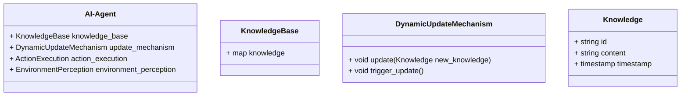
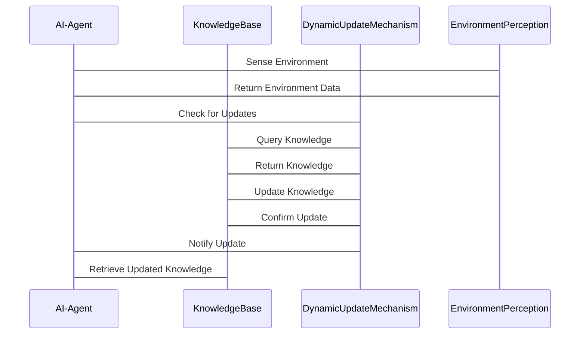

                 


# 构建AI Agent的动态知识蒸馏机制

> 关键词：知识蒸馏，AI Agent，动态更新，机器学习，模型压缩

> 摘要：知识蒸馏是一种将复杂模型的知识迁移到简单模型的技术，而AI Agent作为具有自主决策能力的智能体，需要在动态环境中持续更新知识。本文详细探讨了构建AI Agent的动态知识蒸馏机制，从背景概念到算法实现，再到系统架构和项目实战，全面解析这一机制的核心原理和实际应用。

---

## 第一部分: 知识蒸馏与AI Agent概述

### 第1章: 知识蒸馏与AI Agent概述

#### 1.1 知识蒸馏的基本概念

##### 1.1.1 知识蒸馏的背景与意义
知识蒸馏是一种将复杂模型的知识迁移到简单模型的技术，旨在在保持性能的同时减少模型的大小和计算成本。它最初在2015年提出，通过教师模型（Teacher）和学生模型（Student）的交互，将教师模型的深层知识传递给学生模型。这种方法在模型压缩、边缘计算和低资源环境下尤为重要。

##### 1.1.2 知识蒸馏的核心概念
- **教师模型（Teacher）**：通常是一个复杂的、训练良好的大型模型，负责提供知识。
- **学生模型（Student）**：一个较小的、轻量级的模型，旨在学习教师模型的知识。
- **蒸馏过程**：通过软标签（soft labels）和损失函数的设计，将教师模型的预测概率分布迁移到学生模型。

##### 1.1.3 知识蒸馏与模型压缩的区别
知识蒸馏不仅关注模型的大小，更关注知识的转移。模型压缩则侧重于直接减少模型的参数数量，而知识蒸馏通过迁移学习的方式间接实现模型的压缩。

#### 1.2 AI Agent的基本概念

##### 1.2.1 AI Agent的定义与特点
AI Agent是一种能够感知环境、自主决策并执行任务的智能体。它具备以下特点：
- **自主性**：无需外部干预，自主完成任务。
- **反应性**：能够实时感知环境并做出响应。
- **目标导向性**：基于目标进行决策和行动。

##### 1.2.2 AI Agent的分类与应用场景
- **简单反射型AI Agent**：基于当前感知做出反应，适用于简单任务。
- **基于模型的AI Agent**：具备环境模型，能够预测未来状态，适用于复杂任务。
- **目标驱动型AI Agent**：基于目标进行决策，适用于需要长期规划的任务。

#### 1.3 动态知识蒸馏机制的必要性

##### 1.3.1 动态环境中的知识更新需求
AI Agent在动态环境中需要不断适应变化，知识蒸馏机制能够帮助AI Agent快速更新知识，以应对新任务和环境变化。

##### 1.3.2 知识蒸馏在AI Agent中的作用
- **知识迁移**：将复杂模型的知识传递给轻量级的AI Agent，提升其性能。
- **动态更新**：在动态环境中，通过知识蒸馏机制不断更新AI Agent的知识库，确保其适应性。

##### 1.3.3 动态知识蒸馏的挑战与机遇
- **挑战**：动态环境中的知识更新需要高效且稳定的机制，同时需要处理数据稀疏性和模型鲁棒性的问题。
- **机遇**：通过动态知识蒸馏，AI Agent能够实现实时更新，提升在复杂环境中的表现。

---

## 第二部分: 动态知识蒸馏的核心概念与联系

### 第2章: 动态知识蒸馏的核心概念与联系

#### 2.1 动态知识蒸馏的原理

##### 2.1.1 知识蒸馏的基本流程
知识蒸馏通常包括以下步骤：
1. **教师模型训练**：训练一个复杂的教师模型。
2. **学生模型初始化**：初始化一个轻量级的学生模型。
3. **蒸馏过程**：通过损失函数将教师模型的知识迁移到学生模型。
4. **学生模型优化**：通过优化算法调整学生模型的参数，使其逼近教师模型的知识。

##### 2.1.2 动态知识蒸馏的创新点
动态知识蒸馏不仅关注静态的知识迁移，还强调在动态环境中的实时更新。它通过引入动态更新机制，使得AI Agent能够持续学习和适应环境变化。

##### 2.1.3 动态知识蒸馏的核心要素
- **动态更新机制**：确保知识的实时更新。
- **自适应蒸馏策略**：根据环境变化调整蒸馏过程。
- **高效知识表示**：通过有效的表示方法，确保知识的高效传递。

#### 2.2 核心概念对比与ER实体关系图

##### 2.2.1 知识蒸馏与模型更新的对比分析
- **知识蒸馏**：关注知识的迁移，适用于模型压缩和轻量级模型的构建。
- **模型更新**：关注模型参数的优化，适用于在线学习和实时调整。

##### 2.2.2 动态知识蒸馏的ER实体关系图
```mermaid
er
    entity: 知识蒸馏过程
    entity: AI Agent
    entity: 知识库
    entity: 动态更新机制
    relation: 知识蒸馏过程 --| 实现 |--> AI Agent
    relation: 知识库 --| 提供 |--> 知识蒸馏过程
    relation: 动态更新机制 --| 驱动 |--> 知识蒸馏过程
```

---

## 第三部分: 动态知识蒸馏的算法原理

### 第3章: 动态知识蒸馏的算法原理

#### 3.1 算法流程与数学模型

##### 3.1.1 知识蒸馏的基本流程
1. **教师模型生成软标签**：教师模型对输入样本进行预测，生成概率分布。
2. **学生模型生成预测**：学生模型对输入样本进行预测。
3. **计算蒸馏损失**：通过损失函数将学生模型的预测与教师模型的软标签进行对比。
4. **优化学生模型**：通过反向传播和优化算法调整学生模型的参数。

##### 3.1.2 动态知识蒸馏的数学模型
$$L_{distill} = \lambda L_{CE}(S, T) + (1-\lambda) L_{CE}(S, S')$$

其中：
- $L_{distill}$为蒸馏损失。
- $L_{CE}$为交叉熵损失。
- $\lambda$为权重系数，用于平衡教师模型和学生模型的损失。

##### 3.1.3 动态更新机制的实现
动态知识蒸馏通过引入动态权重系数$\lambda$，使得蒸馏过程能够根据环境变化自适应调整。例如，当环境变化较大时，增加$\lambda$的值，增强教师模型的影响。

#### 3.2 算法实现与代码示例

##### 3.2.1 知识蒸馏的Python实现
```python
import torch
import torch.nn as nn
import torch.optim as optim

class TeacherModel(nn.Module):
    def __init__(self):
        super(TeacherModel, self).__init__()
        self.fc = nn.Linear(10, 5, bias=False)
    
    def forward(self, x):
        return torch.softmax(x, dim=1)

class StudentModel(nn.Module):
    def __init__(self):
        super(StudentModel, self).__init__()
        self.fc = nn.Linear(10, 5, bias=False)
    
    def forward(self, x):
        return torch.log_softmax(x, dim=1)

def distillation_loss(student_logits, teacher_logits, temperature=1.0):
    teacher_logits = teacher_logits / temperature
    student_logits = student_logits / temperature
    loss = nn.KLDivLoss(reduction='batchmean')(student_logits, teacher_logits)
    return loss

# 初始化模型和优化器
teacher = TeacherModel()
student = StudentModel()
optimizer = optim.SGD(student.parameters(), lr=0.01)

# 训练过程
for epoch in range(100):
    optimizer.zero_grad()
    inputs = torch.randn(10, 10)  # 示例输入
    teacher_outputs = teacher(inputs)
    student_outputs = student(inputs)
    loss = distillation_loss(student_outputs, teacher_outputs)
    loss.backward()
    optimizer.step()
```

---

## 第四部分: 系统架构与项目实战

### 第4章: 动态知识蒸馏的系统架构

#### 4.1 问题场景介绍
在动态环境中，AI Agent需要实时感知环境并做出决策。然而，轻量级的AI Agent通常难以处理复杂的任务。通过动态知识蒸馏机制，AI Agent可以在动态环境中持续更新知识，提升其性能。

#### 4.2 项目介绍
本项目旨在构建一个具备动态知识蒸馏机制的AI Agent，能够在动态环境中实时更新知识，提升决策能力。

#### 4.3 系统功能设计

##### 4.3.1 领域模型（类图）


#### 4.4 系统架构设计

##### 4.4.1 系统架构图


#### 4.5 系统接口设计

##### 4.5.1 知识库接口
- `get_knowledge(id)`：获取特定知识。
- `update_knowledge(new_knowledge)`：更新知识库。

##### 4.5.2 动态更新机制接口
- `trigger_update()`：触发知识更新。
- `update()`：执行知识更新。

#### 4.6 系统交互流程

##### 4.6.1 系统交互序列图


---

## 第五部分: 项目实战

### 第5章: 项目实战

#### 5.1 环境安装与配置

##### 5.1.1 安装依赖
```bash
pip install torch
pip install mermaid
```

#### 5.2 系统核心实现

##### 5.2.1 知识库实现
```python
class KnowledgeBase:
    def __init__(self):
        self.knowledge = {}

    def get_knowledge(self, id):
        return self.knowledge.get(id)

    def update_knowledge(self, new_knowledge):
        self.knowledge.update(new_knowledge)
```

##### 5.2.2 动态更新机制实现
```python
class DynamicUpdateMechanism:
    def __init__(self, knowledge_base):
        self.knowledge_base = knowledge_base

    def trigger_update(self):
        # 模拟知识更新
        new_knowledge = {str(uuid.uuid4()): "Updated knowledge content"}
        self.knowledge_base.update_knowledge(new_knowledge)
```

##### 5.2.3 AI Agent实现
```python
class AI-Agent:
    def __init__(self, knowledge_base, update_mechanism):
        self.knowledge_base = knowledge_base
        self.update_mechanism = update_mechanism

    def perceive_environment(self):
        # 模拟环境感知
        return "environment_data"

    def execute_action(self, action):
        print(f"Executing action: {action}")
```

#### 5.3 代码应用解读与分析
- **知识库实现**：通过`KnowledgeBase`类管理知识，支持获取和更新知识。
- **动态更新机制**：通过`DynamicUpdateMechanism`类实现知识的动态更新，触发更新并通知知识库。
- **AI Agent实现**：通过`AI-Agent`类实现环境感知和动作执行，集成知识库和动态更新机制。

#### 5.4 实际案例分析
假设AI Agent需要在动态环境中识别新的物体，通过动态知识蒸馏机制，AI Agent能够快速更新其知识库，识别新的物体类别。

#### 5.5 项目小结
本项目通过动态知识蒸馏机制，实现了AI Agent在动态环境中的知识更新，提升了其适应性和决策能力。

---

## 第六部分: 最佳实践与总结

### 第6章: 最佳实践与总结

#### 6.1 最佳实践

##### 6.1.1 知识蒸馏的关键因素
- **教师模型的选择**：选择合适的教师模型，确保知识的权威性。
- **温度系数的调整**：根据任务需求调整温度系数，平衡蒸馏过程中的知识迁移。
- **动态更新的频率**：根据环境变化的速率调整更新频率，确保知识的及时性。

##### 6.1.2 AI Agent的设计原则
- **模块化设计**：将AI Agent划分为感知、决策和执行模块，便于管理和维护。
- **动态适应性**：确保AI Agent能够在动态环境中实时更新知识，适应环境变化。

#### 6.2 小结与展望

##### 6.2.1 小结
本文详细探讨了构建AI Agent的动态知识蒸馏机制，从背景概念到算法实现，再到系统架构和项目实战，全面解析了这一机制的核心原理和实际应用。

##### 6.2.2 展望
未来，随着AI技术的不断发展，动态知识蒸馏机制将在更多领域得到应用，帮助AI Agent在动态环境中实现更高效的知识更新和决策。

---

## 作者

作者：AI天才研究院/AI Genius Institute & 禅与计算机程序设计艺术 /Zen And The Art of Computer Programming

---

感谢您的耐心阅读，希望本文对您理解和构建AI Agent的动态知识蒸馏机制有所帮助！

