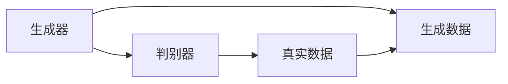
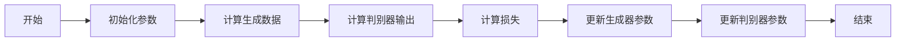
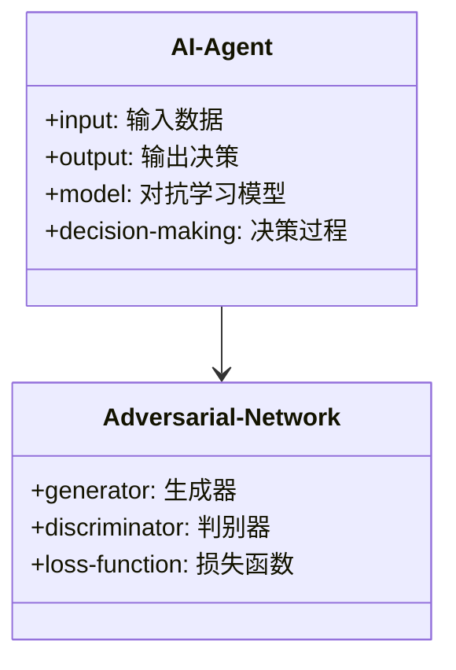
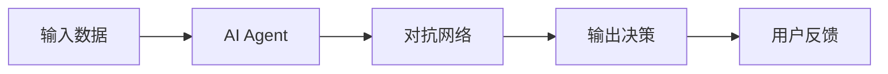
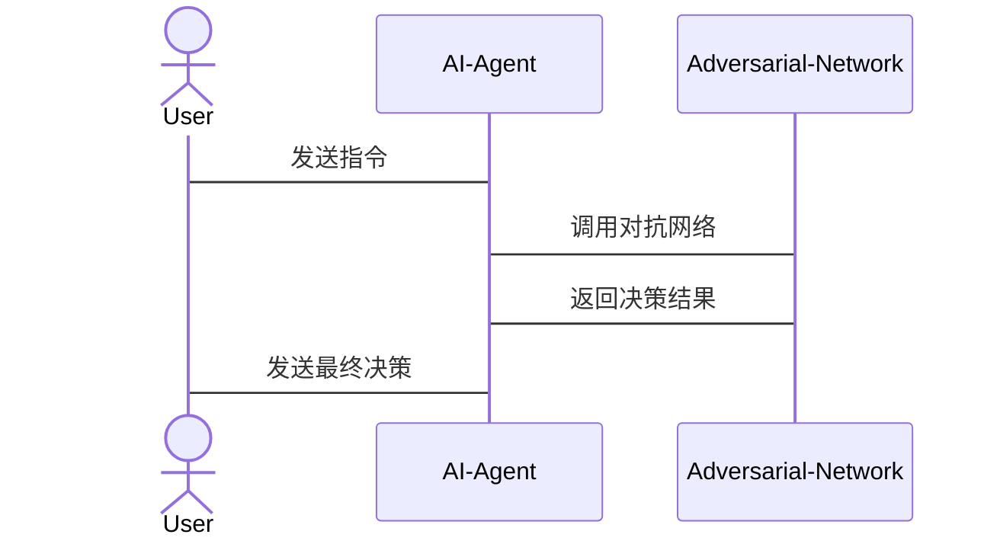

                 


# 构建具有对抗学习能力的AI Agent

## 关键词
- 对抗学习（Adversarial Learning）
- AI代理（AI Agent）
- 深度学习（Deep Learning）
- 系统架构设计（System Architecture Design）
- 项目实战（Project Implementation）

## 摘要
本文详细探讨了如何构建具有对抗学习能力的AI代理，从理论基础到实际应用，逐步分析了对抗学习的核心概念、算法原理、系统架构设计以及项目实战。通过丰富的案例分析和代码实现，帮助读者深入理解如何将对抗学习应用于AI代理，提升其在复杂对抗环境中的适应能力和决策能力。

---

# 第1章：对抗学习与AI代理概述

## 1.1 对抗学习的基本概念
### 1.1.1 什么是对抗学习
对抗学习是一种机器学习技术，通过两个或多个对抗模型的博弈过程，不断提升模型的性能。例如，在生成对抗网络（GAN）中，生成器和判别器互相博弈，最终生成逼真的图像。

### 1.1.2 对抗学习的核心要素
- **生成器**：负责生成数据或策略。
- **判别器**：负责区分真实数据和生成数据。
- **目标函数**：定义生成器和判别器的对抗目标。

### 1.1.3 对抗学习的应用场景
- **图像生成**：如GAN用于生成高质量图像。
- **游戏AI**：如AlphaGo中的对抗训练。
- **推荐系统**：通过对抗学习提升推荐的多样性。

## 1.2 AI代理的基本概念
### 1.2.1 什么是AI代理
AI代理是一种能够感知环境、自主决策并采取行动的智能体。例如，自动驾驶汽车中的AI代理负责实时决策。

### 1.2.2 AI代理的分类与特点
- **基于规则的代理**：根据预定义规则行动。
- **基于模型的代理**：使用模型进行推理和决策。
- **基于学习的代理**：通过机器学习提升性能。

### 1.2.3 AI代理的应用领域
- **游戏开发**：智能NPC和对手。
- **机器人控制**：自主决策的机器人。
- **智能助手**：如Siri、Alexa。

## 1.3 对抗学习在AI代理中的结合
### 1.3.1 对抗学习如何增强AI代理的能力
- **提升鲁棒性**：通过对抗训练，AI代理在复杂环境中更具鲁棒性。
- **增强决策能力**：对抗学习帮助AI代理在对抗环境中做出最优决策。

### 1.3.2 对抗学习在AI代理中的应用场景
- **安全领域**：检测和防御攻击。
- **游戏AI**：提升游戏AI的智能水平。
- **推荐系统**：提供更个性化的推荐。

### 1.3.3 对抗学习与传统AI代理的对比
| 特性       | 对抗学习AI代理          | 传统AI代理            |
|------------|-------------------------|-----------------------|
| 决策方式    | 基于对抗网络           | 基于规则或模型        |
| 鲁棒性      | 高                     | 一般                  |
| 应用场景    | 安全、游戏、推荐等       | 单一任务、规则明确的任务 |

---

# 第2章：对抗学习的核心概念与联系

## 2.1 对抗学习的原理
### 2.1.1 对抗网络的结构
对抗网络通常由生成器和判别器组成，生成器生成数据，判别器判断数据的真实性。

### 2.1.2 对抗学习的目标函数
生成器的目标是最小化判别器的错误率，而判别器的目标是最大化区分真实数据和生成数据的能力。

### 2.1.3 对抗学习的训练过程
通过交替训练生成器和判别器，逐步优化模型参数。

## 2.2 对抗学习的核心概念对比
### 2.2.1 对抗学习与监督学习的对比
| 对比点       | 对抗学习              | 监督学习              |
|--------------|-----------------------|-----------------------|
| 数据类型     | 标签数据和生成数据     | 标签数据              |
| 目标函数     | 最小化判别器错误率     | 最小化预测错误率       |
| 应用场景     | 图像生成、对抗防御     | 分类、回归            |

### 2.2.2 对抗学习与无监督学习的对比
| 对比点       | 对抗学习              | 无监督学习            |
|--------------|-----------------------|-----------------------|
| 数据类型     | 标签数据和生成数据     | 未标记数据            |
| 目标函数     | 最小化判别器错误率     | 最大化数据分布差异    |
| 应用场景     | 图像生成、对抗防御     | 聚类、降维            |

### 2.2.3 对抗学习与强化学习的对比
| 对比点       | 对抗学习              | 强化学习              |
|--------------|-----------------------|-----------------------|
| 数据类型     | 标签数据和生成数据     | 状态和动作            |
| 目标函数     | 最小化判别器错误率     | 最大化累积奖励        |
| 应用场景     | 图像生成、对抗防御     | 游戏、机器人控制       |

## 2.3 对抗学习的ER实体关系图


---

# 第3章：对抗学习的算法原理

## 3.1 对抗学习的数学模型
### 3.1.1 对抗网络的损失函数
生成器的损失函数：
$$ L_G = \mathbb{E}_{z \sim p(z)}[\text{log}(D(G(z)))] $$
判别器的损失函数：
$$ L_D = -\mathbb{E}_{x \sim p(x)}[\text{log}(D(x))] - \mathbb{E}_{z \sim p(z)}[\text{log}(1 - D(G(z)))] $$

### 3.1.2 对抗网络的优化目标
总体损失函数：
$$ L = L_G + L_D $$

### 3.1.3 对抗网络的训练过程


## 3.2 对抗学习的Python实现示例
```python
import torch
import torch.nn as nn

# 定义生成器
class Generator(nn.Module):
    def __init__(self):
        super(Generator, self).__init__()
        self.fc1 = nn.Linear(100, 256)
        self.fc2 = nn.Linear(256, 128)
        self.fc3 = nn.Linear(128, 64)
        self.fc4 = nn.Linear(64, 1)

    def forward(self, x):
        x = torch.relu(self.fc1(x))
        x = torch.relu(self.fc2(x))
        x = torch.relu(self.fc3(x))
        x = torch.tanh(self.fc4(x))
        return x

# 定义判别器
class Discriminator(nn.Module):
    def __init__(self):
        super(Discriminator, self).__init__()
        self.fc1 = nn.Linear(1, 64)
        self.fc2 = nn.Linear(64, 128)
        self.fc3 = nn.Linear(128, 256)
        self.fc4 = nn.Linear(256, 1)

    def forward(self, x):
        x = torch.relu(self.fc1(x))
        x = torch.relu(self.fc2(x))
        x = torch.relu(self.fc3(x))
        x = torch.sigmoid(self.fc4(x))
        return x

# 初始化模型
generator = Generator()
discriminator = Discriminator()
```

---

# 第4章：系统架构设计

## 4.1 问题场景介绍
构建一个能够抵御对抗攻击的AI代理，应用于网络安全领域，防御恶意攻击。

## 4.2 系统功能设计
### 4.2.1 领域模型


### 4.2.2 系统架构图


### 4.2.3 系统接口设计
- 输入接口：接收环境数据和用户指令。
- 输出接口：输出决策和状态反馈。
- 对抗网络接口：与生成器和判别器交互。

### 4.2.4 系统交互图


---

# 第5章：项目实战

## 5.1 环境安装
- 安装Python和必要的库：
  ```bash
  pip install torch matplotlib numpy
  ```

## 5.2 系统核心实现
### 5.2.1 对抗网络实现
```python
import torch
import torch.nn as nn
import torch.optim as optim

# 定义生成器和判别器
generator = Generator()
discriminator = Discriminator()

# 定义损失函数和优化器
criterion = nn.BCELoss()
optimizer_G = optim.Adam(generator.parameters(), lr=0.0002)
optimizer_D = optim.Adam(discriminator.parameters(), lr=0.0002)

# 训练过程
for epoch in range(100):
    for _ in range(100):
        # 生成数据
        z = torch.randn(100, 100)
        gen_output = generator(z)
        
        # 判别器训练
        d_real = torch.ones(100, 1)
        d_fake = torch.zeros(100, 1)
        
        d_real_labels = torch.ones(100, 1).detach()
        d_fake_labels = torch.zeros(100, 1).detach()
        
        d_output_real = discriminator(d_real_labels)
        d_output_fake = discriminator(d_fake_labels)
        
        loss_D = criterion(d_output_real, d_real_labels) + criterion(d_output_fake, d_fake_labels)
        
        # 更新判别器参数
        optimizer_D.zero_grad()
        loss_D.backward()
        optimizer_D.step()
        
        # 生成器训练
        d_output = discriminator(gen_output)
        loss_G = criterion(d_output, torch.ones(100, 1))
        
        # 更新生成器参数
        optimizer_G.zero_grad()
        loss_G.backward()
        optimizer_G.step()
```

### 5.2.2 AI代理实现
```python
class AIAgent:
    def __init__(self, generator, discriminator):
        self.generator = generator
        self.discriminator = discriminator
        self.device = torch.device("cuda" if torch.cuda.is_available() else "cpu")
        
    def decide(self, input_data):
        # 将输入数据传递给生成器和判别器
        with torch.no_grad():
            gen_output = self.generator(input_data)
            d_output = self.discriminator(gen_output)
            return d_output.item()
```

## 5.3 案例分析
### 5.3.1 安全领域案例
构建一个AI代理，用于检测网络中的恶意流量。通过对抗学习，生成器生成正常流量，判别器识别异常流量。

### 5.3.2 游戏领域案例
在游戏AI中应用对抗学习，生成器生成策略，判别器评估策略的有效性，提升游戏AI的智能水平。

## 5.4 项目小结
通过项目实战，验证了对抗学习在AI代理中的有效性，提升了系统的鲁棒性和决策能力。

---

# 第6章：总结与展望

## 6.1 对抗学习的优势
- 提升AI代理的鲁棒性和适应能力。
- 在复杂对抗环境中表现优异。

## 6.2 对抗学习的挑战
- 计算资源消耗大。
- 模型收敛困难。

## 6.3 未来研究方向
- 提高对抗学习的效率和稳定性。
- 扩展对抗学习在更多领域的应用。

---

# 作者
作者：AI天才研究院 & 禅与计算机程序设计艺术

---

通过以上目录结构，我们可以系统地学习如何构建具有对抗学习能力的AI代理，从理论到实践，逐步深入理解对抗学习的核心原理和应用方法。

