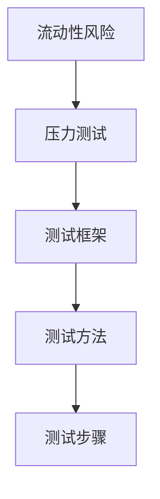
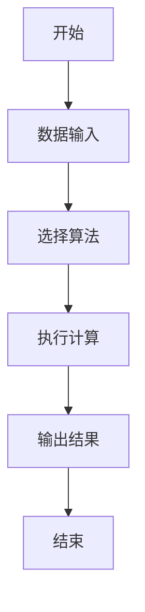
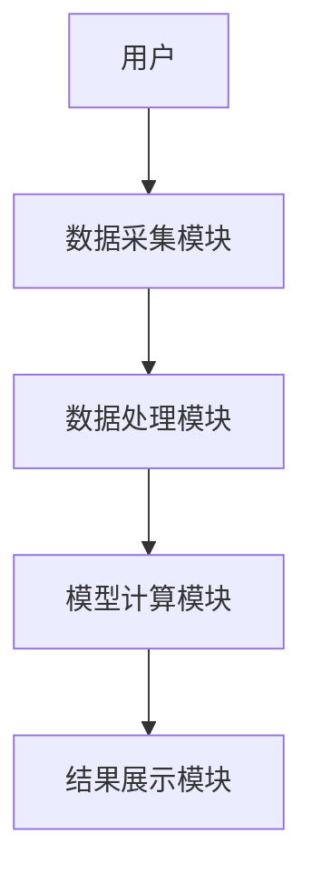
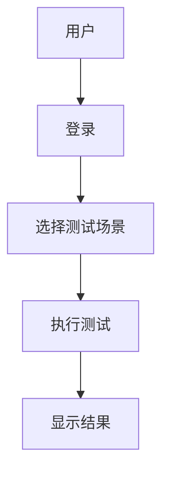

                 


# 金融机构流动性风险压力测试平台

> 关键词：流动性风险，压力测试，金融机构，金融系统，风险评估，蒙特卡洛模拟

> 摘要：本文将详细介绍金融机构流动性风险压力测试平台的设计与实现。通过对流动性风险的定义、压力测试的原理以及平台的系统架构进行深入分析，结合具体的算法实现和项目实战，为读者提供一个全面的解决方案。

---

# 第一部分: 金融机构流动性风险压力测试平台概述

## 第1章: 流动性风险与压力测试概述

### 1.1 流动性风险的基本概念

#### 1.1.1 流动性风险的定义
流动性风险是指金融机构在一定时间内，无法以合理成本获得足够资金来满足其资产增长或到期债务偿还的风险。

#### 1.1.2 流动性风险的来源
- **市场风险**：市场波动导致资产变现困难。
- **信用风险**：客户违约导致的资金流动性问题。
- **操作风险**：内部操作失误或外部事件引发的流动性危机。
- **政策风险**：监管政策变化影响资金流动。

#### 1.1.3 流动性风险的衡量指标
- **流动性覆盖率（LCR）**：衡量银行在压力情况下，短期流动性资产与短期负债的比例。
- **净稳定资金比例（NSFR）**：衡量银行长期资金来源是否充足。
- **流动性缺口**：短期负债与短期资产之间的差异。

### 1.2 压力测试的定义与作用

#### 1.2.1 压力测试的定义
压力测试是一种通过模拟极端市场条件，评估金融机构在不利环境下的财务稳定性和流动性状况的方法。

#### 1.2.2 压力测试的目的
- **识别风险**：发现潜在的流动性问题。
- **评估韧性**：检验金融机构在极端情况下的应对能力。
- **制定策略**：为管理层提供决策支持，优化资产负债结构。

#### 1.2.3 压力测试在金融机构中的应用
- **银行**：评估贷款和存款业务的流动性风险。
- **证券公司**：分析交易业务的流动性需求。
- **保险公司**：确保偿付能力的稳定性。

### 1.3 金融机构流动性风险压力测试平台的背景

#### 1.3.1 金融机构流动性风险的现状
随着金融市场的复杂化，流动性风险已成为金融机构面临的主要风险之一。特别是在全球经济波动加剧的情况下，金融机构需要更加精准的工具来评估和管理流动性风险。

#### 1.3.2 压力测试平台的需求
- **自动化需求**：传统手工压力测试效率低，难以应对高频测试需求。
- **数据需求**：需要整合多来源数据，确保测试的准确性。
- **实时性需求**：金融机构需要实时监控流动性风险，及时采取措施。

#### 1.3.3 平台的核心目标与价值
- **目标**：提供自动化、智能化的流动性风险压力测试解决方案。
- **价值**：帮助金融机构提高风险管理效率，降低流动性风险的发生概率。

### 1.4 本章小结
本章从流动性风险的基本概念出发，介绍了压力测试的定义、作用及其在金融机构中的应用，最后提出了构建流动性风险压力测试平台的背景和目标。

---

# 第二部分: 流动性风险压力测试的核心概念与联系

## 第2章: 流动性风险压力测试的框架与方法

### 2.1 流动性风险压力测试的框架

#### 2.1.1 测试场景的设计
- **基准场景**：模拟正常市场条件下的流动性状况。
- **压力场景**：模拟极端市场条件下的流动性状况，例如市场恐慌、资产贬值等。
- **恢复场景**：模拟在压力场景下采取应对措施后的流动性恢复情况。

#### 2.1.2 测试指标的选择
- **流动性覆盖率（LCR）**：短期流动性资产与短期负债的比例。
- **净稳定资金比例（NSFR）**：长期资金来源与资产使用情况的比例。
- **流动性缺口**：短期负债与短期资产的差异。

#### 2.1.3 测试数据的来源
- **内部数据**：金融机构自身的资产负债表数据。
- **外部数据**：市场数据、宏观经济数据等。

### 2.2 压力测试的主要方法

#### 2.2.1 敏感性分析
敏感性分析通过改变单一变量，观察其对流动性风险的影响程度。例如，假设市场利率上升5%，观察流动性覆盖率的变化。

#### 2.2.2 情景分析
情景分析通过构建多个假设场景，评估金融机构在不同市场条件下的流动性状况。例如，构建市场崩盘、政策变化等情景。

#### 2.2.3 蒙特卡洛模拟
蒙特卡洛模拟通过随机抽样和概率分布，模拟多种可能的市场情况，评估金融机构在极端情况下的流动性风险。

### 2.3 流动性风险压力测试的实施步骤

#### 2.3.1 数据收集与准备
- **数据收集**：整合内部和外部数据，确保数据的完整性和准确性。
- **数据清洗**：处理缺失值、异常值，确保数据质量。

#### 2.3.2 模型构建与校准
- **模型选择**：根据测试需求选择合适的模型，例如蒙特卡洛模拟、情景分析等。
- **参数校准**：通过历史数据对模型参数进行校准，确保模型的准确性。

#### 2.3.3 测试结果的分析与报告
- **结果分析**：评估测试结果是否符合预期，识别潜在风险点。
- **报告撰写**：根据测试结果撰写报告，提出改进建议。

### 2.4 核心概念与联系的Mermaid图



---

# 第三部分: 流动性风险压力测试的算法原理

## 第3章: 压力测试算法的原理与实现

### 3.1 蒙特卡洛模拟算法

#### 3.1.1 算法原理
蒙特卡洛模拟通过随机抽样和概率分布，模拟多种可能的市场情况，评估金融机构在极端情况下的流动性风险。

#### 3.1.2 算法实现步骤

1. **定义变量**：确定需要模拟的变量，例如市场利率、资产价格等。
2. **设定概率分布**：为每个变量设定概率分布，例如正态分布、均匀分布等。
3. **随机抽样**：根据概率分布生成随机样本。
4. **模拟市场情景**：根据随机样本模拟市场情景，计算流动性覆盖率等指标。
5. **分析结果**：统计模拟结果，评估流动性风险。

#### 3.1.3 算法的优缺点
- **优点**：能够模拟多种可能的市场情景，评估金融机构的韧性。
- **缺点**：计算复杂，需要大量计算资源。

### 3.2 VaR模型

#### 3.2.1 VaR模型的定义
VaR（Value at Risk）是指在给定置信水平下，资产组合可能遭受的最大损失。例如，在95%的置信水平下，资产组合在一天内可能遭受的最大损失。

#### 3.2.2 VaR模型的计算方法
- **历史模拟法**：基于历史数据，计算资产组合在不同市场情景下的损失。
- **方差-协方差法**：基于资产的收益率分布，计算资产组合的VaR。
- **蒙特卡洛模拟法**：通过随机抽样模拟资产组合的收益率分布，计算VaR。

#### 3.2.3 VaR模型的应用场景
- **风险管理**：用于评估资产组合的潜在损失。
- **资本分配**：用于确定不同资产组合的风险敞口。

### 3.3 压力测试算法的Mermaid流程图



### 3.4 算法实现的Python代码示例

```python
import numpy as np
import pandas as pd

def monte_carlo_simulation(assets, num_simulations=10000):
    # 生成随机数
    random_returns = np.random.normal(0, 0.01, size=(num_simulations, len(assets)))
    # 计算资产收益
    asset_returns = pd.DataFrame(assets) + random_returns
    # 计算VaR
    var = asset_returns.sort_values().iloc[int(num_simulations * 0.05), :]
    return var

# 示例数据
assets = [100, 200, 300]
result = monte_carlo_simulation(assets)
print(result)
```

### 3.5 算法的数学模型和公式

#### 3.5.1 蒙特卡洛模拟的数学模型
蒙特卡洛模拟的数学模型如下：
$$
X_i \sim N(\mu, \sigma^2) \quad i=1,2,\dots,n
$$
其中，$X_i$ 是第 $i$ 个资产的收益率，$\mu$ 是均值，$\sigma$ 是标准差。

#### 3.5.2 VaR模型的数学公式
$$
VaR_{\alpha}(P) = \inf \{ L \in \mathbb{R} \mid P(L \leq x) \geq \alpha \}
$$
其中，$P$ 是资产组合的损失分布，$\alpha$ 是置信水平。

---

# 第四部分: 系统分析与架构设计方案

## 第4章: 系统分析与架构设计

### 4.1 问题场景介绍

#### 4.1.1 金融机构的流动性风险
金融机构在市场波动加剧的情况下，可能面临流动性风险，导致无法及时偿还债务或满足资产需求。

#### 4.1.2 平台的目标
构建一个自动化、智能化的流动性风险压力测试平台，帮助金融机构实时监控流动性风险，评估潜在风险点。

### 4.2 项目介绍

#### 4.2.1 项目目标
- 提供自动化压力测试功能。
- 实现实时监控和预警功能。
- 提供详细的测试报告和改进建议。

#### 4.2.2 项目范围
- 数据采集与处理。
- 模型构建与校准。
- 测试结果的分析与展示。

### 4.3 系统功能设计

#### 4.3.1 数据采集模块
- **功能**：采集金融机构的资产负债数据、市场数据等。
- **设计**：通过API接口或文件导入方式获取数据。
- **实现**：使用Python的pandas库进行数据清洗和处理。

#### 4.3.2 模型计算模块
- **功能**：构建流动性风险模型，进行压力测试。
- **设计**：支持多种测试方法，例如蒙特卡洛模拟、情景分析等。
- **实现**：使用Python的numpy库进行数值计算。

#### 4.3.3 结果展示模块
- **功能**：展示测试结果，生成测试报告。
- **设计**：通过可视化工具展示关键指标，例如流动性覆盖率、VaR值等。
- **实现**：使用Python的matplotlib库进行数据可视化。

### 4.4 系统架构设计

#### 4.4.1 系统架构图



#### 4.4.2 系统交互图



---

# 第五部分: 项目实战

## 第5章: 项目实战

### 5.1 环境安装

#### 5.1.1 安装Python
```bash
# 安装Python
sudo apt-get install python3
```

#### 5.1.2 安装依赖库
```bash
# 安装pandas、numpy、matplotlib
pip install pandas numpy matplotlib
```

### 5.2 系统核心实现源代码

#### 5.2.1 数据采集模块

```python
import pandas as pd

def load_data(file_path):
    data = pd.read_csv(file_path)
    return data
```

#### 5.2.2 模型计算模块

```python
import numpy as np

def monte_carlo_simulation(assets, num_simulations=10000):
    random_returns = np.random.normal(0, 0.01, size=(num_simulations, len(assets)))
    asset_returns = pd.DataFrame(assets) + random_returns
    var = asset_returns.sort_values().iloc[int(num_simulations * 0.05), :]
    return var
```

#### 5.2.3 结果展示模块

```python
import matplotlib.pyplot as plt

def plot_var(var_values):
    plt.hist(var_values, bins=50, alpha=0.7)
    plt.xlabel('VaR值')
    plt.ylabel('频率')
    plt.title('VaR分布图')
    plt.show()
```

### 5.3 代码应用解读与分析

#### 5.3.1 数据采集模块解读
数据采集模块通过读取CSV文件，获取金融机构的资产负债数据，为后续的模型计算提供基础数据。

#### 5.3.2 模型计算模块解读
模型计算模块通过蒙特卡洛模拟，模拟多种可能的市场情景，计算资产组合的VaR值，评估流动性风险。

#### 5.3.3 结果展示模块解读
结果展示模块通过绘制VaR分布图，直观展示资产组合的潜在损失情况，帮助金融机构识别风险点。

### 5.4 实际案例分析

#### 5.4.1 案例背景
某银行需要评估其贷款业务在市场利率上升5%情况下的流动性风险。

#### 5.4.2 案例实施
- 数据采集：获取该银行的资产负债数据。
- 模型计算：使用蒙特卡洛模拟，模拟市场利率上升5%的情景，计算流动性覆盖率。
- 结果分析：根据模拟结果，评估流动性覆盖率是否满足监管要求。

### 5.5 项目小结
本章通过实际案例，展示了如何利用流动性风险压力测试平台进行风险评估，帮助金融机构优化资产负债结构，降低流动性风险。

---

# 第六部分: 总结与最佳实践

## 第6章: 总结与最佳实践

### 6.1 本章总结
本文详细介绍了金融机构流动性风险压力测试平台的设计与实现，从理论到实践，全面覆盖了平台的核心概念、算法原理、系统架构和项目实战。

### 6.2 最佳实践 tips

#### 6.2.1 数据质量
- 确保数据的完整性和准确性，避免因数据问题导致测试结果偏差。

#### 6.2.2 模型选择
- 根据实际需求选择合适的模型，例如蒙特卡洛模拟适用于复杂市场情景，而VaR模型适用于单一资产组合的风险评估。

#### 6.2.3 结果应用
- 将测试结果与实际业务相结合，制定切实可行的风险管理策略。

### 6.3 注意事项

#### 6.3.1 数据隐私
- 注意保护金融机构的敏感数据，确保数据安全。

#### 6.3.2 模型局限性
- 了解模型的局限性，避免过度依赖模型而忽视其他风险因素。

### 6.4 拓展阅读
- 《金融风险管理》：深入理解金融风险管理的核心概念。
- 《Python金融建模》：学习如何使用Python进行金融建模和分析。

### 6.5 本章小结
本文通过总结流动性风险压力测试平台的核心内容，提出了最佳实践建议，帮助金融机构更好地管理和应对流动性风险。

---

# 作者：AI天才研究院/AI Genius Institute & 禅与计算机程序设计艺术 /Zen And The Art of Computer Programming

---

以上是《金融机构流动性风险压力测试平台》的完整目录大纲和部分章节内容。本文通过理论与实践相结合的方式，全面解析了流动性风险压力测试平台的设计与实现，为金融机构提供了一套有效的风险管理解决方案。

