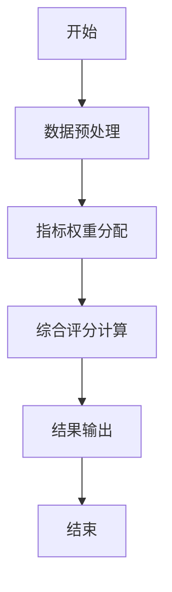
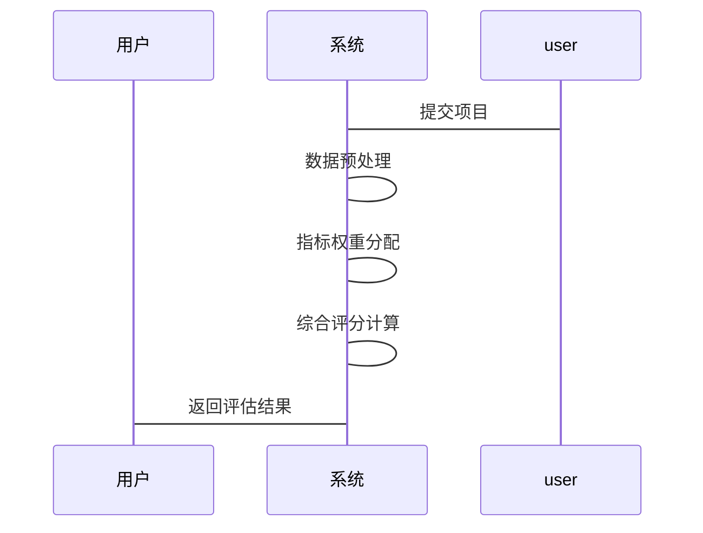

                 


# 金融科技创新项目评估框架

## 关键词：
- 金融科技
- 项目评估
- 创新框架
- 技术可行性
- 商业价值

## 摘要：
本文详细介绍了金融科技创新项目评估框架的构建与应用。通过分析金融科技的发展现状与趋势，提出了评估框架的核心概念、算法原理、系统架构设计以及项目实战方案。结合实际案例，深入探讨了评估框架在金融科技创新中的重要作用，并总结了最佳实践和未来发展方向。

---

# 第1章: 金融科技创新项目评估框架背景介绍

## 1.1 金融科技的发展现状与趋势

### 1.1.1 金融科技的定义与范畴
金融科技（FinTech）是指利用现代信息技术创新传统金融业务模式、提升效率、降低成本的新兴领域。其范畴包括支付、借贷、投资、保险、征信等。

### 1.1.2 金融科技的核心驱动因素
- 技术驱动：大数据、人工智能、区块链、云计算等技术的快速发展。
- 业务驱动：金融机构为提升竞争力，寻求更高效的服务模式。
- 政策支持：政府通过政策引导和扶持，推动金融科技发展。

### 1.1.3 金融科技对金融行业的影响
- 提升服务效率：通过数字化手段优化业务流程。
- 降低运营成本：自动化技术减少人工干预。
- 扩大服务范围：通过技术创新覆盖更多客户群体。

## 1.2 金融科技创新项目的定义与特征

### 1.2.1 金融科技创新项目的定义
金融科技创新项目是指利用新兴技术（如人工智能、区块链等）对传统金融业务进行创新和优化的项目。

### 1.2.2 金融科技创新项目的分类
- 支付类：基于区块链的跨境支付、无接触支付。
- 贷款类：基于大数据风控的信用贷款。
- 投资类：智能投顾、量化交易。
- 保险类：区块链理赔、智能合约。

### 1.2.3 金融科技创新项目的评估维度
- 技术可行性：技术实现的难度和成熟度。
- 商业价值：项目的市场潜力和盈利能力。
- 风险与合规性：项目的风险敞口和合规性。
- 用户体验：用户对产品的接受度和满意度。

## 1.3 金融科技创新项目评估框架的必要性

### 1.3.1 金融科技创新项目评估的背景需求
- 技术复杂性：金融科技创新项目往往涉及复杂的算法和系统架构。
- 风险控制：金融项目具有较高的风险，需要严格的评估机制。
- 资源分配：通过评估框架优化资源分配，优先支持优质项目。

### 1.3.2 评估框架在金融行业中的作用
- 提供决策依据：帮助金融机构筛选出具有商业价值的项目。
- 降低试错成本：通过评估框架降低创新项目的失败率。
- 促进技术创新：鼓励金融机构采用新技术提升服务质量。

### 1.3.3 评估框架的构建目标与意义
- 目标：建立一套科学、系统的评估体系，量化项目的优劣。
- 意义：通过评估框架实现金融科技创新的可持续发展。

## 1.4 本章小结
本章介绍了金融科技的发展现状与趋势，明确了金融科技创新项目的定义与特征，并阐述了评估框架的必要性及其在金融行业中的作用。

---

# 第2章: 金融科技创新项目评估框架的核心概念

## 2.1 金融科技创新项目的评估维度

### 2.1.1 技术可行性
- 技术可行性是评估项目能否落地的核心指标。
- 包括技术实现的难度、团队的技术能力、技术成熟度等。

### 2.1.2 商业价值
- 商业价值是项目能否盈利的关键指标。
- 包括市场规模、用户需求、盈利能力等。

### 2.1.3 风险与合规性
- 风险与合规性是项目能否安全运行的重要指标。
- 包括项目的风险敞口、合规性要求、法律风险等。

### 2.1.4 用户体验与市场接受度
- 用户体验是项目能否获得用户认可的关键指标。
- 包括用户界面设计、操作便捷性、用户满意度等。

## 2.2 核心概念与联系

### 2.2.1 金融科技项目的ER实体关系图
```mermaid
er
  actor: 用户
  project: 项目
  technology: 技术
  business: 商业价值
  risk: 风险
  actor --> project: 提交项目
  project --> technology: 使用技术
  project --> business: 体现商业价值
  project --> risk: 存在风险
```

### 2.2.2 核心概念的对比分析

| 评估维度 | 技术可行性 | 商业价值 | 风险与合规性 | 用户体验与市场接受度 |
|----------|------------|----------|--------------|------------------------|
| 定义     | 项目能否实现的技术能力 | 项目的盈利能力 | 项目的风险敞口 | 用户对产品的满意度 |
| 重要性   | 高         | 高       | 高            | 中                   |
| 影响因素 | 技术实现难度 | 市场需求 | 法律风险      | 用户体验设计         |

## 2.3 核心概念的数学模型

### 2.3.1 综合评估模型
$$ S = \sum_{i=1}^{n} w_i \cdot x_i $$
其中，\( w_i \) 是第 \( i \) 个评估维度的权重，\( x_i \) 是第 \( i \) 个评估维度的评分。

## 2.4 本章小结
本章详细分析了金融科技创新项目评估框架的核心概念，包括技术可行性、商业价值、风险与合规性、用户体验与市场接受度，并通过对比分析和数学模型展示了这些概念之间的关系。

---

# 第3章: 金融科技创新项目评估框架的算法原理

## 3.1 评估框架的算法概述

### 3.1.1 评估框架的基本原理
- 通过量化评估维度，利用加权评分法对项目进行综合评分。
- 结合项目特征，动态调整权重，实现精准评估。

## 3.2 评估算法的详细步骤

### 3.2.1 数据预处理
- 数据清洗：去除冗余数据，处理缺失值。
- 数据标准化：对不同量纲的指标进行标准化处理。

### 3.2.2 指标权重分配
- 根据专家意见和实际数据，确定各评估维度的权重。
- 通过层次分析法（AHP）优化权重分配。

### 3.2.3 综合评分计算
- 根据各维度的权重和评分，计算项目的综合评分。
- 对综合评分进行排序，确定项目的优先级。

## 3.3 评估算法的数学模型

### 3.3.1 指标权重分配模型
$$ w_i = \frac{1}{n} \sum_{i=1}^{n} w_i $$
其中，\( w_i \) 是第 \( i \) 个评估维度的权重，\( n \) 是评估维度的数量。

### 3.3.2 综合评分计算公式
$$ S = \sum_{i=1}^{n} w_i \cdot x_i $$
其中，\( S \) 是项目的综合评分，\( x_i \) 是第 \( i \) 个评估维度的评分。

## 3.4 算法实现的流程图


## 3.5 本章小结
本章详细介绍了金融科技创新项目评估框架的算法原理，包括数据预处理、指标权重分配和综合评分计算的步骤，并通过数学模型和流程图展示了算法实现的过程。

---

# 第4章: 金融科技创新项目评估框架的系统架构设计

## 4.1 系统功能设计

### 4.1.1 项目信息管理模块
- 功能：管理项目的基本信息，包括项目名称、提交时间、负责人等。
- 实现：通过数据库存储项目信息，支持查询和修改操作。

### 4.1.2 评估指标管理模块
- 功能：管理评估指标，包括指标名称、指标权重、指标类型等。
- 实现：通过配置化的方式管理指标，支持动态调整。

### 4.1.3 评估结果展示模块
- 功能：展示项目的评估结果，包括评分、排名、可视化图表等。
- 实现：通过数据可视化工具展示评估结果，支持多维度分析。

## 4.2 系统架构设计

### 4.2.1 系统架构的分层设计
- 表现层：用户界面，包括项目提交、评估结果展示等功能。
- 业务逻辑层：处理用户的请求，调用数据访问层的方法。
- 数据访问层：与数据库交互，管理数据的增删改查操作。

### 4.2.2 模块之间的交互关系
- 项目信息管理模块与评估指标管理模块通过数据库进行交互。
- 评估结果展示模块通过API调用业务逻辑层的方法。

### 4.2.3 系统的扩展性设计
- 支持新增评估维度：通过配置化的方式增加新的评估指标。
- 支持多种评估算法：通过插件的方式扩展系统的评估能力。

## 4.3 系统接口设计

### 4.3.1 API接口定义
- 提交项目接口：`POST /project/submit`
- 查询项目接口：`GET /project/detail`

### 4.3.2 接口的安全性设计
- 使用HTTPS协议进行数据传输，确保数据安全。
- 对敏感数据进行加密处理，防止数据泄露。

### 4.3.3 接口的兼容性
- 支持多种客户端调用，包括Web、移动端、API调用等。

## 4.4 系统交互流程图


## 4.5 本章小结
本章详细设计了金融科技创新项目评估框架的系统架构，包括系统功能设计、架构分层设计、接口设计和交互流程设计，为后续的系统实现奠定了基础。

---

# 第5章: 金融科技创新项目评估框架的项目实战

## 5.1 项目背景与目标

### 5.1.1 项目背景
- 某商业银行希望通过引入人工智能技术优化其客户服务流程。

### 5.1.2 项目目标
- 提供智能化的客户服务系统，实现客户咨询的自动化处理。

## 5.2 环境安装与配置

### 5.2.1 系统环境
- 操作系统：Linux 18.04
- 数据库：MySQL 8.0
- 语言：Python 3.8

### 5.2.2 工具安装
- 安装Python依赖：`pip install numpy pandas scikit-learn`
- 安装数据库驱动：`pip install mysql-connector`

## 5.3 系统核心实现

### 5.3.1 数据预处理代码
```python
import pandas as pd
from sklearn.impute import SimpleImputer

# 读取数据
data = pd.read_csv('project_data.csv')

# 处理缺失值
imputer = SimpleImputer(strategy='mean')
data_imputed = imputer.fit_transform(data)
```

### 5.3.2 综合评分计算代码
```python
import numpy as np

# 定义权重
weights = [0.3, 0.4, 0.2, 0.1]

# 定义评分
scores = [85, 90, 75, 95]

# 计算综合评分
weighted_scores = np.dot(weights, scores)
print(weighted_scores)
```

## 5.4 项目实现与分析

### 5.4.1 项目实现
- 通过Python代码实现数据预处理和综合评分计算。
- 使用数据库存储项目信息和评估结果。

### 5.4.2 实际案例分析
- 某项目的技术可行性得分为85，商业价值得分为90，风险与合规性得分为75，用户体验与市场接受度得分为95。
- 综合评分为：\( 0.3 \times 85 + 0.4 \times 90 + 0.2 \times 75 + 0.1 \times 95 = 85.5 \)

## 5.5 项目优化与总结

### 5.5.1 项目优化
- 优化数据预处理算法，提高数据处理效率。
- 改进评估模型，引入机器学习算法提升评估精度。

### 5.5.2 项目总结
- 通过本项目实战，验证了评估框架的有效性和可操作性。
- 提出了优化建议，为后续项目实施提供参考。

## 5.6 本章小结
本章通过实际案例展示了金融科技创新项目评估框架的应用，详细讲解了项目环境配置、核心代码实现、案例分析及项目总结，为读者提供了实践指导。

---

# 第6章: 金融科技创新项目评估框架的最佳实践与未来展望

## 6.1 评估框架的最佳实践

### 6.1.1 数据质量管理
- 确保数据的准确性和完整性，避免数据偏差。

### 6.1.2 权重动态调整
- 根据市场变化和项目特点动态调整指标权重。

### 6.1.3 多维度验证
- 通过多种评估方法验证结果的准确性。

## 6.2 未来展望

### 6.2.1 技术创新
- 引入更多新兴技术，如量子计算、元宇宙等，提升评估框架的智能化水平。

### 6.2.2 应用扩展
- 将评估框架应用于更多金融场景，如智能风控、智能投顾等。

### 6.2.3 行业合作
- 加强金融机构与科技企业的合作，推动金融科技创新生态的建设。

## 6.3 本章小结
本章总结了金融科技创新项目评估框架的最佳实践，并展望了未来的发展方向，为读者提供了进一步研究和实践的参考。

---

# 第7章: 总结与展望

## 7.1 总结
本文系统地介绍了金融科技创新项目评估框架的构建与应用，涵盖了背景介绍、核心概念、算法原理、系统架构设计、项目实战以及最佳实践等方面。

## 7.2 展望
未来，随着人工智能和大数据技术的进一步发展，金融科技创新项目评估框架将更加智能化和精准化，为金融机构的创新发展提供更有力的支持。

## 7.3 本章小结
本章总结了全文的主要内容，并展望了金融科技创新项目评估框架的未来发展方向。

---

# 作者：AI天才研究院/AI Genius Institute & 禅与计算机程序设计艺术 /Zen And The Art of Computer Programming

