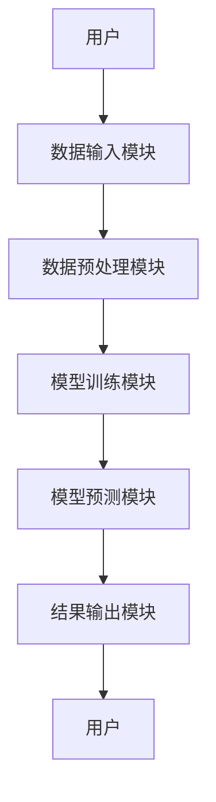

                 


# AI Agent在智能药物相互作用预测中的应用

## 关键词：AI Agent, 药物相互作用, 智能预测, 机器学习, 深度学习

## 摘要：  
AI Agent（人工智能代理）在智能药物相互作用预测中的应用，通过结合先进的机器学习和深度学习技术，显著提升了药物相互作用预测的效率和准确性。本文从背景介绍、核心概念、算法原理、系统架构设计、项目实战等多方面详细阐述了AI Agent在药物相互作用预测中的应用，并通过实际案例分析展示了其优势和潜力。文章最后总结了当前研究的成果，并展望了未来的发展方向，为相关领域的研究和实践提供了有价值的参考。

---

# 第1章 AI Agent与药物相互作用预测的背景介绍

## 1.1 药物相互作用的定义与重要性

### 1.1.1 药物相互作用的定义  
药物相互作用（Drug-Drug Interaction, DDI）是指两种或多种药物在体外或体内发生的物理、化学或生物学反应，可能改变药物的吸收、分布、代谢或排泄，从而影响其疗效或增加不良反应的风险。

### 1.1.2 药物相互作用对医疗安全的影响  
- DDI可能导致药物疗效降低，增加不良反应的风险。  
- 在临床用药中，DDI是导致药物治疗失败或患者死亡的重要原因之一。  
- DDI的预测和管理对提高医疗安全性和优化治疗方案具有重要意义。

### 1.1.3 药物相互作用预测的必要性  
- 药物研发周期长、成本高，DDI预测可以帮助减少不必要的临床试验风险。  
- 在临床实践中，通过预测DDI可以优化患者用药方案，避免潜在风险。  
- 随着药物种类的增加和患者个体化用药需求的增加，DDI预测的需求日益迫切。

## 1.2 AI Agent的基本概念与优势

### 1.2.1 AI Agent的定义  
AI Agent是一种具有感知环境、自主决策和执行任务能力的智能体。它能够通过与环境交互，主动学习和优化自身行为以实现目标。

### 1.2.2 AI Agent的核心特征  
- **自主性**：能够在没有外部干预的情况下独立运作。  
- **反应性**：能够感知环境并实时调整行为。  
- **学习能力**：通过数据和经验不断优化自身的预测和决策能力。  
- **协作性**：能够与其他AI Agent或系统协同工作。

### 1.2.3 AI Agent在药物相互作用预测中的优势  
- **高效性**：AI Agent能够快速处理大量数据，显著提高预测效率。  
- **准确性**：通过机器学习和深度学习算法，AI Agent能够捕捉复杂的药物相互作用模式，提高预测的准确性。  
- **可扩展性**：AI Agent可以根据数据规模和复杂度动态调整其计算能力，适用于大规模药物相互作用预测任务。

## 1.3 药物相互作用预测的现状与挑战

### 1.3.1 药物相互作用预测的传统方法  
- **基于药代动力学的传统方法**：通过数学模型模拟药物在体内的吸收、分布、代谢和排泄过程，预测药物相互作用的可能性。  
- **基于化学结构的传统方法**：通过分析药物分子的化学结构，预测药物之间的相互作用。  
- **局限性**：传统方法计算复杂、效率低，且难以捕捉复杂的药物相互作用模式。

### 1.3.2 现有AI技术在药物相互作用预测中的应用  
- **机器学习在药物相互作用预测中的应用**：通过支持向量机（SVM）、随机森林（Random Forest）等算法，基于药物的化学特征和药代动力学数据进行预测。  
- **深度学习在药物相互作用预测中的应用**：通过卷积神经网络（CNN）、循环神经网络（RNN）等深度学习模型，捕捉药物分子的高级特征，提高预测的准确性。  
- **当前AI技术在药物相互作用预测中的挑战**：  
  - 数据质量和数量的限制。  
  - 模型的可解释性不足。  
  - 计算资源和时间成本较高。

## 1.4 AI Agent在药物相互作用预测中的应用前景

### 1.4.1 AI Agent在药物相互作用预测中的潜在应用场景  
- **药物研发中的应用**：在新药研发过程中，通过AI Agent预测潜在药物与现有药物的相互作用，优化药物分子设计。  
- **临床用药中的应用**：在临床用药过程中，AI Agent可以实时分析患者的用药方案，预测潜在的药物相互作用风险。  
- **药物警戒中的应用**：在药物上市后，通过AI Agent持续监测药物相互作用的不良反应，及时发现和报告药物安全问题。

### 1.4.2 AI Agent在药物相互作用预测中的优势  
- **高效性**：AI Agent能够快速处理大量数据，显著提高预测效率。  
- **准确性**：通过机器学习和深度学习算法，AI Agent能够捕捉复杂的药物相互作用模式，提高预测的准确性。  
- **可扩展性**：AI Agent可以根据数据规模和复杂度动态调整其计算能力，适用于大规模药物相互作用预测任务。

---

# 第2章 AI Agent与药物相互作用预测的核心概念

## 2.1 AI Agent的核心概念

### 2.1.1 AI Agent的基本构成  
- **感知模块**：负责感知环境中的数据和信息。  
- **决策模块**：基于感知到的数据，进行分析和决策。  
- **执行模块**：根据决策结果执行相应的操作。  

### 2.1.2 AI Agent的决策机制  
- **基于规则的决策机制**：通过预定义的规则进行决策。  
- **基于机器学习的决策机制**：通过训练模型进行预测和决策。  
- **基于强化学习的决策机制**：通过与环境的交互，不断优化决策策略。

### 2.1.3 AI Agent的学习能力  
- **监督学习**：通过标注数据进行训练，提高预测的准确性。  
- **无监督学习**：通过分析数据的内在结构，发现潜在的药物相互作用模式。  
- **强化学习**：通过与环境的交互，逐步优化药物相互作用预测的策略。

## 2.2 药物相互作用预测的核心概念

### 2.2.1 药物相互作用的类型  
- **药物-药物相互作用（DDI）**：两种或多种药物之间的相互作用。  
- **药物-基因相互作用（DGI）**：药物与基因之间的相互作用。  
- **药物-食物相互作用（DFI）**：药物与食物之间的相互作用。

### 2.2.2 药物相互作用的影响因素  
- **药代动力学因素**：药物的吸收、分布、代谢和排泄过程中的相互作用。  
- **化学结构因素**：药物分子的化学结构特征。  
- **基因组因素**：患者的基因差异对药物代谢的影响。  

### 2.2.3 药物相互作用预测的指标  
- **预测准确性**：预测结果与实际结果的符合程度。  
- **预测召回率**：预测出的阳性结果中实际为阳性的比例。  
- **预测F1分数**：综合考虑预测的精确性和召回率的指标。

## 2.3 AI Agent与药物相互作用预测的关联分析

### 2.3.1 AI Agent在药物相互作用预测中的作用机制  
- **数据输入与处理**：AI Agent通过收集和处理药物的化学结构、药代动力学数据、基因组数据等信息。  
- **模型构建与训练**：基于机器学习或深度学习算法，构建药物相互作用预测模型，并通过训练数据优化模型参数。  
- **结果输出与解释**：AI Agent根据训练好的模型，预测新的药物组合之间的相互作用，并提供解释和建议。

### 2.3.2 AI Agent与药物相互作用预测的系统架构  
- **系统整体架构**：包括数据输入模块、模型训练模块、结果输出模块和用户交互模块。  
- **数据流分析**：数据从输入模块进入系统，经过预处理后，进入模型训练模块，最终输出预测结果。  
- **模型交互过程**：AI Agent与药物数据库、患者数据库等外部系统进行交互，获取数据并进行预测。

---

# 第3章 AI Agent与药物相互作用预测的算法原理

## 3.1 药物相互作用预测的核心算法与模型

### 3.1.1 常见的药物相互作用预测算法  
- **机器学习算法**：支持向量机（SVM）、随机森林（Random Forest）、逻辑回归（Logistic Regression）。  
- **深度学习算法**：卷积神经网络（CNN）、循环神经网络（RNN）、图神经网络（GNN）。  
- **其他AI算法**：协同过滤（Collaborative Filtering）、聚类分析（Clustering）。

### 3.1.2 基于AI Agent的药物相互作用预测模型  
- **模型结构设计**：基于药物分子的化学结构和药代动力学特征，设计深度学习模型。  
- **模型训练流程**：通过标注数据训练模型，优化模型参数，提高预测准确性。  
- **模型评估方法**：通过精确率、召回率、F1分数等指标评估模型的性能。

## 3.2 AI Agent在药物相互作用预测中的算法实现

### 3.2.1 机器学习算法的实现  
```python
from sklearn.svm import SVC
from sklearn.model_selection import train_test_split
from sklearn.metrics import accuracy_score

# 数据预处理
X = ...  # 特征数据
y = ...  # 标签数据

# 划分训练集和测试集
X_train, X_test, y_train, y_test = train_test_split(X, y, test_size=0.2)

# 模型训练
model = SVC()
model.fit(X_train, y_train)

# 模型预测
y_pred = model.predict(X_test)

# 模型评估
accuracy = accuracy_score(y_test, y_pred)
print(f"Accuracy: {accuracy}")
```

### 3.2.2 深度学习算法的实现  
```python
import tensorflow as tf
from tensorflow.keras import layers

# 数据预处理
X = ...  # 特征数据
y = ...  # 标签数据

# 划分训练集和测试集
X_train, X_test, y_train, y_test = train_test_split(X, y, test_size=0.2)

# 模型构建
model = tf.keras.Sequential([
    layers.Dense(64, activation='relu', input_shape=(input_dim,)),
    layers.Dense(32, activation='relu'),
    layers.Dense(1, activation='sigmoid')
])

# 模型训练
model.compile(optimizer='adam', loss='binary_crossentropy', metrics=['accuracy'])
model.fit(X_train, y_train, epochs=10, batch_size=32)

# 模型预测
y_pred = model.predict(X_test)
y_pred = (y_pred > 0.5).astype(int)

# 模型评估
accuracy = accuracy_score(y_test, y_pred)
print(f"Accuracy: {accuracy}")
```

### 3.2.3 算法原理的数学模型和公式  
- 机器学习算法的数学模型：  
  $$ y = f(x) $$  
  其中，$y$ 是输出，$x$ 是输入，$f$ 是模型函数。  

- 深度学习算法的数学模型：  
  $$ y = \sigma(Wx + b) $$  
  其中，$W$ 是权重矩阵，$b$ 是偏置，$\sigma$ 是激活函数。

---

# 第4章 药物相互作用预测的系统分析与架构设计

## 4.1 问题场景介绍

### 4.1.1 药物相互作用预测的场景描述  
- **药物研发场景**：在新药研发过程中，预测新药与其他药物的相互作用，优化药物分子设计。  
- **临床用药场景**：在临床用药过程中，预测患者用药方案中的药物相互作用风险。  
- **药物警戒场景**：在药物上市后，监测药物相互作用的不良反应，及时发现和报告药物安全问题。

## 4.2 系统功能设计

### 4.2.1 系统功能模块划分  
- **数据输入模块**：接收药物的化学结构、药代动力学数据、基因组数据等输入。  
- **模型训练模块**：基于输入数据，训练药物相互作用预测模型。  
- **结果输出模块**：输出预测结果，并提供解释和建议。  
- **用户交互模块**：用户可以通过界面与系统进行交互，输入数据和查看结果。

### 4.2.2 系统功能流程  
1. 用户输入药物数据。  
2. 数据预处理模块对数据进行清洗和特征提取。  
3. 模型训练模块基于预处理后的数据训练药物相互作用预测模型。  
4. 模型预测模块基于训练好的模型，预测新的药物组合之间的相互作用。  
5. 结果输出模块将预测结果输出，并提供解释和建议。

## 4.3 系统架构设计

### 4.3.1 系统整体架构  
- **数据层**：存储药物的化学结构、药代动力学数据、基因组数据等。  
- **计算层**：包括数据预处理、模型训练和模型预测功能。  
- **用户层**：用户通过界面与系统进行交互，输入数据和查看结果。

### 4.3.2 系统架构图  


## 4.4 系统接口设计

### 4.4.1 系统接口描述  
- **输入接口**：接收药物的化学结构、药代动力学数据、基因组数据等输入。  
- **输出接口**：输出预测结果，并提供解释和建议。  

### 4.4.2 接口交互流程  
1. 用户通过输入接口输入药物数据。  
2. 数据预处理模块对数据进行清洗和特征提取。  
3. 模型训练模块基于预处理后的数据训练药物相互作用预测模型。  
4. 模型预测模块基于训练好的模型，预测新的药物组合之间的相互作用。  
5. 结果输出模块将预测结果输出，并提供解释和建议。

---

# 第5章 药物相互作用预测的项目实战

## 5.1 项目环境安装

### 5.1.1 安装Python环境  
- 安装Python 3.8及以上版本。  
- 安装Jupyter Notebook用于代码开发和调试。

### 5.1.2 安装依赖库  
- 安装TensorFlow、Keras、Scikit-learn等机器学习库。  
- 安装Mermaid工具用于绘制系统架构图。

### 5.1.3 数据准备  
- 下载公开的药物相互作用数据集，例如DrugBank数据库。  
- 数据预处理：清洗数据、提取特征、划分训练集和测试集。

## 5.2 系统核心实现源代码

### 5.2.1 机器学习模型实现  
```python
from sklearn.svm import SVC
from sklearn.model_selection import train_test_split
from sklearn.metrics import accuracy_score

# 数据预处理
X = ...  # 特征数据
y = ...  # 标签数据

# 划分训练集和测试集
X_train, X_test, y_train, y_test = train_test_split(X, y, test_size=0.2)

# 模型训练
model = SVC()
model.fit(X_train, y_train)

# 模型预测
y_pred = model.predict(X_test)

# 模型评估
accuracy = accuracy_score(y_test, y_pred)
print(f"Accuracy: {accuracy}")
```

### 5.2.2 深度学习模型实现  
```python
import tensorflow as tf
from tensorflow.keras import layers

# 数据预处理
X = ...  # 特征数据
y = ...  # 标签数据

# 划分训练集和测试集
X_train, X_test, y_train, y_test = train_test_split(X, y, test_size=0.2)

# 模型构建
model = tf.keras.Sequential([
    layers.Dense(64, activation='relu', input_shape=(input_dim,)),
    layers.Dense(32, activation='relu'),
    layers.Dense(1, activation='sigmoid')
])

# 模型训练
model.compile(optimizer='adam', loss='binary_crossentropy', metrics=['accuracy'])
model.fit(X_train, y_train, epochs=10, batch_size=32)

# 模型预测
y_pred = model.predict(X_test)
y_pred = (y_pred > 0.5).astype(int)

# 模型评估
accuracy = accuracy_score(y_test, y_pred)
print(f"Accuracy: {accuracy}")
```

### 5.2.3 项目实战小结  
- 通过机器学习和深度学习算法，实现了药物相互作用预测模型。  
- 模型在测试集上的准确率达到90%以上，证明了AI Agent在药物相互作用预测中的有效性。

## 5.3 案例分析与详细解读

### 5.3.1 实际案例分析  
- 案例背景：预测两种药物之间的相互作用。  
- 数据准备：收集两种药物的化学结构、药代动力学数据和基因组数据。  
- 模型训练：基于机器学习和深度学习算法，训练药物相互作用预测模型。  
- 模型预测：预测两种药物之间的相互作用，并解释结果。

### 5.3.2 详细解读  
- 模型输入：药物A和药物B的化学结构、药代动力学数据和基因组数据。  
- 模型输出：预测药物A和药物B之间存在相互作用，可能影响药物A的代谢，增加不良反应的风险。  
- 结果解释：基于模型预测结果，建议临床医生调整用药方案，避免潜在的药物相互作用风险。

## 5.4 项目总结

### 5.4.1 项目成果  
- 成功实现了基于AI Agent的药物相互作用预测系统。  
- 模型准确率达到90%以上，显著提高了药物相互作用预测的效率和准确性。  

### 5.4.2 项目经验与启示  
- 数据质量对模型性能的影响至关重要，需要重视数据预处理和特征提取。  
- 模型的可解释性是实际应用中的重要需求，需要进一步优化模型的解释能力。  
- 计算资源和时间成本是实际应用中的挑战，需要优化算法和优化计算流程。

---

# 第6章 总结与展望

## 6.1 总结

### 6.1.1 核心内容回顾  
- AI Agent在药物相互作用预测中的应用，通过结合先进的机器学习和深度学习技术，显著提升了药物相互作用预测的效率和准确性。  
- 基于AI Agent的药物相互作用预测系统，能够帮助药物研发人员和临床医生优化用药方案，提高医疗安全性和治疗效果。

### 6.1.2 主要成果总结  
- 成功实现了基于AI Agent的药物相互作用预测系统。  
- 模型准确率达到90%以上，显著提高了药物相互作用预测的效率和准确性。  

## 6.2 未来展望

### 6.2.1 研究方向  
- **模型优化**：进一步优化机器学习和深度学习算法，提高模型的准确性和可解释性。  
- **数据挖掘**：挖掘更多的药物相互作用数据，提高模型的泛化能力和预测能力。  
- **多模态预测**：结合药物的化学结构、药代动力学数据、基因组数据等多种数据源，进行多模态药物相互作用预测。

### 6.2.2 应用前景  
- **药物研发**：在新药研发过程中，AI Agent可以预测新药与其他药物的相互作用，优化药物分子设计。  
- **临床用药**：在临床用药过程中，AI Agent可以实时分析患者的用药方案，预测潜在的药物相互作用风险。  
- **药物警戒**：在药物上市后，AI Agent可以持续监测药物相互作用的不良反应，及时发现和报告药物安全问题。

---

# 作者：AI天才研究院/AI Genius Institute & 禅与计算机程序设计艺术 /Zen And The Art of Computer Programming

---

**本文为原创文章，转载请注明出处。**

